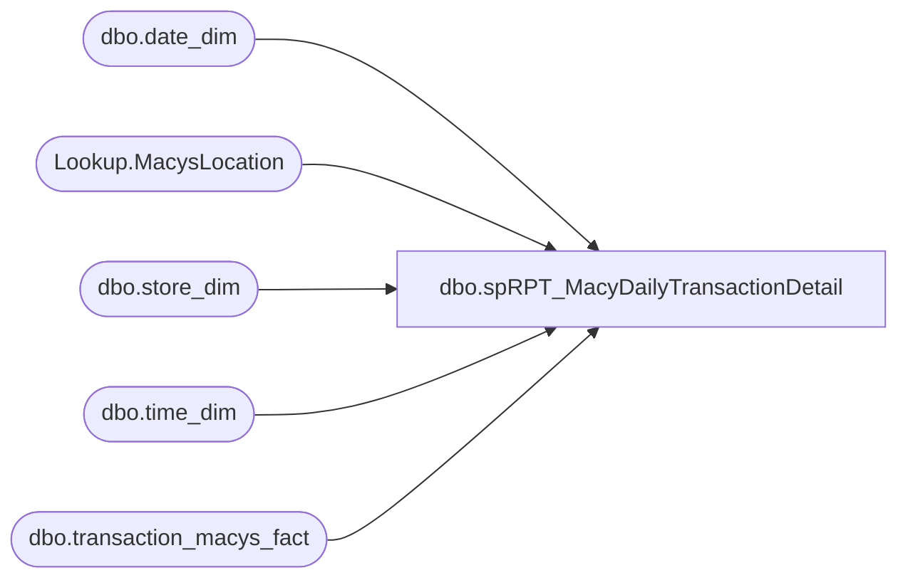

# dbo.spRPT_MacyDailyTransactionDetail

**Database:** dw  
**Server:** papamart  

## Architecture Diagram



## Table Dependencies

| Referenced Table |
|---|
| dbo.date_dim |
| Lookup.MacysLocation |
| dbo.store_dim |
| dbo.time_dim |
| dbo.transaction_macys_fact |

## Stored Procedure Code

```sql
CREATE PROCEDURE [dbo].[spRPT_MacyDailyTransactionDetail]
	@StoreKey INT
	, @RollingDays INT = 1
AS
BEGIN
	SET NOCOUNT ON;
	DECLARE @DateRangeStart AS DATETIME
	DECLARE @DateRangeEnd AS DATETIME
	SET @DateRangeEnd = DATEADD(dd, -1, CAST(FLOOR(CAST(GETDATE() AS FLOAT)) AS DateTime))
	SET @DateRangeStart = DATEADD(dd, -@RollingDays+1, @DateRangeEnd)
	
	SELECT DISTINCT
		sd.store_id AS StoreNumber
		, sd.store_name AS StoreName
		, dd.actual_date AS SaleDate
		, tmf.Register AS RegisterNumber
		, CAST(td.[hour] AS VARCHAR(2)) + ':' + RIGHT('00' + LTRIM(RTRIM(CAST(td.[minute] AS VARCHAR(2)))), 2) AS SaleTime 
		, tmf.RingAssocID AS CashierNumber
		, tmf.TRANS AS TransactionNumber
		, tmf.SEQUENCE
		, tmf.PLUAMOUNT AS PLUAmount
		, ISNULL(COUPON1_DISCOUNT, 0) + ISNULL(COUPON2_DISCOUNT, 0) + ISNULL(COUPON3_DISCOUNT, 0) AS TotalCoupon
		, tmf.SALEAMOUNT AS SaleAmount
	FROM dbo.transaction_macys_fact tmf WITH(NOLOCK)
		INNER JOIN dbo.date_dim dd WITH(NOLOCK)
			ON tmf.DATE_KEY = dd.date_key
		INNER JOIN dbo.time_dim td WITH(NOLOCK)
			ON tmf.TIME_KEY = td.time_key
		INNER JOIN Lookup.MacysLocation ml WITH(NOLOCK)
			ON tmf.SELL_LOCATION = ml.Location
		INNER JOIN dbo.store_dim sd WITH(NOLOCK)
			ON ml.store_key = sd.store_key
	WHERE dd.actual_date BETWEEN @DateRangeStart AND @DateRangeEnd
		AND ml.store_key = @StoreKey
	ORDER BY sd.store_id
		, dd.actual_date
		, CAST(td.[hour] AS VARCHAR(2)) + ':' + RIGHT('00' + LTRIM(RTRIM(CAST(td.[minute] AS VARCHAR(2)))), 2)
		, tmf.TRANS
		
END
```

