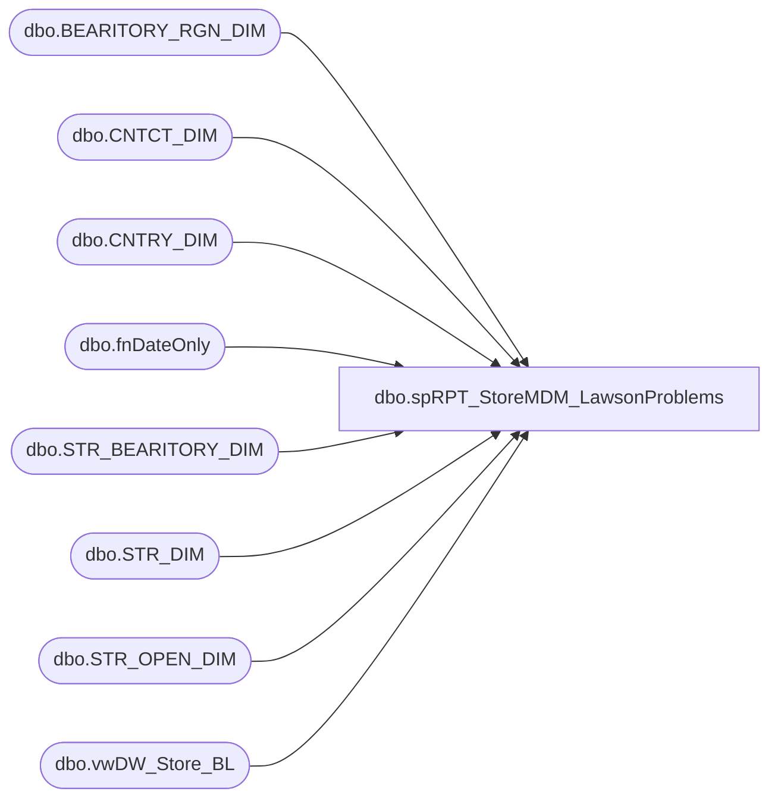

# dbo.spRPT_StoreMDM_LawsonProblems

**Database:** dw  
**Server:** papamart  

## Architecture Diagram



## Table Dependencies

| Referenced Table |
|---|
| dbo.BEARITORY_RGN_DIM |
| dbo.CNTCT_DIM |
| dbo.CNTRY_DIM |
| dbo.fnDateOnly |
| dbo.STR_BEARITORY_DIM |
| dbo.STR_DIM |
| dbo.STR_OPEN_DIM |
| dbo.vwDW_Store_BL |

## Stored Procedure Code

```sql
CREATE PROCEDURE [dbo].[spRPT_StoreMDM_LawsonProblems]
AS
-- =====================================================================================================
-- Name: spRPT_StoreMDM_LawsonProblems
--
-- Description:	Generates a list of Stores where StoreMDM is different from Lawson
--
-- Input: None
--
-- Output: Resultset 
--			
--
-- Dependencies: None
--
-- Revision History
--		Name:			Date:			Comments:
--		Gary Murrish	9/6/2013		Initial Release
--		Mike Pelikan	04/29/2014		Changed BABWMSTRDATA linked server reference
-- =====================================================================================================
BEGIN
	SET NOCOUNT ON;
	-- Run this on Papamart.dw
	DECLARE @asOfDate datetime
	SET @asOfDate = dbo.fnDateOnly(GETDATE())
	IF DATEPART(hh, GETDATE()) > 20
	BEGIN
		SET @asOfDate = @asOfDate + 1
	END

	-- Get Store MDM information for Open Stores
	IF OBJECT_ID('tempdb..#MDMStoreBearitory') IS NOT NULL
	BEGIN
		DROP TABLE #MDMStoreBearitory
	END

	SELECT
		SD.STR_NUM,
		SD.NM_ABBRV,
		BRD.BEARITORY_NUM,
		BRD.NM AS BearitoryName,
		CD.email AS BLEmail,
		CD.LAST_NM AS BLLastName
	INTO #MDMStoreBearitory
	FROM
		KODIAK.BABWMstrData.dbo.STR_DIM SD WITH (NOLOCK)
		INNER JOIN KODIAK.BABWMstrData.dbo.STR_BEARITORY_DIM SBD WITH (NOLOCK)
			ON SD.STR_ID = SBD.STR_ID
			AND @asOfDate BETWEEN SBD.STRT_DT AND SBD.END_DT
		INNER JOIN KODIAK.BABWMstrData.dbo.BEARITORY_RGN_DIM BRD
			ON SBD.bearitory_id = BRD.bearitory_id
			AND @asOfDate BETWEEN BRD.STRT_DT AND BRD.END_DT
		INNER JOIN KODIAK.BABWMstrData.dbo.CNTCT_DIM CD WITH (NOLOCK)
			ON BRD.CNTCT_ID = CD.CNTCT_ID
		INNER JOIN KODIAK.BABWMstrData.dbo.CNTRY_DIM Cntry WITH (NOLOCK)
			ON SD.CNTRY_ID = Cntry.CNTRY_ID
		INNER JOIN KODIAK.BABWMstrData.dbo.STR_OPEN_DIM SOD WITH (NOLOCK)
			ON SOD.STR_KEY = SD.STR_ID
			AND @asOfDate BETWEEN SOD.OPEN_DT AND SOD.CLOSE_DT
	WHERE
		1 = 1
		AND SD.STR_NUM > 0
		AND Cntry.NM_ABBRV = 'US'

	IF OBJECT_ID('tempdb..#tmpLawson') IS NOT NULL
	BEGIN
		DROP TABLE #tmpLawson
	END

	SELECT
		dsb.StoreNo,
		LTRIM(RTRIM(dsb.BearitoryNum)) COLLATE database_default AS BearitoryNum,
		LTRIM(RTRIM(dsb.BLLastName)) COLLATE database_default AS BLLastName
	INTO #tmpLawson
	FROM
		LAWSONSQLCLSTR1.PROD90.dbo.vwDW_Store_BL dsb

	SELECT
		mb.STR_NUM,
		mb.NM_ABBRV,
		mb.BEARITORY_NUM,
		mb.BearitoryName,
		mb.BLEmail,
		mb.BLLastName,
		ISNULL(l.BearitoryNum, 'Missing') AS lawsonBearitoryNum,
		ISNULL(l.BLLastName, 'Missing') AS lawsonBLLastName
	FROM
		#MDMStoreBearitory mb WITH (NOLOCK)
		LEFT JOIN #tmpLawson l WITH (NOLOCK)
			ON mb.STR_NUM = l.StoreNo
	WHERE
		1 = 0
		OR mb.BLLastName <> ISNULL(l.BLLastName, 'Missing')
		OR mb.BEARITORY_NUM <> ISNULL(l.BearitoryNum, 'Missing')
END
```

