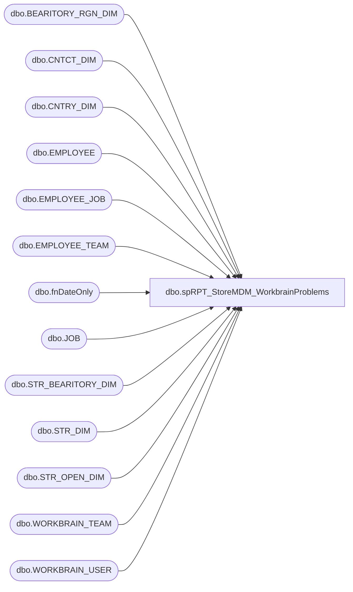

# dbo.spRPT_StoreMDM_WorkbrainProblems

**Database:** dw  
**Server:** papamart  

## Architecture Diagram



## Table Dependencies

| Referenced Table |
|---|
| dbo.BEARITORY_RGN_DIM |
| dbo.CNTCT_DIM |
| dbo.CNTRY_DIM |
| dbo.EMPLOYEE |
| dbo.EMPLOYEE_JOB |
| dbo.EMPLOYEE_TEAM |
| dbo.fnDateOnly |
| dbo.JOB |
| dbo.STR_BEARITORY_DIM |
| dbo.STR_DIM |
| dbo.STR_OPEN_DIM |
| dbo.WORKBRAIN_TEAM |
| dbo.WORKBRAIN_USER |

## Stored Procedure Code

```sql
CREATE PROCEDURE [dbo].[spRPT_StoreMDM_WorkbrainProblems]
AS
-- =====================================================================================================
-- Name: spRPT_StoreMDM_WorkbrainProblems
--
-- Description:	Generates a list of Stores where StoreMDM is different from Lawson
--
-- Input: None
--
-- Output: Resultset 
--			
--
-- Dependencies: None
--
-- Revision History
--		Name:			Date:			Comments:
--		Gary Murrish	9/6/2013		Initial Release
--		Mike Pelikan	04/29/2014		Changed BABWMSTRDATA linked server reference
-- =====================================================================================================
BEGIN
	SET NOCOUNT ON;
	-- Run this on Papamart.dw
	DECLARE @asOfDate datetime
	SET @asOfDate = dbo.fnDateOnly(GETDATE())
	IF DATEPART(hh, GETDATE()) > 20
	BEGIN
		SET @asOfDate = @asOfDate + 1
	END

	-- Get Store MDM information for Open Stores
	IF OBJECT_ID('tempdb..#MDMStoreBearitory') IS NOT NULL
	BEGIN
		DROP TABLE #MDMStoreBearitory
	END

	SELECT
		SD.STR_NUM,
		SD.NM_ABBRV,
		BRD.BEARITORY_NUM,
		BRD.NM AS BearitoryName,
		lower(CD.email) AS BLEmail,
		CD.LAST_NM AS BLLastName
	INTO #MDMStoreBearitory
	FROM
		KODIAK.BABWMstrData.dbo.STR_DIM SD WITH (NOLOCK)
		INNER JOIN KODIAK.BABWMstrData.dbo.STR_BEARITORY_DIM SBD WITH (NOLOCK)
			ON SD.STR_ID = SBD.STR_ID
			AND @asOfDate BETWEEN SBD.STRT_DT AND SBD.END_DT
		INNER JOIN KODIAK.BABWMstrData.dbo.BEARITORY_RGN_DIM BRD
			ON SBD.bearitory_id = BRD.bearitory_id
			AND @asOfDate BETWEEN BRD.STRT_DT AND BRD.END_DT
		INNER JOIN KODIAK.BABWMstrData.dbo.CNTCT_DIM CD WITH (NOLOCK)
			ON BRD.CNTCT_ID = CD.CNTCT_ID
		INNER JOIN KODIAK.BABWMstrData.dbo.CNTRY_DIM Cntry WITH (NOLOCK)
			ON SD.CNTRY_ID = Cntry.CNTRY_ID
		INNER JOIN KODIAK.BABWMstrData.dbo.STR_OPEN_DIM SOD WITH (NOLOCK)
			ON SOD.STR_KEY = SD.STR_ID
			AND @asOfDate BETWEEN SOD.OPEN_DT AND SOD.CLOSE_DT
	WHERE
		1 = 1
		AND SD.STR_NUM > 0
		AND Cntry.NM_ABBRV = 'US'

	IF OBJECT_ID('tempdb..#blNames') IS NOT NULL
	BEGIN
		DROP TABLE #blNames
	END

	SELECT
		e.EMP_NAME,
		e.EMP_LASTNAME,
		e.EMP_FIRSTNAME,
		b.JOB_NAME,
		LTRIM(RTRIM(a.WBT_NAME)) AS "Bearitory",
		LTRIM(RTRIM(wu.WBU_EMAIL)) AS "Email Address",
		LTRIM(RTRIM(REPLACE(LEFT(a.WBT_NAME, 5), 'BT', ''))) AS bearitory_no
	INTO #blNames
	FROM
		LABORDB01.workbrainProd.dbo.EMPLOYEE e
		FULL OUTER JOIN LABORDB01.workbrainProd.dbo.EMPLOYEE_JOB j
			ON e.emp_id = j.emp_id
		INNER JOIN LABORDB01.workbrainProd.dbo.JOB b
			ON b.job_id = j.job_id
		INNER JOIN LABORDB01.workbrainProd.dbo.EMPLOYEE_TEAM t
			ON e.emp_id = t.emp_id
		INNER JOIN LABORDB01.workbrainProd.dbo.WORKBRAIN_TEAM a
			ON t.WBT_ID = a.WBT_ID
		INNER JOIN LABORDB01.workbrainProd.dbo.WORKBRAIN_USER wu
			ON e.emp_id = wu.emp_id

	WHERE
		e.EMP_STATUS = 'A'
		AND b.JOB_NAME = 'DIR BL'
		AND WBT_NAME <> 'UNASSIGNED TEAM'
		AND t.EMPT_END_DATE > '1/1/2099'
	ORDER BY bearitory_no

	IF OBJECT_ID('tempdb..#StoreBearitory') IS NOT NULL
	BEGIN
		DROP TABLE #StoreBearitory
	END

	SELECT
		CAST(LEFT(WT.WBT_NAME, 5) AS int) AS store_num,
		WP.WBT_NAME AS StoreName,
		CONVERT(datetime, WP.WBT_UDF3) AS StoreStartDate,
		LTRIM(RTRIM(WB.WBT_DESC)) AS BearitoryName,
		LTRIM(RTRIM(REPLACE(LEFT(WB.WBT_NAME, 5), 'BT', ''))) AS bearitory_no
	INTO #StoreBearitory
	FROM
		LABORDB01.workbrainProd.dbo.WORKBRAIN_TEAM WT (NOLOCK)
		INNER JOIN LABORDB01.workbrainProd.dbo.WORKBRAIN_TEAM WP (NOLOCK)
			ON WT.WBT_PARENT_ID = WP.WBT_ID
		INNER JOIN LABORDB01.workbrainProd.dbo.WORKBRAIN_TEAM WB (NOLOCK)
			ON WP.WBT_PARENT_ID = WB.WBT_ID
	WHERE
		WT.WBT_NAME LIKE '%BAB'


	IF OBJECT_ID('tempdb..#wbStoreBearitory') IS NOT NULL
	BEGIN
		DROP TABLE #wbStoreBearitory
	END

	SELECT
		sb.store_num AS wbStore_num,
		sb.BearitoryName COLLATE database_default AS wbBearitoryName,
		sb.bearitory_no COLLATE database_default AS wbBearitoryNo,
		ISNULL(n.EMP_LASTNAME, 'Missing') COLLATE database_default AS wbBLLastName,
		ISNULL(n.[EMAIL ADDRESS], 'Missing') COLLATE database_default AS wbBLEMail
	INTO #wbStoreBearitory
	FROM
		#StoreBearitory sb WITH (NOLOCK)
		LEFT JOIN #blNames n WITH (NOLOCK)
			ON sb.bearitory_no = n.bearitory_no


	SELECT
		mb.STR_NUM,
		mb.NM_ABBRV,
		mb.BEARITORY_NUM,
		mb.BearitoryName,
		mb.BLEmail,
		mb.BLLastName,
		sb.wbStore_num,
		sb.wbBearitoryName,
		sb.wbBearitoryNo,
		sb.wbBLLastName,
		sb.wbBLEMail,
		@asOfDate AS asOfDate
	FROM
		#MDMStoreBearitory mb
		LEFT JOIN #wbStoreBearitory sb WITH (NOLOCK)
			ON mb.STR_NUM = sb.wbStore_num
	WHERE
		1 = 0
		OR mb.BearitoryName <> sb.wbBearitoryName
		OR mb.BLEmail <> sb.wbBLEMail
		OR mb.BLLastName <> sb.wbBLLastName

END
```

