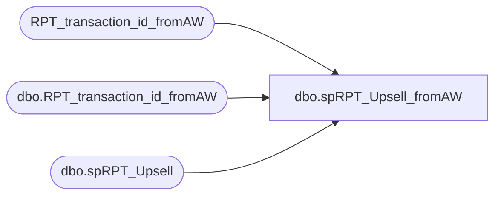

# dbo.spRPT_Upsell_fromAW

**Database:** dw  
**Server:** papamart  

## Architecture Diagram



## Table Dependencies

| Referenced Table |
|---|
| RPT_transaction_id_fromAW |
| dbo.RPT_transaction_id_fromAW |
| dbo.spRPT_Upsell |

## Stored Procedure Code

```sql
CREATE PROCEDURE [dbo].[spRPT_Upsell_fromAW]  
 @BeginDate datetime,  
 @EndDate datetime,  
 @GrossLineAmount int,  
 @LineObject int  
as  
/*************************************************  
Purpose:  Used to provide a list of transaction_id's  
  to be used with JacksFacts BusObj Universe  
   
 Created on Papamart so that Jack can access through  
 existing BO connections  
  
Author:  Dan Morgan  
Created:  8/28/07  
Modified:  
  
Sample:  exec spRPT_Upsell_fromAW @BeginDate = '7/2/07', @EndDate = '7/2/07', @GrossLineAmount = 10, @LineObject = 633  
* Name			Date			Change
* Garyd			08/19/2010		Update server name for SA 5.0.
**************************************************/  
set nocount on  
  
--create table RPT_transaction_id_fromAW  
--(transaction_id int,  
--use_field_y_n char(1))  
  
delete RPT_transaction_id_fromAW  
  
exec bedrockdb01.auditworks.dbo.spRPT_Upsell @BeginDate, @EndDate, @GrossLineAmount, @LineObject  

insert dw.dbo.RPT_transaction_id_fromAW(transaction_id,use_field_y_n)  
select transaction_id, use_field_y_n  
from bedrockdb01.auditworks.dbo.RPT_transaction_id_fromAW
```

