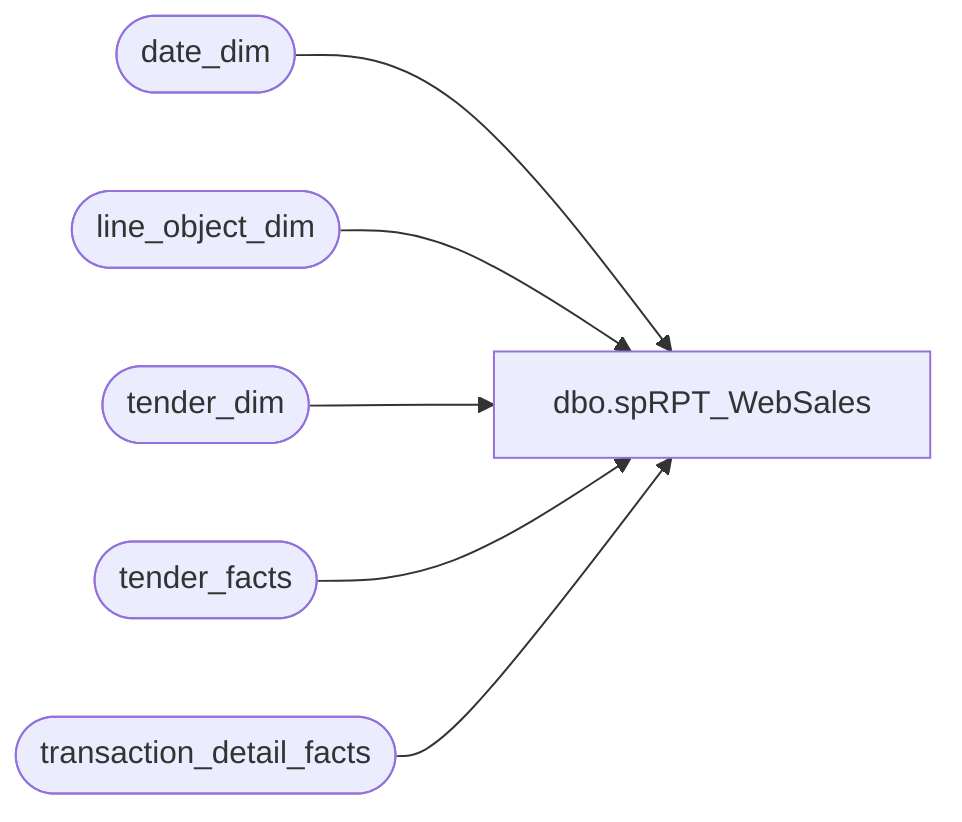

# dbo.spRPT_WebSales

**Database:** dw  
**Server:** papamart  

## Architecture Diagram



## Table Dependencies

| Referenced Table |
|---|
| date_dim |
| line_object_dim |
| tender_dim |
| tender_facts |
| transaction_detail_facts |

## Stored Procedure Code

```sql
-- =====================================================================================================
-- Name: spRPT_WebSales
--
-- Description:	Extracts the Sales information from the data warehouse for the Web Sales report
--
-- Input:	@fromDate - The starting date of the period to be reported
--			@thruDate - The ending date of the period to be reported
--
-- Output: Resultset 
--			
--
-- Dependencies: None
--
-- Revision History
--		Name:			Date:			Comments:
--		Gary Murrish	3/7/2013		Added Store 991 to the reporting for Web Sales Per Jack McCormick
--		Gary Murrish	3/5/2013		Initial Release
-- =====================================================================================================
CREATE PROCEDURE [dbo].[spRPT_WebSales]
	@fromDate AS datetime, @thruDate AS datetime
AS
BEGIN
	SET NOCOUNT ON;
	--SELECT store_key FROM store_dim sd WITH (NOLOCK) WHERE store_id IN (13, 473, 991)
	-- (13, 169, 501)
	-- Get the date keys
	DECLARE	@fromDate_Key AS int,
			@thruDate_Key AS int
	SELECT
		@fromDate_Key = date_key
	FROM
		date_dim dd WITH (NOLOCK)
	WHERE
		dd.actual_date = @fromDate
	SELECT
		@thruDate_Key = date_key
	FROM
		date_dim dd WITH (NOLOCK)
	WHERE
		dd.actual_date = @thruDate

	DECLARE @StoreSales AS money
	DECLARE @VWSales AS money
	DECLARE @ShippingRevenue AS money
	DECLARE @ShippingDiscounts AS money
	DECLARE @DiscountsAndReturns AS money
	DECLARE @Fees AS MONEY

	-- Get the information from TDF
	SELECT
		@StoreSales = SUM(CASE
				WHEN base.Line_Object IN (100) AND base.tranTYPE = 'Normal' THEN base.UGA
			ELSE 0
			END),
		@VWSales = SUM(CASE
				WHEN base.Line_Object IN (102, 103) AND base.tranTYPE = 'Normal' THEN base.UGA
			ELSE 0
			END),
		@Fees = SUM(CASE
				WHEN base.Line_Object IN (202) AND base.tranTYPE = 'Normal' THEN base.UGA
			ELSE 0
			END),
		@ShippingRevenue = SUM(CASE
				WHEN base.Line_Object IN (200, 203) AND base.tranTYPE = 'Normal' THEN base.UGA
			ELSE 0
			END),
		@ShippingDiscounts = SUM(CASE
				WHEN base.Line_Object IN (200, 203) AND base.tranTYPE = 'Normal' THEN base.Disc * -1
			ELSE 0
			END),
		@DiscountsAndReturns = SUM(CASE
				WHEN base.tranTYPE = 'Return' THEN base.UGA + (base.Disc * -1)
			ELSE 0
			END)
		+ SUM(CASE
				WHEN (base.Line_Object < 200 OR base.Line_Object IN (202)) AND base.tranTYPE = 'Normal' THEN base.Disc * -1
			ELSE 0
			END)
	FROM
		(SELECT
				lod.Line_Object,
				lod.Line_Object_Description,
				CASE
						WHEN tdf.unit_gross_amount < 0 THEN 'Return'
					ELSE 'Normal'
					END AS tranTYPE,
				SUM(tdf.unit_gross_amount) AS UGA,
				SUM(CASE
						WHEN tdf.unit_gross_amount < 0 THEN -1
					ELSE 1
					END * tdf.unit_disc_amount) AS Disc
			FROM
				transaction_detail_facts tdf WITH (NOLOCK)
				INNER JOIN line_object_dim lod WITH (NOLOCK)
					ON tdf.line_object_key = lod.line_object_key
			WHERE
				tdf.date_key BETWEEN @fromDate_Key AND @thruDate_key
				AND tdf.store_key IN (13, 169, 501)
				AND lod.Line_Object NOT IN (403,404, 101, 292)	-- Giftcards
			GROUP BY	lod.Line_Object,
						lod.Line_Object_Description,
						CASE
								WHEN tdf.unit_gross_amount < 0 THEN 'Return'
							ELSE 'Normal'
							END)
		base

	-- Get the SFS Cert Redemptions
	SELECT
		@DiscountsAndReturns = @DiscountsAndReturns + SUM(tf.tender_amt)
	FROM
		tender_facts tf WITH (NOLOCK)
		INNER JOIN tender_dim td WITH (NOLOCK)
			ON tf.tender_key = td.tender_key
	WHERE
		tf.date_key BETWEEN @fromDate_Key AND @thruDate_key
		AND tf.store_key IN (13, 169, 501)
		AND td.tender_code = 640

	-- Return the information
	SELECT
		@StoreSales AS StoreSales,
		@VWSales AS VWSales,
		@Fees AS Fees,
		@ShippingRevenue AS ShippingRevenue,
		@ShippingDiscounts AS ShippingDiscounts,
		@DiscountsAndReturns AS DiscountsAndReturns
END
```

