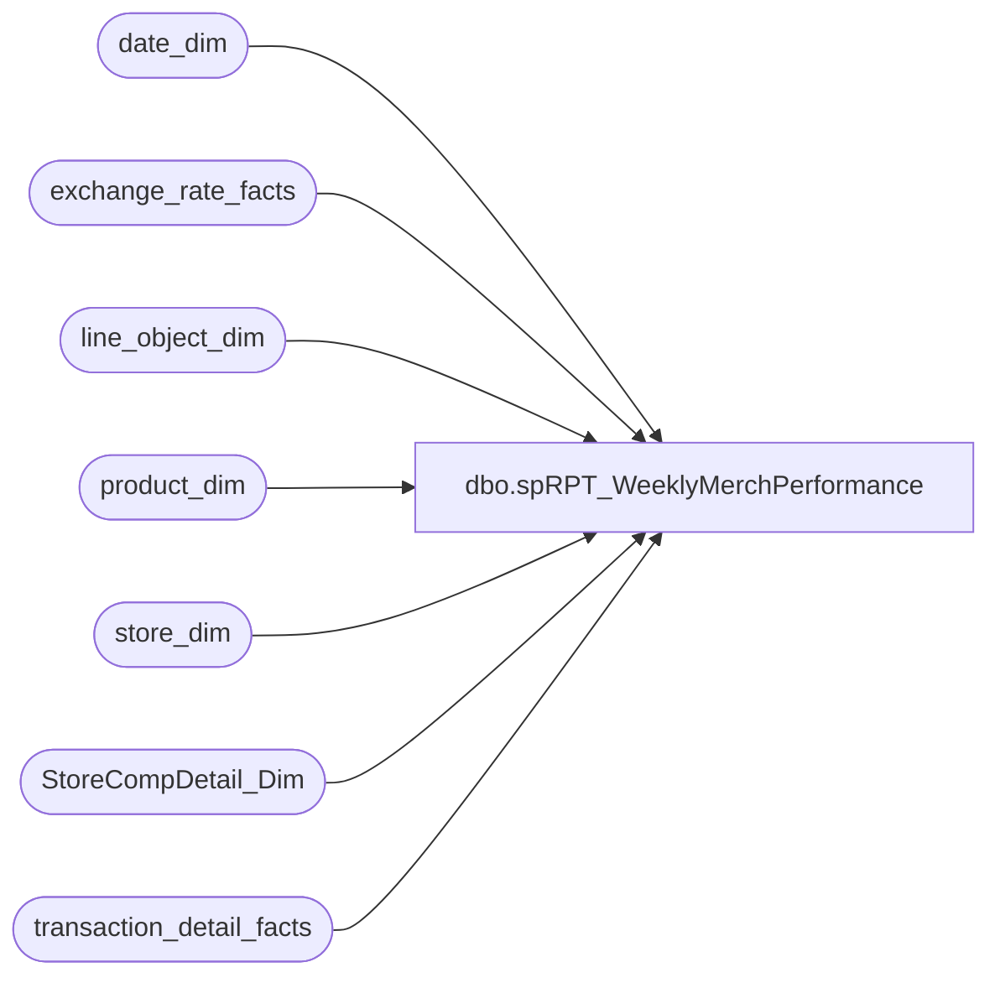

# dbo.spRPT_WeeklyMerchPerformance

**Database:** dw  
**Server:** papamart  

## Architecture Diagram



## Table Dependencies

| Referenced Table |
|---|
| date_dim |
| exchange_rate_facts |
| line_object_dim |
| product_dim |
| store_dim |
| StoreCompDetail_Dim |
| transaction_detail_facts |

## Stored Procedure Code

```sql
-- =====================================================================================================
-- Name: spRPT_WeeklyMerchPerformance
--
-- Description:	Generates the Data for the Weekly Merchandise Performance Report
--
-- Input: startDate = Starting Date
--			endDate	= Ending Date
--			compTY = If 'Y' use comp this year (Use when running This Year)
--					If 'N' use comp Next Year. (Use when running Last Year)
--
--
-- Output: Resultset 
--			
--
-- Dependencies: None
--
-- Revision History
--		Name:			Date:			Comments:
--		Gary Murrish	3/18/2015		Initial Release
--		Gary Murrish	3/26/2015		Added line object 115 as a merchandise line item

-- =====================================================================================================
CREATE PROCEDURE [dbo].[spRPT_WeeklyMerchPerformance]
	@fromDate datetime,
	@thruDate datetime,
	@compTY varchar(1)

AS
BEGIN
	SET NOCOUNT ON;


	DECLARE @fromDateKey int
	DECLARE @thruDateKey int
	SELECT
		@fromDateKey = date_key
	FROM
		date_dim dd WITH (NOLOCK)
	WHERE
		dd.actual_date = @fromDate
	SELECT
		@thruDateKey = date_key
	FROM
		date_dim dd WITH (NOLOCK)
	WHERE
		dd.actual_date = @thruDate


	SELECT
		ISNULL(sd.country, 'US') AS country,
		CASE
			WHEN @CompTY = 'Y' THEN CASE
				WHEN ISNULL(scdd.isCompTY, 0) = 1 THEN 'Y'
				ELSE 'N'
			END
			ELSE CASE
				WHEN ISNULL(scdd.isCompNY, 0) = 1 THEN 'Y'
				ELSE 'N'
			END
		END AS isComp,
		pd.department_code,
		MIN(pd.department) AS department,
		pd.subclass_code,
		MIN(pd.subclass) AS subclass,
		MIN(pd.division) AS division,
		MIN(pd.chain) AS chain,
		MIN(pd.concept) AS concept,
		pd.sku,
		SUM(tdf.unit_gross_amount) AS Gross,
		SUM(tdf.unit_disc_amount) AS Disc,
		SUM(tdf.unit_gross_amount) - SUM(tdf.unit_disc_amount) AS NetAmount,
		SUM(tdf.unit_gross_amount) - SUM(tdf.unit_disc_amount) + SUM(tdf.upsell_disc_allocated) AS NetAmountLessUpsell,
		SUM(tdf.Units) AS Units,
		SUM(tdf.ext_cost) AS Cost,
		1 / AVG(ISNULL(erf.fiscal_month_ave_rate, 1)) AS currRate,
		SUM((tdf.unit_gross_amount - tdf.unit_disc_amount) * (1 / ISNULL(erf.fiscal_month_ave_rate, 1))) AS NetSalesUSD,
		SUM(tdf.ext_cost * (1 / ISNULL(erf.fiscal_month_ave_rate, 1))) AS CostUSD,
		SUM(tdf.upsell_disc_allocated * (1 / ISNULL(erf.fiscal_month_ave_rate, 1))) AS upsellSFSUSD,
		SUM(tdf.unit_gross_amount * (1 / ISNULL(erf.fiscal_month_ave_rate, 1))) AS GrossSalesUSD,
		SUM(tdf.unit_disc_amount * (1 / ISNULL(erf.fiscal_month_ave_rate, 1))) AS DiscountUSD
	FROM
		transaction_detail_facts tdf WITH (NOLOCK)
		INNER JOIN product_dim pd WITH (NOLOCK)
			ON tdf.product_key = pd.product_key
		INNER JOIN store_dim sd WITH (NOLOCK)
			ON tdf.store_key = sd.store_key
		LEFT JOIN exchange_rate_facts erf WITH (NOLOCK)
			ON erf.to_currency_key = tdf.currency_key
			AND erf.from_currency_key = 141
			AND erf.date_key = tdf.date_key
		LEFT JOIN StoreCompDetail_Dim scdd WITH (NOLOCK)
			ON tdf.store_key = scdd.store_key
			AND tdf.date_key = scdd.date_key
		INNER JOIN line_object_dim lod WITH (NOLOCK)
			ON tdf.line_object_key = lod.Line_Object_Key
	WHERE
		tdf.date_key BETWEEN @fromDateKey AND @thruDateKey
		AND lod.Line_Object IN (100, 115)	-- Merchandise Line Items

	GROUP BY	ISNULL(sd.country, 'US'),
				CASE
					WHEN @CompTY = 'Y' THEN CASE
						WHEN ISNULL(scdd.isCompTY, 0) = 1 THEN 'Y'
						ELSE 'N'
					END
					ELSE CASE
						WHEN ISNULL(scdd.isCompNY, 0) = 1 THEN 'Y'
						ELSE 'N'
					END
				END,
				pd.department_code,
				pd.subclass_code,
				pd.sku
	ORDER BY	1,
				2,
				3

END
```

