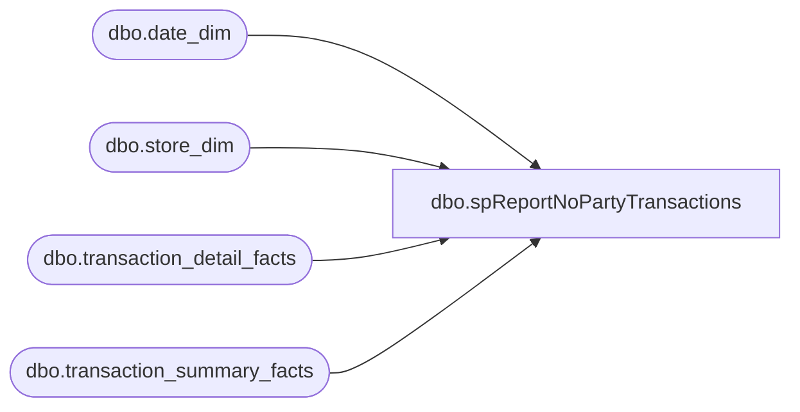

# dbo.spReportNoPartyTransactions

**Database:** dw  
**Server:** papamart  

## Architecture Diagram



## Table Dependencies

| Referenced Table |
|---|
| dbo.date_dim |
| dbo.store_dim |
| dbo.transaction_detail_facts |
| dbo.transaction_summary_facts |

## Stored Procedure Code

```sql
CREATE  PROCEDURE [dbo].[spReportNoPartyTransactions]
	/* ===== ARGUMENTS ===== */
	@BeginDate 	datetime, 
	@EndDate 	datetime

AS

set nocount on

IF (Object_ID('tempdb..#date_keys') IS NOT NULL) DROP TABLE #date_keys
select d.date_key
into #date_keys
from dbo.date_dim d 
where actual_date BETWEEN @BeginDate AND @EndDate

IF (Object_ID('tempdb.dbo.#trans') IS NOT NULL) DROP TABLE #trans
select distinct 
	t.transaction_id,
	t.store_key,
	t.date_key
into dbo.#trans
from dbo.transaction_detail_facts t	
	join #date_keys d 
	on d.date_key = t.date_key
where 1=1
 	and t.party_y_n = 'N'
create clustered index idxC_NU_#trans on dbo.#trans (date_key, store_key,  transaction_id)

select 	s.store_id,
 	ics.transaction_id,
	tsf.GAAP_Sale
from #trans ics
	join dbo.transaction_summary_facts tsf 
	on ics.transaction_id = tsf.transaction_id	
		and ics.store_key = tsf.store_key
		and ics.date_key = tsf.date_key
	join dbo.store_dim s on ics.store_key = s.store_key  
	join dbo.date_dim d on ics.date_key = d.date_key

set nocount off
```

