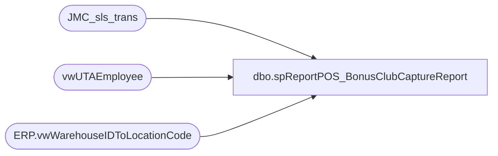

# dbo.spReportPOS_BonusClubCaptureReport

**Database:** dw  
**Server:** papamart  

## Architecture Diagram



## Table Dependencies

| Referenced Table |
|---|
| JMC_sls_trans |
| vwUTAEmployee |
| ERP.vwWarehouseIDToLocationCode |

## Stored Procedure Code

```sql
-- =====================================================================================================
-- Name: spReportPOS_BonusClubCaptureReport
-- Revision History
--		Name:			Date:			Comments:
--		Tim Callahan	05/10/2023		Initial Release
--		Tim Callahan	05/15/2023		Updates after finally getting report requirements from Annie S of Store Ops
--		Tim Callahan	10/19/2023		Changed Employee Lookup source 
--		Dan Tweedie		2025-03-06		Removed query against transaction_facts, we only need past 30-60 days, per Annie
-- =====================================================================================================
CREATE PROCEDURE [dbo].[spReportPOS_BonusClubCaptureReport]
 @BeginDate date,
 @EndDate date ,
 @StoreNumber varchar (4)

 --@DynanmicsLocationCode varchar (4)
 --@DwLocationCode varchar (4)

AS

-- Use This Section for testing 
--Declare @BeginDate date
--Declare @EndDate date 
--Declare @StoreNumber varchar (4)
--Declare @DynanmicsLocationCode varchar (4)
--Declare @DwLocationCode varchar (4)
--;

--set @BeginDate = '2022-05-08'
--set @EndDate = '2023-05-08'
--set @StoreNumber = '1105'
--;
Declare @DynanmicsLocationCode varchar (4)
Declare @DwLocationCode varchar (4)
;

IF OBJECT_ID(N'tempdb..#StoreLookup') IS NOT NULL
DROP TABLE #StoreLookup
select 
WarehouseId as DynanmicsLocationCode,
LocationCode as DwLocationCode
into #StoreLookup
from [stl-ssis-p-01].[IntegrationStaging].[ERP].[vwWarehouseIDToLocationCode]
where 1=1
and Entity = '1100'
and WarehouseId = @StoreNumber


set @DynanmicsLocationCode = (select DynanmicsLocationCode from #StoreLookup) 
set @DwLocationCode = (select DwLocationCode from #StoreLookup)
;


IF OBJECT_ID(N'tempdb..#RawTransData') IS NOT NULL
DROP TABLE #RawTransData
--select 
--dd.actual_date as TransactionDate, 
----right('111'+cast(sd.store_id as varchar),4) as StoreNumber, 
--sl.DynanmicsLocationCode as StoreNumber,
----isnull(e.Emp_Name,cd.cashier_code) as AssociateNumber,  -- Replaced on 11/21/2023
--isnull(e.Emp_Name,SUBSTRING(cd.cashier_code, CHARINDEX('_',cd.cashier_code)+1, 7)) as AssociateNumber, 
--isnull(e.Emp_Fullname,'AssocNameLookUpNotFound') as AssociateName,
----cast (tf.register_no as varchar) as RegisterNumber,
--tf.transaction_no as TransactionNumber, 
----tf.transaction_id as TransactionID,  
--ctf.CustomerNumber
--into #RawTransData 
--From Transaction_Facts tf (nolock)
--left join CRMTransactionFact ctf (nolock) on ctf.TransactionID=tf.transaction_id
--join store_dim sd (nolock) on sd.store_key=tf.store_key
--join vwPOSActiveJumpMindStores v on v.StoreID=sd.store_id
--join date_dim dd (nolock) on dd.date_key=tf.date_key
--left join Cashier_Dim cd (nolock) on cd.cashier_key=tf.cashier_key
----left join vwUTAEmployee e (nolock) on right('0000000'+cd.cashier_code,7)=e.Emp_Name -- Replaced on 11/21/2023
--left join vwUTAEmployee e (nolock) on right('0000000'+(SUBSTRING(cd.cashier_code, CHARINDEX('_',cd.cashier_code)+1, 7)),7)=e.Emp_Name
--			--and e.Calcgrp_ID in ('10005','10004','10011','10010','10009','10008')-- US, UK and IE hourly\salary 	
--join #StoreLookup sl  on sl.DwLocationCode=sd.store_id
--where 1=1
----and sd.country = 'US' -- CA and UK may need to be handled differently for the employee lookup 
--and tf.isShipFromStore = 0 
--and tf.isPickupFromStore = 0 
--and dd.actual_date between @BeginDate and @EndDate
--and sd.store_id = @DwLocationCode
--and isnull(cd.cashier_code,'1')  not in ('13','1') -- This is In case a web\store (bopis, etc.) doesn't get flagged in DW as such due to a lookup failure against Web Order Processed -- Added 1 on 12/6/2023 per Linda this is "These are the records from when an endless aisle order is completed. "
--union 
select 
--h.business_date as TransactionDate, 
cast (h.create_time as date) as TransactionDate, -- Replaced 5/24/2023 due to Business Date could be wrong if store doesnt run EOD\SOD
h.business_unit_id as StoreNumber, 
isnull(e.Emp_name, h.username) as AssociateNumber,
isnull(e.Emp_Fullname,'AssocNameLookUpNotFound') as AssociateName,
--h.device_id as RegisterNumber, 
h.trans_nbr as TransactionNumber, 
h.loyalty_card_number as CustomerNumber
into #RawTransData 
from [JMC_sls_trans] h  (nolock) 
left join vwUTAEmployee e on h.username=e.Emp_Name
	--and e.Calcgrp_ID in ('10005','10004','10011','10010','10009','10008')-- US, UK and IE hourly\salary 	
where 1=1
and h.trans_type = 'SALE'
and h.trans_status = 'COMPLETED' -- Added 5/15/2023
and h.username <> 000
--and h.business_date between @BeginDate and @EndDate
and cast (h.create_time as date) between @BeginDate and @EndDate
and h.business_unit_id = @DynanmicsLocationCode
 

-- I observed potential where there is no customer number in JM but is in DW thus the need for group by and max Customer Number
IF OBJECT_ID(N'tempdb..#RawTransData2') IS NOT NULL
DROP TABLE #RawTransData2
select
TransactionDate, 
StoreNumber, 
AssociateNumber, 
AssociateName, 
TransactionNumber, 
max (CustomerNumber) as CustomerNumber
into #RawTransData2
from #RawTransData
group by 
TransactionDate, 
StoreNumber, 
AssociateNumber, 
AssociateName, 
TransactionNumber

IF OBJECT_ID(N'tempdb..#Summary1') IS NOT NULL
DROP TABLE #Summary1
select 
TransactionDate, 
StoreNumber, 
AssociateNumber, 
AssociateName, 
cast (count (distinct TransactionNumber) as float) as TotalTransNumber, 
cast (sum (
case when CustomerNumber is null then 0 
	when CustomerNumber is not null then 1 
	end )  as float)
	as TotalTransNumberWithClubNumber

into #Summary1
from #RawTransData2
group by 
TransactionDate, 
StoreNumber, 
AssociateNumber, 
AssociateName


IF OBJECT_ID(N'tempdb..#Summary2') IS NOT NULL
DROP TABLE #Summary2
select 
--cast (s.TransactionDate as date) as TransactionDate, 
s.StoreNumber,
s.AssociateNumber, 
s.AssociateName, 
sum(s.TotalTransNumber) as TotalTransNumber, 
sum(s.TotalTransNumberWithClubNumber) as TotalTransNumberWithClubNumber
into #Summary2
From #Summary1 s
group by 
--s.TransactionDate, 
s.StoreNumber,
s.AssociateNumber, 
s.AssociateName 
--s.TotalTransNumber, 
--s.TotalTransNumberWithClubNumber


-- Final Grouping 

select 
s.StoreNumber, 
isnull(s.AssociateNumber, 'NumberNotFound') as AssociateNumber, 
s.AssociateName, 
s.TotalTransNumber,
s.TotalTransNumberWithClubNumber,
--cast (sum ((s.TotalTransNumberWithClubNumber/S.TotalTransNumber)*100) as numeric (5,2)) as PercentageOfTotal 
cast (sum ((s.TotalTransNumberWithClubNumber/S.TotalTransNumber)) as numeric (5,2)) as PercentageOfTotal -- Replaced above on 5/15/2023 -- Annie S of Store Ops needed a fancy % sign in the SSRS report
from #Summary2 s
where s.AssociateNumber is not null 
group by 
s.StoreNumber, 
isnull(s.AssociateNumber, 'NumberNotFound'),
s.AssociateName, 
s.TotalTransNumber,
s.TotalTransNumberWithClubNumber

order by 6 desc, 1, 2
```

