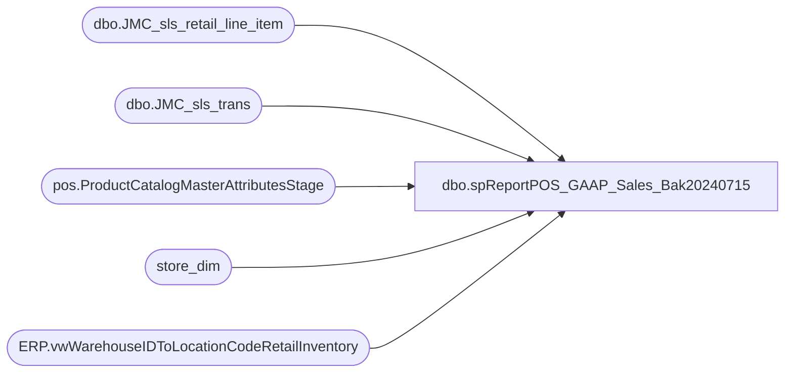

# dbo.spReportPOS_GAAP_Sales_Bak20240715

**Database:** dw  
**Server:** papamart  

## Architecture Diagram



## Table Dependencies

| Referenced Table |
|---|
| dbo.JMC_sls_retail_line_item |
| dbo.JMC_sls_trans |
| pos.ProductCatalogMasterAttributesStage |
| store_dim |
| ERP.vwWarehouseIDToLocationCodeRetailInventory |

## Stored Procedure Code

```sql
---- =====================================================================================================
---- Name: spReportPOS_GAAP_Sales
---- Revision History
----		Name:			Date:			Comments:
----		Tim Callahan	06/01/2023		Initial Release
----		Tim Callahan	09/15/2023		Updated To Handle Multiple Store Countries for JumpMind Portion Of Sales
----		Dan Tweedie		2023-10-06		Added join to store_dim to get country so UK and IE are broken out, subtract tax from UK/IE for sales due to complaints from UK ops, experimenting
----		Tim Callahan	10/13/2023		Changed NetSales source field as the JM field actual_price did not multiple by qty, need to used the extended field 
---- =====================================================================================================
CREATE PROCEDURE [dbo].[spReportPOS_GAAP_Sales_Bak20240715]

 @BeginDate date,
 @EndDate date ,
 @StoreNumber varchar (4)

----@DynanmicsLocationCode varchar (4)
----@DwLocationCode varchar (4)

as 

-- Use This Section for testing 
--Declare @BeginDate date
--Declare @EndDate date 
--Declare @StoreNumber varchar (4)
--Declare @DynanmicsLocationCode varchar (4)
--Declare @DwLocationCode varchar (4)
--;

--set @BeginDate = '2023-06-12'
--set @EndDate = '2023-05-08'
--set @StoreNumber = '1105'
--;

Declare @DynanmicsLocationCode varchar (4)
Declare @DwLocationCode varchar (4)
;

IF OBJECT_ID(N'tempdb..#StoreLookup') IS NOT NULL
DROP TABLE #StoreLookup
select 
	v.WarehouseId as DynanmicsLocationCode,
	v.LocationCode as DwLocationCode, 
	sd.country
	--case when Entity = '1100' 
	--		then 'US'
	--	when Entity = '1700'
	--		then 'CA'
	--	when Entity = '2110'
	--		then 'UK'
	--	ELSE NULL 
	--	end as Country 
into #StoreLookup
from [stl-ssis-p-01].[IntegrationStaging].[ERP].[vwWarehouseIDToLocationCodeRetailInventory] v -- changed view source on 9/15/2023
join store_dim sd on cast(v.LocationCode as int)=sd.store_id  --added 2023-10-06
where 1=1
--and Entity = '1100' -- Removed Condition on 9/15/2023
and WarehouseId = @StoreNumber


set @DynanmicsLocationCode = (select DynanmicsLocationCode from #StoreLookup) 
set @DwLocationCode = (select DwLocationCode from #StoreLookup)
;

-- Style Data
IF OBJECT_ID(N'tempdb..#StyleLookup') IS NOT NULL
DROP TABLE #StyleLookup
select a.ProductNumber, a.ProductDescription, a.Department, a.DepartmentCode, a.ProductSellingGeography, a.ItemType
into #StyleLookup
from [stl-ssis-p-01].IntegrationStaging.pos.ProductCatalogMasterAttributesStage a 
join #StoreLookup sl on sl.Country=a.ProductSellingGeography -- Added Join on 9/15/2023
group by a.ProductNumber, a.ProductDescription, a.Department, a.DepartmentCode, a.ProductSellingGeography, a.ItemType

;


with RawData as (

select 
cast (h.last_update_time as date) as TransactionDate, 
h.trans_nbr, 
datepart( hh, h.last_update_time) as TransactionHour, 
datepart( mi, h.last_update_time) as TransactionMinute, 
h.business_unit_id as StoreNumber,
s.Department

--,case when s.ProductSellingGeography in ('UK','IE') 
--	then sum(l.actual_unit_price-l.tax_amount) 
--		else sum(l.actual_unit_price) 
--	end as NetSales -- Replaced on 10/13/2023
,case when s.ProductSellingGeography in ('UK','IE') 
	then sum(l.extended_discounted_amount-l.tax_amount) 
		else sum(l.extended_discounted_amount) 
	end as NetSales -- Replaced above on 10/13/2023 as this wasn't considering multiple of the same sku
, sum (l.quantity) as UnitsSold
from [dbo].[JMC_sls_trans] h (nolock) 
join [dbo].[JMC_sls_retail_line_item] l (nolock) on h.device_id=l.device_id
												and h.trans_nbr=l.sequence_number
												and h.business_date = l.business_date -- Added 7/2/2024
join #StyleLookup s on s.productnumber=l.item_id
where 1=1
--and h.trans_type = 'SALE'
and h.trans_status = 'COMPLETED'
and h.username <> 000
and l.voided = 0
--and l.item_returned = 0
and l.item_type in ('STOCK')
and s.DepartmentCode not in ('R-B-D-47')

and l.line_item_type ='STORE_SALE'

--and cast (h.last_update_time as date) = cast (getdate () as date) -- Will be replaced by parameters 
--and h.business_unit_id = '1105'-- Will be replaced by parameters 
and cast (h.last_update_time as date) between @BeginDate and @EndDate
and cast (l.last_update_time as date) between @BeginDate and @EndDate -- Added on 8/10/2023
and h.business_unit_id = @DynanmicsLocationCode
group by 
cast (h.last_update_time as date),
h.trans_nbr, 
datepart( hh, h.last_update_time), 
datepart( mi, h.last_update_time), 
h.business_unit_id,
s.Department,
s.ProductSellingGeography
) , 

TransactionCountPerHour as (

select TransactionHour, 
count (distinct Trans_Nbr) as TransactionCountPerHour

from RawData
group by TransactionHour
) , 

NetSalesPerHour as (

select TransactionHour, 
sum (NetSales) as NetSalesPerHour

from RawData
group by TransactionHour

) ,

UnitsPerHour   as (

select TransactionHour, 
cast (sum (UnitsSold) as Int)  as UnitSoldPerHour

from RawData
group by TransactionHour

), 

UnitsPerHourByDepartment as (

select 
TransactionHour, 
Department,
cast (sum (UnitsSold) as Int)  as UnitSoldPerHour, 
count (distinct Trans_Nbr) as CountTransWithKeyDepartment

from RawData
where Department in ('Footwear','Stuffers')
group by 
TransactionHour, 
Department

), 


UnitsPerHourSkins  as

(

select 
TransactionHour, 
Department,
cast (sum (UnitsSold) as Int)  as UnitSoldPerHour, 
count (distinct Trans_Nbr) as CountTransWithKeyDepartment

from RawData
where Department in ('Unstuffed')
group by 
TransactionHour, 
Department

), 

Summary1 as (

select 
n.TransactionHour, 
n.NetSalesPerHour, 
t.TransactionCountPerHour, 
u.UnitSoldPerHour, 
cast (n.NetSalesPerHour/t.TransactionCountPerHour as numeric (14,2)) as DPT, 
--cast (n.nePerHour/u.UnitSoldPerHour as numeric (14,2)) as UPT, 
cast (cast (u.UnitSoldPerHour as float) /cast (t.TransactionCountPerHour as float) as numeric (14,2)) as UPT,
uphs.UnitSoldPerHour as SkinsPerHour, 
uphd.UnitSoldPerHour as ShoesPerHour, 
uphds.UnitSoldPerHour as StuffersPerHour, 
cast (cast (uphd.UnitSoldPerHour as float) /cast (uphs.UnitSoldPerHour as float) as numeric (5,2)) as ShoesPct, 
cast (cast (uphds.UnitSoldPerHour as float) /cast (uphs.UnitSoldPerHour as float) as numeric (5,2)) as StuffersPct
from NetSalesPerHour  N
join TransactionCountPerHour T on t.TransactionHour=n.TransactionHour
join UnitsPerHour u on u.TransactionHour=n.TransactionHour
left join UnitsPerHourskins uphs on uphs.TransactionHour=n.TransactionHour
left join UnitsPerHourByDepartment uphd on uphd.TransactionHour=n.TransactionHour
								and uphd.Department = 'Footwear'
left join UnitsPerHourByDepartment uphds on uphds.TransactionHour=n.TransactionHour
								and uphds.Department = 'Stuffers'
) 

select 
s.TransactionHour, 
format (dateadd(hh,s.TransactionHour, '00:00'),'h tt') as TransactionHourConverted,
s.NetSalesPerHour, 
s.TransactionCountPerHour, 
s.UnitSoldPerHour, 
s.DPT, 
s.UPT, 
isnull(s.SkinsPerHour,0) as SkinsPerHour, 
s.ShoesPerHour, 
s.StuffersPerHour, 
s.ShoesPct as ShoesPctRaw, 
case when s.ShoesPct >= 1 
		then 1--00
	when s.ShoesPct is null 
		then 0
	else s.ShoesPct--*100 
	end as ShoesPercentage, 
s.StuffersPct as StufferPctRaw,
case when s.StuffersPct >= 1 
		then 1--00
	when s.StuffersPct is null 
		then 0
	else s.StuffersPct--*100
	end as StufferPercentage
from Summary1 s
order by 1 
							

dbo,dt_verstamp007,/*
**	This procedure returns the version number of the stored
**    procedures used by the the Microsoft Visual Database Tools.
**	Version is 7.0.05.
*/
create procedure dbo.dt_verstamp007
as
	select 7005
```

