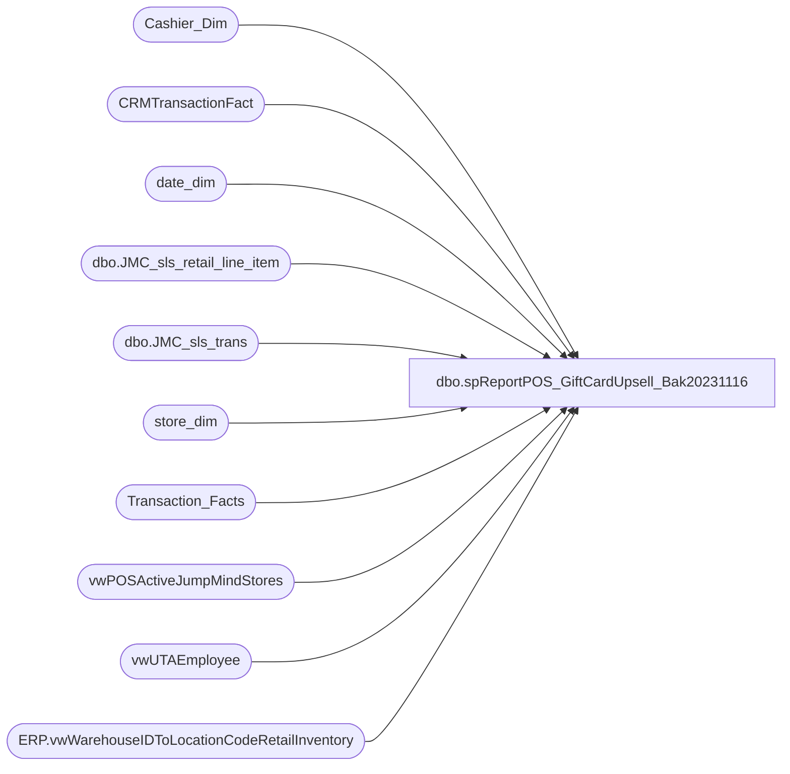

# dbo.spReportPOS_GiftCardUpsell_Bak20231116

**Database:** dw  
**Server:** papamart  

## Architecture Diagram



## Table Dependencies

| Referenced Table |
|---|
| Cashier_Dim |
| CRMTransactionFact |
| date_dim |
| dbo.JMC_sls_retail_line_item |
| dbo.JMC_sls_trans |
| store_dim |
| Transaction_Facts |
| vwPOSActiveJumpMindStores |
| vwUTAEmployee |
| ERP.vwWarehouseIDToLocationCodeRetailInventory |

## Stored Procedure Code

```sql
-- =====================================================================================================
-- Name: spReportPOS_GiftCardUpsell
-- Revision History
--		Name:			Date:			Comments:
--		Tim Callahan	05/17/2023		Initial Release
--		Tim Callahan	05/25/2023		Received additional requirements from Annie S of Store Ops 
--		Tim Callahan	09/15/2023		Updated To Handle Multiple Store Countries for JumpMind Portion Of Sales
--										Solutioning Still needed for Historical Aptos POS Sales for UK\CA Stores 
--		Tim Callahan	10/19/2023		Changed Employee Lookup source 
-- =====================================================================================================
CREATE PROCEDURE [dbo].[spReportPOS_GiftCardUpsell_Bak20231116]

 @BeginDate date,
 @EndDate date ,
 @StoreNumber varchar (4)

 --@DynanmicsLocationCode varchar (4)
 --@DwLocationCode varchar (4)

 WITH RECOMPILE 

 as 

 -- Use This Section for testing 
--Declare @BeginDate date
--Declare @EndDate date 
--Declare @StoreNumber varchar (4)
--Declare @DynanmicsLocationCode varchar (4)
--Declare @DwLocationCode varchar (4)
--;

--set @BeginDate = '2022-05-08'
--set @EndDate = '2023-05-08'
--set @StoreNumber = '1105'
--;
Declare @DynanmicsLocationCode varchar (4)
Declare @DwLocationCode varchar (4)
;

IF OBJECT_ID(N'tempdb..#StoreLookup') IS NOT NULL
DROP TABLE #StoreLookup
select 
WarehouseId as DynanmicsLocationCode,
LocationCode as DwLocationCode, 
case when Entity = '1100' 
		then 'US'
	when Entity = '1700'
		then 'CA'
	when Entity = '2110'
		then 'UK'
	ELSE NULL 
	end as Country 
into #StoreLookup
from [stl-ssis-p-01].[IntegrationStaging].[ERP].[vwWarehouseIDToLocationCodeRetailInventory] -- Replaced View on 9/15/2023
where 1=1
--and Entity = '1100'
and WarehouseId = @StoreNumber

set @DynanmicsLocationCode = (select DynanmicsLocationCode from #StoreLookup) 
set @DwLocationCode = (select DwLocationCode from #StoreLookup)
;


-- Total Trans Data 

IF OBJECT_ID(N'tempdb..#RawTransData') IS NOT NULL
DROP TABLE #RawTransData
select 
dd.actual_date as TransactionDate, 
--right('111'+cast(sd.store_id as varchar),4) as StoreNumber, 
sl.DynanmicsLocationCode as StoreNumber,
isnull(e.Emp_Name,cd.cashier_code) as AssociateNumber, 
isnull(e.Emp_Fullname,'AssocNameLookUpNotFound') as AssociateName,
sum (tf.unit_net_amount+tf.tax_amount+abs(tf.upsell_discount_amount)) as SumTotal, -- Basically Goods sold after discount plus tax less any promo gc redeemed 
cast (count (distinct tf.transaction_id) as float)  as TotalTrans, 
sum (
	case when tf.unit_net_amount >= 25.00 then 1 
		else 0 
	end ) as TotalQualifyingTrans
into #RawTransData 
From Transaction_Facts tf (nolock)
left join CRMTransactionFact ctf (nolock) on ctf.TransactionID=tf.transaction_id
join store_dim sd (nolock) on sd.store_key=tf.store_key
join vwPOSActiveJumpMindStores v on v.StoreID=sd.store_id
join date_dim dd (nolock) on dd.date_key=tf.date_key
left join Cashier_Dim cd (nolock) on cd.cashier_key=tf.cashier_key
left join vwUTAEmployee e (nolock) on right('0000000'+cd.cashier_code,7)=e.Emp_Name
	--and e.Calcgrp_ID in ('10005','10004')-- US hourly\salary	
join #StoreLookup sl  on sl.DwLocationCode=sd.store_id
where 1=1
--and sd.country = 'US' -- CA and UK may need to be handled differently for the employee lookup 
and tf.isShipFromStore = 0 
and tf.isPickupFromStore = 0 
and dd.actual_date between @BeginDate and @EndDate
and sd.store_id = @DwLocationCode
group by 
dd.actual_date, 
--right('111'+cast(sd.store_id as varchar),4),
sl.DynanmicsLocationCode,
isnull(e.Emp_Name,cd.cashier_code),
isnull(e.Emp_Fullname,'AssocNameLookUpNotFound')
union 

select 
--h.business_date as TransactionDate, 
cast (h.create_time as date) as TransactionDate, -- Replaced 5/24/2023 due to Business Date could be wrong if store doesnt run EOD\SOD
h.business_unit_id as StoreNumber, 
--e.Emp_name as AssociateNumber,
isnull(e.Emp_name,h.username) as AssociateNumber,
isnull(e.Emp_Fullname,'AssocNameLookUpNotFound') as AssociateName,
sum (h.total) as SumTotal,
cast (count (distinct h.trans_nbr) as float)  as TotalTrans,
sum (
	case when h.subtotal >= 25.00 then 1 
		else 0 
	end ) as TotalQualifyingTrans
from [dbo].[JMC_sls_trans] h (nolock) 
left join vwUTAEmployee e on h.username=e.Emp_Name	
	--and e.Calcgrp_ID in ('10005','10004')-- US hourly\salary	
where 1=1
and h.trans_type = 'SALE'
and h.trans_status = 'COMPLETED' -- Added 5/15/2023
and h.username <> 000
--and h.business_date between @BeginDate and @EndDate
and cast (h.create_time as date) between @BeginDate and @EndDate -- Replaced 5/24/2023 due to Business Date could be wrong if store doesnt run EOD\SOD
and h.business_unit_id = @DynanmicsLocationCode
group by 
--h.business_date, 
cast (h.create_time as date),
h.business_unit_id, 
--e.Emp_name , 
isnull(e.Emp_name,h.username),
isnull(e.Emp_Fullname,'AssocNameLookUpNotFound')
order by 1, 3

-- Found that there is at time as transaction date variance between the JM data and the AW\DW data , taking max value 
IF OBJECT_ID(N'tempdb..#RawTransData2') IS NOT NULL
DROP TABLE #RawTransData2
select
TransactionDate, 
StoreNumber, 
AssociateNumber, 
AssociateName, 
max (SumTotal) as SumTotal, 
max (TotalTrans) as TotalTrans, 
max (TotalQualifyingTrans) as TotalQualifyingTrans
into #RawTransData2
from #RawTransData
group by 
TransactionDate, 
StoreNumber, 
AssociateNumber, 
AssociateName


-- GC Upsell Trans Data 
IF OBJECT_ID(N'tempdb..#GcTransData') IS NOT NULL
DROP TABLE #GcTransData

select 
dd.actual_date as TransactionDate, 
--right('111'+cast(sd.store_id as varchar),4) as StoreNumber, 
sl.DynanmicsLocationCode as StoreNumber,
isnull(e.Emp_Name,cd.cashier_code) as AssociateNumber, 
isnull(e.Emp_Fullname,'AssocNameLookUpNotFound') as AssociateName,
cast (count (distinct tf.transaction_id) as float)  as TotalTransWithGcPromo
into #GcTransData
From Transaction_Facts tf (nolock)
left join CRMTransactionFact ctf (nolock) on ctf.TransactionID=tf.transaction_id
join store_dim sd (nolock) on sd.store_key=tf.store_key
join vwPOSActiveJumpMindStores v on v.StoreID=sd.store_id
join date_dim dd (nolock) on dd.date_key=tf.date_key
left join Cashier_Dim cd (nolock) on cd.cashier_key=tf.cashier_key
left join vwUTAEmployee e (nolock) on right('0000000'+cd.cashier_code,7)=e.Emp_Name
	--and e.Calcgrp_ID in ('10005','10004')-- US hourly\salary	
join #StoreLookup sl  on sl.DwLocationCode=sd.store_id
where 1=1
--and sd.country = 'US' -- CA and UK will need to be handled differently for the employee lookup 
and tf.isShipFromStore = 0 
and tf.isPickupFromStore = 0 
and tf.giftcard_units > 0 
and abs(tf.giftcard_discount_amount / tf.giftcard_units) = 5
and dd.actual_date between @BeginDate and @EndDate
and sd.store_id = @DwLocationCode
group by
dd.actual_date, 
--right('111'+cast(sd.store_id as varchar),4),
sl.DynanmicsLocationCode,
isnull(e.Emp_Name,cd.cashier_code),
isnull(e.Emp_Fullname,'AssocNameLookUpNotFound')
union 
select
--h.business_date as TransactionDate, 
cast (h.create_time as date) as TransactionDate, -- Replaced 5/24/2023 due to Business Date could be wrong if store doesnt run EOD\SOD
h.business_unit_id as StoreNumber, 
--e.Emp_name as AssociateNumber,
isnull(e.Emp_name,h.username) as AssociateNumber, -- Replaced Above on 9/15/2023
isnull(e.Emp_Fullname,'AssocNameLookUpNotFound') as AssociateName,
cast (count (distinct h.trans_nbr) as float) as TotalTransWithGcPromo
from [dbo].[JMC_sls_trans] h (nolock) 
join [dbo].[JMC_sls_retail_line_item] l (nolock) on h.device_id=l.device_id
												and h.trans_nbr=l.sequence_number
left join vwUTAEmployee e on h.username=e.Emp_Name
	--and e.Calcgrp_ID in ('10005','10004')-- US hourly\salary	

where 1=1
and h.trans_type = 'SALE'
and h.trans_status = 'COMPLETED'
and h.username <> 000
and l.voided = 0
and l.item_returned = 0
and l.item_id in ('083500','183500','483500') -- Gift Card Activation Styles 
and l.regular_unit_price = '10.000'
and l.discount_amount = '5.000'
--and h.business_date between @BeginDate and @EndDate
and cast (h.create_time as date) between @BeginDate and @EndDate -- Replaced 5/24/2023 due to Business Date could be wrong if store doesnt run EOD\SOD
and cast (l.create_time as date) between @BeginDate and @EndDate --  Added 8/10/2023
and h.business_unit_id = @DynanmicsLocationCode

group by 
--h.business_date, 
cast (h.create_time as date),-- Replaced 5/24/2023 due to Business Date could be wrong if store doesnt run EOD\SOD
h.business_unit_id, 
--e.Emp_Name, 
isnull(e.Emp_name,h.username), -- Replaced Above on 9/15/2023
isnull(e.Emp_Fullname,'AssocNameLookUpNotFound')
order by 1, 2, 3


-- 
IF OBJECT_ID(N'tempdb..#GcTransData2') IS NOT NULL
DROP TABLE #GcTransData2
select
TransactionDate, 
StoreNumber, 
AssociateNumber, 
AssociateName, 
max (TotalTransWithGcPromo) as TotalTransWithGcPromo
into #GcTransData2
from #GcTransData
group by 
TransactionDate, 
StoreNumber, 
AssociateNumber, 
AssociateName


IF OBJECT_ID(N'tempdb..#Summary') IS NOT NULL
DROP TABLE #Summary
select
--r.TransactionDate, 
r.StoreNumber, 
r.AssociateNumber, 
r.AssociateName, 
sum (r.SumTotal) SumTotal,
sum (r.TotalTrans) as TotalTrans,
sum (r.TotalQualifyingTrans) as TotalQualifyingTrans,
sum (isnull(g.TotalTransWithGcPromo,0)) as TotalTransWithGcPromo
into #Summary
from #RawTransData2 r
left join #GcTransData2 G on r.TransactionDate=g.TransactionDate
	and r.StoreNumber=g.StoreNumber
	and r.AssociateName=g.AssociateName
	and r.AssociateNumber=g.AssociateNumber
group by 
r.StoreNumber, 
r.AssociateNumber, 
r.AssociateName


-- Final Output 
select
StoreNumber, 
isnull(AssociateNumber, 'NumberNotFound') as AssociateNumber,
AssociateName, 
SumTotal as TotalTransactionAmount , 
TotalTrans as TotalTransactionsNumber, 
TotalQualifyingTrans as TotalQualifyingTransactions,
TotalTransWithGcPromo as TotalTransactionsWithGcUpsell,
cast (isnull(TotalTransWithGcPromo,0)/TotalQualifyingTrans as numeric (5,2)) as PercentageTransactionsWithGcUpsell
from #Summary
where TotalQualifyingTrans > 0 
order by 8 desc, 2
```

