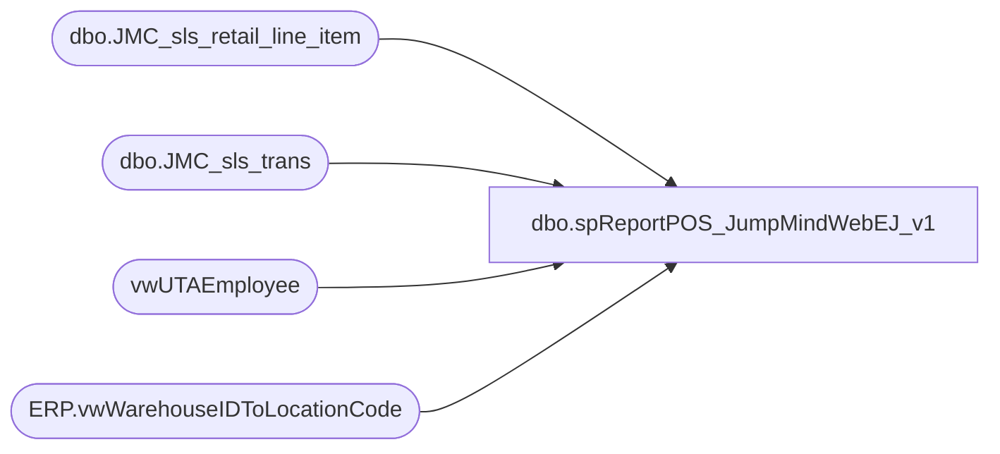

# dbo.spReportPOS_JumpMindWebEJ_v1

**Database:** dw  
**Server:** papamart  

## Architecture Diagram



## Table Dependencies

| Referenced Table |
|---|
| dbo.JMC_sls_retail_line_item |
| dbo.JMC_sls_trans |
| vwUTAEmployee |
| ERP.vwWarehouseIDToLocationCode |

## Stored Procedure Code

```sql
-- =====================================================================================================
-- Name: spReportPOS_JumpMindWebEJ_v1
-- Revision History
--		Name:			Date:			Comments:
--		Tim Callahan	05/23/2023		Initial Release as support crutch for Linda Keeney until formal WebEJ is constructed for JumpMindPOS
-- =====================================================================================================
CREATE PROCEDURE [dbo].[spReportPOS_JumpMindWebEJ_v1]
 @BeginDate date,
 @EndDate date ,
 @StoreNumber varchar (4),
 @TransNumber varchar (10), 
 @RegisterNumber varchar(1)

 --@DynanmicsLocationCode varchar (4)
 --@DwLocationCode varchar (4)

AS
set nocount on 

----Use This Section for testing 
--Declare @BeginDate date
--Declare @EndDate date 
--Declare @StoreNumber varchar (4)
--Declare @TransNumber varchar (10)
--Declare @RegisterNumber varchar (1)
Declare @DynanmicsLocationCode varchar (4)
Declare @DwLocationCode varchar (4)

--;

--set @BeginDate = '2022-05-20'
--set @EndDate = '2023-05-20'
--set @StoreNumber = '1530'
--;
--Declare @DynanmicsLocationCode varchar (4)
--Declare @DwLocationCode varchar (4)
--;

IF OBJECT_ID(N'tempdb..#StoreLookup') IS NOT NULL
DROP TABLE #StoreLookup
select 
WarehouseId as DynanmicsLocationCode,
LocationCode as DwLocationCode
into #StoreLookup
from [stl-ssis-p-01].[IntegrationStaging].[ERP].[vwWarehouseIDToLocationCode]
where 1=1
and Entity = '1100'
and WarehouseId = @StoreNumber


set @DynanmicsLocationCode = (select DynanmicsLocationCode from #StoreLookup) 
set @DwLocationCode = (select DwLocationCode from #StoreLookup)
;


IF OBJECT_ID(N'tempdb..#RawTransData') IS NOT NULL
DROP TABLE #RawTransData
select 
--h.business_date as TransactionDate, 
cast(h.create_time as date) as TransactionDate, -- Replaced on 5/24/2023 as Sometimes Stores Do Not Run EoD to create new busines date 
h.business_unit_id as StoreNumber, 
h.trans_nbr as TransactionNumber,
l.line_sequence_number as LineSeqNumber,
h.total as TransactionTotal, 
h.subtotal as TransactionSubTotal, 
h.tax_total as TransactionTaxTotal, 
h.discount_total as TransactionDiscountTotal,
e.Emp_name as AssociateNumber,
--isnull(e.Emp_Fullname,'AssocNameLookUpNotFound') as AssociateName,
--cast (count (distinct h.trans_nbr) as float) as TotalTransWithGcPromo, 
l.item_id as ItemId, 
l.item_description as ItemDesc, 
l.quantity as Quantity,
l.regular_unit_price as RegularUnitPrice, 
l.actual_unit_price as ActualUnitPrice, 
l.discount_amount as LineDiscountAmount, 
l.extended_amount as LineTotalAmount,
l.tax_amount as LineTaxAmount
--, l.*
into #RawTransDAta
from [dbo].[JMC_sls_trans] h (nolock) 
join [dbo].[JMC_sls_retail_line_item] l (nolock) on h.device_id=l.device_id
												and h.trans_nbr=l.sequence_number
left join vwUTAEmployee e on h.username=e.Emp_Name
	--and e.Calcgrp_ID in ('10005')-- US hourly\salary	

where 1=1
and h.trans_type in ('SALE','RETURN')
and h.trans_status = 'COMPLETED'
and h.username <> 000
and l.voided = 0
--and l.item_returned = 0 -- Remarked Out on 6/22/2023 due to feeedback from Linda, well see how it goes
--and h.device_id = '1530-003'
--and l.sequence_number = '776'
--and h.business_date between @BeginDate and @EndDate
and cast(h.create_time as date) between @BeginDate and @EndDate
and cast(l.create_time as date) between @BeginDate and @EndDate -- Added 8/10/2023
and h.business_unit_id = @DynanmicsLocationCode
and h.trans_nbr = @TransNumber
and h.device_id = h.business_unit_id+'-00'+@RegisterNumber
order by h.trans_nbr, l.line_sequence_number
 


--IF OBJECT_ID(N'tempdb..#Summary1') IS NOT NULL
--DROP TABLE #Summary1
select 
TransactionDate, 
StoreNumber, 
TransactionNumber, 
LineSeqNumber , 
TransactionTotal, 
TransactionSubTotal, 
TransactionTaxTotal, 
TransactionDiscountTotal, 
AssociateNumber, 
ItemId, 
ItemDesc, 
Quantity, 
RegularUnitPrice, 
ActualUnitPrice, 
LineDiscountAmount, 
LineTotalAmount, 
LineTaxAmount
--into #Summary1
from #RawTransData
order by TransactionNumber, LineSeqNumber
```

