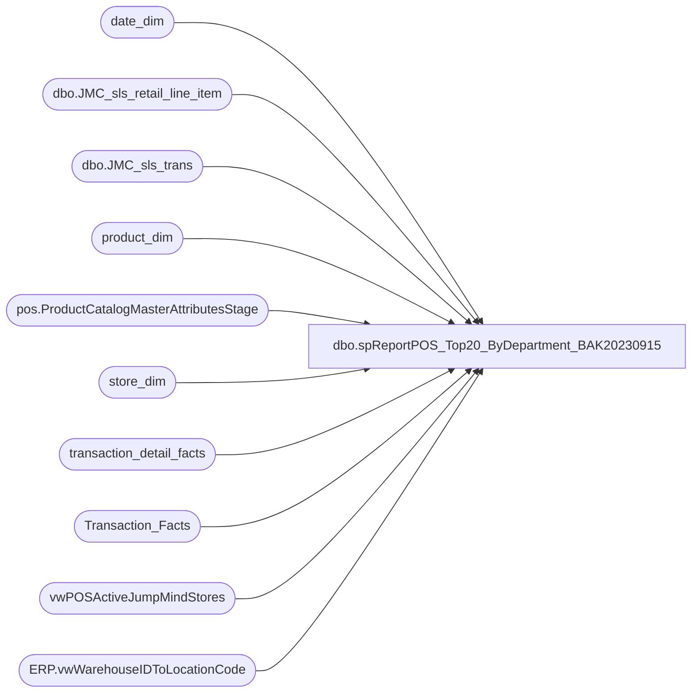

# dbo.spReportPOS_Top20_ByDepartment_BAK20230915

**Database:** dw  
**Server:** papamart  

## Architecture Diagram



## Table Dependencies

| Referenced Table |
|---|
| date_dim |
| dbo.JMC_sls_retail_line_item |
| dbo.JMC_sls_trans |
| product_dim |
| pos.ProductCatalogMasterAttributesStage |
| store_dim |
| transaction_detail_facts |
| Transaction_Facts |
| vwPOSActiveJumpMindStores |
| ERP.vwWarehouseIDToLocationCode |

## Stored Procedure Code

```sql
-- =====================================================================================================
-- Name: spReportPOS_Top20_ByDepartment
-- Revision History
--		Name:			Date:			Comments:
--		Tim Callahan	05/17/2023		Initial Release
-- =====================================================================================================
CREATE PROCEDURE [dbo].[spReportPOS_Top20_ByDepartment_BAK20230915]

 @BeginDate date,
 @EndDate date ,
 @StoreNumber varchar (4)

 --@DynanmicsLocationCode varchar (4)
 --@DwLocationCode varchar (4)

 as 

 -- Use This Section for testing 
--Declare @BeginDate date
--Declare @EndDate date 
--Declare @StoreNumber varchar (4)
--Declare @DynanmicsLocationCode varchar (4)
--Declare @DwLocationCode varchar (4)
--;

--set @BeginDate = '2022-05-08'
--set @EndDate = '2023-05-08'
--set @StoreNumber = '1105'
--;

Declare @DynanmicsLocationCode varchar (4)
Declare @DwLocationCode varchar (4)
;

IF OBJECT_ID(N'tempdb..#StoreLookup') IS NOT NULL
DROP TABLE #StoreLookup
select 
WarehouseId as DynanmicsLocationCode,
LocationCode as DwLocationCode
into #StoreLookup
from [stl-ssis-p-01].[IntegrationStaging].[ERP].[vwWarehouseIDToLocationCode]
where 1=1
and Entity = '1100'
and WarehouseId = @StoreNumber

set @DynanmicsLocationCode = (select DynanmicsLocationCode from #StoreLookup) 
set @DwLocationCode = (select DwLocationCode from #StoreLookup)
;

IF OBJECT_ID(N'tempdb..#StyleLookup') IS NOT NULL
DROP TABLE #StyleLookup
select a.ProductNumber, a.ProductDescription, a.Department, a.DepartmentCode, a.ProductSellingGeography, a.ItemType
into #StyleLookup
from [stl-ssis-p-01].IntegrationStaging.pos.ProductCatalogMasterAttributesStage a 
group by a.ProductNumber, a.ProductDescription, a.Department, a.DepartmentCode, a.ProductSellingGeography, a.ItemType


-- Raw Data 

IF OBJECT_ID(N'tempdb..#RawData') IS NOT NULL
DROP TABLE #RawData

--DW\Historical 
select 
--dd.actual_date, 
--right('111'+cast(sd.store_id as varchar),4) as StoreNumber, 
stl.DynanmicsLocationCode as StoreNumber,
pd.style_code as ItemNumber, 
sl.ProductDescription as ItemDesc,
sl.Department, 
sl.DepartmentCode,
sum (tdf.unit_gross_amount-tdf.unit_disc_amount) as NetSales,
sum(tdf.units) as UnitsSold
into #RawData
from transaction_detail_facts tdf (nolock)
join Transaction_Facts tf on tf.transaction_id=tdf.transaction_id
join store_dim sd (nolock) on sd.store_key=tdf.store_key
join date_dim dd (nolock) on dd.date_key=tdf.date_key
join product_dim pd (nolock) on pd.product_key=tdf.product_key
join vwPOSActiveJumpMindStores v on v.StoreID=sd.store_id
join #StyleLookup sl on sl.productnumber=pd.style_code
join #StoreLookup stl  on stl.DwLocationCode=sd.store_id
where 1=1
and sd.country = 'US' -- CA and UK may need to be handled differently for the employee lookup 
and tf.isShipFromStore = 0 
and tf.isPickupFromStore = 0 
and sl.ItemType = 'STOCK'
and sl.DepartmentCode not in ('R-B-D-47')
--and dd.actual_date between '05-02-2023' and '05-16-2023' -- Will be replaced by parameters 
--and sd.store_id = '105' -- Will be replaced by parameters 
and dd.actual_date between @BeginDate and @EndDate
and sd.store_id = @DwLocationCode

group by 
--dd.actual_date, 
--right('111'+cast(sd.store_id as varchar),4), 
stl.DynanmicsLocationCode,
pd.style_code , 
sl.ProductDescription,
sl.Department, 
sl.DepartmentCode
union 
--Jumpmind
select 
--h.business_date as TransactionDate, 
h.business_unit_id as StoreNumber,
l.item_id as ItemNumber, 
--l.item_description as ItemDesc, 
s.ProductDescription as ItemDesc,
s.Department, 
s.DepartmentCode
,sum(l.actual_unit_price) as NetSales
, sum (l.quantity) as UnitsSold
from [dbo].[JMC_sls_trans] h (nolock) 
join [dbo].[JMC_sls_retail_line_item] l (nolock) on h.device_id=l.device_id
												and h.trans_nbr=l.sequence_number
join #StyleLookup s on s.productnumber=l.item_id
where 1=1
and h.trans_type = 'SALE'
and h.trans_status = 'COMPLETED'
and h.username <> 000
and l.voided = 0
and l.item_returned = 0
and l.item_type in ('STOCK')
and s.DepartmentCode not in ('R-B-D-47')
--and h.business_date between '05-2-2023' and '05-16-2023' -- Will be replaced by parameters 
--and h.business_unit_id = '1105'-- Will be replaced by parameters 
--and h.business_date between @BeginDate and @EndDate
and cast (h.create_time as date) between @BeginDate and @EndDate -- Replaced 5/24/2023 due to Business Date could be wrong if store doesnt run EOD\SOD
and cast (l.create_time as date) between @BeginDate and @EndDate -- Added 8/10/2023
and h.business_unit_id = @DynanmicsLocationCode
group by 
--h.business_date, 
h.business_unit_id,
l.item_id, 
--l.item_description,
s.ProductDescription,
s.Department, 
s.DepartmentCode


--Max Data due to date variances I am seeing between JM and AW\DW 
IF OBJECT_ID(N'tempdb..#RawData2') IS NOT NULL
DROP TABLE #RawData2
select 
StoreNumber, 
ItemNumber, 
ItemDesc, 
Department, 
DepartmentCode, 
max(NetSales) as NetSales, 
max(UnitsSold) as UnitsSold
into #RawData2
from #RawData
group by StoreNumber, 
ItemNumber, 
ItemDesc, 
Department, 
DepartmentCode
order by ItemNumber

IF OBJECT_ID(N'tempdb..#Summary1') IS NOT NULL
DROP TABLE #Summary1
select
StoreNumber, 
ItemNumber, 
ItemDesc, 
Department, 
DepartmentCode
,NetSales
,UnitsSold
,dense_rank() over ( Partition by Department order by NetSales desc) as ItemDenseRankInDepartment
--,rank() over (Partition by Department order by UnitsSold desc) as ItemRankInDepartment 
, row_number () over (Partition by Department order by NetSales desc) as RowNumber
into #Summary1 
from #RawData2
--where Department in ('Friend','Footwear')

select *
from #Summary1  s
where s.RowNumber <= 20
--order by Department, UnitsSold desc
order by Department, NetSales desc
```

