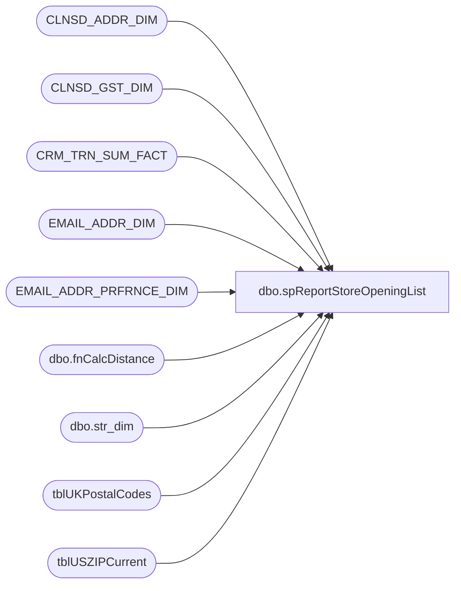

# dbo.spReportStoreOpeningList

**Database:** dw  
**Server:** papamart  

## Architecture Diagram



## Table Dependencies

| Referenced Table |
|---|
| CLNSD_ADDR_DIM |
| CLNSD_GST_DIM |
| CRM_TRN_SUM_FACT |
| EMAIL_ADDR_DIM |
| EMAIL_ADDR_PRFRNCE_DIM |
| dbo.fnCalcDistance |
| dbo.str_dim |
| tblUKPostalCodes |
| tblUSZIPCurrent |

## Stored Procedure Code

```sql
CREATE proc spReportStoreOpeningList
@store varchar(4),
@radius int

-- =====================================================================================================
-- Name: spReportStoreOpeningList
--
-- Description:	Accepts Store Number and Radius as input, pulls guess within the radius of the store.
--				
--				 
-- Revision History
--		Name:			Date:			Comments:
--		Dan Tweedie		10/29/2015		Created proc.	
-- =====================================================================================================

as 
set nocount on


declare @latitude numeric(15,10),
		@longitude numeric(15,10)

select @store = right(('0000' + @store), 4)

select @latitude = latitude,
	   @longitude = longitude
from kodiak.BABWmstrData.dbo.str_dim where right(('0000' + cast(str_num as varchar)), 4) = @store


IF (Object_ID('tempdb..#tmpZips') IS NOT NULL) DROP TABLE #tmpZips
create table #tmpZips
(ZIP char(5),
 distance float)
 
if (select left(@store, 1)) <> '2'
		insert #tmpZips
		SELECT
			ZIP,
			dbo.fnCalcDistance(@latitude, @longitude, u.Lat, u.Lon) AS distance
		FROM tblUSZIPCurrent u WITH (NOLOCK)
		WHERE dbo.fnCalcDistance(@latitude, @longitude, u.Lat, u.Lon) <= @radius
 ELSE
		insert #tmpZips
		select
			PostCode, 	
			dbo.fnCalcDistance(@latitude, @longitude, u.Lat, u.Lon) AS distance
		from tblUKPostalCodes u
		WHERE dbo.fnCalcDistance(@latitude, @longitude, u.Lat, u.Lon) <= @radius


IF (Object_ID('tempdb..#addrs') IS NOT NULL) DROP TABLE #addrs
SELECT
	cad.CLNSD_ADDR_ID
INTO #addrs
FROM CLNSD_ADDR_DIM cad WITH (NOLOCK)
JOIN #tmpZips z WITH (NOLOCK) ON cad.PSTL_CD = z.ZIP

IF (Object_ID('tempdb..#gsts') IS NOT NULL) DROP TABLE #gsts
SELECT
	cgd.CLNSD_GST_ID,
	cgd.EMAIL_ADDR_ID, 
	cgd.FRST_NM
INTO #gsts
FROM CLNSD_GST_DIM cgd WITH (NOLOCK)
JOIN #addrs a WITH (NOLOCK) ON cgd.CLNSD_ADDR_ID = a.CLNSD_ADDR_ID
WHERE cgd.EMAIL_ADDR_ID > 0

IF (Object_ID('tempdb..#shopped') IS NOT NULL) DROP TABLE #shopped
SELECT DISTINCT ctsf.CLNSD_GST_ID
INTO #shopped
FROM #gsts g WITH (NOLOCK)
JOIN CRM_TRN_SUM_FACT ctsf WITH (NOLOCK) ON g.CLNSD_GST_ID = ctsf.CLNSD_GST_ID
WHERE ctsf.DT_ID BETWEEN 6807 - (365 * 2) AND 6807

IF (Object_ID('tempdb..#emails') IS NOT NULL) DROP TABLE #emails
SELECT g.EMAIL_ADDR_ID, MIN(g.FRST_NM) AS firstName, COUNT(*) AS numGuests
INTO #emails
FROM #shopped s WITH (NOLOCK)
JOIN #gsts g WITH (NOLOCK) ON s.CLNSD_GST_ID = g.CLNSD_GST_ID
GROUP by g.EMAIL_ADDR_ID

SELECT
	e.EMAIL_ADDR_ID AS SubscriberKey,
	ead.EMAIL_ADDR_TXT AS email_address,
	CASE WHEN e.numGuests = 1 THEN ISNULL(e.firstName, 'Beary Special Guest') ELSE 'Beary Special Guest' END  AS FirstName
FROM #emails e WITH (NOLOCK)
JOIN EMAIL_ADDR_DIM ead WITH (NOLOCK) ON e.EMAIL_ADDR_ID = ead.EMAIL_ADDR_ID
JOIN EMAIL_ADDR_PRFRNCE_DIM eapd WITH (NOLOCK) ON e.EMAIL_ADDR_ID = eapd.EMAIL_ADDR_ID
WHERE ead.EMAIL_STAT_CD = 'VALID'
AND eapd.PROMO_PREF = 'Y'


dbo,dt_dropuserobjectbyid,/*
**	Drop an object from the dbo.dtproperties table
*/
create procedure dbo.dt_dropuserobjectbyid
	@id int
as
	set nocount on
	delete from dbo.dtproperties where objectid=@id
```

