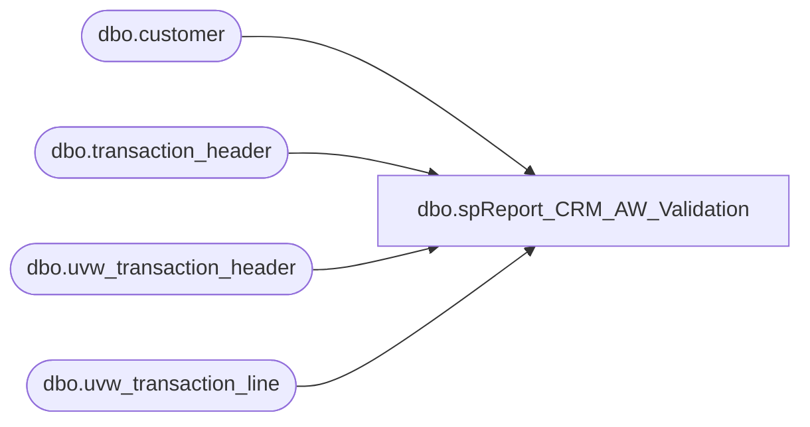

# dbo.spReport_CRM_AW_Validation

**Database:** dw  
**Server:** papamart  

## Architecture Diagram



## Table Dependencies

| Referenced Table |
|---|
| dbo.customer |
| dbo.transaction_header |
| dbo.uvw_transaction_header |
| dbo.uvw_transaction_line |

## Stored Procedure Code

```sql
CREATE PROC [dbo].[spReport_CRM_AW_Validation] -- =============================================================================================================
-- Name: [dbo].[spReport_CRM_AW_Validation]
--
-- Description:	Selects data from CRM and Auditworks to be able to verify
--				that the information is correct. This is used for Audit verification
--
-- Input:	@fromDate	datetime		Beginning date of the analysis
--			@thruDate	datetime		Ending date of the Analysis
--
-- Output: Recordset used by the report Verify CRM Auditworks
--
-- Dependencies: 
--
-- Revision History
--		Name:			Date:			Comments:
--		Gary Murrish	12/26/2012		created
-- =============================================================================================================
/*
DECLARE @fromDate datetime
DECLARE @thruDate datetime
SET @fromDate = '12/2/2012'
SET @thruDate = '12/25/2012'
*/
@fromDate datetime = NULL,
@thruDate datetime = NULL

AS
	SET NOCOUNT ON

	SELECT
		sales_module_transaction_id AS transaction_id,
		th.store_no,
		transaction_type,
		register_no,
		pos_transaction_no,
		transaction_date,
		total_net_retail,
		c.customer_no INTO #AuditCRM
	FROM
		[stl-crmdb-p-01].crm.dbo.transaction_header th WITH (NOLOCK)
		INNER JOIN [stl-crmdb-p-01].crm.dbo.customer c WITH (NOLOCK)
			ON c.customer_id = th.customer_id
	WHERE
		transaction_date BETWEEN @fromDate AND @thruDate

	-- Drop table queries.dbo.tmp_GMAuditAW
	SELECT
		uth.transaction_id,
		uth.store_no,
		register_no,
		transaction_date,
		tender_total,
		grossAmt,
		netAmt INTO #AuditAW
	FROM
		bedrockdb01.auditworks.dbo.uvw_transaction_header uth WITH (NOLOCK)
		INNER JOIN (SELECT
				transaction_id,
				SUM(Gross_line_Amount * db_cr_none * voiding_reversal_flag * -1) AS grossAmt,
				SUM((Gross_line_Amount -
				CASE
				WHEN Line_Object NOT IN (404, 202) THEN Pos_Discount_amount
				ELSE 0
				END) * db_cr_none * voiding_reversal_flag * -1) AS netAmt
			FROM
				bedrockdb01.auditworks.dbo.uvw_transaction_line utl WITH (NOLOCK)
			WHERE
				(Line_Object BETWEEN 100 AND 199
				OR Line_Object IN (404, 204, 202, 291) -- Gift Card, Misc Fee, Embrod Fee, Cub Cash

				--or line_object between 6001 and 6999	-- Party Deposit
				)
				--and line_object not in (200,292, 203, 204) -- Shipping, Contribution, Shipping, Misc Fee

				AND line_void_flag = 0
			GROUP BY transaction_id)
			dtl
			ON dtl.transaction_id = uth.transaction_id
	WHERE
		transaction_date BETWEEN @fromDate AND @thruDate
		AND transaction_void_flag = 0
		AND transaction_category IN (1, 2)

	-- Show Result	
	SELECT
		@fromDate AS fromDate,
		@thruDate AS thruDate,
		crmValue.numTrans,
		crmValue.CRMtotalNetRetail,
		crmMissing.numMissingTrans,
		crmMissing.CRMtotalNetRetailMissing,
		crmDiffs.numTransDiff,
		crmDiffs.CRMtotalNetRetailDiff,
		crmDiffs.AWnetAmtDiff,
		crmDiffs.Diff
	FROM
		(-- Value of CRM
			SELECT
				COUNT(*) AS numTrans,
				SUM(crm.total_net_retail) AS CRMtotalNetRetail
			FROM
				#AuditCRM crm WITH (NOLOCK))
		crmValue
		CROSS JOIN (-- Missing transactions
			SELECT
				COUNT(*) AS numMissingTrans,
				SUM(crm.total_net_retail) AS CRMtotalNetRetailMissing
			FROM
				#AuditCRM crm WITH (NOLOCK)
				LEFT JOIN #AuditAW aw WITH (NOLOCK)
				ON aw.transaction_id = crm.transaction_id
			WHERE
				aw.transaction_id IS NULL
				AND crm.total_net_retail = 0)
				crmMissing
		CROSS JOIN -- Differences
		(SELECT
				COUNT(*) AS numTransDiff,
				SUM(crm.total_net_retail) AS CRMtotalNetRetailDiff,
				SUM(aw.netAmt) AS AWnetAmtDiff,
				SUM(crm.total_net_retail - aw.netAmt) AS Diff
			FROM
				#AuditCRM crm WITH (NOLOCK)
				LEFT JOIN #AuditAW aw WITH (NOLOCK)
				ON aw.transaction_id = crm.transaction_id
			WHERE
				total_net_retail <> netAmt)
				crmDiffs

/* -- Details
SELECT
	CRM.transaction_id,
	CRM.store_no,
	CRM.total_net_retail AS CRMtotalNetRetail,
	aw.netAmt AS AWnetAmt,
	CRM.total_net_retail - aw.netAmt AS Diff,
	aw.grossAmt,
	aw.tender_total,
	CRM.register_no,
	CRM.pos_transaction_no,
	CRM.customer_no
FROM #AuditCRM CRM WITH (NOLOCK)
LEFT JOIN #AuditAW aw WITH (NOLOCK)
	ON aw.transaction_id = CRM.transaction_id
WHERE total_net_retail <> netAmt
--WHERE aw.transaction_id = 22384600
*/
```

