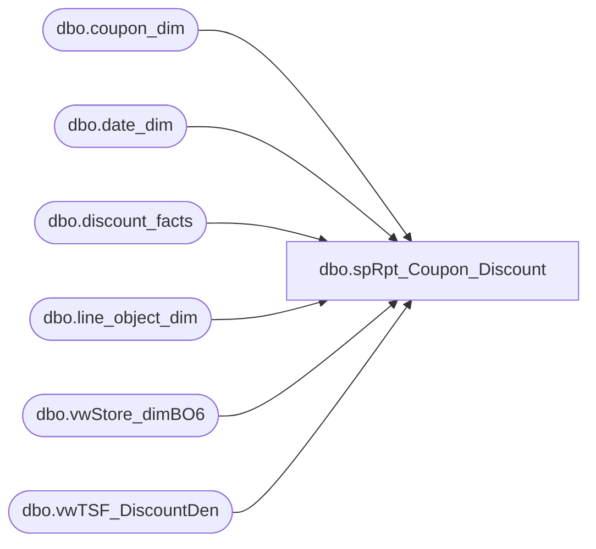

# dbo.spRpt_Coupon_Discount

**Database:** dw  
**Server:** papamart  

## Architecture Diagram



## Table Dependencies

| Referenced Table |
|---|
| dbo.coupon_dim |
| dbo.date_dim |
| dbo.discount_facts |
| dbo.line_object_dim |
| dbo.vwStore_dimBO6 |
| dbo.vwTSF_DiscountDen |

## Stored Procedure Code

```sql
CREATE PROCEDURE [dbo].[spRpt_Coupon_Discount] 

	(
	 @fiscalyear INT
	--,@FiscalPeriod VARCHAR(500)
	)
AS
BEGIN
SET NOCOUNT ON

/*********************************************************************************************************************************
 Author:		Mahendar Akula
 Create date:	05/11/2015
 Description:	
 Assigned by :	Kevin Shyr
 Version:		0.1
 Modified On:
 Modified By:
 Comments:		Created Proc
 Test:			EXEC [dbo].[spRpt_Coupon_Discount]  2012

***********************************************************************************************************************************/

--DECLARE  @fiscalYear INT--, @FiscalPeriod INT
--Set @fiscalYear = '2015' -- Set @FiscalPeriod = '1'


SELECT DF.transaction_id                         As [Transaction id]
,DF.reference_no                                 As [Reference No]
,CD.coupon_desc                                  AS [Coupon Description]
,LOD.Line_Object_Description                     AS [Line Object Description]
,DM.actual_date                                  AS [Actual Date]
,SD.store_id                                     AS [Store ID]                       
,TSF.GAAP_Sale                                   AS [No of GAAP Sale]
,CD.start_date                                   AS [Start Date]
,CD.stop_date                                    AS [Stop Date]
,CD.category_id                                  AS [Category ID]
,CD.category                                     AS [Category]
,CD.event_id                                     AS [Event ID]
,CD.event_name                                   AS [Event Name]
,LOD.Line_Object                                 AS [Line Object]
,LOD.Line_Object_Type                            AS [Line Object Type]
,CD.qty_distributed                              AS [QTY Distributed]
,TSF.Coupon_Amt + TSF.Discounts                  AS [Discounts UGA]
,SD.state_province                               AS [State Province]
,COUNT(DISTINCT TSF.transaction_id)              AS [Total Transaction ID]

 FROM 
dbo.discount_facts DF
INNER JOIN dbo.coupon_dim CD (NOLOCK) ON CD.coupon_key = DF.coupon_key
INNER JOIN dbo.line_object_dim LOD (NOLOCK) ON LOD.Line_Object_Key = DF.line_object_key
INNER JOIN dbo.date_dim DM (NOLOCK) ON DM.date_key = df.date_key
INNER JOIN dbo.vwStore_dimBO6 SD (NOLOCK) ON SD.store_key = DF.store_key
INNER JOIN dbo.vwTSF_DiscountDen TSF (NOLOCK) ON TSF.transaction_id = DF.transaction_id
WHERE TSF.Receipt_Ttl >= 0 
AND TSF.donation_only = 0
AND TSF.gift_card_only = 0
AND party_dep_only = 0
AND LOD.Line_Object NOT IN ('1625','1626')
AND DM.actual_date between '11/10/2013' AND '12/31/2013'
AND DF.reference_no IN ('2000193')

GROUP BY 
 DF.transaction_id                        
,DF.reference_no
,CD.coupon_desc                                 
,LOD.Line_Object_Description
,DM.actual_date
,SD.store_id  
,TSF.GAAP_Sale
,CD.start_date
,CD.stop_date
,CD.category_id
,CD.category
,CD.event_id
,CD.event_name
,LOD.Line_Object
,LOD.Line_Object_Type
,CD.qty_distributed
,TSF.Coupon_Amt + TSF.Discounts
,SD.state_province

END
dbo,dt_getobjwithprop,/*
**	Retrieve the owner object(s) of a given property
*/
create procedure dbo.dt_getobjwithprop
	@property varchar(30),
	@value varchar(255)
as
	set nocount on

	if (@property is null) or (@property = '')
	begin
		raiserror('Must specify a property name.',-1,-1)
		return (1)
	end

	if (@value is null)
		select objectid id from dbo.dtproperties
			where property=@property

	else
		select objectid id from dbo.dtproperties
			where property=@property and value=@value
```

