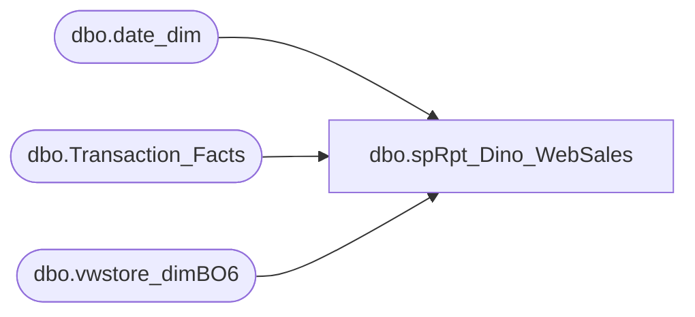

# dbo.spRpt_Dino_WebSales

**Database:** dw  
**Server:** papamart  

## Architecture Diagram



## Table Dependencies

| Referenced Table |
|---|
| dbo.date_dim |
| dbo.Transaction_Facts |
| dbo.vwstore_dimBO6 |

## Stored Procedure Code

```sql
CREATE procedure [dbo].[spRpt_Dino_WebSales] 
	@BeginDate DATE
	, @EndDate DATE
AS
BEGIN 
SET NOCOUNT ON
-- =====================================================================================================
-- Report Name: Dino Web Sales Report.
-- Created by: Mahendar Akula
-- Description: Web Sales Report				 
-- Created Date: 04/06/2015
-- Assigned by : Kevin Shyr
-- Comments: Created Proc
-- Version: 0.1
--
--
-- =====================================================================================================
--Declare @BeginDate Datetime, @EndDate Datetime
--Set @BeginDate = '4/1/15' Set @EndDate = '4/3/15'

SELECT 
	RIGHT('000'+CAST(SD.store_id AS VARCHAR),4)+' '+ sd.store_name AS [StoreID],
	DD.actual_date AS [Actual Date],
	tf.transaction_id AS [Transaction id],
	SUM(tf.GAAP_sales_amount) AS [GAAP Sale],
	SUM(tf.total_units) AS [Units]
FROM dbo.vwstore_dimBO6 sd
	JOIN dbo.Transaction_Facts tf WITH(READCOMMITTED)
		ON tf.store_key = sd.store_key
	JOIN dbo.date_dim DD WITH(READCOMMITTED) 
		ON DD.date_key = tf.date_key
WHERE dd.actual_date BETWEEN @BeginDate AND @EndDate
	AND tf.register_no = 5
	AND sd.store_id = 13
Group by
	RIGHT('000'+CAST(SD.store_id AS VARCHAR),4)+' '+ sd.store_name,
	DD.actual_date,
	tf.transaction_id

END
```

