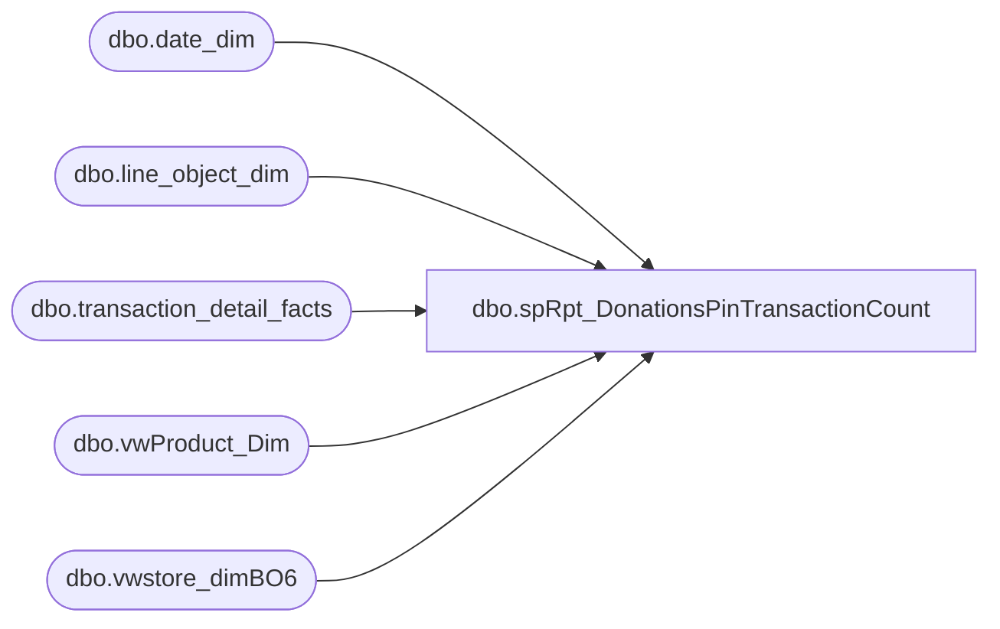

# dbo.spRpt_DonationsPinTransactionCount

**Database:** dw  
**Server:** papamart  

## Architecture Diagram



## Table Dependencies

| Referenced Table |
|---|
| dbo.date_dim |
| dbo.line_object_dim |
| dbo.transaction_detail_facts |
| dbo.vwProduct_Dim |
| dbo.vwstore_dimBO6 |

## Stored Procedure Code

```sql
CREATE PROCEDURE [dbo].[spRpt_DonationsPinTransactionCount] 
	( @fiscalyear INT,
	@BeginDate DATE
	, @EndDate DATE
	)
AS
BEGIN
SET NOCOUNT ON

/*********************************************************************************************************************************
 Author:		Mahendar Akula
 Create date:	04/07/2015
 Description:	
 Assigned by :	Kevin Shyr
 Version:		0.1
 Modified On:
 Modified By:
 Comments:		Created Proc
 Test:			EXEC [dbo].[spRpt_DonationsPinTransactionCount]   2015

***********************************************************************************************************************************/

--DECLARE  @fiscalYear INT
--Set @fiscalYear = '2015'

	SELECT 
	    DD.fiscal_year
		,DD.org_fiscal_period
		,DD.org_fiscal_week
		,SD.postal_code
		,RIGHT('000' + CAST(SD.store_id AS VARCHAR), 4) + ' ' + sd.store_name AS [StoreID]
		,COUNT(DISTINCT TDF.transaction_id) AS [No of Transaction]
		,PD.sku AS [Sku]
		,PD.product_desc AS [Product Description] 
		,TDF.reference_no
		,SUM(TDF.unit_gross_amount) AS [Unit Gross Amount] 
		,SUM (TDF.unit_disc_amount) AS [Unit Disc Amount]
		,SUM(TDF.unit_gross_amount)  - SUM (TDF.unit_disc_amount) AS [NET]
        ,DD.actual_date
        ,SD.division AS SD_Division
		,SD.store_id
		,SUM(TDF.Units) AS [Units]
	FROM dbo.vwstore_dimBO6 SD
		JOIN dbo.transaction_detail_facts TDF WITH(READCOMMITTED)
			ON TDF.store_key = SD.store_key
		JOIN dbo.date_dim DD WITH(READCOMMITTED) 
			ON DD.date_key = TDF.date_key
		JOIN dbo.vwProduct_Dim PD 
			ON PD.product_key = TDF.product_key
		JOIN dbo.line_object_dim LOD WITH(READCOMMITTED)
			ON LOD.Line_Object_Key = tdf.line_object_key
				AND LOD.Line_Object IN (292, 101)
				AND dd.fiscal_year IN (@fiscalYear)
				AND dd.actual_date BETWEEN @BeginDate AND @EndDate
				--and actual_date BETWEEN '2014-12-28' AND '2015-01-31'
	GROUP BY 
		DD.fiscal_year
		,DD.org_fiscal_period
		,DD.org_fiscal_week
		,SD.postal_code
		,RIGHT('000' + CAST(SD.store_id AS VARCHAR), 4) + ' ' + sd.store_name 
		,PD.sku 
		,PD.product_desc
		,TDF.reference_no
		,DD.actual_date
        ,SD.division 
		,SD.store_id
	
END
```

