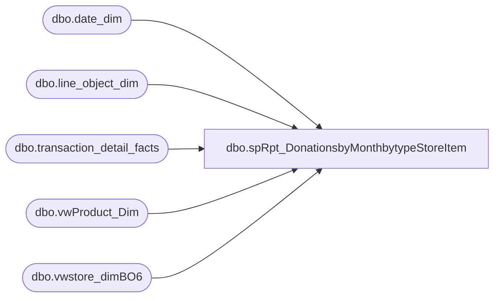

# dbo.spRpt_DonationsbyMonthbytypeStoreItem

**Database:** dw  
**Server:** papamart  

## Architecture Diagram



## Table Dependencies

| Referenced Table |
|---|
| dbo.date_dim |
| dbo.line_object_dim |
| dbo.transaction_detail_facts |
| dbo.vwProduct_Dim |
| dbo.vwstore_dimBO6 |

## Stored Procedure Code

```sql
CREATE PROCEDURE [dbo].[spRpt_DonationsbyMonthbytypeStoreItem] 

	(
	 @fiscalyear INT
	--,@FiscalPeriod VARCHAR(500)
	)
AS
BEGIN
SET NOCOUNT ON

/*********************************************************************************************************************************
 Author:		Mahendar Akula
 Create date:	04/07/2015
 Description:	
 Assigned by :	Kevin Shyr
 Version:		0.1
 Modified On:
 Modified By:
 Comments:		Created Proc
 Test:			EXEC [dbo].[spRpt_DonationsbyMonthbytypeStoreItem]  2012,1

***********************************************************************************************************************************/

--DECLARE  @fiscalYear INT--, @FiscalPeriod INT
--Set @fiscalYear = '2015' -- Set @FiscalPeriod = '1'

--IF OBJECT_ID ('tempdb..#PARVALUES') IS NOT NULL DROP TABLE #PARVALUES

--SELECT * INTO #PARVALUES FROM [dbo].[fnSplitString] (@FiscalPeriod, ',')

	SELECT 
		SD.store_id
		,DD.org_fiscal_period
		,sum (TDF.Units) AS [Units]
		,sum(TDF.unit_gross_amount) AS [Unit Gross Amount]
		,sum (TDF.unit_disc_amount) AS [Unit Disc Amount]
		,Count(distinct TDF.transaction_id) AS [No of Transaction]
		,SD.division AS SD_Division
		,PD.sku AS [Sku]
		,PD.product_desc AS [Product Description] 
		,SD.state_province_name
		,RIGHT('000' + CAST(SD.store_id AS VARCHAR), 4) + ' ' + sd.store_name AS [StoreID]
		,SD.store_name
		,DD.fiscal_year
		,SD.state_province
		,DD.actual_date
		,DD.org_fiscal_week
	FROM dbo.vwstore_dimBO6 SD
		JOIN dbo.transaction_detail_facts TDF WITH(READCOMMITTED) 
			ON TDF.store_key = SD.store_key
		JOIN dbo.date_dim DD WITH(READCOMMITTED)
			ON DD.date_key = TDF.date_key
		JOIN dbo.vwProduct_Dim PD 
			ON PD.product_key = TDF.product_key
		JOIN dbo.line_object_dim LOD WITH(READCOMMITTED)
			ON LOD.Line_Object_Key = tdf.line_object_key
				AND LOD.Line_Object IN (292, 101)
				AND dd.fiscal_year IN (@fiscalYear)
				--AND DD.org_fiscal_period IN(@FiscalPeriod)
				--AND DD.org_fiscal_period IN (SELECT splitdata FROM #PARVALUES )
	GROUP BY
		SD.store_id
		,DD.org_fiscal_period
		,SD.division 
		,PD.sku 
		,PD.product_desc
		,SD.state_province_name
		,RIGHT('000' + CAST(SD.store_id AS VARCHAR), 4) + ' ' + sd.store_name 
		,SD.store_name
		,DD.fiscal_year
		,SD.state_province
		,DD.actual_date
		,DD.org_fiscal_week

END


--CREATE FUNCTION [dbo].[fnSplitString] 
--( 
--    @string NVARCHAR(MAX), 
--    @delimiter CHAR(1) 
--) 
--RETURNS @output TABLE(splitdata NVARCHAR(MAX) 
--) 
--BEGIN 
--    DECLARE @start INT, @end INT 
--    SELECT @start = 1, @end = CHARINDEX(@delimiter, @string) 
--    WHILE @start < LEN(@string) + 1 BEGIN 
--        IF @end = 0  
--            SET @end = LEN(@string) + 1
       
--        INSERT INTO @output (splitdata)  
--        VALUES(SUBSTRING(@string, @start, @end - @start)) 
--        SET @start = @end + 1 
--        SET @end = CHARINDEX(@delimiter, @string, @start)
        
--    END 
--    RETURN 
--END
```

