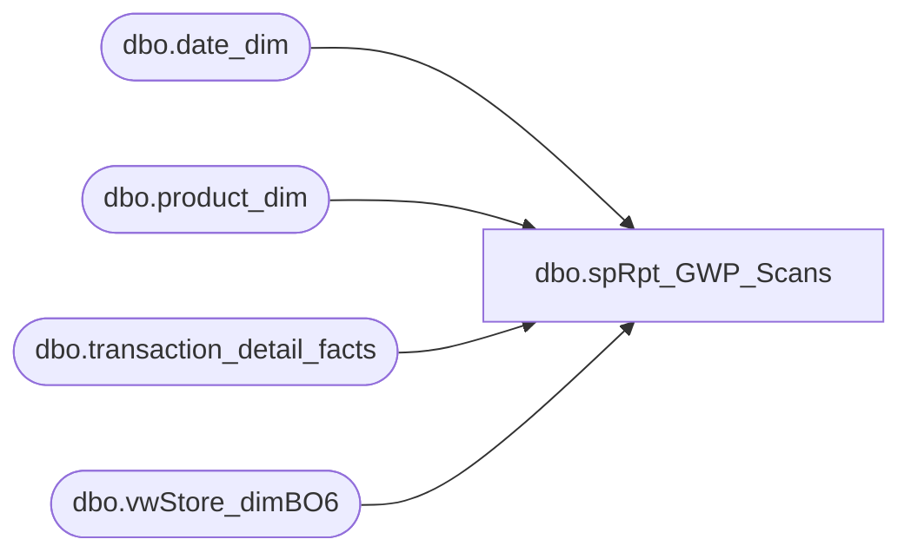

# dbo.spRpt_GWP_Scans

**Database:** dw  
**Server:** papamart  

## Architecture Diagram



## Table Dependencies

| Referenced Table |
|---|
| dbo.date_dim |
| dbo.product_dim |
| dbo.transaction_detail_facts |
| dbo.vwStore_dimBO6 |

## Stored Procedure Code

```sql
CREATE PROCEDURE [dbo].[spRpt_GWP_Scans] 

	(
	 @fiscalyear INT
	--,@FiscalPeriod VARCHAR(500)
	)
AS
BEGIN
SET NOCOUNT ON

/*********************************************************************************************************************************
 Author:		Mahendar Akula
 Create date:	05/11/2015
 Description:	
 Assigned by :	Kevin Shyr
 Version:		0.1
 Modified On:
 Modified By:
 Comments:		Created Proc
 Test:			EXEC [dbo].[spRpt_GWP_Scans]   2012

***********************************************************************************************************************************/

SELECT 
SD.store_id                               AS [Store ID]
,DD.actual_date                           AS [Actual Date]
,SUM(tdf.units)                           AS [Units]
FROM 
dbo.transaction_detail_facts TDF
INNER JOIN dbo.date_dim DD (NOLOCK) ON DD.date_key = TDF.date_key
INNER JOIN dbo.vwStore_dimBO6 SD (NOLOCK) ON SD.store_key = TDF.store_key
INNER JOIN dbo.product_dim PD (NOLOCK) ON PD.product_key = TDF.product_key
WHERE 
DD.actual_date BETWEEN '03/27/2014' AND '04/13/2014'
AND SD.store_id BETWEEN '1' AND '2100'
AND PD.sku IN ('092005', '192005', '492005')
GROUP BY 
SD.store_id,                         
DD.actual_date 

END                      
dbo,dt_getpropertiesbyid,/*
**	Retrieve properties by id's
**
**	dt_getproperties objid, null or '' -- retrieve all properties of the object itself
**	dt_getproperties objid, property -- retrieve the property specified
*/
create procedure dbo.dt_getpropertiesbyid
	@id int,
	@property varchar(64)
as
	set nocount on

	if (@property is null) or (@property = '')
		select property, version, value, lvalue
			from dbo.dtproperties
			where  @id=objectid
	else
		select property, version, value, lvalue
			from dbo.dtproperties
			where  @id=objectid and @property=property
```

