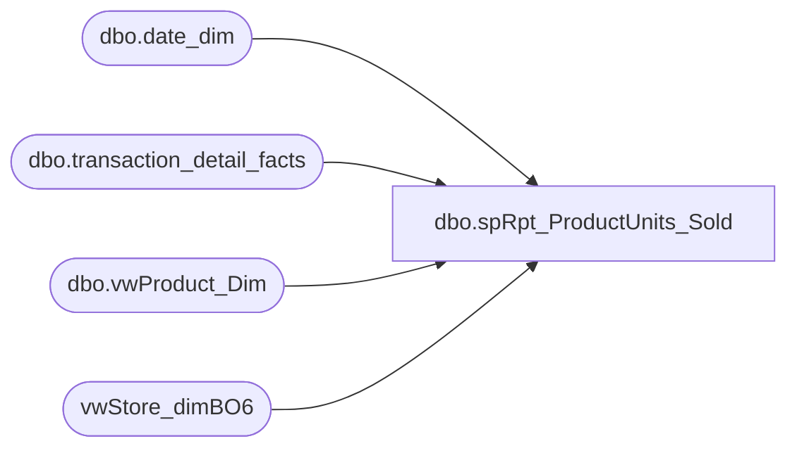

# dbo.spRpt_ProductUnits_Sold

**Database:** dw  
**Server:** papamart  

## Architecture Diagram



## Table Dependencies

| Referenced Table |
|---|
| dbo.date_dim |
| dbo.transaction_detail_facts |
| dbo.vwProduct_Dim |
| vwStore_dimBO6 |

## Stored Procedure Code

```sql
CREATE PROCEDURE [dbo].[spRpt_ProductUnits_Sold] 

	(
	 @fiscalyear INT
	--,@FiscalPeriod VARCHAR(500)
	)
AS
BEGIN
SET NOCOUNT ON

/*********************************************************************************************************************************
 Author:		Mahendar Akula
 Create date:	05/13/2015
 Description:	
 Assigned by :	Kevin Shyr
 Version:		0.1
 Modified On:
 Modified By:
 Comments:		Created Proc
 Test:			EXEC [dbo].[spRpt_ProductUnits_Sold]    2015

***********************************************************************************************************************************/

SELECT DISTINCT
dd.actual_date                          AS [Actual Date]
,VPD.product_desc                       AS [Product Description]
,SUM(TDF.units)                         AS [UNITS]
FROM dbo.transaction_detail_facts TDF
INNER JOIN dbo.vwProduct_Dim VPD (NOLOCK) ON VPD.product_key = TDF.product_key
INNER JOIN dbo.date_dim DD (NOLOCK) ON DD.date_key = TDF.date_key
INNER JOIN vwStore_dimBO6 SD (NOLOCK) ON SD.store_key = TDF.store_key
WHERE DD.actual_date BETWEEN '09-05-2014' AND '11-23-2014'
AND SD.store_id BETWEEN '1' AND '2100'
AND VPD.sku IN ('021820','020097')
GROUP BY
dd.actual_date   
,VPD.product_desc 
END
```

