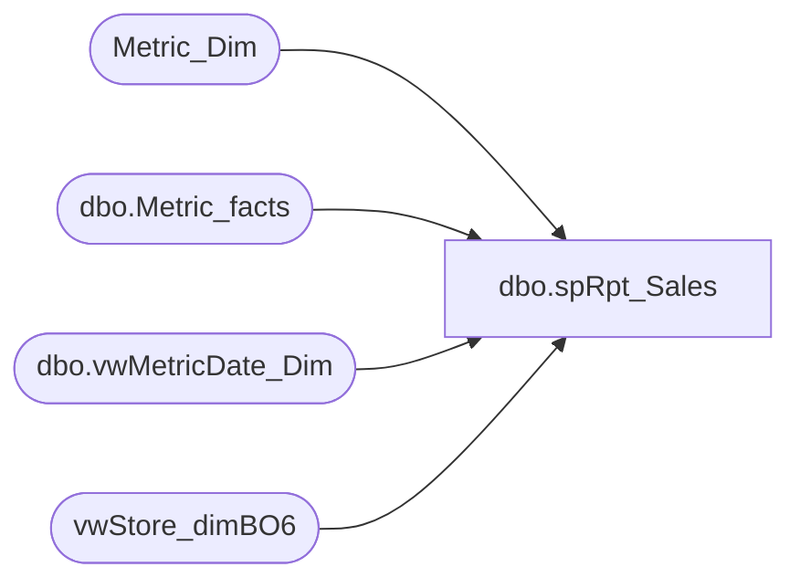

# dbo.spRpt_Sales

**Database:** dw  
**Server:** papamart  

## Architecture Diagram



## Table Dependencies

| Referenced Table |
|---|
| Metric_Dim |
| dbo.Metric_facts |
| dbo.vwMetricDate_Dim |
| vwStore_dimBO6 |

## Stored Procedure Code

```sql
CREATE PROCEDURE [dbo].[spRpt_Sales] 

	(
	 @fiscalyear INT
	--,@FiscalPeriod VARCHAR(500)
	)
AS
BEGIN
SET NOCOUNT ON

/*********************************************************************************************************************************
 Author:		Mahendar Akula
 Create date:	05/12/2015
 Description:	
 Assigned by :	Kevin Shyr
 Version:		0.1
 Modified On:
 Modified By:
 Comments:		Created Proc
 Test:			EXEC [dbo].[spRpt_Sales]   2012,1

***********************************************************************************************************************************/

--DECLARE  @fiscalYear INT--, @FiscalPeriod INT
--Set @fiscalYear = '2015' -- Set @FiscalPeriod = '1'


SELECT Distinct
VSD.store_id                               AS [STORED ID]
,VSD.store_name                            AS [Store_Name]
,VMD.fiscal_year                           AS [Fiscal Year]
,VMD.org_fiscal_period                     AS [Org Fiscal Period]
,VMD.actual_date                           AS [Actual Date]
,MF.amount                                 AS [Amount]
,md.name                                   AS [Name]
FROM
dbo.Metric_facts MF 
INNER JOIN Metric_Dim MD (NOLOCK) ON MD.metric_dim_key = MF.metric_dim_key
INNER JOIN vwStore_dimBO6 VSD (NOLOCK) ON VSD.store_key = MF.store_key
INNER JOIN (SELECT fiscal_year, org_fiscal_period,actual_date,date_key FROM dbo.vwMetricDate_Dim 
WHERE fiscal_year = '2014' AND org_fiscal_period ='6' ) VMD
ON VMD.date_key = MF.date_key
WHERE VMD.fiscal_year ='2014'
AND VMD.org_fiscal_period ='6'
AND MD.name IN ('GAAPsales')
END
```

