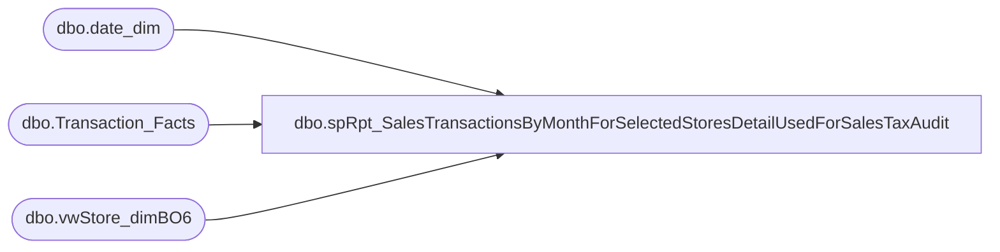

# dbo.spRpt_SalesTransactionsByMonthForSelectedStoresDetailUsedForSalesTaxAudit

**Database:** dw  
**Server:** papamart  

## Architecture Diagram



## Table Dependencies

| Referenced Table |
|---|
| dbo.date_dim |
| dbo.Transaction_Facts |
| dbo.vwStore_dimBO6 |

## Stored Procedure Code

```sql
CREATE PROCEDURE [dbo].[spRpt_SalesTransactionsByMonthForSelectedStoresDetailUsedForSalesTaxAudit]
	@FiscalYear INT
	, @FiscalPeriod INT
	, @StoreStateProvince VARCHAR(10)
AS
/*
	2015-04-03	Kevin Shyr	Created
*/
BEGIN
	SET NOCOUNT ON;
	--/***********  debugging  ***********/
	--/***********  debugging  ***********/
	--/***********  debugging  ***********/
	--DECLARE @FiscalYear INT
	--	, @FiscalPeriod INT
	--  , @StoreStateProvince VARCHAR(10)
	--SET @FiscalYear = 2015
	--SET @FiscalPeriod = 2
	--SET @StoreStateProvince = 'NY'
	--/***********  debugging  ***********/
	--/***********  debugging  ***********/
	--/***********  debugging  ***********/

	SELECT RIGHT('000' + CAST(vsdbo.store_id AS VARCHAR), 4) + ' ' + vsdbo.store_name AS Store_ID_And_Name
		, @FiscalYear AS fiscal_year
		, @FiscalPeriod AS org_fiscal_period
		, dd.actual_date
		, tf.register_no
		, tf.transaction_no
		, SUM(tf.Merchandise_UGA) AS Merchandise_UGA
		, SUM(tf.total_discount_amount) AS Discounts
		, SUM(tf.shipping_UGA) AS Shipping
		, SUM(tf.other_fees_UGA) AS Other_Fee
		, SUM(tf.giftcard_UGA) AS Gift_Card_Sold
		, SUM(tf.giftcard_discount_amount) AS GiftCardDiscounts
		, SUM(tf.party_deposit_UGA) AS Party_Deposit_Merch
		, SUM(tf.coupon_discount_amount) AS Coupon_Amt
		, SUM(tf.receipt_total_amount) AS Receipt_Ttl
		, SUM(tf.tax_amount) AS Tax_Tender
	FROM dbo.Transaction_Facts tf WITH(READCOMMITTED)
		INNER JOIN dbo.vwStore_dimBO6 vsdbo
			ON tf.store_key = vsdbo.store_key
		INNER JOIN dbo.date_dim dd WITH(READCOMMITTED)
			ON tf.date_key = dd.date_key
	WHERE dd.fiscal_year = @FiscalYear
		AND dd.org_fiscal_period = @FiscalPeriod
		AND vsdbo.state_province = @StoreStateProvince
	GROUP BY RIGHT('000' + CAST(vsdbo.store_id AS VARCHAR), 4) + ' ' + vsdbo.store_name
		, dd.actual_date
		, tf.register_no
		, tf.transaction_no

END
```

