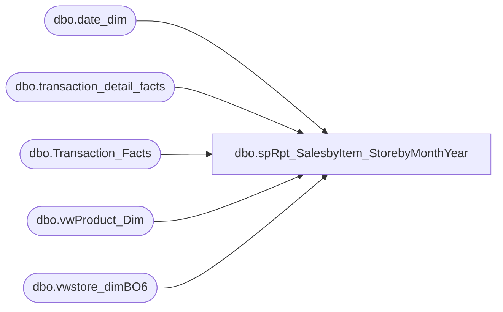

# dbo.spRpt_SalesbyItem_StorebyMonthYear

**Database:** dw  
**Server:** papamart  

## Architecture Diagram



## Table Dependencies

| Referenced Table |
|---|
| dbo.date_dim |
| dbo.transaction_detail_facts |
| dbo.Transaction_Facts |
| dbo.vwProduct_Dim |
| dbo.vwstore_dimBO6 |

## Stored Procedure Code

```sql
CREATE PROCEDURE [dbo].[spRpt_SalesbyItem_StorebyMonthYear] 
	@fiscalyear INT
	,@Location INT
AS
BEGIN
SET NOCOUNT ON

/*********************************************************************************************************************************
 Author:		Mahendar Akula
 Create date:	04/07/2015
 Description:	
 Assigned by :	Kevin Shyr
 Version:		0.1
 Modified On:
 Modified By:
 Comments:		Created Proc
 Test:			EXEC [dbo].[spRpt_SalesbyItem_StorebyMonthYear] 2012,7

***********************************************************************************************************************************/

--DECLARE  @fiscalyear INT, @Location INT
--Set @fiscalyear = '2015' Set @Location = '11'
 
	SELECT SD.store_id
		,DD.org_fiscal_period
		,PD.sku AS [Sku]
		,PD.style_desc AS [Style Description]
		,DD.fiscal_year
		,CAST(DD.fiscal_year AS INT) AS fiscal_year_INT
		,tf.net_sales_amount AS [NET]
		,SD.division AS SD_Division
		,RIGHT('000' + CAST(SD.store_id AS VARCHAR), 4) + ' ' + sd.store_name AS [StoreID]
		,SD.store_name
		,DD.month_name
		,DD.actual_date
		,DD.org_fiscal_week
		,tf.GAAP_sales_amount AS GAAP_Sale
		,TDF.transaction_id
		,PD.PRODUCT_GROUP
		,PD.division As PD_Division
		,SUM(TDF.unit_gross_amount) AS [Unit Gross Amount]
		,SUM (TDF.unit_disc_amount) AS [Unit Disc Amount]
		,SUM (TDF.Units) AS [Units]
		,SUM(TDF.unit_gross_amount)  - SUM (TDF.unit_disc_amount) AS [NETCAL]
	FROM dbo.vwstore_dimBO6 SD
		JOIN dbo.transaction_detail_facts TDF WITH(READCOMMITTED)
			ON TDF.store_key = SD.store_key
		JOIN dbo.date_dim DD WITH(READCOMMITTED)
			ON DD.date_key = TDF.date_key
		JOIN dbo.Transaction_Facts tf WITH(READCOMMITTED)
			ON tf.transaction_id = TDF.transaction_id -- This Table (TSF) needs to be Replaced according to Kevin Shyr
		JOIN dbo.vwProduct_Dim PD 
			ON PD.product_key = TDF.product_key
	WHERE dd.fiscal_year IN (@fiscalyear)
		AND SD.store_id = (@Location)
		AND PD.sku > 0
	group by 
		SD.store_id
		,DD.org_fiscal_period
		,PD.sku 
		,PD.style_desc 
		,DD.fiscal_year
		,CAST(DD.fiscal_year AS INT) 
		,tf.net_sales_amount 
		,SD.division 
		,RIGHT('000' + CAST(SD.store_id AS VARCHAR), 4) + ' ' + sd.store_name 
		,SD.store_name
		,DD.month_name
		,DD.actual_date
		,DD.org_fiscal_week
		,tf.GAAP_sales_amount
		,TDF.transaction_id
		,PD.PRODUCT_GROUP
		,PD.division 
 
 END
```

