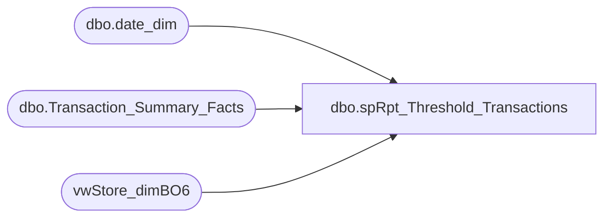

# dbo.spRpt_Threshold_Transactions

**Database:** dw  
**Server:** papamart  

## Architecture Diagram



## Table Dependencies

| Referenced Table |
|---|
| dbo.date_dim |
| dbo.Transaction_Summary_Facts |
| vwStore_dimBO6 |

## Stored Procedure Code

```sql
CREATE PROCEDURE [dbo].[spRpt_Threshold_Transactions] 
	(
	@Variable1 DATE
	, @Variable2 DATE
	)
AS
BEGIN
SET NOCOUNT ON

/*********************************************************************************************************************************
 Author:		Mahendar Akula
 Create date:	04/07/2015
 Description:	
 Assigned by :	Kevin Shyr
 Version:		0.1
 Modified On:
 Modified By:
 Comments:		Created Proc
 Test:			EXEC [dbo].[spRp_Threshold_Transactions]   

***********************************************************************************************************************************/

--
--DECLARE  @Variable1 DATE, @Variable2 DATE
--Set @Variable1 = '03-08-2013'  Set @Variable2 = '03-31-2013'
SELECT 
RIGHT('000' + cast(sd.store_id as varchar),4)+ ''+sd.store_name    as [Store Name]
,dd.actual_date                                                    as [Actual Date]
,tsf.transaction_id                                                as [Transaction ID]
,dd.org_fiscal_week                                              as [Org Fiscal WEEK]
,sd.division                                                       as [Division]
,SUM(TSF.GAAP_Sale)                                                as [GAAP SALE]
,sd.store_id                                                       as [Store ID]
,SUM(TSF.GAAP_Sale) + SUM(TSF.GIFT_CARD_SOLD) + SUM(TSF.Reward_cert_Tender) as [Transaction Count]
FROM dbo.Transaction_Summary_Facts TSF
INNER JOIN dbo.date_dim DD (NOLOCK) ON DD.date_key = TSF.date_key
INNER JOIN vwStore_dimBO6 SD (NOLOCK) ON SD.store_key = TSF.store_key
WHERE DD.actual_date BETWEEN (@Variable1)  AND (@Variable2)
AND SD.division = 'Europe'
GROUP BY
RIGHT('000' + cast(sd.store_id as varchar),4)+ ''+sd.store_name 
,dd.actual_date
,tsf.transaction_id
,dd.org_fiscal_week    
,sd.division
,sd.store_id
--HAVING SUM(TSF.GAAP_Sale) + SUM(TSF.GIFT_CARD_SOLD) + SUM(TSF.Reward_cert_Tender) > 0

UNION ALL
SELECT 
RIGHT('000' + cast(sd.store_id as varchar),4)+ ''+sd.store_name    as [Store Name]
,dd.actual_date                                                    as [Actual Date]
,tsf.transaction_id                                                as [Transaction ID]
,dd.org_fiscal_week                                              as [Org Fiscal WEEK]
,sd.division                                                       as [Division]
,SUM(TSF.GAAP_Sale)                                                as [GAAP SALE]
,sd.store_id                                                       as [Store ID]
,SUM(TSF.GAAP_Sale) + SUM(TSF.GIFT_CARD_SOLD) + SUM(TSF.Reward_cert_Tender) as [Transaction Count]
FROM dbo.Transaction_Summary_Facts TSF
INNER JOIN dbo.date_dim DD (NOLOCK) ON DD.date_key = TSF.date_key
INNER JOIN vwStore_dimBO6 SD (NOLOCK) ON SD.store_key = TSF.store_key
WHERE DD.actual_date BETWEEN (@Variable1)  AND (@Variable2)
AND SD.division = 'United Kingdom'
GROUP BY
RIGHT('000' + cast(sd.store_id as varchar),4)+ ''+sd.store_name 
,dd.actual_date
,tsf.transaction_id
,dd.org_fiscal_week    
,sd.division
,sd.store_id

UNION ALL 
SELECT 
RIGHT('000' + cast(sd.store_id as varchar),4)+ ''+sd.store_name    as [Store Name]
,dd.actual_date                                                    as [Actual Date]
,tsf.transaction_id                                                as [Transaction ID]
,dd.org_fiscal_week                                              as [Org Fiscal WEEK]
,sd.division                                                       as [Division]
,SUM(TSF.GAAP_Sale)                                                as [GAAP SALE]
,sd.store_id                                                       as [Store ID]
,SUM(TSF.GAAP_Sale) + SUM(TSF.GIFT_CARD_SOLD) + SUM(TSF.Reward_cert_Tender) as [Transaction Count]
FROM dbo.Transaction_Summary_Facts TSF
INNER JOIN dbo.date_dim DD (NOLOCK) ON DD.date_key = TSF.date_key
INNER JOIN vwStore_dimBO6 SD (NOLOCK) ON SD.store_key = TSF.store_key
WHERE DD.actual_date BETWEEN (@Variable1)  AND (@Variable2)
AND SD.division = 'Canada'
GROUP BY
RIGHT('000' + cast(sd.store_id as varchar),4)+ ''+sd.store_name 
,dd.actual_date
,tsf.transaction_id
,dd.org_fiscal_week    
,sd.division
,sd.store_id

UNION ALL
SELECT 
RIGHT('000' + cast(sd.store_id as varchar),4)+ ''+sd.store_name    as [Store Name]
,dd.actual_date                                                    as [Actual Date]
,tsf.transaction_id                                                as [Transaction ID]
,dd.org_fiscal_week                                              as [Org Fiscal WEEK]
,sd.division                                                       as [Division]
,SUM(TSF.GAAP_Sale)                                                as [GAAP SALE]
,sd.store_id                                                       as [Store ID]
,SUM(TSF.GAAP_Sale) + SUM(TSF.GIFT_CARD_SOLD) + SUM(TSF.Reward_cert_Tender) as [Transaction Count]
FROM dbo.Transaction_Summary_Facts TSF
INNER JOIN dbo.date_dim DD (NOLOCK) ON DD.date_key = TSF.date_key
INNER JOIN vwStore_dimBO6 SD (NOLOCK) ON SD.store_key = TSF.store_key
WHERE DD.actual_date BETWEEN (@Variable1)  AND (@Variable2)
AND SD.division = 'US Retail'
GROUP BY
RIGHT('000' + cast(sd.store_id as varchar),4)+ ''+sd.store_name 
,dd.actual_date
,tsf.transaction_id
,dd.org_fiscal_week    
,sd.division
,sd.store_id
END
```

