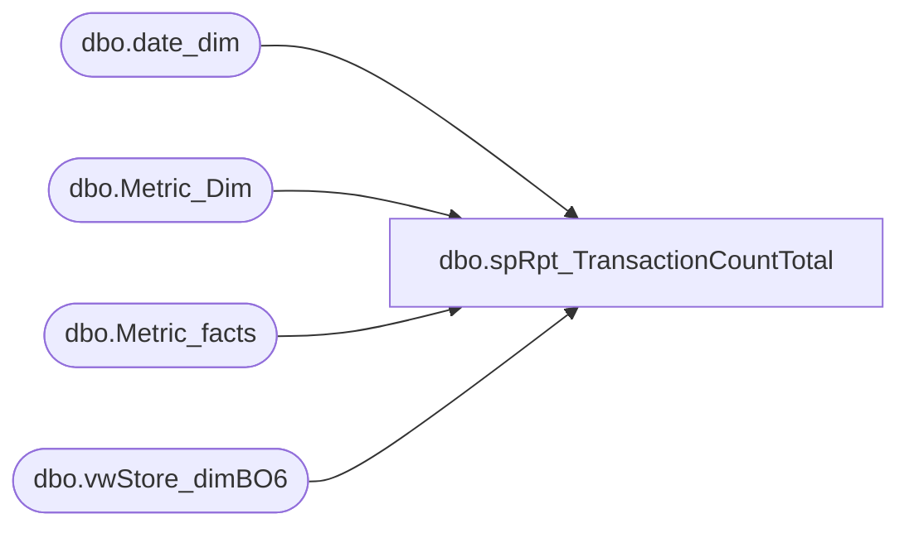

# dbo.spRpt_TransactionCountTotal

**Database:** dw  
**Server:** papamart  

## Architecture Diagram



## Table Dependencies

| Referenced Table |
|---|
| dbo.date_dim |
| dbo.Metric_Dim |
| dbo.Metric_facts |
| dbo.vwStore_dimBO6 |

## Stored Procedure Code

```sql
CREATE PROCEDURE [dbo].[spRpt_TransactionCountTotal]
	@FiscalYear INT
AS
SET NOCOUNT ON;
BEGIN

	SELECT 
		dd.fiscal_year
		, dd.org_fiscal_period
		, vsdbo.store_id
		, md.name
		, mf.amount
		, md.description
		, md.source
		, vsdbo.division
		, dd.actual_date
		, dd.org_fiscal_week
	FROM dbo.Metric_facts mf WITH(NOLOCK)
		INNER JOIN dbo.Metric_Dim md WITH(NOLOCK)
			ON mf.metric_dim_key = md.metric_dim_key
		INNER JOIN dbo.date_dim dd WITH(NOLOCK)
			ON mf.date_key = dd.date_key
		INNER JOIN dbo.vwStore_dimBO6 vsdbo
			ON mf.store_key = vsdbo.store_key
	WHERE
		dd.fiscal_year = @FiscalYear
		AND md.name IN ('ActualTransactions', 'GAAPtransactions', 'Returns', 'Transactions', 'GAAPsales')
		AND vsdbo.store_id < 3000
		AND vsdbo.division <> 'US Ridemakerz'

END
dbo,spGuestLoad_Update_BATCH_ADDR_CLNSD_STG,-- =============================================================================================================
-- Name: spGuestLoad_Update_BATCH_ADDR_CLNSD_STG
--
-- Description:	
--	QAS Batch can return some really odd results.  They say the address looks good - R9, but it's
--	questionable.  A lot of the problems are related to apartments.  They gave some reason about
--	apartment data passing through, yada, yada.  But, it looks like crap.  You would think they would
--	have an exact address match, but sometimes the apartment data comes through.
--
--	There was no way to be 100%, so I tried to find common patterns without throwing away good addresses.
--
--	This needs to be run before adding the addresses to CLNSD_ADDR_DIM, hence the need to modify the
--	qas_rtrn_cd.
--
--	QAS returns obviously bad addresses that are set as R9.  They tried to explain away this as retention issues and we should
--	just remove double spaces and periods.  After testing many of these through google, I determined that it's best just to mark
--	them as bad and not let them in the cleansed addresses.  Canada especially had issues and there were too many US addresses
--	to allow them through.
--
-- Input:
--
-- Output: 
--
-- Dependencies: 
--
-- EXAMPLE:
--		exec dw.dbo.spGuestLoad_Update_BATCH_ADDR_CLNSD_STG
--
-- Revision History
--		Name:			Date:			Comments:
--		Dave Rice		7/19/2010		created
--		Keith Missey	2/2/2012		updated to add fix for QAS issue with Canadian province abbreviations
-- =============================================================================================================
CREATE PROCEDURE [dbo].[spGuestLoad_Update_BATCH_ADDR_CLNSD_STG]
AS
BEGIN
-- SET NOCOUNT ON added to prevent extra result sets from
-- interfering with SELECT statements.
SET NOCOUNT ON;

----exec dbo.[spGuestLoad_Update_BATCH_ADDR_CLNSD_STG]

update QASCleansing.dbo.BATCH_ADDR_CLNSD_STG
set qas_rtrn_cd = replace(qas_rtrn_cd, 'R9', 'X9')
from QASCleansing.dbo.BATCH_ADDR_CLNSD_STG c
where (
	-- 'trunced apartment number'
	(c.apt_unit_nbr like '%-')

	-- 'odd apartment number'
	or (c.apt_unit_nbr like '%apt%apt%' 
		or c.apt_unit_nbr like '%#%#%' 
		or c.addr_ln_1_txt like '%apt%apt%' 
		or c.addr_ln_1_txt like '%#%#%'
		)

	--'double spaces'
	or (c.addr_ln_1_txt like '%  %')
	
	-- 'addr_ln_1_txt too short or cty_nm is null'
	or ((len(c.addr_ln_1_txt) < 5 or c.cty_nm is null) 
			and c.addr_ln_1_txt not like 'RR %' 
			and c.addr_ln_1_txt not like 'GD'
		) 

	-- 'odd placement of period'
	or (PATINDEX('%[abcdefghijklmnopqrstuvwxyz].[abcdefghijklmnopqrstuvwxyz0123456789]%', c.addr_ln_1_txt) > 0) 

	-- 'non-standard abbreviations'
	or (c.addr_ln_1_txt like '%rd.%' 
		or c.addr_ln_1_txt like '%st.' 
		or c.addr_ln_1_txt like '%ave.%' 
		or c.addr_ln_1_txt like '%cir.%'
	)
	)
	-- only update "good" addresses
	and substring(qas_rtrn_cd, 1, 2) = 'R9'
	
--TEMPORARY FIX FOR QAS ISSUE; NEEDS TO BE REMOVED WHEN QAS FIXES ISSUE	
Update qascleansing.dbo.BATCH_ADDR_CLNSD_STG
SET ST_PRVNC_ABBRV= (Case     When LTRIM(RTRIM(ST_PRVNC_NM))='Alberta' then 'AB'
                                          When LTRIM(RTRIM(ST_PRVNC_NM))='British Columbia' then 'BC' 
                                          When LTRIM(RTRIM(ST_PRVNC_NM))='Manitoba' then 'MB' 
                                          When LTRIM(RTRIM(ST_PRVNC_NM))='New Brunswick' then 'NB'        
                                          When LTRIM(RTRIM(ST_PRVNC_NM))='Newfoundland and Labrador' then 'NL' 
                                          When LTRIM(RTRIM(ST_PRVNC_NM))='Northwest Territories' then 'NT' 
                                          When LTRIM(RTRIM(ST_PRVNC_NM))='Nova Scotia' then 'NS' 
                                          When LTRIM(RTRIM(ST_PRVNC_NM))='Nunavut' then 'NU' 
                                          When LTRIM(RTRIM(ST_PRVNC_NM))='Ontario' then 'ON' 
                                          When LTRIM(RTRIM(ST_PRVNC_NM))='Prince Edward Island' then 'BC' 
                                          When LTRIM(RTRIM(ST_PRVNC_NM))='Quebec' then 'QC'
                                          When LTRIM(RTRIM(ST_PRVNC_NM))='Saskatchewan' then 'SK' 
                                          When LTRIM(RTRIM(ST_PRVNC_NM))='Yukon' then 'YT'  
                                          WHEN LTRIM(RTRIM(st_prvnc_nm)) = 'Prince-Edward Island' THEN 'BC'
                                    END)
WHERE CNTRY_ABBRV='CAN' AND LEN(st_prvnc_abbrv) > 2
	
END
```

