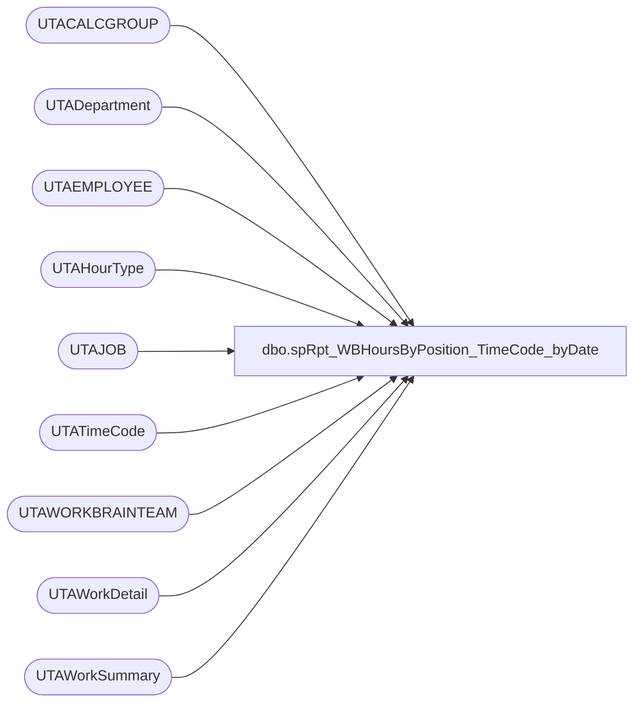

# dbo.spRpt_WBHoursByPosition_TimeCode_byDate

**Database:** dw  
**Server:** papamart  

## Architecture Diagram



## Table Dependencies

| Referenced Table |
|---|
| UTACALCGROUP |
| UTADepartment |
| UTAEMPLOYEE |
| UTAHourType |
| UTAJOB |
| UTATimeCode |
| UTAWORKBRAINTEAM |
| UTAWorkDetail |
| UTAWorkSummary |

## Stored Procedure Code

```sql
CREATE PROCEDURE [dbo].[spRpt_WBHoursByPosition_TimeCode_byDate]
	@fromDate datetime,
	@thruDate datetime
AS
-- =============================================================================================================
-- Name: spRpt_WBHoursByPosition_TimeCode
--
-- Description:	Extract the hours for the Weekly Hours by Position and Time Code report
-- 
-- Dependencies: 
--
-- Revision History
--		Name:			Date:			Comments:
--		Ian Wallace		3/11/2016		copied spRpt_WBHoursByPosition_TimeCode abd added fields
--		Ian Wallace		3/7/2018		replaced base_rate with wrkd_rate 
--		Dan Tweedie		2019-03-26		Created proc on papamart.dw, copied from Labordb01.WorkbrainProd (as creatded by Ian Wallace)
--		Ian Wallace		2023-03-29		replace isnumeric filter to allow store 1068A to come through
-- =============================================================================================================
BEGIN
	-- SET NOCOUNT ON added to prevent extra result sets from
	-- interfering with SELECT statements.
	SET NOCOUNT ON;

	IF (OBJECT_ID('tempdb..#empLongDay') IS NOT NULL)
		DROP TABLE #empLongDay

	SELECT
		E.EMP_NAME AS "Employee Number",
		--E.EMP_BASE_RATE AS "RATE",
		wd.WRKD_RATE AS "RATE",
		--lhd.Multplier * e.emp_base_rate as "Rate",
		J.JOB_NAME,
		CG.CALCGRP_NAME,
		--SUBSTRING(wt.WBT_NAME, 1, 5) AS "store",
		--case 
		--			when left(wt.WBT_NAME,1) = '2'
		--				then cast(LEFT(wt.WBT_NAME, 4) as int) 
		--				else cast(right(LEFT(wt.WBT_NAME, 4),3) as int)
		--		end as "store",
		case --changing to use department, as this appears to be where they actually clocked the data
			when left(d.dept_NAME,1) = '2'
				then cast(LEFT(d.dept_NAME, 4) as int) 
				else cast(right(LEFT(d.dept_NAME, 4),3) as int)
		end as "store",
		convert(char(10), wd.WRKD_WORK_DATE, 126) as "Work Date",
		ht.HTYPE_NAME,
		tc.TCODE_NAME,
		(LEFT(CONVERT(decimal(10, 2), SUM(wd.WRKD_MINUTES)) / 60, 5)) AS "HOURS"
	INTO #empLongDay
	FROM
		UTAWorkDetail wd WITH (NOLOCK)
		JOIN UTAWorkSummary ws WITH (NOLOCK)
			ON wd.WRKS_ID = ws.WRKS_ID
		JOIN UTAEMPLOYEE e WITH (NOLOCK)
			ON ws.EMP_ID = e.EMP_ID
		--JOIN UTAEmployeeJob ej WITH (NOLOCK)
		--	ON e.EMP_ID = ej.EMP_ID
		--	and ej.job_ID = wd.job_id
		--	AND wd.WRKD_WORK_DATE BETWEEN ej.EMPJOB_START_DATE AND ej.EMPJOB_END_DATE
		JOIN UTAJOB j WITH (NOLOCK)
			ON wd.JOB_ID = j.JOB_ID
		JOIN UTACALCGROUP cg WITH (NOLOCK)
			ON e.CALCGRP_ID = cg.CALCGRP_ID
		JOIN UTAWORKBRAINTEAM wt WITH (NOLOCK)
			ON wd.WBT_ID = wt.WBT_ID
		JOIN UTATimeCode tc WITH (NOLOCK)
			ON wd.TCODE_ID = tc.TCODE_ID
		JOIN UTAHourType ht WITH (NOLOCK)
			ON wd.HTYPE_ID = ht.HTYPE_ID
		--join labor_hourtype_dim lhd on ht.HType_Name = lhd.wb_cd
		join UTADepartment d on wd.dept_id = d.dept_id
	WHERE
		WRKD_WORK_DATE BETWEEN @fromDate AND @thruDate
		AND ht.HTYPE_NAME != 'UNPAID'
		--and (isnumeric(LEFT(wt.WBT_NAME, 4)) = 1)
		--and isnumeric(d.dept_name) = 1
		and isnumeric(left(d.dept_name,4)) = 1   
	GROUP BY	e.EMP_NAME,
				--e.EMP_BASE_RATE,
				wd.WRKD_RATE,
				--lhd.Multplier,
				--e.emp_base_rate,
				j.JOB_NAME,
				--SUBSTRING(wt.WBT_NAME, 1, 5),
				--case 
				--	when left(wt.WBT_NAME,1) = '2'
				--		then cast(LEFT(wt.WBT_NAME, 4) as int) 
				--		else cast(right(LEFT(wt.WBT_NAME, 4),3) as int)
				--end,
				case --changing to use department, as this appears to be where they actually clocked the data
						when left(d.dept_NAME,1) = '2'
							then cast(LEFT(d.dept_NAME, 4) as int) 
							else cast(right(LEFT(d.dept_NAME, 4),3) as int)
					end,
				cg.CALCGRP_NAME,
				wd.WRKD_WORK_DATE,
				ht.HTYPE_NAME,
				tc.TCODE_NAME
	
	--UNION

	--SELECT
	--	E.EMP_NAME AS "Employee Number",
	--	--E.EMP_BASE_RATE AS "RATE",
	--	wd.WRKD_RATE AS "RATE",
	--	--lhd.Multplier * e.emp_base_rate as "Rate",
	--	J.JOB_NAME,
	--	CG.CALCGRP_NAME,
	--	--SUBSTRING(wt.WBT_NAME, 1, 5) AS "store",
	--	sd.store_id as "store",
	--	convert(char(10), wd.WRKD_WORK_DATE, 126) as "Work Date",
	--	ht.HTYPE_NAME,
	--	tc.TCODE_NAME,
	--	(LEFT(CONVERT(decimal(10, 2), SUM(wd.WRKD_MINUTES)) / 60, 5)) AS "HOURS"
	--FROM
	--	UTAWorkDetail wd WITH (NOLOCK)
	--	JOIN UTAWorkSummary ws WITH (NOLOCK)
	--		ON wd.WRKS_ID = ws.WRKS_ID
	--	JOIN UTAEMPLOYEE e WITH (NOLOCK)
	--		ON ws.EMP_ID = e.EMP_ID
	--	--JOIN UTAEmployeeJob ej WITH (NOLOCK)
	--	--	ON e.EMP_ID = ej.EMP_ID
	--	--	and ej.job_ID = wd.job_id
	--	--	AND wd.WRKD_WORK_DATE BETWEEN ej.EMPJOB_START_DATE AND ej.EMPJOB_END_DATE
	--	JOIN UTAJOB j WITH (NOLOCK)
	--		ON wd.JOB_ID = j.JOB_ID
	--	JOIN UTACALCGROUP cg WITH (NOLOCK)
	--		ON e.CALCGRP_ID = cg.CALCGRP_ID
	--	JOIN UTAWORKBRAINTEAM wt WITH (NOLOCK)
	--		ON wd.WBT_ID = wt.WBT_ID
	--	JOIN UTATimeCode tc WITH (NOLOCK)
	--		ON wd.TCODE_ID = tc.TCODE_ID
	--	JOIN UTAHourType ht WITH (NOLOCK)
	--		ON wd.HTYPE_ID = ht.HTYPE_ID
	--	join 
	--				(
	--					select 
	--						e.EepEEID, 
	--						e.EecLocation, 
	--						case 
	--							when left(e.EecLocation,1) = '2'
	--								then cast(LEFT(e.EecLocation, 4) as int) 
	--								else cast(right(LEFT(e.EecLocation, 4),3) as int)
	--						end as store_id
	--					from UHCMEmp e with (nolock)
	--						left join store_dim sd with (nolock) 
	--							on case 
	--							when left(e.EecLocation,1) = '2'
	--								then cast(LEFT(e.EecLocation, 4) as int) 
	--								else cast(right(LEFT(e.EecLocation, 4),3) as int)
	--						end = sd.store_id
	--					where  ISNUMERIC(LEFT(e.EecLocation, 5)) = 1
	--				) as CWM 
	--				on CWM.EepEEID = e.emp_name 
	--	join store_dim sd with (nolock) on cwm.store_id = sd.store_id
	--	--join labor_hourtype_dim lhd on ht.HType_Name = lhd.wb_cd
	--WHERE
	--	WRKD_WORK_DATE BETWEEN @fromDate AND @thruDate
	--	AND ht.HTYPE_NAME != 'UNPAID'
	--	and (isnumeric(LEFT(wt.WBT_NAME, 4)) <> 1)
	--GROUP BY	e.EMP_NAME,
	--			--e.EMP_BASE_RATE,
	--			wd.WRKD_RATE,
	--			--lhd.Multplier,
	--			--e.emp_base_rate,
	--			j.JOB_NAME,
	--			--SUBSTRING(wt.WBT_NAME, 1, 5),
	--			sd.store_id,
	--			cg.CALCGRP_NAME,
	--			wd.WRKD_WORK_DATE,
	--			ht.HTYPE_NAME,
	--			tc.TCODE_NAME


	SELECT
		[Employee Number],
		JOB_NAME AS "JOB",
		CALCGRP_NAME AS "Calc. Group",
		Store,
		HTYPE_NAME AS "Hour Type",
		[Work Date],
		TCODE_NAME AS "Time Code",
		SUM(CONVERT(decimal(10, 2), (Hours))) AS Hours,
		RATE,
		Rate * SUM(CONVERT(decimal(10, 2), (Hours))) as Pay
	FROM
		#empLongDay
	GROUP BY	[Employee Number],
				[RATE],
				JOB_NAME,
				store,
				CALCGRP_NAME,
				HTYPE_NAME,
				[Work Date],
				TCODE_NAME,
				RATE
	ORDER BY	store,
				[Work Date],
				Job,
				"Hour Type"

END;
```

