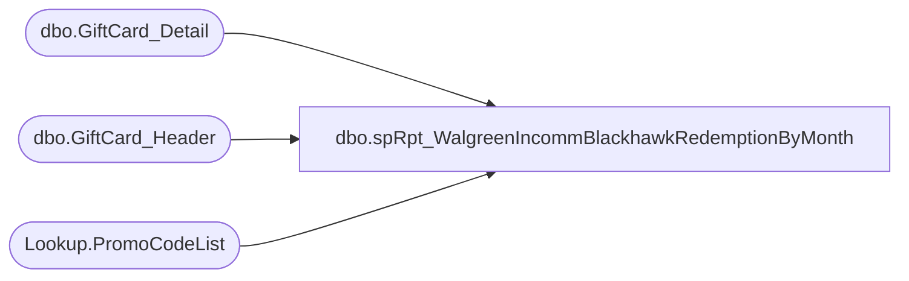

# dbo.spRpt_WalgreenIncommBlackhawkRedemptionByMonth

**Database:** dw  
**Server:** papamart  

## Architecture Diagram



## Table Dependencies

| Referenced Table |
|---|
| dbo.GiftCard_Detail |
| dbo.GiftCard_Header |
| Lookup.PromoCodeList |

## Stored Procedure Code

```sql
CREATE PROCEDURE [dbo].[spRpt_WalgreenIncommBlackhawkRedemptionByMonth]
	@BeginDate DATETIME
	, @EndDate DATETIME
AS
/*
	2015-04-01	Kevin Shyr	Created
	2015-04-02	Kevin Shyr	143268 is Costco, but should not be included.
	2015-10-02  Brian Byas	Altered Begin/End Dates to be DATETIME instead of DATE
*/
SET @EndDate = convert(DATETIME,@EndDate + ' 23:59:59.000')

BEGIN
	SELECT
		gd.alternate_merchant_number
		, CAST(gh.processed_date AS DATETIME) AS processed_date
		, gd.promotion_code
		, gd.transaction_amount
		, gd.internal_request_code
		, gd.FDMS_local_timestamp
		--, CASE
		--	WHEN gd.promotion_code IN (22098, 24890, 128667)
		--		THEN 'Walgreen'
		--	WHEN gd.promotion_code IN (68978, 68981, 78976)
		--		THEN 'Incomm'
		--	WHEN gd.promotion_code IN (107612)
		--		THEN 'Costco'
		--	WHEN gd.promotion_code IN (93808, 105737, 105738, 109622, 123984, 148821, 158726, 179251, 200256, 200262, 227007, 234768)
		--		THEN 'Blackhawk'
		--	WHEN gd.promotion_code IN (113336)
		--		THEN 'BH-Canada'
		--	ELSE 'Other'
		--END AS MerchName
		, pcl.Consortium AS MerchName
		--, gd.FDMS_local_timestamp
		--, gh.[dw_processed_date]
		--, gh.[processed_date]
		--, gh.[period_start_date]
		--, gh.[period_end_date]
	FROM dbo.GiftCard_Header gh WITH(READCOMMITTED)
		INNER JOIN dbo.GiftCard_Detail gd WITH(READCOMMITTED)
			ON gh.FileID = gd.FileID
		INNER JOIN Lookup.PromoCodeList pcl WITH(READCOMMITTED)
			ON gd.promotion_code = pcl.PromoCode
	WHERE 
		--gd.FDMS_local_timestamp BETWEEN @BeginDate AND @EndDate
		--gd.FDMS_local_timestamp BETWEEN '2/15/2015' AND '3/1/2015'
		gh.period_start_date BETWEEN @BeginDate AND @EndDate
		--gh.period_start_date BETWEEN '2/1/2015' AND '3/1/2015'
		--AND gd.promotion_code IN (22098
		--						, 24890
		--						, 68978
		--						, 68981
		--						, 78976
		--						, 93808
		--						, 105737
		--						, 105738
		--						, 107612
		--						, 109622
		--						, 113336
		--						, 123984
		--						, 128667
		--						, 148821
		--						, 158726
		--						, 179251
		--						, 200256
		--						, 200262
		--						, 227007
		--						, 234768)
		AND gd.alternate_merchant_number < 700
		AND gd.internal_request_code = 1
		AND gd.response_code = 0
END
```

