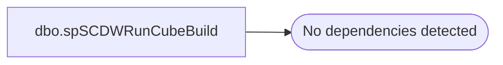

# dbo.spSCDWRunCubeBuild

**Database:** dw  
**Server:** papamart  

## Architecture Diagram



## Table Dependencies

_No table dependencies detected._

## Stored Procedure Code

```sql
/******************************************************************************
**
**	Name:		spSCDWRunCubeBuild
**
**	Description: 	Returns results for the Trend Report.
**
**
**	Parameters:	none
**
** 	Returns:	result set
**
**	Examples:	EXEC spSCDWRunCubeBuild
**			

******************************************************************************/

CREATE   PROCEDURE  [dbo].[spSCDWRunCubeBuild]

AS
SET NOCOUNT ON


Exec BABWSCORE01.Master..xp_cmdshell 'dtexec /sq "Sync Partitions 3" /ser BABWSCORE01'
```

