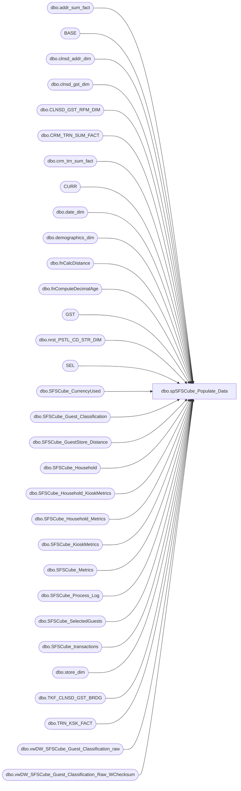

# dbo.spSFSCube_Populate_Data

**Database:** dw  
**Server:** papamart  

## Architecture Diagram



## Table Dependencies

| Referenced Table |
|---|
| dbo.addr_sum_fact |
| BASE |
| dbo.clnsd_addr_dim |
| dbo.clnsd_gst_dim |
| dbo.CLNSD_GST_RFM_DIM |
| dbo.CRM_TRN_SUM_FACT |
| dbo.crm_trn_sum_fact |
| CURR |
| dbo.date_dim |
| dbo.demographics_dim |
| dbo.fnCalcDistance |
| dbo.fnComputeDecimalAge |
| GST |
| dbo.nrst_PSTL_CD_STR_DIM |
| SEL |
| dbo.SFSCube_CurrencyUsed |
| dbo.SFSCube_Guest_Classification |
| dbo.SFSCube_GuestStore_Distance |
| dbo.SFSCube_Household |
| dbo.SFSCube_Household_KioskMetrics |
| dbo.SFSCube_Household_Metrics |
| dbo.SFSCube_KioskMetrics |
| dbo.SFSCube_Metrics |
| dbo.SFSCube_Process_Log |
| dbo.SFSCube_SelectedGuests |
| dbo.SFSCube_transactions |
| dbo.store_dim |
| dbo.TKF_CLNSD_GST_BRDG |
| dbo.TRN_KSK_FACT |
| dbo.vwDW_SFSCube_Guest_Classification_raw |
| dbo.vwDW_SFSCube_Guest_Classification_Raw_WChecksum |

## Stored Procedure Code

```sql
-- =============================================================================================================
-- Name: spSFSCube_Populate_Data
--
-- Description:	
--		This procedure will generate the SFSCube information that is necessary for the cube.
--		
-- Input:
--
-- Output: 
--
-- Dependencies: 
--
-- EXAMPLE:
--		exec dw.dbo.spSFSCube_Populate_Data @numDays=60
--
-- Revision History
--		Name:				Date:			Comments:
--		Gary Murrish		11/12/2013		Changed 12 Month Visit count to be 455 days (15 Months)
--		Gary Murrish		2/8/2011		Added Household Information
--		Gary Murrish		12/29/2010		created
-- =============================================================================================================
CREATE PROCEDURE [dbo].[spSFSCube_Populate_Data] 
	-- These are the number of days to go back and regenerate information
    @numDays INT = 60
AS
BEGIN
    SET NOCOUNT ON ;

    TRUNCATE TABLE queries.dbo.SFSCube_Process_Log
    INSERT INTO queries.dbo.SFSCube_Process_Log
        (Descr)
    VALUES
        ('Start of run')
			
		-- Work Variables
    DECLARE
        @gst_ID INT
       ,@LastNumber SMALLINT

	-- Determine the starting Date Key
    DECLARE @today AS int
    SET @today = (SELECT date_key
					FROM dw.dbo.date_dim WITH(NOLOCK)
					WHERE actual_date = CAST(CONVERT(VARCHAR, GETDATE(), 101) AS DATETIME))

    DECLARE @fromDate_Key AS INT
    SET @fromDate_Key = @today - @numDays
					
	-- Populate the Transactions
	/*
	DELETE FROM queries.dbo.SFSCube_Transactions WHERE date_key >= @fromDate_Key

	INSERT INTO queries.dbo.SFSCube_Transactions
	SELECT     currency_key, transaction_id, store_key, date_key, LineCount AS numItems, transaction_type_key, UnitGrossAmount, UnitDiscAmount, GaapSales, 
						  CAST(GAAPTransactionFlag AS SMALLINT) AS numGAAPTrans, CAST(CASE WHEN giftcardssolduga > 0 THEN 1 ELSE 0 END AS SMALLINT) 
						  AS numGiftCardsTrans, MerchandiseUnits, GAAPTransactionFlag AS GAAPTransaction, unit_net_amount, Animal_UGA, Non_Animal_UGA, 
						  Footwear_UGA, Accessories_UGA, Sounds_UGA, Clothing_UGA, Other_UGA, NetSales, MerchandiseUga, GiftCardsSoldUga, GiftCardDiscount, 
						  DonationsUga, StuffingAndSuppliesUGA, AnimalUnits, ShoeUnits, SoundUnits

	FROM         dw.dbo.vwDW_Transactions WITH (NOLOCK)
	WHERE     (date_key >= @fromDate_Key)
	 */

/***********************************************************************************************************/         
		-- Populate the currencies Used
/***********************************************************************************************************/
    INSERT INTO queries.dbo.SFSCube_Process_Log
        (Descr)
    VALUES
        ('LOAD Currencies')

    INSERT INTO queries.dbo.SFSCube_CurrencyUsed
        SELECT DISTINCT currency_key
        FROM queries.dbo.SFSCube_transactions WITH (NOLOCK)
        WHERE currency_key NOT IN (SELECT currency_key
									FROM queries.dbo.SFSCube_CurrencyUsed WITH(NOLOCK))
			
/***********************************************************************************************************/         
		-- Construct the Transaction Metrics for each guest who is identified
/***********************************************************************************************************/
    INSERT INTO queries.dbo.SFSCube_Process_Log
        (Descr)
    VALUES
        ('Load SFSCube_Metrics')

    DELETE FROM queries.dbo.SFSCube_Metrics
    WHERE dt_id >= @fromDate_Key

    INSERT INTO queries.dbo.SFSCube_Metrics
        SELECT
            TSF.clnsd_gst_id
           ,TSF.dt_id
           ,CAST(1 AS smallint) AS lifetimeVisitNumber
           ,CAST(0 AS int) AS DaysSinceLastTransaction
           ,datediff(m, gst.brth_dt, trndte.actual_date) AS ageMonths
           ,CAST(0 AS int) AS prevVisit_DT_ID
           ,CAST(0 AS int) AS [12MoVisit]
           ,CAST(0 AS int) AS [24MoVisit]
        FROM dw.dbo.crm_trn_sum_fact TSF WITH (NOLOCK)
			LEFT JOIN dw.dbo.clnsd_gst_dim GST WITH (NOLOCK)
				ON tsf.clnsd_gst_id = gst.clnsd_Gst_id
			LEFT JOIN dw.dbo.date_dim TRNDTE WITH (NOLOCK)
				ON TSF.dt_id = TRNDTE.date_key
        WHERE
			TSF.dt_id >= @fromDate_Key
        GROUP BY
            tsf.clnsd_gst_id
           ,tsf.dt_id
           ,trndte.actual_date
           ,gst.brth_dt

    UPDATE CURR
    SET prevVisit_DT_ID = (SELECT TOP 1
                               THIS.DT_ID
                           FROM
                               queries.dbo.SFSCube_Metrics THIS
                           WHERE
                           THIS.CLNSD_GST_ID = CURR.CLNSD_GST_ID
                           AND THIS.DT_ID < CURR.dt_id
                           ORDER BY
                               this.dt_id DESC)
    FROM
        queries.dbo.SFSCube_Metrics CURR
    WHERE
    curr.dt_id >= @fromdate_key	

		-- Compute the lifetimeVisitNumber, DaysSinceLastTransacton, 12 Mo Visit Count and 24 Mo Visit Count

    SELECT
        @lastNumber = 0
       ,@gst_ID = -9999999

    UPDATE
        queries.dbo.SFSCube_Metrics
    SET
        @lastNumber = lifetimeVisitNumber = CASE
                                                 WHEN clnsd_gst_id = @gst_ID THEN @lastNumber + 1
                                                 ELSE isnull(
                                                 (SELECT TOP 1
                                                      lifetimevisitnumber
                                                  FROM
                                                      queries.dbo.SFSCube_Metrics X WITH (NOLOCK)
                                                  WHERE
                                                  x.clnsd_gst_id = queries.dbo.SFSCube_Metrics.clnsd_gst_id
                                                  AND x.dt_id < queries.dbo.SFSCube_Metrics.dt_id
                                                  ORDER BY
                                                      X.dt_id DESC), 0) + 1
                                            END
       ,daysSinceLastTransaction = isnull(dt_id - prevVisit_DT_ID, -1)
       ,@gst_ID = clnsd_Gst_ID
       ,[12MoVisit] = (SELECT
                           COUNT(*)
                       FROM
                           queries.dbo.SFSCube_Metrics C WITH (NOLOCK)
                       WHERE
                       C.clnsd_gst_id = queries.dbo.SFSCube_Metrics.clnsd_gst_id
                       AND C.dt_id BETWEEN (queries.dbo.SFSCube_Metrics.dt_id - 455)
                       AND (queries.dbo.SFSCube_Metrics.dt_id))
       ,[24MoVisit] = (SELECT
                           COUNT(*)
                       FROM
                           queries.dbo.SFSCube_Metrics C WITH (NOLOCK)
                       WHERE
                       C.clnsd_gst_id = queries.dbo.SFSCube_Metrics.clnsd_gst_id
                       AND C.dt_id BETWEEN (queries.dbo.SFSCube_Metrics.dt_id - 365 * 2)
                       AND (queries.dbo.SFSCube_Metrics.dt_id))
    WHERE
    queries.dbo.SFSCube_Metrics.dt_id >= @fromDate_Key
			


/***********************************************************************************************************/         
		-- Construct the Kiosk metrics for each guest who is identified
/***********************************************************************************************************/
    INSERT INTO
        queries.dbo.SFSCube_Process_Log
        (
         Descr)
    VALUES
        (
         'Load Kiosk Metrics')

    DELETE  FROM
            queries.dbo.SFSCube_KioskMetrics
    WHERE
    dt_id >= @fromDate_Key

    INSERT INTO
        queries.dbo.SFSCube_KioskMetrics
        SELECT
            brdg.clnsd_gst_id
           ,tkf.dt_id
           ,CAST(1 AS smallint) AS lifetimeVisitNumber
           ,CAST(0 AS int) AS DaysSinceLastTransaction
           ,CASE
                 WHEN GST.BRTH_DT IS NULL
                 OR GST.BRTH_DT = '1900-01-01' THEN-1
                 ELSE datediff(m, GST.BRTH_DT, trndte.actual_date)
            END AS ageMonths
           ,CAST(0 AS int) AS prevVisit_DT_ID
           ,CAST(0 AS int) AS [12MoVisit]
           ,CAST(0 AS int) AS [24MoVisit]
        FROM
            dw.dbo.TRN_KSK_FACT tkf WITH (NOLOCK)
        INNER JOIN dw.dbo.TKF_CLNSD_GST_BRDG BRDG WITH (NOLOCK)
            ON tkf.TKF_ID = BRDG.TKF_ID
        LEFT JOIN dw.dbo.clnsd_gst_dim GST WITH (NOLOCK)
            ON BRDG.CLNSD_GST_ID = GST.CLNSD_GST_ID
        LEFT JOIN dw.dbo.date_dim TRNDTE WITH (NOLOCK)
            ON tkf.dt_id = TRNDTE.date_key
        WHERE
        tkf.dt_id >= @fromDate_Key
        GROUP BY
            brdg.clnsd_gst_id
                   ,tkf.dt_id
                   ,trndte.actual_date
                   ,gst.brth_dt


    UPDATE
        CURR
    SET
        prevVisit_DT_ID = (SELECT TOP 1
                               THIS.DT_ID
                           FROM
                               queries.dbo.SFSCube_KioskMetrics THIS
                           WHERE
                           THIS.CLNSD_GST_ID = CURR.CLNSD_GST_ID
                           AND THIS.DT_ID < CURR.dt_id
                           ORDER BY
                               this.dt_id DESC)
    FROM
        queries.dbo.SFSCube_KioskMetrics CURR
    WHERE
    curr.dt_id >= @fromdate_key

		-- Compute the lifetimeVisitNumber and the DaysSinceLastTransacton
    SELECT
        @lastNumber = 0
       ,@gst_ID = -9999999

    UPDATE
        queries.dbo.SFSCube_KioskMetrics
    SET
        @lastNumber = lifetimeVisitNumber = CASE
                                                 WHEN clnsd_gst_id = @gst_ID THEN @lastNumber + 1
                                                 ELSE isnull(
                                                 (SELECT TOP 1
                                                      lifetimevisitnumber
                                                  FROM
                                                      queries.dbo.SFSCube_KioskMetrics X WITH (NOLOCK)
                                                  WHERE
                                                  x.clnsd_gst_id = queries.dbo.SFSCube_KioskMetrics.clnsd_gst_id
                                                  AND x.dt_id < queries.dbo.SFSCube_KioskMetrics.dt_id
                                                  ORDER BY
                                                      X.dt_id DESC), 0) + 1
                                            END
       ,daysSinceLastTransaction = isnull(dt_id - prevVisit_DT_ID, -1)
       ,@gst_ID = clnsd_Gst_ID
       ,[12MoVisit] = (SELECT
                           COUNT(*)
                       FROM
                           queries.dbo.SFSCube_KioskMetrics C WITH (NOLOCK)
                       WHERE
                       C.clnsd_gst_id = queries.dbo.SFSCube_KioskMetrics.clnsd_gst_id
                       AND C.dt_id BETWEEN (queries.dbo.SFSCube_KioskMetrics.dt_id - 455)
                       AND (queries.dbo.SFSCube_KioskMetrics.dt_id))
       ,[24MoVisit] = (SELECT
                           COUNT(*)
                       FROM
                           queries.dbo.SFSCube_KioskMetrics C WITH (NOLOCK)
                       WHERE
                       C.clnsd_gst_id = queries.dbo.SFSCube_KioskMetrics.clnsd_gst_id
                       AND C.dt_id BETWEEN (queries.dbo.SFSCube_KioskMetrics.dt_id - 365 * 2)
                       AND (queries.dbo.SFSCube_KioskMetrics.dt_id))
    WHERE
    queries.dbo.SFSCube_KioskMetrics.dt_id >= @fromDate_Key

/***********************************************************************************************************/         
		-- Construct the 'Household Kiosk Metrics'
/***********************************************************************************************************/
    INSERT INTO
        queries.dbo.SFSCube_Process_Log
        (
         Descr)
    VALUES
        (
         'Load Household Kiosk Metrics')
    DELETE  FROM
            queries.dbo.SFSCube_Household_KioskMetrics
    WHERE
    dt_id >= @fromDate_Key

    INSERT INTO
        queries.dbo.SFSCube_Household_KioskMetrics
        SELECT
            gst.CLNSD_ADDR_ID
           ,ksk.dt_id
           ,CAST(1 AS smallint) AS lifetimeVisitNumber
           ,CAST(0 AS int) AS DaysSinceLastTransaction
           ,CAST(0 AS int) AS ageMonths
           ,CAST(0 AS int) AS prevVisit_DT_ID
           ,CAST(0 AS int) AS [12MoVisit]
           ,CAST(0 AS int) AS [24MoVisit]
        FROM
            queries.dbo.SFSCube_KioskMetrics KSK WITH (NOLOCK)
        INNER JOIN dw.dbo.clnsd_gst_dim GST WITH (NOLOCK)
            ON KSK.CLNSD_GST_ID = GST.CLNSD_GST_ID
        WHERE
        KSK.dt_id >= @fromDate_Key
        GROUP BY
            gst.CLNSD_ADDR_ID
                   ,ksk.dt_id

    UPDATE
        CURR
    SET
        prevVisit_DT_ID = (SELECT TOP 1
                               THIS.DT_ID
                           FROM
                               queries.dbo.SFSCube_Household_KioskMetrics THIS
                           WHERE
                           THIS.clnsd_addr_id = CURR.clnsd_addr_id
                           AND THIS.DT_ID < CURR.dt_id
                           ORDER BY
                               this.dt_id DESC)
    FROM
        queries.dbo.SFSCube_Household_KioskMetrics CURR
    WHERE
    curr.dt_id >= @fromdate_key

		-- Compute the lifetimeVisitNumber and the DaysSinceLastTransacton
    SELECT
        @lastNumber = 0
       ,@gst_ID = -9999999

    UPDATE
        queries.dbo.SFSCube_Household_KioskMetrics
    SET
        @lastNumber = lifetimeVisitNumber = CASE
                                                 WHEN clnsd_addr_id = @gst_ID THEN @lastNumber + 1
                                                 ELSE isnull(
                                                 (SELECT TOP 1
                                                      lifetimevisitnumber
                                                  FROM
                                                      queries.dbo.SFSCube_Household_KioskMetrics X WITH (NOLOCK)
                                                  WHERE
                                                  x.clnsd_addr_id = queries.dbo.SFSCube_Household_KioskMetrics.clnsd_addr_id
                                                  AND x.dt_id < queries.dbo.SFSCube_Household_KioskMetrics.dt_id
                                                  ORDER BY
                                                      X.dt_id DESC), 0) + 1
                                            END
       ,daysSinceLastTransaction = isnull(dt_id - prevVisit_DT_ID, -1)
       ,@gst_ID = clnsd_addr_ID
       ,[12MoVisit] = (SELECT
                           COUNT(*)
                       FROM
                           queries.dbo.SFSCube_Household_KioskMetrics C WITH (NOLOCK)
                       WHERE
                       C.clnsd_addr_id = queries.dbo.SFSCube_Household_KioskMetrics.clnsd_addr_id
                       AND C.dt_id BETWEEN (queries.dbo.SFSCube_Household_KioskMetrics.dt_id - 455)
                       AND (queries.dbo.SFSCube_Household_KioskMetrics.dt_id))
       ,[24MoVisit] = (SELECT
                           COUNT(*)
                       FROM
                           queries.dbo.SFSCube_Household_KioskMetrics C WITH (NOLOCK)
                       WHERE
                       C.clnsd_addr_id = queries.dbo.SFSCube_Household_KioskMetrics.clnsd_addr_id
                       AND C.dt_id BETWEEN (queries.dbo.SFSCube_Household_KioskMetrics.dt_id - 365 * 2)
                       AND (queries.dbo.SFSCube_Household_KioskMetrics.dt_id))
    WHERE
    queries.dbo.SFSCube_Household_KioskMetrics.dt_id >= @fromDate_Key         

/***********************************************************************************************************/         
		-- Construct the 'Household Transaction Metrics'
/***********************************************************************************************************/
    INSERT INTO
        queries.dbo.SFSCube_Process_Log
        (
         Descr)
    VALUES
        (
         'Load Household Transaction Metrics')

    DELETE  FROM
            queries.dbo.SFSCube_Household_Metrics
    WHERE
    dt_id >= @fromDate_Key

    INSERT INTO
        queries.dbo.SFSCube_Household_Metrics
        SELECT
            gst.CLNSD_ADDR_ID
           ,ksk.dt_id
           ,CAST(1 AS smallint) AS lifetimeVisitNumber
           ,CAST(0 AS int) AS DaysSinceLastTransaction
           ,CAST(0 AS int) AS prevVisit_DT_ID
           ,CAST(0 AS int) AS [12MoVisit]
           ,CAST(0 AS int) AS [24MoVisit]
        FROM
            queries.dbo.SFSCube_Metrics KSK WITH (NOLOCK)
        INNER JOIN dw.dbo.clnsd_gst_dim GST WITH (NOLOCK)
            ON KSK.CLNSD_GST_ID = GST.CLNSD_GST_ID
        WHERE
        KSK.dt_id > @fromDate_Key
        GROUP BY
            gst.CLNSD_ADDR_ID
                   ,ksk.dt_id

    UPDATE
        CURR
    SET
        prevVisit_DT_ID = (SELECT TOP 1
                               THIS.DT_ID
                           FROM
                               queries.dbo.SFSCube_Household_Metrics THIS
                           WHERE
                           THIS.clnsd_addr_id = CURR.clnsd_addr_id
                           AND THIS.DT_ID < CURR.dt_id
                           ORDER BY
                               this.dt_id DESC)
    FROM
        queries.dbo.SFSCube_Household_Metrics CURR
    WHERE
    curr.dt_id >= @fromdate_key

		-- Compute the lifetimeVisitNumber and the DaysSinceLastTransacton
    SELECT
        @lastNumber = 0
       ,@gst_ID = -9999999

    UPDATE
        queries.dbo.SFSCube_Household_Metrics
    SET
        @lastNumber = lifetimeVisitNumber = CASE
                                                 WHEN clnsd_addr_id = @gst_ID THEN @lastNumber + 1
                                                 ELSE isnull(
                                                 (SELECT TOP 1
                                                      lifetimevisitnumber
                                                  FROM
                                                      queries.dbo.SFSCube_Household_Metrics X WITH (NOLOCK)
                                                  WHERE
                                                  x.clnsd_addr_id = queries.dbo.SFSCube_Household_Metrics.clnsd_addr_id
                                                  AND x.dt_id < queries.dbo.SFSCube_Household_Metrics.dt_id
                                                  ORDER BY
                                                      X.dt_id DESC), 0) + 1
                                            END
       ,daysSinceLastTransaction = isnull(dt_id - prevVisit_DT_ID, -1)
       ,@gst_ID = clnsd_addr_ID
       ,[12MoVisit] = (SELECT
                           COUNT(*)
                       FROM
                           queries.dbo.SFSCube_Household_Metrics C WITH (NOLOCK)
                       WHERE
                       C.clnsd_addr_id = queries.dbo.SFSCube_Household_Metrics.clnsd_addr_id
                       AND C.dt_id BETWEEN (queries.dbo.SFSCube_Household_Metrics.dt_id - 455)
                       AND (queries.dbo.SFSCube_Household_Metrics.dt_id))
       ,[24MoVisit] = (SELECT
                           COUNT(*)
                       FROM
                           queries.dbo.SFSCube_Household_Metrics C WITH (NOLOCK)
                       WHERE
                       C.clnsd_addr_id = queries.dbo.SFSCube_Household_Metrics.clnsd_addr_id
                       AND C.dt_id BETWEEN (queries.dbo.SFSCube_Household_Metrics.dt_id - 365 * 2)
                       AND (queries.dbo.SFSCube_Household_Metrics.dt_id))
    WHERE
    queries.dbo.SFSCube_Household_Metrics.dt_id >= @fromDate_Key
    
    /***********************************************************************************************************/         
		-- Construct the 'Selected Customers Master Trigger table'
	/***********************************************************************************************************/
    INSERT INTO
        queries.dbo.SFSCube_Process_Log
        (
         Descr)
    VALUES
        (
         'Insert new Selected Guests')

    INSERT INTO
        queries.dbo.SFSCube_SelectedGuests
        (
         clnsd_gst_id
        ,currentAge
        ,sfs_rfm_key)
        SELECT 
			--TOP 1000
            K.clnsd_gst_id
           ,-1
           ,-1
        FROM
            queries.dbo.SFSCube_kioskmetrics K WITH (NOLOCK)
        INNER JOIN dw.dbo.CLNSD_GST_DIM GST WITH (NOLOCK)
            ON gst.CLNSD_GST_ID = K.clnsd_gst_id
        LEFT JOIN queries.dbo.SFSCube_selectedguests S WITH (NOLOCK)
            ON s.clnsd_gst_id = K.clnsd_gst_id
        WHERE
        K.clnsd_gst_id <> -1
        AND s.clnsd_gst_id IS NULL
        GROUP BY
            K.clnsd_gst_id
        ORDER BY
            COUNT(*) DESC


    INSERT INTO
        queries.dbo.SFSCube_SelectedGuests
        (
         clnsd_gst_id
        ,currentAge
        ,sfs_rfm_key)
        SELECT 
			--TOP 1000
            M.clnsd_gst_id
           ,-1
           ,-1
        FROM
            queries.dbo.SFSCube_metrics M WITH (NOLOCK)
        LEFT JOIN queries.dbo.SFSCube_selectedguests S WITH (NOLOCK)
            ON s.clnsd_gst_id = M.clnsd_gst_id
        INNER JOIN dw.dbo.CLNSD_GST_DIM GST WITH (NOLOCK)
            ON gst.CLNSD_GST_ID = M.clnsd_gst_id
        WHERE
        M.clnsd_gst_id <> -1
        AND s.clnsd_gst_ID IS NULL
        GROUP BY
            M.clnsd_gst_id
        ORDER BY
            COUNT(*) DESC

/***********************************************************************************************************/         
	--	Update the CRM Store for the guest
/***********************************************************************************************************/
    INSERT INTO
        queries.dbo.SFSCube_Process_Log
        (
         Descr)
    VALUES
        (
         'Update Selected Guests CRM Store')

    UPDATE
        BASE
    SET
       CRM_REGIS_STR_ID = ISNULL(GST.CRM_REGIS_STR_ID, -4)
    FROM
        queries.dbo.SFSCube_SelectedGuests BASE WITH (NOLOCK)
        INNER JOIN dw.dbo.CLNSD_GST_DIM GST WITH (NOLOCK)
        ON GST.clnsd_gst_id = BASE.clnsd_gst_id
    WHERE
	    ISNULL(GST.CRM_REGIS_STR_ID, -4) <> ISNULL(BASE.CRM_REGIS_STR_ID, -99)


/***********************************************************************************************************/         
/*		Update the Visit Number																			   */         
/***********************************************************************************************************/
    INSERT INTO
        queries.dbo.SFSCube_Process_Log
        (
         Descr)
    VALUES
        (
         'Update Selected Guests Visit Numbers')

    UPDATE
        GST
    SET
        lifetimevisitnumber = ISNULL(metc.lifetimevisitnumber, 0)
       ,daysSinceLastTransaction = ISNULL(@today - metc.last_visit_dt, 0)
       ,[12MoVisit] = ISNULL(metc.[12MoVisit], 0)
       ,[24MoVisit] = ISNULL(metc.[24MoVisit], 0)
       ,[12MoKiosk] = ISNULL(KSKC.[12MoKiosk], 0)
       ,[24MoKiosk] = ISNULL(KSKC.[24MoKiosk], 0)
       ,lifetimeKiosk = ISNULL(KSKC.lifetimeKiosk, 0)
       ,daysSinceLastKiosk = ISNULL(@today - KSKC.last_Kisok_Dt, 0)
    FROM
        queries.dbo.SFSCube_SelectedGuests GST WITH (NOLOCK)
        LEFT JOIN
        (SELECT
             clnsd_gst_id
            ,SUM(CASE
                      WHEN met.dt_id >= @today - 455 THEN 1
                      ELSE 0
                 END) AS [12MoVisit]
            ,SUM(CASE
                      WHEN met.dt_id >= @today - (365 * 2) THEN 1
                      ELSE 0
                 END) AS [24MoVisit]
            ,MAX(lifetimevisitnumber) AS lifetimeVisitNumber
            ,MAX(dt_id) AS last_Visit_Dt
         FROM
             queries.dbo.SFSCube_Metrics MET WITH (NOLOCK)
         GROUP BY
             clnsd_gst_id) METC
        ON GST.clnsd_gst_id = metc.clnsd_gst_id
        LEFT JOIN
        (SELECT
             clnsd_gst_id
            ,SUM(CASE
                      WHEN KSK.dt_id >= @today - 365 THEN 1
                      ELSE 0
                 END) AS [12MoKiosk]
            ,SUM(CASE
                      WHEN KSK.dt_id >= @today - (365 * 2) THEN 1
                      ELSE 0
                 END) AS [24MoKiosk]
            ,MAX(lifetimevisitnumber) AS lifetimeKiosk
            ,MAX(dt_id) AS last_Kisok_Dt
         FROM
             queries.dbo.SFSCube_KioskMetrics KSK WITH (NOLOCK)
         GROUP BY
             clnsd_gst_id) KSKC
        ON GST.clnsd_gst_id = KSKC.clnsd_gst_id	


/***********************************************************************************************************/         
		-- Set the current Age of the guest
/***********************************************************************************************************/
    INSERT INTO
        queries.dbo.SFSCube_Process_Log
        (
         Descr)
    VALUES
        (
         'Update Selected Guests Current Age  CRM Membership Date')

    UPDATE
        SEL
    SET
        SEL.CurrentAge = ISNULL(dw.dbo.fnComputeDecimalAge(GST.BRTH_DT, GETDATE()), -1)
       ,SEL.dateJoinedSFS = ISNULL(DTE.date_key, 1)
    FROM
        queries.dbo.SFSCube_SelectedGuests SEL
        INNER JOIN dw.dbo.CLNSD_GST_DIM GST WITH (NOLOCK)
        ON sel.clnsd_gst_id = gst.CLNSD_GST_ID
        LEFT JOIN dw.dbo.date_dim DTE WITH (NOLOCK)
        ON GST.CRM_MBRSHP_DT = DTE.actual_date
    WHERE
    sel.currentage <> ISNULL(dw.dbo.fnComputeDecimalAge(GST.BRTH_DT, GETDATE()), -1)
    OR ISNULL(SEL.dateJoinedSFS, -1) <> ISNULL(DTE.date_key, 1)			
				
/***********************************************************************************************************/         				
		-- Set the current RFM Category for the Guest
/***********************************************************************************************************/
    INSERT INTO
        queries.dbo.SFSCube_Process_Log
        (
         Descr)
    VALUES
        (
         'Update RFM Category on Selected Guest')

    UPDATE
        SEL
    SET
        SEL.sfs_rfm_key = ISNULL(rfm.sfs_rfm_key, -1)
    FROM
        queries.dbo.SFSCube_SelectedGuests SEL
        LEFT JOIN dw.dbo.CLNSD_GST_RFM_DIM AS RFM WITH (nolock)
        ON RFM.CLNSD_GST_ID = sel.CLNSD_GST_ID
        AND @today BETWEEN rfm.from_date_key
        AND rfm.thru_date_key
    WHERE
    SEL.sfs_rfm_key <> ISNULL(rfm.sfs_rfm_key, -1)		


/*	*************************************************************************************************************
	* Construct the missing Households
	*************************************************************************************************************
*/

INSERT INTO
    queries.dbo.SFSCube_Process_Log
    (
     Descr)
VALUES
    (
     'Insert Missing Households')
INSERT INTO
    queries.dbo.SFSCube_Household
    (
     clnsd_addr_id)
    SELECT
        KSK.clnsd_addr_id
    FROM
        queries.dbo.SFSCube_Household_KioskMetrics KSK WITH (NOLOCK)
    LEFT JOIN queries.dbo.SFSCube_Household HSH WITH (NOLOCK)
        ON KSK.clnsd_addr_id = HSH.clnsd_addr_id
    WHERE
    HSH.clnsd_addr_id IS NULL
    GROUP BY
        KSK.clnsd_addr_id

INSERT INTO
    queries.dbo.SFSCube_Household
    (
     clnsd_addr_id)
    SELECT
        MET.clnsd_addr_id
    FROM
        queries.dbo.SFSCube_Household_Metrics MET WITH (NOLOCK)
    LEFT JOIN queries.dbo.SFSCube_Household HSH WITH (NOLOCK)
        ON MET.clnsd_addr_id = HSH.clnsd_addr_id
    WHERE
    HSH.clnsd_addr_id IS NULL
    GROUP BY
        MET.clnsd_addr_id

INSERT INTO
    queries.dbo.SFSCube_Household
    (
     clnsd_addr_id)
    SELECT
        GST.clnsd_addr_id
    FROM
        queries.dbo.SFSCube_SelectedGuests SEL WITH (NOLOCK)
    INNER JOIN dw.dbo.CLNSD_GST_DIM GST WITH (NOLOCK)
        ON GST.clnsd_gst_id = SEL.clnsd_gst_id
    LEFT JOIN queries.dbo.SFSCube_Household HSH WITH (NOLOCK)
        ON GST.clnsd_addr_id = HSH.clnsd_addr_id
    WHERE
    HSH.clnsd_addr_id IS NULL
    GROUP BY
        GST.clnsd_addr_id

/*	*************************************************************************************************************
	* Update Selected Guest Addresses
	*************************************************************************************************************
*/
INSERT INTO
    queries.dbo.SFSCube_Process_Log
    (
     Descr)
VALUES
    (
     'Update Guest Address')
UPDATE BASE
	SET clnsd_addr_id = ISNULL(GST.clnsd_addr_id, -1)	
	FROM queries.dbo.SFSCube_SelectedGuests BASE WITH (NOLOCK)
	INNER JOIN dw.dbo.CLNSD_GST_DIM GST WITH (NOLOCK)
		ON GST.CLNSD_GST_id = BASE.clnsd_gst_id
WHERE ISNULL(BASE.clnsd_addr_id, -99) <> ISNULL(GST.clnsd_addr_id, -1)		


/*	*************************************************************************************************************
	* Update the PSYTE Cluster, latitude, longitude, dma_code for the Households
	*************************************************************************************************************
*/

INSERT INTO
    queries.dbo.SFSCube_Process_Log
    (
     Descr)
VALUES
    (
     'UPDATE Household PSYTE Cluster')
         
	UPDATE BASE
		SET psyte_clus_id = ISNULL(addr.clus_id, -1)
			, latitude = ISNULL(addr.LAT_NBR, -1)
			, longitude = ISNULL(ADDR.LONG_NBR, -1)
			, dma_code = ISNULL(DEMO.dma_code, -1)
			, DMailStatus = ISNULL(ADDR.MAIL_STAT_CD, 'No Address')
		FROM queries.dbo.SFSCube_Household BASE WITH (NOLOCK)
		INNER JOIN dw.dbo.clnsd_addr_dim ADDR WITH (NOLOCK)
			ON ADDR.CLNSD_ADDR_ID = BASE.clnsd_addr_id
		LEFT JOIN dw.dbo.demographics_dim DEMO WITH (NOLOCK)
			ON DEMO.demographics_bg_key = ADDR.BLKGRP_CD			
		WHERE
		ISNULL(BASE.psyte_clus_id,-99) <> ISNULL(addr.clus_id,-1)			
		OR ISNULL(BASE.latitude,-99) <> ISNULL(addr.LAT_NBR,-1)
		OR ISNULL(BASE.longitude, -99) <> ISNULL(addr.LONG_NBR,-1)
		OR ISNULL(BASE.dma_code, -99) <> ISNULL(DEMO.dma_code,-1)
		OR ISNULL(BASE.DMailStatus, '') <> ISNULL(ADDR.MAIL_STAT_CD, 'No Address')
  		

/***********************************************************************************************************/         
		-- Build the distance table from the Kiosk information
/***********************************************************************************************************/
    INSERT INTO
        queries.dbo.SFSCube_Process_Log
        (
         Descr)
    VALUES
        (
         'Insert Guest Store Distance from Kiosk')

    INSERT INTO
        queries.dbo.SFSCube_GuestStore_Distance
        (
         clnsd_gst_id
        ,store_key
        ,dstnc_to_store_qty)
        SELECT
            BRDG.CLNSD_GST_ID
           ,tkf.STR_ID
           ,CASE
                 WHEN HSH.latitude <= 0 THEN CAST(0 AS float)
                 ELSE ISNULL(dw.dbo.fnCalcDistance(HSH.latitude, HSH.longitude, STO.latitude, sto.longitude), -1)
            END AS dstnc_to_str_qty
        FROM
            dw.dbo.TRN_KSK_FACT tkf WITH (NOLOCK)
        INNER JOIN dw.dbo.TKF_CLNSD_GST_BRDG BRDG WITH (NOLOCK)
            ON tkf.TKF_ID = BRDG.TKF_ID
        INNER JOIN queries.dbo.SFSCube_SelectedGuests SEL WITH (NOLOCK)
            ON SEL.clnsd_gst_id = BRDG.CLNSD_GST_ID
        INNER JOIN queries.dbo.SFSCube_Household HSH WITH (NOLOCK)
			ON SEL.clnsd_addr_id = HSH.clnsd_addr_id
        INNER JOIN dw.dbo.store_dim STO WITH (NOLOCK)
            ON STO.store_key = tkf.STR_ID
        LEFT JOIN queries.dbo.SFSCube_GuestStore_Distance DST WITH (NOLOCK)
            ON BRDG.CLNSD_GST_ID = DST.clnsd_gst_id
               AND tkf.STR_ID = DST.store_key
        WHERE
        tkf.dt_id >= @fromDate_Key
        AND DST.clnsd_gst_id IS NULL
        GROUP BY
            brdg.clnsd_gst_id
                   ,tkf.STR_ID
                   ,HSH.latitude
                   ,HSH.longitude
                   ,sto.latitude
                   ,sto.longitude	
		   
/***********************************************************************************************************/         		   
		-- Build the guest store information from the transactions
/***********************************************************************************************************/
    INSERT INTO
        queries.dbo.SFSCube_Process_Log
        (
         Descr)
    VALUES
        (
         'Insert Guest Store Distance from Transactions')

    INSERT INTO
        queries.dbo.SFSCube_GuestStore_Distance
        (
         clnsd_gst_id
        ,store_key
        ,dstnc_to_store_qty)
        SELECT
            TSF.CLNSD_GST_ID
           ,TSF.STR_ID
           ,CASE
                 WHEN HSH.latitude <= 0 THEN CAST(0 AS float)
                 ELSE ISNULL(dw.dbo.fnCalcDistance(HSH.latitude, HSH.longitude, STO.latitude, sto.longitude), -1)
            END AS dstnc_to_str_qty
        FROM
            dbo.CRM_TRN_SUM_FACT AS TSF
        INNER JOIN queries.dbo.SFSCube_SelectedGuests SEL WITH (NOLOCK)
            ON SEL.clnsd_gst_id = TSF.CLNSD_GST_ID
        INNER JOIN queries.dbo.SFSCube_Household HSH WITH (NOLOCK)
			ON SEL.clnsd_addr_id = HSH.clnsd_addr_id
        INNER JOIN dw.dbo.store_dim STO WITH (NOLOCK)
            ON STO.store_key = TSF.STR_ID
        LEFT JOIN queries.dbo.SFSCube_GuestStore_Distance DST WITH (NOLOCK)
            ON TSF.CLNSD_GST_ID = DST.clnsd_gst_id
               AND TSF.STR_ID = DST.store_key
        WHERE
        TSF.DT_ID >= @fromDate_Key
        AND DST.clnsd_gst_id IS NULL
        GROUP BY
            TSF.clnsd_gst_id
                   ,TSF.STR_ID
                   ,HSH.latitude
                   ,HSH.longitude
                   ,sto.latitude
                   ,sto.longitude				   					
		   
		   
/***********************************************************************************************************/         		   
		-- Build any new Guest Classifications
/***********************************************************************************************************/
    INSERT INTO
        queries.dbo.SFSCube_Process_Log
        (
         Descr)
    VALUES
        (
         'Build New Guest Classifications')

    INSERT INTO
        Queries.dbo.SFSCube_Guest_Classification
        (
         [GNDR_CD]
        ,[hasBirthDate]
        ,[isSFSMember]
        ,[hasDMailAddress]
        ,[hasEMailAddress]
        ,[EMailStatus]
        ,[SFS_Country]
        ,[CNTRY_ABBRV]
        ,[DMailStatus]
        ,CheckSumValue
        ,[hasHispanicSurname]
        ,[isSFSHousehold])
        SELECT DISTINCT
            new.[GNDR_CD]
           ,new.[hasBirthDate]
           ,new.[isSFSMember]
           ,new.[hasDMailAddress]
           ,new.[hasEMailAddress]
           ,new.[EMailStatus]
           ,new.[SFS_Country]
           ,new.[CNTRY_ABBRV]
           ,new.[DMailStatus]
           ,CHECKSUM(NEW.[GNDR_CD], NEW.[hasBirthDate] * 27, NEW.[isSFSMember] * 13, NEW.[hasDMailAddress], NEW.[hasEMailAddress], NEW.[EMailStatus], NEW.[SFS_Country], NEW.[CNTRY_ABBRV], NEW.[DMailStatus], NEW.[hasHispanicSurname] * 17, NEW.[isSFSHousehold] * 47) AS CheckSumValue
           ,new.[hasHispanicSurname]
           ,NEW.[isSFSHousehold]
        FROM
            dw.dbo.vwDW_SFSCube_Guest_Classification_raw NEW WITH (NOLOCK)
        LEFT JOIN Queries.dbo.SFSCube_Guest_Classification CURR WITH (NOLOCK)
            ON CHECKSUM(NEW.[GNDR_CD], NEW.[hasBirthDate] * 27, NEW.[isSFSMember] * 13, NEW.[hasDMailAddress], NEW.[hasEMailAddress], NEW.[EMailStatus], NEW.[SFS_Country], NEW.[CNTRY_ABBRV], NEW.[DMailStatus], NEW.[hasHispanicSurname] * 17, NEW.[isSFSHousehold] * 47) = curr.CheckSumValue
        WHERE
        curr.guest_class_key IS NULL
			
/***********************************************************************************************************/         			
-- Set the Guest Class of the selected Guests			
/***********************************************************************************************************/
    INSERT INTO
        queries.dbo.SFSCube_Process_Log
        (
         Descr)
    VALUES
        (
         'Update Selected Guests with New Guest Classifications')


    SELECT
        [CLNSD_GST_ID]
       ,[CheckSumValue]
    INTO
        #tmpGM
    FROM
        [dw].[dbo].[vwDW_SFSCube_Guest_Classification_Raw_WChecksum]
				
		-- Update the changed selected Guests Guest Class Key
    DECLARE @I int
    SET @I = 100
    WHILE @I > 0

        BEGIN

            SELECT TOP 10000
                CURR.CLNSD_GST_ID
               ,NEWHASH.guest_class_key AS new_guest_class_key
               ,curr.guest_class_key
            INTO
                #tmpToUpdate
            FROM
                #tmpGM RAW WITH (NOLOCK)
            INNER JOIN queries.dbo.SFSCube_SelectedGuests CURR WITH (TABLOCKX, HOLDLOCK)
                ON RAW.CLNSD_GST_ID = CURR.clnsd_gst_id
            INNER JOIN queries.dbo.SFSCube_Guest_Classification NEWHASH WITH (NOLOCK)
                ON NEWHASH.CheckSumValue = RAW.CheckSumValue
            WHERE
            NEWHASH.guest_class_key <> curr.guest_class_key

            UPDATE
                CURR
            SET
                guest_class_key = new.new_guest_class_key
            FROM
                #tmpToUpdate NEW WITH (NOLOCK)
                INNER JOIN queries.dbo.SFSCube_SelectedGuests CURR WITH (NOLOCK)
                ON new.CLNSD_GST_ID = CURR.clnsd_gst_id
            WHERE
            NEW.new_guest_class_key <> curr.guest_class_key
            SET @I = @@ROWCOUNT

            DROP TABLE #tmpToUpdate
        END

    DROP TABLE #tmpGM


/*	*************************************************************************************************************
	* Nearest store and distance to Nearest Store for the Households
	*************************************************************************************************************
*/

INSERT INTO
    queries.dbo.SFSCube_Process_Log
    (
     Descr)
VALUES
    (
     'UPDATE Household Nearest Store')
UPDATE
    BASE
SET
    NRST_STR_KEY = ISNULL(NR.STR_ID, -4)
   ,DSTNC_TO_STR_QTY = ISNULL(ASF.DSTNC_TO_STR_QTY, 0)
FROM
    queries.dbo.SFSCube_Household BASE WITH (NOLOCK)
    LEFT JOIN dw.dbo.addr_sum_fact ASF WITH (NOLOCK)
    ON ASF.CLNSD_ADDR_ID = BASE.clnsd_addr_id
    LEFT JOIN dw.dbo.nrst_PSTL_CD_STR_DIM NR WITH (NOLOCK)
    ON ASF.NRST_PSTL_CD_STR_ID = NR.NRST_PSTL_CD_STR_ID
WHERE
ISNULL(BASE.NRST_STR_KEY, -99) <> ISNULL(nr.str_id, -4)
OR ISNULL(BASE.DSTNC_TO_STR_QTY, -99) <> ISNULL(ASF.DSTNC_TO_STR_QTY, 0)


/*	*************************************************************************************************************
	* Update performance statistics
	*************************************************************************************************************
*/

INSERT INTO
    queries.dbo.SFSCube_Process_Log
    (
     Descr)
VALUES
    (
     'Update Household Performance Statistics')
UPDATE
    BASE
SET
    lifetimeVisitNumber = ISNULL(MET.lifetimeVisitNumber, 0)
   ,[12MoVisit] = ISNULL(met.[12MoVisit], 0)
   ,[24MoVisit] = ISNULL(MET.[24MoVisit], 0)
   ,daysSinceLastTransaction = ISNULL(@today - MET.last_Visit_dt, 0)
   ,lifetimeKiosk = ISNULL(KSK.lifetimeKiosk, 0)
   ,[12MoKiosk] = ISNULL(KSK.[12MoKiosk], 0)
   ,[24MoKiosk] = ISNULL(KSK.[24MoKiosk], 0)
   ,daysSinceLastKiosk = ISNULL(@today - KSK.last_Kiosk_dt, 0)
FROM
    queries.dbo.SFSCube_Household BASE WITH (NOLOCK)
    LEFT JOIN
    (SELECT
         met.clnsd_addr_id
        ,SUM(CASE
                  WHEN met.dt_id >= @today - 455 THEN 1
                  ELSE 0
             END) AS [12MoVisit]
        ,SUM(CASE
                  WHEN met.dt_id >= @today - (365 * 2) THEN 1
                  ELSE 0
             END) AS [24MoVisit]
        ,MAX(lifetimeVisitNumber) AS lifetimeVisitNumber
        ,MAX(dt_id) AS last_Visit_dt
     FROM
         queries.dbo.SFSCube_Household_Metrics MET WITH (NOLOCK)
     GROUP BY
         MET.clnsd_addr_id) AS MET
    ON BASE.clnsd_addr_id = MET.clnsd_addr_id
    LEFT JOIN
    (SELECT
         KSK.clnsd_addr_id
        ,SUM(CASE
                  WHEN KSK.dt_id >= @today - 365 THEN 1
                  ELSE 0
             END) AS [12MoKiosk]
        ,SUM(CASE
                  WHEN KSK.dt_id >= @today - (365 * 2) THEN 1
                  ELSE 0
             END) AS [24MoKiosk]
        ,MAX(lifetimeVisitNumber) AS lifetimeKiosk
        ,MAX(dt_id) AS last_Kiosk_dt
     FROM
         queries.dbo.SFSCube_Household_KioskMetrics KSK WITH (NOLOCK)
     GROUP BY
         KSK.clnsd_addr_id) AS KSK
    ON BASE.clnsd_addr_id = KSK.clnsd_addr_id	


/*	*************************************************************************************************************
	* Update Household SFS information 
	*************************************************************************************************************
*/

INSERT INTO
    queries.dbo.SFSCube_Process_Log
    (
     Descr)
VALUES
    (
     'Update Household SFS Information')
UPDATE
    BASE
SET
    firstDateJoinedSFS = ISNULL(DTA.firstDateJoinedSFS, 1)
   ,isSFSHousehold = ISNULL(DTA.isSFSHousehold, 0)
FROM
    queries.dbo.SFSCube_Household BASE WITH (NOLOCK)
    LEFT JOIN
    (SELECT
         GST.CLNSD_ADDR_ID
        ,MIN(DTE.date_key) AS firstDateJoinedSFS
        ,MAX(CASE
                  WHEN LEN(ISNULL(GST.HOH_LYLTY_GST_NBR, '')) > 0 THEN 1
                  ELSE 0
             END) AS isSFSHousehold
     FROM
         dw.dbo.CLNSD_GST_DIM GST WITH (NOLOCK)
     INNER JOIN dw.dbo.date_dim DTE WITH (NOLOCK)
         ON DTE.actual_date = gst.CRM_MBRSHP_DT
     GROUP BY
         GST.clnsd_addr_id) AS DTA
    ON DTA.CLNSD_ADDR_ID = BASE.clnsd_addr_id
WHERE
ISNULL(BASE.firstDateJoinedSFS, -99) <> ISNULL(DTA.firstDateJoinedSFS, 1)
OR ISNULL(BASE.isSFSHousehold, -99) <> ISNULL(DTA.isSFSHousehold, 0)


    INSERT INTO
        queries.dbo.SFSCube_Process_Log
        (
         Descr)
    VALUES
        (
         'End of Job')

END
```

