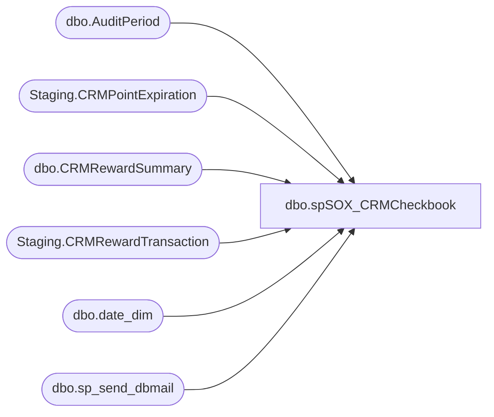

# dbo.spSOX_CRMCheckbook

**Database:** dw  
**Server:** papamart  

## Architecture Diagram



## Table Dependencies

| Referenced Table |
|---|
| dbo.AuditPeriod |
| Staging.CRMPointExpiration |
| dbo.CRMRewardSummary |
| Staging.CRMRewardTransaction |
| dbo.date_dim |
| dbo.sp_send_dbmail |

## Stored Procedure Code

```sql
CREATE proc [dbo].[spSOX_CRMCheckbook] 

as

-- =====================================================================================================
-- Name: spSOX_CRMCheckbook 
--
-- Description: Captures CRM loyalty points data, maintains monthly 'checkbook' to track activity month to month
--				
-- Revision History
--		Name:			Date:			Comments:
--		Dan Tweedie		2017-01-19		Created proc
--		Dan Tweedie		2017-02-27		I put steps 1 and 2 into SSIS, so CRM data is captured and staged on CRM server, then SSIS data flows it to Papamart, then this proc does the final steps on papamart
-- =====================================================================================================


set nocount on
--SSIS has already staged the data to papamart.sox.staging.CRMRewardTransaction and papamart.sox.staging.CRMPointExpiration
declare 
			@FiscalStartKey int,
			@mindate date,
			@maxdate date, 
			@fiscalyear int, 
			@fiscalperiod int,
			@AuditPeriodKey int,
			@fiscalyearCurr int, 
			@fiscalperiodCurr int,
			@calendardate date;

		with FirstFiscalPeriodDateKeys as
			(
				select min(date_key) MinDateKey
				from dw.dbo.date_dim 
				where cast(actual_date as date) <= cast(getdate() as date)
				group by fiscal_year, fiscal_period
			)
		select @FiscalStartKey = max(date_key)
		from dw.dbo.date_dim dd
		join FirstFiscalPeriodDateKeys dk on dd.date_key = dk.MinDateKey

		select @fiscalyear = max(fiscal_year)
		from dw.dbo.date_dim 
		where date_key < @FiscalStartKey

		select @fiscalperiod = max(fiscal_period)
		from dw.dbo.date_dim 
		where date_key < @FiscalStartKey
		and fiscal_year = @fiscalyear

		select @mindate=StartDate, @maxdate = EndDate
		from SOX.dbo.AuditPeriod 
		WHERE AuditYear=@fiscalyear AND AuditPeriod=@fiscalperiod;


-------------------------------- Begin Step 3 -----------------------------
		-- Get AuditPeriodKey for CURRENT MONTH.  We want to sum all points in the stg 
		-- table to find the current balance (or month beginning points) for each country.
		select 
			@fiscalyearCurr = fiscal_year,
			@fiscalperiodCurr = fiscal_period
		from dw.dbo.date_dim 
		where date_key = @FiscalStartKey

		SELECT @AuditPeriodKey=AuditPeriodKey 
		FROM SOX.dbo.AuditPeriod
		WHERE AuditYear=@fiscalyearCurr AND AuditPeriod=@fiscalperiodCurr;

		-- Move data from stage to CRMRewardSummary 
		-- Insert BeginningPointsTotal for current period.  SUM(reward_header.points_posted) equals the total outstanding points.
		INSERT INTO SOX.dbo.CRMRewardSummary (AuditPeriodKey, CountryCode, BeginningPointsTotal, InsertDate, InsertUser)
		SELECT	@AuditPeriodKey, country_code, SUM(points_posted), CAST(GETDATE() AS DATE), 'bab\sqlservices'
		FROM SOX.Staging.CRMRewardTransaction 
		GROUP BY country_code
		ORDER BY country_code;
		-------------------------------- End Step 3 -----------------------------

		-------------------------------- Begin Step 4 ---------------------------
		
		-- Update Earned and Adjusted for previous period
		-- The rows for this period already exist because we inserted the beginning totals last period
		WITH RewardCategoryPoints (AuditPeriodKey, CountryCode, EarnedPointsTotal, AdjustedPointsTotal) AS (
			SELECT	a.AuditPeriodKey, c.country_code,
					SUM(CASE WHEN reward_category='S' THEN points_posted ELSE 0 END),
					SUM(CASE WHEN reward_category='A' THEN points_posted ELSE 0 END)
			FROM SOX.Staging.CRMRewardTransaction c
			INNER JOIN SOX.dbo.AuditPeriod a
				ON a.AuditYear=@fiscalyear
				AND a.AuditPeriod=@fiscalperiod
			WHERE transaction_date BETWEEN @mindate and @maxdate
			GROUP BY a.AuditPeriodKey, c.country_code
			)
		UPDATE s 
		SET		s.EarnedPointsTotal=r.EarnedPointsTotal, 
				s.AdjustedPointsTotal=r.AdjustedPointsTotal,
				s.UpdateDate=CAST(GETDATE() AS DATE),
				s.UpdateUser='bab\sqlservices'
		FROM SOX.dbo.CRMRewardSummary s 
		INNER JOIN RewardCategoryPoints r
			ON r.AuditPeriodKey=s.AuditPeriodKey
			AND r.CountryCode=s.CountryCode;

		-- Get last calendar day of previous period
		-- Redeemed points are given a transaction_date of the last calendar day in the previous fiscal month
		--   i.e. May redemptions have a transaction_date of 4/30
		SET @calendardate = DateAdd(month, @fiscalperiod - 1, 
								DateAdd(Year, @fiscalyear-1900, 0))-1; 

		-- Update Redeemed for previous period
		-- The rows for this period already exist because we inserted the beginning totals last period
		-- Redeemed points are given a transaction_date of the last day in the previous fiscal month
		--   i.e. May redemptions have a transaction_date of 4/30
		WITH RewardCategoryPoints (AuditPeriodKey, CountryCode, RedeemedPointsTotal) AS (
			SELECT	a.AuditPeriodKey, c.country_code,
					SUM(CASE WHEN reward_category='R' THEN -1*points_posted ELSE 0 END)
			FROM SOX.Staging.CRMRewardTransaction c
			INNER JOIN SOX.dbo.AuditPeriod a
				ON a.AuditYear=@fiscalyear
				AND a.AuditPeriod=@fiscalperiod
			WHERE transaction_date = @calendardate
			GROUP BY a.AuditPeriodKey, c.country_code
			)
		UPDATE s 
		SET		s.RedeemedPointsTotal=r.RedeemedPointsTotal
		FROM SOX.dbo.CRMRewardSummary s 
		INNER JOIN RewardCategoryPoints r
			ON r.AuditPeriodKey=s.AuditPeriodKey
			AND r.CountryCode=s.CountryCode;
		-------------------------------- End Step 4 -------------------------------
		
		-------------------------------- Begin Step 5 -----------------------------
		-- Update expired points for previous period.
		-- The rows for this period already exist because we inserted the beginning totals last period
		WITH ExpiredPoints (CountryCode, ExpiredPointsTotal) AS (
			SELECT country_code, SUM(last_no_points_expired)
			FROM SOX.[Staging].[CRMPointExpiration]
			GROUP BY country_code
			)
		UPDATE c
		SET c.ExpiredPointsTotal=e.ExpiredPointsTotal
		FROM SOX.[dbo].[CRMRewardSummary] c
		INNER JOIN ExpiredPoints e
			ON e.CountryCode=c.CountryCode
		AND AuditPeriodKey=@AuditPeriodKey
		-------------------------------- End Step 5 -------------------------------

		-------------------------------- Begin Step 6 -----------------------------

		--EXEC PAPAMART.msdb.dbo.sp_start_job @job_name='Execute DOMO Workbench Jobs - Sox.CRMPointsSummary'

		-------------------------------- End Step 6 -----------------------------

		-------------------------------- Begin Step 7  -----------------------------
		exec msdb.dbo.sp_send_dbmail
		@profile_name = 'BIAdmin',
		@recipients = 'FinancialAnalyst@buildabear.com',
		@copy_recipients = 'biadmin@buildabear.com',
		@body = 'The CRM SFS points summary updates have posted to the data warehouse' ,
		@subject= 'The CRM SFS points summary updates have posted to the data warehouse',
		@body_format = 'HTML'
		-------------------------------- End Step 7  -----------------------------

---original code---
--------------------------------------------------------------------------------------------
--------This code should be run on the morning of the first day in every fiscal month-------
--------------------------------------------------------------------------------------------

-----CHECK TO SEE IF TODAY IS FIRST DAY OF FISCAL MONTH

--declare 
--	@FiscalStartCheck int;

--with FirstFiscalPeriodDateKeys as
--	(
--		select min(date_key) MinDateKey
--		from dw.dbo.date_dim 
--		group by fiscal_year, fiscal_period
--	)
--select @FiscalStartCheck = dd.date_key
--from dw.dbo.date_dim dd
--join FirstFiscalPeriodDateKeys dk on dd.date_key = dk.MinDateKey
--where datediff(dd, dd.actual_date, getdate()) = 0

--if @FiscalStartCheck is not NULL

--BEGIN


--		-------------------------------- Begin Step 0 -----------------------------
--		truncate table sox.[Staging].[CRMRewardTransaction] 
--		truncate table sox.[Staging].[CRMPointExpiration]
--		-------------------------------- END Step 0 -------------------------------

--		-------------------------------- Begin Step 1 -----------------------------
--		-- Get Fiscal Date Range for previous period
--		declare 
--			@FiscalStartKey int,
--			@mindate date,
--			@maxdate date, 
--			@fiscalyear int, 
--			@fiscalperiod int,
--			@AuditPeriodKey int,
--			@fiscalyearCurr int, 
--			@fiscalperiodCurr int,
--			@calendardate date;

--		with FirstFiscalPeriodDateKeys as
--			(
--				select min(date_key) MinDateKey
--				from dw.dbo.date_dim 
--				where cast(actual_date as date) <= cast(getdate() as date)
--				group by fiscal_year, fiscal_period
--			)
--		select @FiscalStartKey = max(date_key)
--		from dw.dbo.date_dim dd
--		join FirstFiscalPeriodDateKeys dk on dd.date_key = dk.MinDateKey

--		select @fiscalyear = max(fiscal_year)
--		from dw.dbo.date_dim 
--		where date_key < @FiscalStartKey

--		select @fiscalperiod = max(fiscal_period)
--		from dw.dbo.date_dim 
--		where date_key < @FiscalStartKey
--		and fiscal_year = @fiscalyear

--		select @mindate=StartDate, @maxdate = EndDate
--		from SOX.dbo.AuditPeriod 
--		WHERE AuditYear=@fiscalyear AND AuditPeriod=@fiscalperiod;

		
--		-- Stage transactions from CRM from BOT through end of previous fiscal month
--		INSERT INTO SOX.[Staging].[CRMRewardTransaction]
--		SELECT rha.[reward_transaction_id]
--			  ,rha.[customer_id]
--			  ,rha.[transaction_id]
--			  ,rha.[transaction_date]
--			  ,rha.[store_no]
--			  ,rha.[reward_category]
--			  ,rha.[points_posted]
--			  ,rha.[points_available]
--			  ,rha.[reason_type_code]
--			  ,rha.[comments]
--			  ,rha.[total_net_retail]
--			  ,rha.[total_net_units]
--			  ,rha.[regular_points]
--			  ,rha.[header_bonus_points]
--			  ,rha.[detail_bonus_points]
--			  ,rha.[tender_bonus_points]
--			  ,rha.[date_points_posted]
--			  ,rha.[reference_no]
--			  ,rha.[original_reward_tran_id]
--			  ,rha.[transaction_time]
--			  ,rha.[total_net_retail_central]
--			  ,rha.[exchange_rate]
--			  ,rha.[currency_code]
--			  ,rha.[redemption_reversed]
--			  ,rha.[amount]
--			  ,CASE
--				   WHEN a.[country_code] = 'CAN' THEN 'CAN'
--				   WHEN a.[country_code] = 'CAF' THEN 'CAN'
--				   WHEN a.[country_code] = 'GBR' THEN 'GBR'
--				   ELSE 'USA'
--			   END AS [country_code]
--		FROM CRMDB02.crm.[dbo].[reward_header] rha with (nolock) 
--		INNER JOIN CRMDB02.crm.dbo.customer c with (nolock)
--			ON c.customer_id=rha.customer_id
--		LEFT OUTER JOIN CRMDB02.crm.[dbo].[address] a with (nolock) 
--			ON a.customer_id=rha.customer_id
--			AND a.address_id=c.active_address_id
--		WHERE rha.transaction_date<=@maxdate
--		AND c.membership_type_code IN ('SFS','BASI','CHAR','PREF','CLUB')
--		AND ISNULL(LOWER(c.title), 'X') NOT LIKE '%emp%';
		
--		-------------------------------- End Step 1 -------------------------------
		
--		-------------------------------- Begin Step 2 -----------------------------
		
--		-- Stage points expired from previous period
--		INSERT INTO SOX.[Staging].[CRMPointExpiration]
--		SELECT	clt.[customer_id], 
--				clt.[last_date_points_expired], 
--				clt.[last_no_points_expired], 
--				CASE
--				   WHEN a.[country_code] = 'CAN' THEN 'CAN'
--				   WHEN a.[country_code] = 'CAF' THEN 'CAN' 
--				   WHEN a.[country_code] = 'GBR' THEN 'GBR' 
--				   ELSE 'USA'  
--			   END AS [country_code]
--		FROM CRMDB02.crm.[dbo].[customer_lifetime_totals] clt
--		INNER JOIN CRMDB02.crm.dbo.customer c -- This filters for valid Loyalty customers
--			ON c.customer_id=clt.customer_id
--		LEFT OUTER JOIN CRMDB02.crm.[dbo].[address] a
--			ON a.customer_id=clt.customer_id
--			AND a.address_id=c.active_address_id
--		WHERE clt.last_date_points_expired BETWEEN @mindate and @maxdate
--		-- Filters for customers whom are "point eligible"
--		AND c.membership_type_code IN ('SFS','BASI','CHAR','PREF','CLUB')
--		AND ISNULL(LOWER(c.title), 'X') NOT LIKE '%emp%';
--		-- (211542 row(s) affected)
--		-------------------------------- End Step 2 -------------------------------
		
--		-------------------------------- Begin Step 3 -----------------------------
--		-- Get AuditPeriodKey for CURRENT MONTH.  We want to sum all points in the stg 
--		-- table to find the current balance (or month beginning points) for each country.
--		select 
--			@fiscalyearCurr = fiscal_year,
--			@fiscalperiodCurr = fiscal_period
--		from dw.dbo.date_dim 
--		where date_key = @FiscalStartKey

--		SELECT @AuditPeriodKey=AuditPeriodKey 
--		FROM SOX.dbo.AuditPeriod
--		WHERE AuditYear=@fiscalyearCurr AND AuditPeriod=@fiscalperiodCurr;

--		-- Move data from stage to CRMRewardSummary 
--		-- Insert BeginningPointsTotal for current period.  SUM(reward_header.points_posted) equals the total outstanding points.
--		INSERT INTO SOX.dbo.CRMRewardSummary (AuditPeriodKey, CountryCode, BeginningPointsTotal, InsertDate, InsertUser)
--		SELECT	@AuditPeriodKey, country_code, SUM(points_posted), CAST(GETDATE() AS DATE), 'bab\sqlservices'
--		FROM SOX.Staging.CRMRewardTransaction 
--		GROUP BY country_code
--		ORDER BY country_code;
--		-------------------------------- End Step 3 -----------------------------

--		-------------------------------- Begin Step 4 ---------------------------
		
--		-- Update Earned and Adjusted for previous period
--		-- The rows for this period already exist because we inserted the beginning totals last period
--		WITH RewardCategoryPoints (AuditPeriodKey, CountryCode, EarnedPointsTotal, AdjustedPointsTotal) AS (
--			SELECT	a.AuditPeriodKey, c.country_code,
--					SUM(CASE WHEN reward_category='S' THEN points_posted ELSE 0 END),
--					SUM(CASE WHEN reward_category='A' THEN points_posted ELSE 0 END)
--			FROM SOX.Staging.CRMRewardTransaction c
--			INNER JOIN SOX.dbo.AuditPeriod a
--				ON a.AuditYear=@fiscalyear
--				AND a.AuditPeriod=@fiscalperiod
--			WHERE transaction_date BETWEEN @mindate and @maxdate
--			GROUP BY a.AuditPeriodKey, c.country_code
--			)
--		UPDATE s 
--		SET		s.EarnedPointsTotal=r.EarnedPointsTotal, 
--				s.AdjustedPointsTotal=r.AdjustedPointsTotal,
--				s.UpdateDate=CAST(GETDATE() AS DATE),
--				s.UpdateUser='bab\sqlservices'
--		FROM SOX.dbo.CRMRewardSummary s 
--		INNER JOIN RewardCategoryPoints r
--			ON r.AuditPeriodKey=s.AuditPeriodKey
--			AND r.CountryCode=s.CountryCode;

--		-- Get last calendar day of previous period
--		-- Redeemed points are given a transaction_date of the last calendar day in the previous fiscal month
--		--   i.e. May redemptions have a transaction_date of 4/30
--		SET @calendardate = DateAdd(month, @fiscalperiod - 1, 
--								DateAdd(Year, @fiscalyear-1900, 0))-1; 

--		-- Update Redeemed for previous period
--		-- The rows for this period already exist because we inserted the beginning totals last period
--		-- Redeemed points are given a transaction_date of the last day in the previous fiscal month
--		--   i.e. May redemptions have a transaction_date of 4/30
--		WITH RewardCategoryPoints (AuditPeriodKey, CountryCode, RedeemedPointsTotal) AS (
--			SELECT	a.AuditPeriodKey, c.country_code,
--					SUM(CASE WHEN reward_category='R' THEN -1*points_posted ELSE 0 END)
--			FROM SOX.Staging.CRMRewardTransaction c
--			INNER JOIN SOX.dbo.AuditPeriod a
--				ON a.AuditYear=@fiscalyear
--				AND a.AuditPeriod=@fiscalperiod
--			WHERE transaction_date = @calendardate
--			GROUP BY a.AuditPeriodKey, c.country_code
--			)
--		UPDATE s 
--		SET		s.RedeemedPointsTotal=r.RedeemedPointsTotal
--		FROM SOX.dbo.CRMRewardSummary s 
--		INNER JOIN RewardCategoryPoints r
--			ON r.AuditPeriodKey=s.AuditPeriodKey
--			AND r.CountryCode=s.CountryCode;
--		-------------------------------- End Step 4 -------------------------------
		
--		-------------------------------- Begin Step 5 -----------------------------
--		-- Update expired points for previous period.
--		-- The rows for this period already exist because we inserted the beginning totals last period
--		WITH ExpiredPoints (CountryCode, ExpiredPointsTotal) AS (
--			SELECT country_code, SUM(last_no_points_expired)
--			FROM SOX.[Staging].[CRMPointExpiration]
--			GROUP BY country_code
--			)
--		UPDATE c
--		SET c.ExpiredPointsTotal=e.ExpiredPointsTotal
--		FROM SOX.[dbo].[CRMRewardSummary] c
--		INNER JOIN ExpiredPoints e
--			ON e.CountryCode=c.CountryCode
--		AND AuditPeriodKey=@AuditPeriodKey
--		-------------------------------- End Step 5 -------------------------------

--		-------------------------------- Begin Step 6 -----------------------------

--		EXEC PAPAMART.msdb.dbo.sp_start_job @job_name='Execute DOMO Workbench Jobs - Sox.CRMPointsSummary'

--		-------------------------------- End Step 6 -----------------------------

--		-------------------------------- Begin Step 7  -----------------------------
--		exec msdb.dbo.sp_send_dbmail
--		@profile_name = 'BIAdmin',
--		@recipients = 'dant@buildabear.com',--'FinancialAnalyst@buildabear.com',
--		--@copy_recipients = 'biadmin@buildabear.com;crmadmin@buildabear.com',
--		@body = 'The CRM SFS points summary updates have posted to the data warehouse and Domo.' ,
--		@subject= 'The CRM SFS points summary updates have posted to the data warehouse and Domo.',
--		@body_format = 'HTML'
--		-------------------------------- End Step 7  -----------------------------

--END
```

