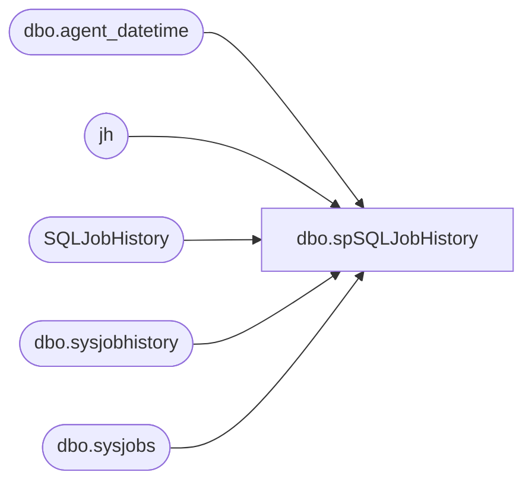

# dbo.spSQLJobHistory

**Database:** dw  
**Server:** papamart  

## Architecture Diagram



## Table Dependencies

| Referenced Table |
|---|
| dbo.agent_datetime |
| jh |
| SQLJobHistory |
| dbo.sysjobhistory |
| dbo.sysjobs |

## Stored Procedure Code

```sql
CREATE proc [dbo].[spSQLJobHistory] 

as

set nocount on

if (select count(*) from SQLJobHistory where datediff(dd, InsertDate, getdate()) <> 0) > 0
	begin

		delete from SQLJobHistory 
		where datediff(dd, InsertDate, getdate()) <> 0
	end


IF (Object_ID('tempdb..#SQLJobHistory') IS NOT NULL) DROP TABLE #SQLJobHistory

;
with 
ServerJobs as
	(
		select 'STL-SSIS-P-01' as servername, name, job_id 
		from [STL-SSIS-P-01].msdb.dbo.sysjobs
		UNION
		select '[STL-SQL-P-04\SQL2008R2]' as servername, name, job_id 
		from [STL-SQL-P-04\SQL2008R2].msdb.dbo.sysjobs 
	),
JOBS as
	(
		select 
			servername,
			name, 
			job_id,
			case 
				when name in 
					(
						'HR_UTA_ETL'
						--'Workbrain HOO Import'
					) then 'Labor' 
				when name in 
					(
						--'ShopperTrak Export Daily',
						'ShopperTrak Traffic DailyImport',
						'ShopperTrak - Reload Partitions and Email Process Summary'
					) then 'Traffic'
				when name in 
					(
						'ProcessCubeMeasures'
					) then 'AW Sales'
				
				end as 'DataSet'
				
		from Serverjobs
	)
select 
	j.servername as server,
	j.name as 'JobName',
	cast(msdb.dbo.agent_datetime(run_date, run_time) as datetime)  as 'RealRunDateTime',
	convert(varchar, msdb.dbo.agent_datetime(run_date, run_time), 100)  as 'RunDateTime',
	((run_duration/10000*3600 + (run_duration/100)%100*60 + run_duration%100 + 31 ) / 60) 
         as 'RunDurationMinutes',
	case h.run_status
		when 0 then 'Failed'
		when 1 then 'Succeeded'
		when 2 then 'Retry'
		when 3 then 'Canceled'
		when NULL then 'No History'
	end as Run_Status,
	j.DataSet
into #SQLJobHistory
From JOBS j
left join [STL-SSIS-P-01].msdb.dbo.sysjobhistory h 
	on j.job_id = h.job_id 
	and h.step_id = 0 --job outcome
	and 
		(
			( --jobs ran yesterday on/after 5pm
				datediff(dd, msdb.dbo.agent_datetime(h.run_date, h.run_time), getdate()-1) = 0
				and datepart(hh, msdb.dbo.agent_datetime(run_date, run_time)) > 16
			) -- or jobs ran today
			or datediff(dd, msdb.dbo.agent_datetime(h.run_date, h.run_time), getdate()) = 0
		)
where j.servername = 'STL-SSIS-P-01'
and j.DataSet in ('AW Sales', 'labor', 'traffic')
UNION
select 
	j.servername as server,
	j.name as 'JobName',
	cast(msdb.dbo.agent_datetime(run_date, run_time) as datetime)  as 'RealRunDateTime',
	convert(varchar, msdb.dbo.agent_datetime(run_date, run_time), 100)  as 'RunDateTime',
	((run_duration/10000*3600 + (run_duration/100)%100*60 + run_duration%100 + 31 ) / 60) 
         as 'RunDurationMinutes',
	case h.run_status
		when 0 then 'Failed'
		when 1 then 'Succeeded'
		when 2 then 'Retry'
		when 3 then 'Canceled'
		when NULL then 'No History'
	end as Run_Status,
	j.DataSet
From JOBS j
left join [STL-SQL-P-04\SQL2008R2].msdb.dbo.sysjobhistory h 
	on j.job_id = h.job_id 
	and h.step_id = 0 --job outcome
	and 
		(
			( --jobs ran yesterday on/after 5pm
				datediff(dd, msdb.dbo.agent_datetime(h.run_date, h.run_time), getdate()-1) = 0
				and datepart(hh, msdb.dbo.agent_datetime(run_date, run_time)) > 16
			) -- or jobs ran today
			or datediff(dd, msdb.dbo.agent_datetime(h.run_date, h.run_time), getdate()) = 0
		)
where j.servername = '[STL-SQL-P-04\SQL2008R2]'
and j.DataSet in ('traffic')

----===================================================================

	;
	with 
	MaxDate as
		(
			select [server], JobName, max(RealRunDateTime) RealRunDateTime
			from #SQLJobHistory
			group by server, JobName
		)
	delete jh
	from #SQLJobHistory jh
	join MaxDate md 
		on jh.[server]=md.[server] 
		and jh.JobName=md.JobName 
		and jh.RealRunDateTime<>md.RealRunDateTime
	;

-----
	;
	merge into SQLJobHistory as target 
	using #SQLJobHistory as source
		on 
			target.[Server]=source.[server]
			and 
			target.JobName=source.JobName
			and 
			target.DataSet=source.DataSet
	when matched 
		and
			isnull(target.Run_Status,'x') <> 'Succeeded'
	then update
		set 
			target.RunDateTime=source.RunDateTime,
			target.RunDurationMinutes=source.RunDurationMinutes,
			target.Run_Status=source.Run_Status,
			target.UpdateDate=getdate()
	when not matched by target
	then insert
		(
			[Server],
			JobName,
			DataSet,
			RunDateTime,
			RunDurationMinutes,
			Run_Status,
			InsertDate
		)
		values
		(
			source.[Server],
			source.JobName,
			source.DataSet,
			source.RunDateTime,
			source.RunDurationMinutes,
			source.Run_Status,
			getdate()
		)
	;
----

;
	with Succeeded as
		(
			select JobName, cast(RunDateTime as datetime) as RunDateTime 
			from SQLJobHistory
			where run_status = 'Succeeded'
		)
	delete t
	from SQLJobHistory t
	join Succeeded s on t.JobName = s.JobName 
	where t.run_status <> 'Succeeded' 
	and cast(t.RunDateTime as datetime) < s.RunDateTime 
;
```

