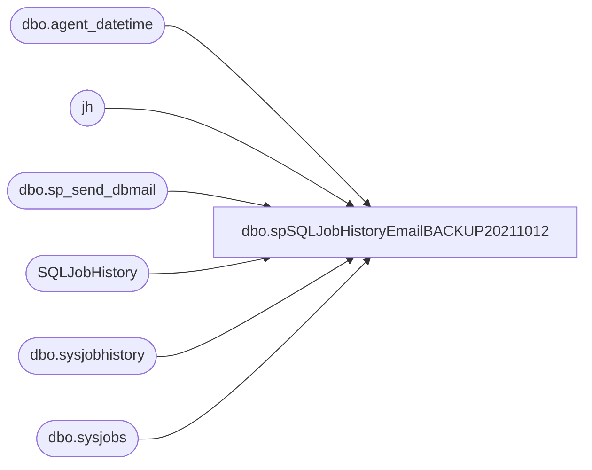

# dbo.spSQLJobHistoryEmailBACKUP20211012

**Database:** dw  
**Server:** papamart  

## Architecture Diagram



## Table Dependencies

| Referenced Table |
|---|
| dbo.agent_datetime |
| jh |
| dbo.sp_send_dbmail |
| SQLJobHistory |
| dbo.sysjobhistory |
| dbo.sysjobs |

## Stored Procedure Code

```sql
CREATE proc [dbo].[spSQLJobHistoryEmailBACKUP20211012]

as


-- =====================================================================================================
-- Name: spSQLJobHistoryEmail
--
-- Description:	Sends emails to report sql agent job status for specific set of high priority jobs
--
-- Syntax:  EXEC [dbo].[spSQLJobHistoryEmail_TB021418]
--
-- Input: N/A
--
-- Output: 
--
-- Dependencies: 
--
-- Revision History
--		Name:			Date:			Comments:
--		Dan Tweedie		07/25/2016		created proc
--		Dan Tweedie		08/12/2016		added DOMO datasets
--		Dan Tweedie		09/10/2016		Added isnull handling for left join on the Domo jobs section (commented below)
--		Dan Tweedie		09/23/2016		Added handling for Saturday afternoon rebuild of these Domo datasets:
--										DW.DiscountFact
--										DW.TransactionFact
--										DW.TransactionDetailFact
--										DW.TransactionFact Store Day Summary
--										DW.TransactionFactProduct
--										The rebuilds are starting at noon and this query will run on Saturday night at 7pm (also daily at 7am to look for the daily updates)
--		Dan Tweedie		10/06/2016		Added new CRM and NameMe datasets
--		Dan Tweedie		10/28/2016		Added text alert for failed status
--		Dan Tweedie		11/2/2016		Removed ExperianFootfall_ExportDaily_DataExtract
--		Tim Bytnar		2/14/2018		Temporarily disabling the DOMO datasets monitoring while the API issue persists
--		Dan Tweedie		2018-09-26		Completely removed references to Domo
--		Dan Tweedie		2019-03-18		Removed old ca/uk labor job, added new UltiPro labor job 
--		Dan TWeedie		2020-02-28		Updated to merge the results so we don't lose 
--										Process will delete previous day's records from SQLJobHistory, and merge records in for today
-- =====================================================================================================


set nocount on


if (select count(*) from SQLJobHistory where datediff(dd, InsertDate, getdate()) <> 0) > 0
	begin

		delete from SQLJobHistory 
		where datediff(dd, InsertDate, getdate()) <> 0
	end


IF (Object_ID('tempdb..#SQLJobHistory') IS NOT NULL) DROP TABLE #SQLJobHistory

;
with 
ServerJobs as
	(
		select '[STL-SQL-P-04\SQL2008R2]' as servername, name, job_id 
		from [STL-SQL-P-04\SQL2008R2].msdb.dbo.sysjobs 
		union 
		select 'KERMODE' as servername, name, job_id 
		from kermode.msdb.dbo.sysjobs
		union 
		select 'PAPAMART' as servername, name, job_id 
		from papamart.msdb.dbo.sysjobs
		union 
		select 'STL-SSIS-P-01' as servername, name, job_id 
		from [STL-SSIS-P-01].msdb.dbo.sysjobs
		union 
		select 'STL-SSIS-P-02' as servername, name, job_id 
		from [STL-SSIS-P-02].msdb.dbo.sysjobs
	),
JOBS as
	(
		select 
			servername,
			name, 
			job_id,
			case 
				when name in 
					(
						'HR_UTA_ETL'
						--'Workbrain HOO Import'
					) then 'Labor' 
				when name in 
					(
						'ShopperTrak Export Daily',
						'ShopperTrak Traffic DailyImport',
						'ShopperTrak - Reload Partitions and Email Process Summary'
					) then 'Traffic'
				when name in
					(
						--'EmailFactsETL',
						--'Process Sales Cube - CRM Info',
						'CustomerTransactionETL',
						'ExactTargetDownloadAndProcess'
					) then 'Guest Load'
				when name in 
					(
						--'AuditWorksImport_Transactions_VAT_Part1of3',
						--'AuditWorksImport_Transactions_VAT_Part2of3',
						--'AuditWorksImport_Transactions_VAT_Part3of3',
						--'AuditWorksImport_Transactions_VAT_Part3Branch',
						--'Process Sales Cube and Run Workbrain Export',
						'Build Sales Cube Partitions',
						'ProcessCubeMeasures',
						'SalesAuditToDW PreStageTrigger',
						'SalesAuditToDW',
						'SalesAuditToDW Delete Trigger'
						--'Party_Facts ETL'
					) then 'AW Sales'
				when name in
					(
						'DWSales_DimensionImport',
						'DM/DW Sync Coupon Dim - CRITICAL',
						'ProcessCubeDimensions'
						--'ExchangeRates',
						--'ExchangeRatesValidate'
					) then 'Dimensions'
				when name in 
					(
						'FranchiseeFilesImport'
					) then 'Franchisee'
				when name in 
					(
						'MerchDataLoad_forPowerBI',
						'MerchPowerBI - Load ProductChainOnHandCost',
						'Web_OrderIntegrationDataMonitor',
						'WEB - InventoryDWLoad',
						'WebOrderInboundDemandExtract_ForPowerBI',
						'WEB_OMSCustomOrderExportETL'
						--'AzureLoadEnterpriseSellingFact'
						--'UKLoyaltyLoad'
					) then 'Power BI Prep'
				when name in 
					(
						'WEB - ProductCatalogExports',
						'WEB - PricebookExports',
						'WEB - StoresExports',
						'WEB - InventoryAndLocationsExports'
					) then 'Web Master Data'
				when name in 
					(
						'AzureProcessing_Dimensions',
						'AzureProcessing_TransactionFacts',
						'AzureProcessing_CRMTransactionFacts',
						'AzureProcessing_TrafficFact',
						'AzureProcessing_MorningLoad',
						'AzureProcessing_WebOrderData'
						--'AzureProcessing_WMS_CycleCount'
					) then 'Azure Processing'
				end as 'DataSet'
				
		from Serverjobs
	)
select 
	j.servername as server,
	j.name as 'JobName',
	cast(msdb.dbo.agent_datetime(run_date, run_time) as datetime)  as 'RealRunDateTime',
	convert(varchar, msdb.dbo.agent_datetime(run_date, run_time), 100)  as 'RunDateTime',
	((run_duration/10000*3600 + (run_duration/100)%100*60 + run_duration%100 + 31 ) / 60) 
         as 'RunDurationMinutes',
	case h.run_status
		when 0 then 'Failed'
		when 1 then 'Succeeded'
		when 2 then 'Retry'
		when 3 then 'Canceled'
		when NULL then 'No History'
	end as Run_Status,
	j.DataSet
into #SQLJobHistory
From JOBS j
left join [STL-SQL-P-04\SQL2008R2].msdb.dbo.sysjobhistory h 
	on j.job_id = h.job_id 
	and h.step_id = 0 --job outcome
	and 
		(
			( --jobs ran yesterday on/after 5pm
				datediff(dd, msdb.dbo.agent_datetime(h.run_date, h.run_time), getdate()-1) = 0
				and datepart(hh, msdb.dbo.agent_datetime(run_date, run_time)) > 16
			) -- or jobs ran today
			or datediff(dd, msdb.dbo.agent_datetime(h.run_date, h.run_time), getdate()) = 0
		)
where j.servername = '[STL-SQL-P-04\SQL2008R2]'
and j.DataSet in 
	(
		'Labor',
		'Traffic',
		'Guest Load',
		'AW Sales',
		'Dimensions',
		'Franchisee',
		'Power BI Prep',
		'Web Master Data'
	)

UNION

select 
	j.servername as server,
	j.name as 'JobName',
	cast(msdb.dbo.agent_datetime(run_date, run_time) as datetime)  as 'RealRunDateTime',
	convert(varchar, msdb.dbo.agent_datetime(run_date, run_time), 100)  as 'RunDateTime',
	((run_duration/10000*3600 + (run_duration/100)%100*60 + run_duration%100 + 31 ) / 60) 
         as 'RunDurationMinutes',
	case h.run_status
		when 0 then 'Failed'
		when 1 then 'Succeeded'
		when 2 then 'Retry'
		when 3 then 'Canceled'
		when NULL then 'No History'
	end as Run_Status,
	j.DataSet
From JOBS j
left join KERMODE.msdb.dbo.sysjobhistory h 
	on j.job_id = h.job_id 
	and h.step_id = 0 --job outcome
	and 
		(
			( --jobs ran yesterday on/after 5pm
				datediff(dd, msdb.dbo.agent_datetime(h.run_date, h.run_time), getdate()-1) = 0
				and datepart(hh, msdb.dbo.agent_datetime(run_date, run_time)) > 16
			) -- or jobs ran today
			or datediff(dd, msdb.dbo.agent_datetime(h.run_date, h.run_time), getdate()) = 0
		)
where j.servername = 'KERMODE'
and j.DataSet in 
	(
		'Labor',
		'Traffic',
		'Guest Load',
		'AW Sales',
		'Dimensions',
		'Franchisee',
		'Power BI Prep',
		'Web Master Data'
	)

UNION

select 
	j.servername as server,
	j.name as 'JobName',
	cast(msdb.dbo.agent_datetime(run_date, run_time) as datetime)  as 'RealRunDateTime',
	convert(varchar, msdb.dbo.agent_datetime(run_date, run_time), 100)  as 'RunDateTime',
	((run_duration/10000*3600 + (run_duration/100)%100*60 + run_duration%100 + 31 ) / 60) 
         as 'RunDurationMinutes',
	case h.run_status
		when 0 then 'Failed'
		when 1 then 'Succeeded'
		when 2 then 'Retry'
		when 3 then 'Canceled'
		when NULL then 'No History'
	end as Run_Status,
	j.DataSet
From JOBS j
left join papamart.msdb.dbo.sysjobhistory h 
	on j.job_id = h.job_id 
	and h.step_id = 0 --job outcome
	and 
		(
			( --jobs ran yesterday on/after 5pm
				datediff(dd, msdb.dbo.agent_datetime(h.run_date, h.run_time), getdate()-1) = 0
				and datepart(hh, msdb.dbo.agent_datetime(run_date, run_time)) > 16
			) -- or jobs ran today
			or datediff(dd, msdb.dbo.agent_datetime(h.run_date, h.run_time), getdate()) = 0
		)
where j.servername = 'PAPAMART'
and j.DataSet in 
	(
		'Labor',
		'Traffic',
		'Guest Load',
		'AW Sales',
		'Dimensions',
		'Franchisee',
		'Power BI Prep',
		'Web Master Data'
	)
UNION

select 
	j.servername as server,
	j.name as 'JobName',
	cast(msdb.dbo.agent_datetime(run_date, run_time) as datetime)  as 'RealRunDateTime',
	convert(varchar, msdb.dbo.agent_datetime(run_date, run_time), 100)  as 'RunDateTime',
	((run_duration/10000*3600 + (run_duration/100)%100*60 + run_duration%100 + 31 ) / 60) 
         as 'RunDurationMinutes',
	case h.run_status
		when 0 then 'Failed'
		when 1 then 'Succeeded'
		when 2 then 'Retry'
		when 3 then 'Canceled'
		when NULL then 'No History'
	end as Run_Status,
	j.DataSet
From JOBS j
left join [STL-SSIS-P-01].msdb.dbo.sysjobhistory h 
	on j.job_id = h.job_id 
	and h.step_id = 0 --job outcome
	and 
		(
			( --jobs ran yesterday on/after 5pm
				datediff(dd, msdb.dbo.agent_datetime(h.run_date, h.run_time), getdate()-1) = 0
				and datepart(hh, msdb.dbo.agent_datetime(run_date, run_time)) > 16
			) -- or jobs ran today
			or datediff(dd, msdb.dbo.agent_datetime(h.run_date, h.run_time), getdate()) = 0
		)
where j.servername = 'STL-SSIS-P-01'
and j.DataSet in 
	(
		'Labor',
		'Traffic',
		'Guest Load',
		'AW Sales',
		'Dimensions',
		'Franchisee',
		'Power BI Prep',
		'Web Master Data'
	)
UNION

select 
	j.servername as server,
	j.name as 'JobName',
	cast(msdb.dbo.agent_datetime(run_date, run_time) as datetime)  as 'RealRunDateTime',
	convert(varchar, msdb.dbo.agent_datetime(run_date, run_time), 100)  as 'RunDateTime',
	((run_duration/10000*3600 + (run_duration/100)%100*60 + run_duration%100 + 31 ) / 60) 
         as 'RunDurationMinutes',
	case h.run_status
		when 0 then 'Failed'
		when 1 then 'Succeeded'
		when 2 then 'Retry'
		when 3 then 'Canceled'
		when NULL then 'No History'
	end as Run_Status,
	j.DataSet
From JOBS j
left join [STL-SSIS-P-02].msdb.dbo.sysjobhistory h 
	on j.job_id = h.job_id 
	and h.step_id = 0 --job outcome
	and 
		(
			( --jobs ran yesterday on/after 5pm
				datediff(dd, msdb.dbo.agent_datetime(h.run_date, h.run_time), getdate()-1) = 0
				and datepart(hh, msdb.dbo.agent_datetime(run_date, run_time)) > 16
			) -- or jobs ran today
			or datediff(dd, msdb.dbo.agent_datetime(h.run_date, h.run_time), getdate()) = 0
		)
where j.servername = 'STL-SSIS-P-02'
and j.DataSet in 
	(
		'Azure Processing'
	)
----===================================================================

	;
	with 
	MaxDate as
		(
			select [server], JobName, max(RealRunDateTime) RealRunDateTime
			from #SQLJobHistory
			group by server, JobName
		)
	delete jh
	from #SQLJobHistory jh
	join MaxDate md 
		on jh.[server]=md.[server] 
		and jh.JobName=md.JobName 
		and jh.RealRunDateTime<>md.RealRunDateTime
	;

-----
	;
	merge into SQLJobHistory as target 
	using #SQLJobHistory as source
		on 
			target.[Server]=source.[server]
			and 
			target.JobName=source.JobName
			and 
			target.DataSet=source.DataSet
	when matched 
		and
			isnull(target.Run_Status,'x') <> 'Succeeded'
			--and 	
			--(
			--	isnull(target.RunDateTime,convert(varchar, getdate(), 100))<>isnull(source.RunDateTime,convert(varchar, getdate(), 100))
			--	OR
			--	isnull(target.Run_Status,'x')<>isnull(source.Run_Status,'x')
			--)
	then update
		set 
			target.RunDateTime=source.RunDateTime,
			target.RunDurationMinutes=source.RunDurationMinutes,
			target.Run_Status=source.Run_Status,
			target.UpdateDate=getdate()
	when not matched by target
	then insert
		(
			[Server],
			JobName,
			DataSet,
			RunDateTime,
			RunDurationMinutes,
			Run_Status,
			InsertDate
		)
		values
		(
			source.[Server],
			source.JobName,
			source.DataSet,
			source.RunDateTime,
			source.RunDurationMinutes,
			source.Run_Status,
			getdate()
		)
	;
----

;
	with Succeeded as
		(
			select JobName, cast(RunDateTime as datetime) as RunDateTime 
			from SQLJobHistory
			where run_status = 'Succeeded'
		)
	delete t
	from SQLJobHistory t
	join Succeeded s on t.JobName = s.JobName 
	where t.run_status <> 'Succeeded' 
	and cast(t.RunDateTime as datetime) < s.RunDateTime 
;
--=====================================================================================================================================
--=====================================================================================================================================

if (select count(*) from SQLJobHistory) > 0
BEGIN
	
			Declare @Recip varchar(100),
					@text nvarchar(max),
					@LaborStat varchar(4),
					@TrafficStat varchar(4),
					@GuestLoadStat varchar(4),
					@SalesStat varchar(4),
					@DimStat varchar(4),
					@FranchStat varchar(4),
					@PBIStat varchar(4),
					@Web varchar(4),
					@Azure varchar(4),
					@SequenceCheck varchar(4),
					@Subj varchar(100)
	
 
			if (
					select count(*) from SQLJobHistory j
						where j.DataSet = 'Labor' 
							and 
							(
								(
									(j.Run_Status <> 'Succeeded' or j.Run_Status is NULL) 
										and
									j.JobName not in (select jj.JobName from SQLJobHistory jj where jj.DataSet = 'Labor' and jj.Run_Status = 'Succeeded' and jj.RunDateTime > j.RunDateTime ) --in case we ran the job again after it failed
								) 

							)
				) > 0 
		
				set @LaborStat = 'Fail' else set @LaborStat = 'Pass'

			if (
					select count(*) from SQLJobHistory j
						where j.DataSet = 'Traffic' 
							and (
								(
									(j.Run_Status <> 'Succeeded' or j.Run_Status is NULL) 
										and
									j.JobName not in (select jj.JobName from SQLJobHistory jj where jj.DataSet = 'Traffic' and jj.Run_Status = 'Succeeded' and jj.RunDateTime > j.RunDateTime )--in case we ran the job again after it failed
								)
								)
				) > 0

				set @TrafficStat = 'Fail' else set @TrafficStat = 'Pass'

			if (
					select count(*) from SQLJobHistory j
						where j.DataSet = 'Guest Load' 
							and (
								(
									(j.Run_Status <> 'Succeeded' or j.Run_Status is NULL) 
										and
									j.JobName not in (select jj.JobName from SQLJobHistory jj where jj.DataSet = 'Guest Load' and jj.Run_Status = 'Succeeded' and jj.RunDateTime > j.RunDateTime )--in case we ran the job again after it failed
								)
								)
				) > 0
				set @GuestLoadStat = 'Fail' else set @GuestLoadStat = 'Pass'

			if (
					select count(*) from SQLJobHistory j
						where j.DataSet = 'AW Sales' 
							and 
								(
								(
									(j.Run_Status <> 'Succeeded' or j.Run_Status is NULL) 
										and
									j.JobName not in (select jj.JobName from SQLJobHistory jj where jj.DataSet = 'AW Sales' and jj.Run_Status = 'Succeeded' and jj.RunDateTime > j.RunDateTime )--in case we ran the job again after it failed
								)
								)
				) > 0
				set @SalesStat = 'Fail' else set @SalesStat = 'Pass'

			if (
					select count(*) from SQLJobHistory j
						where j.DataSet = 'Dimensions' 
							and 
								(
								(
									(j.Run_Status <> 'Succeeded' or j.Run_Status is NULL) 
										and
									j.JobName not in (select jj.JobName from SQLJobHistory jj where jj.DataSet = 'Dimensions' and jj.Run_Status = 'Succeeded' and jj.RunDateTime > j.RunDateTime )--in case we ran the job again after it failed
								)
								)
				) > 0
				set @DimStat = 'Fail' else set @DimStat = 'Pass'

				if (
					select count(*) from SQLJobHistory j
						where j.DataSet = 'Franchisee' 
							and 
								(
								(
									(j.Run_Status <> 'Succeeded' or j.Run_Status is NULL) 
										and
									j.JobName not in (select jj.JobName from SQLJobHistory jj where jj.DataSet = 'Franchisee' and jj.Run_Status = 'Succeeded' and jj.RunDateTime > j.RunDateTime )--in case we ran the job again after it failed
								) 
								)
				) > 0
				set @FranchStat = 'Fail' else set @FranchStat = 'Pass'

				if (
					select count(*) from SQLJobHistory j
						where j.DataSet = 'Power BI Prep' 
							and 
							(
								(
									(j.Run_Status <> 'Succeeded' or j.Run_Status is NULL) 
										and
									j.JobName not in (select jj.JobName from SQLJobHistory jj where jj.DataSet = 'Power BI Prep' and jj.Run_Status = 'Succeeded' and jj.RunDateTime > j.RunDateTime ) --in case we ran the job again after it failed
								) 

							)
				) > 0 
		
				set @PBIStat = 'Fail' else set @PBIStat = 'Pass'
		
				if (
					select count(*) from SQLJobHistory j
						where j.DataSet = 'Web Master Data' 
							and 
							(
								(
									(j.Run_Status <> 'Succeeded' or j.Run_Status is NULL) 
										and
									j.JobName not in (select jj.JobName from SQLJobHistory jj where jj.DataSet = 'Power BI Prep' and jj.Run_Status = 'Succeeded' and jj.RunDateTime > j.RunDateTime ) --in case we ran the job again after it failed
								) 

							)
				) > 0 
		
				set @Web = 'Fail' else set @Web = 'Pass'

				if (
					select count(*) from SQLJobHistory j
						where j.DataSet = 'Azure Processing' 
							and 
							(
								(
									(j.Run_Status <> 'Succeeded' or j.Run_Status is NULL) 
										and
									j.JobName not in (select jj.JobName from SQLJobHistory jj where jj.DataSet = 'Azure Processing' and jj.Run_Status = 'Succeeded' and jj.RunDateTime > j.RunDateTime ) --in case we ran the job again after it failed
								) 

							)
				) > 0 
		
				set @Azure = 'Fail' else set @Azure = 'Pass'


			set @text = '<H1><font face =arial> BI Team Morning Critical Job Status </font> </H1>' +
				'<font face =arial size = 2> These jobs are critical to our reporting environment and must run successfully each morning before 7am.' +
				'<br> The query captures the run history from 5pm the previous day, until today at query run time. 
				<br> 
				</font><br><br>' +
				'<br>' + 
				'<font face =arial size = 2> <b> SUMMARY </b> </font>' +
				'<br>' +
				'<table border="1">' +
				'<font face =arial size = 2>' + 
				'<tr><th>DATASET</th><th>PASS / FAIL</th></tr>' +
				CAST ( ( SELECT distinct
								td = jh.Dataset,'',
								td = case jh.DataSet 
									when 'Labor' then @LaborStat
									when 'Traffic' then @TrafficStat
									when 'Guest Load' then @GuestLoadStat
									when 'AW Sales' then @SalesStat
									when 'Dimensions' then @DimStat
									when 'Franchisee' then @FranchStat
									when 'Power BI Prep' then @PBIStat
									when 'Web Master Data' then @Web
									when 'Azure Processing' then @Azure
								end, ''
							from SQLJobHistory jh
							--left join #PassFail pf on jh.DataSet = pf.DataSet and jh.JobName = pf.JobName
							group by jh.DataSet--, pf.condition
							order by jh.Dataset
						  FOR XML PATH('tr'), TYPE 
				) AS NVARCHAR(MAX) ) +
				'</font></table>
				<br>'
				+
				'<font face =arial size = 2> <b> LABOR </b> </font>' +
				'<br>' +
				'<table border="1">' +
				'<font face =arial size = 2>' + 
				'<tr><th>SERVER</th><th>JOB NAME</th><th>DATETIME</th><th>DURATION</th><th>STATUS</th></tr>' +
				CAST ( ( SELECT td = server,'',
								td = jobName, '',
								td = isnull(RunDateTime, 0), '',
								td = isnull(RunDurationMinutes, ''), '',
								td = Run_Status, ''
						  from SQLJobHistory
						  where DataSet = 'Labor'
						  order by RunDateTime
						  FOR XML PATH('tr'), TYPE 
				) AS NVARCHAR(MAX) ) +
				'</font></table>
				<br>' +
				'<font face =arial size = 2> <b> TRAFFIC </b> </font>' +
				'<br>' +
				'<table border="1">' +
				'<font face =arial size = 2>' + 
				'<tr><th>SERVER</th><th>JOB NAME</th><th>DATETIME</th><th>DURATION</th><th>STATUS</th></tr>' +
				CAST ( ( SELECT td = server,'',
								td = jobName, '',
								td = isnull(RunDateTime, 0), '',
								td = isnull(RunDurationMinutes, ''), '',
								td = Run_Status, ''
						  from SQLJobHistory
						  where DataSet = 'Traffic'
						  order by RunDateTime
						  FOR XML PATH('tr'), TYPE 
				) AS NVARCHAR(MAX) ) +
				'</font></table>
				<br>' 
				+
				'<font face =arial size = 2> <b> SALES </b> </font>' +
				'<br>' +
				'<table border="1">' +
				'<font face =arial size = 2>' + 
				'<tr><th>SERVER</th><th>JOB NAME</th><th>DATETIME</th><th>DURATION</th><th>STATUS</th></tr>' +
				CAST ( ( SELECT td = server,'',
								td = jobName, '',
								td = isnull(RunDateTime, 0), '',
								td = isnull(RunDurationMinutes, ''), '',
								td = Run_Status, ''
						  from SQLJobHistory
						  where DataSet = 'AW Sales'
						  order by RunDateTime
						  FOR XML PATH('tr'), TYPE 
				) AS NVARCHAR(MAX) ) +
				'</font></table>
				<br>' +
				'<font face =arial size = 2> <b> Guest Load </b> </font>' +
				'<br>' +
				'<table border="1">' +
				'<font face =arial size = 2>' + 
				'<tr><th>SERVER</th><th>JOB NAME</th><th>DATETIME</th><th>DURATION</th><th>STATUS</th></tr>' +
				CAST ( ( SELECT td = server,'',
								td = jobName, '',
								td = isnull(RunDateTime, 0), '',
								td = isnull(RunDurationMinutes, ''), '',
								td = Run_Status, ''
						  from SQLJobHistory
						  where DataSet = 'Guest Load'
						  order by RunDateTime
						  FOR XML PATH('tr'), TYPE 
				) AS NVARCHAR(MAX) ) +
				'</font></table>
				<br>' +
				'<font face =arial size = 2> <b> DIMENSIONS </b> </font>' +
				'<br>' +
				'<table border="1">' +
				'<font face =arial size = 2>' + 
				'<tr><th>SERVER</th><th>JOB NAME</th><th>DATETIME</th><th>DURATION</th><th>STATUS</th></tr>' +
				CAST ( ( SELECT td = server,'',
								td = jobName, '',
								td = isnull(RunDateTime, 0), '',
								td = isnull(RunDurationMinutes, ''), '',
								td = Run_Status, ''
						  from SQLJobHistory
						  where DataSet = 'Dimensions'
						  order by RunDateTime
						  FOR XML PATH('tr'), TYPE 
				) AS NVARCHAR(MAX) ) +
				'</font></table>
				<br>' +
				'<font face =arial size = 2> <b> FRANCHISEE </b> </font>' +
				'<br>' +
				'<table border="1">' +
				'<font face =arial size = 2>' + 
				'<tr><th>SERVER</th><th>JOB NAME</th><th>DATETIME</th><th>DURATION</th><th>STATUS</th></tr>' +
				CAST ( ( SELECT td = server,'',
								td = jobName, '',
								td = isnull(RunDateTime, 0), '',
								td = isnull(RunDurationMinutes, ''), '',
								td = Run_Status, ''
						  from SQLJobHistory
						  where DataSet = 'Franchisee'
						  order by RunDateTime
						  FOR XML PATH('tr'), TYPE 
				) AS NVARCHAR(MAX) ) +
				'</font></table><br>' +
				'<font face =arial size = 2> <b> Power BI Prep </b> </font>' +
				'<br>' +
				'<table border="1">' +
				'<font face =arial size = 2>' + 
				'<tr><th>SERVER</th><th>JOB NAME</th><th>DATETIME</th><th>DURATION</th><th>STATUS</th></tr>' +
				CAST ( ( SELECT td = server,'',
								td = jobName, '',
								td = isnull(RunDateTime, 0), '',
								td = isnull(RunDurationMinutes, ''), '',
								td = Run_Status, ''
						  from SQLJobHistory
						  where DataSet = 'Power BI Prep'
						  order by RunDateTime
						  FOR XML PATH('tr'), TYPE 
				) AS NVARCHAR(MAX) ) +
				'</font></table>
				<br>' +
				'</font></table>
				<br>' +
				'<font face =arial size = 2> <b> Web Master Data </b> </font>' +
				'<br>' +
				'<table border="1">' +
				'<font face =arial size = 2>' + 
				'<tr><th>SERVER</th><th>JOB NAME</th><th>DATETIME</th><th>DURATION</th><th>STATUS</th></tr>' +
				CAST ( ( SELECT td = server,'',
								td = jobName, '',
								td = isnull(RunDateTime, 0), '',
								td = isnull(RunDurationMinutes, ''), '',
								td = Run_Status, ''
						  from SQLJobHistory
						  where DataSet = 'Web Master Data'
						  order by RunDateTime
						  FOR XML PATH('tr'), TYPE 
				) AS NVARCHAR(MAX) ) +
				'</font></table>
				<br>' +
				'</font></table>
				<br>' +
				'<font face =arial size = 2> <b> Azure Processing </b> </font>' +
				'<br>' +
				'<table border="1">' +
				'<font face =arial size = 2>' + 
				'<tr><th>SERVER</th><th>JOB NAME</th><th>DATETIME</th><th>DURATION</th><th>STATUS</th></tr>' +
				CAST ( ( SELECT td = server,'',
								td = jobName, '',
								td = isnull(RunDateTime, 0), '',
								td = isnull(RunDurationMinutes, ''), '',
								td = Run_Status, ''
						  from SQLJobHistory
						  where DataSet = 'Azure Processing'
						  order by RunDateTime
						  FOR XML PATH('tr'), TYPE 
				) AS NVARCHAR(MAX) ) +
				'</font></table>
				<br>' +
				'<br>
				<font face =arial size = 2>This report was generated by papamart.DW.dbo.spSQLJobHistoryEmail, which was executed from Kermode SQL Agent: CRITICAL JOB WATCH - - BI TEAM SANITY CHECK.</font>
				<br>
				<br>'

			if 
					@LaborStat = 'Fail'
					or
					@TrafficStat = 'Fail' 
					or
					@GuestLoadStat = 'Fail' 
					or
					@SalesStat = 'Fail' 
					or
					@DimStat = 'Fail' 
					or
					@FranchStat = 'Fail'
					or
					@SequenceCheck = 'Fail'
					or
					@PBIStat='Fail'
					or
					@Web='Fail'
					or
					@Azure='Fail'
		
				select 
					@subj = 'BI Team Morning Critical Job Status: Fail'
					--@Recip = 'BIAdminTextAlert@buildabear.com'
			else

				select 
					@subj = 'BI Team Morning Critical Job Status: Pass'
					--@Recip = 'biadmin@buildabear.com'
		
	
			exec msdb.dbo.sp_send_dbmail
				@profile_name = 'biadmin',
				--@recipients = @Recip, --'biadmin@buildabear.com',
				@recipients = 'ianw@buildabear.com',
				@body = @text,
				@subject = @subj,
				@body_format = 'HTML'


		
END
```

