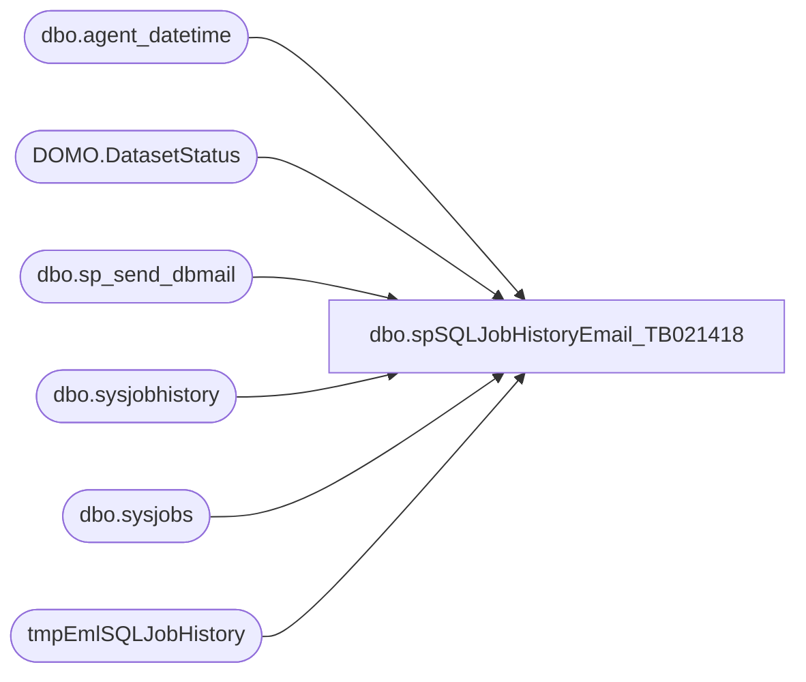

# dbo.spSQLJobHistoryEmail_TB021418

**Database:** dw  
**Server:** papamart  

## Architecture Diagram



## Table Dependencies

| Referenced Table |
|---|
| dbo.agent_datetime |
| DOMO.DatasetStatus |
| dbo.sp_send_dbmail |
| dbo.sysjobhistory |
| dbo.sysjobs |
| tmpEmlSQLJobHistory |

## Stored Procedure Code

```sql
CREATE proc [dbo].[spSQLJobHistoryEmail_TB021418]

as

-- =====================================================================================================
-- Name: spSQLJobHistoryEmail
--
-- Description:	Sends emails to report sql agent job status for specific set of high priority jobs
--
-- Syntax:  EXEC [dbo].[spSQLJobHistoryEmail_TB021418]
--
-- Input: N/A
--
-- Output: 
--
-- Dependencies: 
--
-- Revision History
--		Name:			Date:			Comments:
--		Dan Tweedie		07/25/2016		created proc
--		Dan Tweedie		08/12/2016		added DOMO datasets
--		Dan Tweedie		09/10/2016		Added isnull handling for left join on the Domo jobs section (commented below)
--		Dan Tweedie		09/23/2016		Added handling for Saturday afternoon rebuild of these Domo datasets:
--										DW.DiscountFact
--										DW.TransactionFact
--										DW.TransactionDetailFact
--										DW.TransactionFact Store Day Summary
--										DW.TransactionFactProduct
--										The rebuilds are starting at noon and this query will run on Saturday night at 7pm (also daily at 7am to look for the daily updates)
--		Dan Tweedie		10/06/2016		Added new CRM and NameMe datasets
--		Dan Tweedie		10/28/2016		Added text alert for failed status
--		Dan Tweedie		11/2/2016		Removed ExperianFootfall_ExportDaily_DataExtract
--		Tim Bytnar		2/14/2018		Temporarily disabling the DOMO datasets monitoring while the API issue persists
-- =====================================================================================================

set nocount on

Declare @Recip varchar(100)


IF (Object_ID('DW..tmpEmlSQLJobHistory') IS NOT NULL) DROP TABLE tmpEmlSQLJobHistory

;
with 
DomoMasterList as
	(
		select 'DW.LaborFact' as DomoDataSet
		UNION
		select 'DW.TrafficFact' as DomoDataSet
		UNION
		select 'QA.TrafficProcessSummary' as DomoDataSet
		UNION
		select 'DW.TransactionFact' as DomoDataSet
		UNION
		select 'DW.TransactionFact Store Day Summary' as DomoDataSet
		UNION
		select 'DW.TransactionDetailFact' as DomoDataSet
		UNION
		select 'DW.DiscountFact' as DomoDataSet 
		UNION
		select 'DW.TransactionFactProduct' as DomoDataSet
		UNION
		select 'DW.EnterpriseSellingFact' as DomoDataSet
		UNION
		select 'DW.StoreDateDim' as DomoDataSet
		UNION
		select 'DW.StoreDateDimFuture' as DomoDataSet
		UNION
		select 'DW.SalesPlanFact' as DomoDataSet
		UNION
		select 'DW.SalesPlanFactFranchisee' as DomoDataSet
		UNION
		select 'DW.TransactionFactFranchisee' as DomoDataSet
		UNION
		select 'DW.TransactionDetailFactFranchisee' as DomoDataSet
		UNION
		select 'DW.TransactionFact Store Day Summary Franchisee' as DomoDataSet
		UNION
		select 'TransactionFactSummary with StoreDateDim SalesPlan Traffic Labor' as DomoDataSet
		UNION
		select 'DW.CRMCustomerDim' as DomoDataSet
		UNION
		select 'DW.CRMTransactionFact' as DomoDataSet
		UNION
		select 'DW.CRMTransactionFactStoreDaySummary' as DomoDataSet
		UNION
		select 'DW.NameMeTransactionFact' as DomoDataSet
	),
ServerJobs as
	(
		select 'BABWSCORE01' as servername, name, job_id 
		from babwscore01.msdb.dbo.sysjobs 
		union 
		select 'KERMODE' as servername, name, job_id 
		from kermode.msdb.dbo.sysjobs
		union 
		select 'PAPAMART' as servername, name, job_id 
		from papamart.msdb.dbo.sysjobs
		--union
		--select distinct 'DOMO' as servername, d.DomoDataSet as name, ds.ID as job_id
		--from DomoMasterList d
		--left join Papamart.DW.DOMO.DatasetStatus ds on d.DomoDataSet = ds.name
	),
DomoDataSets as
	(
		select 
			d.DomoDataSet as Name,
			convert(varchar, dateadd(hh, -5, max(ds.UpdatedAt)), 100) as UpdatedAt, --Workbench log is GMT 5 hours ahead during DST
			--convert(varchar, dateadd(hh, -6, max(ds.UpdatedAt)), 100) as UpdatedAt, --Workbench log is GMT 6 hours ahead during standard time
			ds.Rows
		from DomoMasterList d
		left join Papamart.DW.DOMO.DatasetStatus ds on d.DomoDataSet = ds.name
			--and datediff(dd, ds.UpdatedAt, getdate()) <= 1
			--and datediff(dd, dateadd(hh, -5, ds.UpdatedAt), getdate()) <= 1
			  --and datediff(dd, dateadd(hh, -5, max(ds.UpdatedAt)), getdate()) <= 1 --Workbench log is GMT 5 hours ahead,
		group by d.DomoDataSet, ds.rows
	),
JOBS as
	(
		select 
			servername,
			name, 
			job_id,
			case 
				when name in 
					(
						'CA/UK Labor Import',
						'DW.LaborFact',
						'Execute DOMO Workbench Job - LaborFact' --DOMO Job On Papamart
					) then 'Labor' 
				when name in 
					(
						--'ExperianFootfall_ExportDaily_DataExtract',
						'ExperianFootfall_ImportDaily',
						'ShopperTrak Export Daily',
						'ShopperTrak Traffic DailyImport',
						'Execute DOMO Workbench Job - TrafficFact',
						'Execute DOMO Workbench Job - TrafficProcessSummary',
						'DW.TrafficFact',
						'QA.TrafficProcessSummary',
						'Execute DOMO Workbench Job - TrafficFact', --DOMO Job On Papamart
						'Execute DOMO Workbench Job - TrafficProcessSummary' --DOMO Job On Papamart
					) then 'Traffic'
				when name in
					(
						'Guest Load ETL',
						'Guest Load ETL - Run Guest Load Only',
						'Guest Load CRM POS ETL',
						'Process Sales Cube - CRM Info',
						'CustomerTransactionETL',
						'DW.CRMCustomerDim',
						'DW.CRMTransactionFact',
						'DW.CRMTransactionFactStoreDaySummary',
						'DW.NameMeTransactionFact',
						'Execute DOMO Workbench Job - DW.CRMCustomerDim - Replace', --DOMO Job On Papamart
						'Execute DOMO Workbench Job - DW.CRMTransactionFact - Replace' --DOMO Job On Papamart
					) then 'Guest Load'
				when name in 
					(
						'AuditWorksImport_Transactions_VAT_Part1of3',
						'AuditWorksImport_Transactions_VAT_Part2of3',
						'AuditWorksImport_Transactions_VAT_Part3of3',
						'AuditWorksImport_Transactions_VAT_Part3Branch',
						'Process Sales Cube and Run Workbrain Export',
						'DW.TransactionFact',
						'DW.TransactionFact Store Day Summary', 
						'DW.TransactionDetailFact', 
						'DW.DiscountFact', 
						'DW.TransactionFactProduct',
						'DW.EnterpriseSellingFact',
						'TransactionFactSummary with StoreDateDim SalesPlan Traffic Labor',
						'Execute DOMO Workbench Job - EnterpriseSellingFact', --DOMO Job On Papamart
						'Execute DOMO Workbench Job - EnterpriseSellingOrderTransitions', --DOMO Job On Papamart
						'Execute DOMO Workbench Job - DW.WebOrderedToShipped', --DOMO Job On Papamart
						'Execute DOMO Workbench Job - DW.WebOrdersUnshipped', --DOMO Job On Papamart
						'Execute DOMO Workbench Job - TransactionDetailFact Append', --DOMO Job On Papamart
						'Execute DOMO Workbench Job - TransactionFact Append', --DOMO Job On Papamart
						'Execute DOMO Workbench Job - TransactionFact Store Day Summary Append', --DOMO Job On Papamart
						'Execute DOMO Workbench Job - TransactionFactProduct Append' --DOMO Job On Papamart
					) then 'AW Sales'
				when name in
					(
						'DWSales_DimensionImport',
						'Upsert ExchangeRates From Lawson',
						'DM/DW Sync Coupon Dim - CRITICAL',
						'Execute DOMO Workbench Jobs - StoreDateDim - StoreDateDimFuture',
						'Execute DOMO Workbench Job - SalesPlanFact',
						'DW.StoreDateDim',
						'DW.StoreDateDimFuture',
						'DW.SalesPlanFact',
						'DW.SalesPlanFactFranchisee',
						'Execute DOMO Workbench Jobs - StoreDateDim', --DOMO Job On Papamart
						'Execute DOMO Workbench Jobs - StoreDateDimFuture', --DOMO Job On Papamart
						'Execute DOMO Workbench Job - DW.CRMCustomerDim - Replace' --DOMO Job On Papamart
					) then 'Dimensions'
				when name in 
					(
						'FranchiseeFilesImport',
						'Execute DOMO Workbench Jobs - Franchisee Data Sets',
						'DW.TransactionFactFranchisee',
						'DW.TransactionDetailFactFranchisee',
						'DW.TransactionFact Store Day Summary Franchisee',
						'Execute DOMO Workbench Jobs - Franchisee Data Sets' --DOMO Job On Papamart
					) then 'Franchisee'
				
				end as 'DataSet'
				
		from Serverjobs
	)
select 
	j.servername as server,
	j.name as 'JobName',
	convert(varchar, msdb.dbo.agent_datetime(run_date, run_time), 100)  as 'RunDateTime',
	((run_duration/10000*3600 + (run_duration/100)%100*60 + run_duration%100 + 31 ) / 60) 
         as 'RunDurationMinutes',
	case h.run_status
		when 0 then 'Failed'
		when 1 then 'Succeeded'
		when 2 then 'Retry'
		when 3 then 'Canceled'
		when NULL then 'No History'
	end as Run_Status,
	j.DataSet
into tmpEmlSQLJobHistory
From JOBS j
left join babwscore01.msdb.dbo.sysjobhistory h 
	on j.job_id = h.job_id 
	and h.step_id = 0 --job outcome
	and 
		(
			( --jobs ran yesterday on/after 5pm
				datediff(dd, msdb.dbo.agent_datetime(h.run_date, h.run_time), getdate()-1) = 0
				and datepart(hh, msdb.dbo.agent_datetime(run_date, run_time)) > 16
			) -- or jobs ran today
			or datediff(dd, msdb.dbo.agent_datetime(h.run_date, h.run_time), getdate()) = 0
		)
where j.servername = 'BABWSCORE01'
and j.DataSet in 
	(
		'Labor',
		'Traffic',
		'Guest Load',
		'AW Sales',
		'Dimensions',
		'Franchisee'
	)

UNION

select 
	j.servername as server,
	j.name as 'JobName',
	convert(varchar, msdb.dbo.agent_datetime(run_date, run_time), 100)  as 'RunDateTime',
	((run_duration/10000*3600 + (run_duration/100)%100*60 + run_duration%100 + 31 ) / 60) 
         as 'RunDurationMinutes',
	case h.run_status
		when 0 then 'Failed'
		when 1 then 'Succeeded'
		when 2 then 'Retry'
		when 3 then 'Canceled'
		when NULL then 'No History'
	end as Run_Status,
	j.DataSet
From JOBS j
left join KERMODE.msdb.dbo.sysjobhistory h 
	on j.job_id = h.job_id 
	and h.step_id = 0 --job outcome
	and 
		(
			( --jobs ran yesterday on/after 5pm
				datediff(dd, msdb.dbo.agent_datetime(h.run_date, h.run_time), getdate()-1) = 0
				and datepart(hh, msdb.dbo.agent_datetime(run_date, run_time)) > 16
			) -- or jobs ran today
			or datediff(dd, msdb.dbo.agent_datetime(h.run_date, h.run_time), getdate()) = 0
		)
where j.servername = 'KERMODE'
and j.DataSet in 
	(
		'Labor',
		'Traffic',
		'Guest Load',
		'AW Sales',
		'Dimensions',
		'Franchisee'
	)

UNION

select 
	j.servername as server,
	j.name as 'JobName',
	convert(varchar, msdb.dbo.agent_datetime(run_date, run_time), 100)  as 'RunDateTime',
	((run_duration/10000*3600 + (run_duration/100)%100*60 + run_duration%100 + 31 ) / 60) 
         as 'RunDurationMinutes',
	case h.run_status
		when 0 then 'Failed'
		when 1 then 'Succeeded'
		when 2 then 'Retry'
		when 3 then 'Canceled'
		when NULL then 'No History'
	end as Run_Status,
	j.DataSet
From JOBS j
left join papamart.msdb.dbo.sysjobhistory h 
	on j.job_id = h.job_id 
	and h.step_id = 0 --job outcome
	and 
		(
			( --jobs ran yesterday on/after 5pm
				datediff(dd, msdb.dbo.agent_datetime(h.run_date, h.run_time), getdate()-1) = 0
				and datepart(hh, msdb.dbo.agent_datetime(run_date, run_time)) > 16
			) -- or jobs ran today
			or datediff(dd, msdb.dbo.agent_datetime(h.run_date, h.run_time), getdate()) = 0
		)
where j.servername = 'PAPAMART'
and j.DataSet in 
	(
		'Labor',
		'Traffic',
		'Guest Load',
		'AW Sales',
		'Dimensions',
		'Franchisee'
	)

UNION

select
	j.servername as server,
	j.name as 'JobName',
	convert(varchar, d.UpdatedAt, 100) as 'RunDateTime',
	0 as 'RunDurationMinutes',
	case when isnull(d.name,'x') in --added isnull 9/10/2016 - DanT
				(select DomoDataSet from DomoMasterList)
				 and isnull(d.Rows,0) > 0 --added isnull 9/10/2016 - DanT
				then 'Succeeded'
				else 'Failed'
			end as Run_Status,
	j.DataSet
from JOBS j
left join DomoDataSets d on j.Name = d.Name
and 
		(
			( --jobs ran yesterday on/after 5pm
				datediff(dd, d.UpdatedAt, getdate()-1) = 0
				and datepart(hh, d.UpdatedAt) > 16
			) -- or jobs ran today
			or datediff(dd, d.UpdatedAt, getdate()) = 0
		)
where j.servername = 'DOMO'

order by RunDateTime, JobName


delete from tmpEmlSQLJobHistory where DataSet is null

--=====================================================================================================================================
--=====================================================================================================================================

if (select count(*) from tmpEmlSQLJobHistory) > 0
BEGIN
	if 
		(select datename(weekday, getdate())) in ( 'Saturday', 'Sunday')
		and 
		(select datepart(hh, getdate())) >= 19
		

		begin
			declare @textSat nvarchar(max)

			declare @DomoStat varchar(4),
					@SubjSat varchar(100)

			IF (Object_ID('tempdb..#PassFailSat') IS NOT NULL) DROP TABLE #PassFailSat
					;with Success as 
						(
							select JobName as DataSet, RunDateTime 
							from  tmpEmlSQLJobHistory
							where datepart(hh, RunDatetime) >= 12
							and JobName in 
						(
							'DW.DiscountFact',
							'DW.TransactionFact',
							'DW.TransactionDetailFact',
							'DW.TransactionFact Store Day Summary',
							'DW.TransactionFactProduct',
							'DW.CRMCustomerDim',
							'DW.CRMTransactionFact',
							'DW.NameMeTransactionFact'
						) 
						)
					select distinct 
						j.JobName as DataSet,
						case when s.DataSet is NULL
							then 'Fail'
							else 'Pass'
						end as PassFail,
						isnull(s.RunDateTime, 0) as UpdateTime,
						case when s.DataSet is NULL
							then j.JobName + ' did not rebuild in DOMO.' 
							else 'N/A' 
						end as Condition
					into #PassFailSat
					from tmpEmlSQLJobHistory j
					left join Success s on j.JobName = s.DataSet 
					where j.JobName in 
						(
							'DW.DiscountFact',
							'DW.TransactionFact',
							'DW.TransactionDetailFact',
							'DW.TransactionFact Store Day Summary',
							'DW.TransactionFactProduct',
							'DW.CRMCustomerDim',
							'DW.CRMTransactionFact',
							'DW.NameMeTransactionFact'
						) 
						
			select @textSat = '<H1><font face =arial> BI Team Weekend DOMO Rebuilds Status </font> </H1>' +
				'<font face =arial size = 2> These DOMO datasets are scheduled to rebuild on Saturday afternoon. If this did not occur, it can wait until Sunday afternoon, but must be completed before the weekend is over.' +
				'<br> 
				</font><br><br>' +
				'<br>' +
				'<font face =arial size = 2> <b> DOMO DATA SETS </b> </font>' +
				'<br>' +
				'<table border="1">' +
				'<font face =arial size = 2>' + 
				'<tr><th>Data Set</th><th>PASS / FAIL</th><th>Data Set Update Time</th><th>FAIL CONDITION</th></tr>' +
				CAST ( ( SELECT td = DataSet,'',
								td = PassFail, '',
								td = UpdateTime, '',
								td = condition, ''
						  from #PassFailSat
						  order by DataSet 
						  FOR XML PATH('tr'), TYPE 
				) AS NVARCHAR(MAX) ) +
				'</font></table>
				<br>
				<br>
				<font face =arial size = 2>This report was generated by papamart.DW.dbo.spSQLJobHistoryEmail, which was executed from Kermode SQL Agent: CRITICAL JOB WATCH - - BI TEAM SANITY CHECK.</font>
				<br>
				<br>'

			select @SubjSat = case when (select count(*) from #PassFailSat where PassFail = 'Fail') > 0
										then 
											'BI Team Weekend Domo Rebuilds Status: Fail'
										else 
											'BI Team Weekend Domo Rebuilds Status: Pass'
							  end,
					@Recip = case when (select count(*) from #PassFailSat where PassFail = 'Fail') > 0
										then 
											'timb@buildabear.com'
										else 
											'timb@buildabear.com'
							  end

			exec	msdb.dbo.sp_send_dbmail
					@profile_name = 'biadmin',
					@recipients = @Recip, --'biadmin@buildabear.com',
					@body = @textSat,
					@subject = @SubjSat,
					@body_format = 'HTML'

		end
	ELSE
		begin
		
			declare @text nvarchar(max)

			declare @LaborStat varchar(4),
					@TrafficStat varchar(4),
					@GuestLoadStat varchar(4),
					@SalesStat varchar(4),
					@DimStat varchar(4),
					@FranchStat varchar(4),
					@TrafficRun datetime,
					@SequenceCheck varchar(4),
					@Subj varchar(100)
	
				select @TrafficRun = RunDateTime
				from tmpEmlSQLJobHistory
				where JobName = 'DW.TrafficFact'
				and Run_Status = 'Succeeded'

				IF (Object_ID('tempdb..#PassFail') IS NOT NULL) DROP TABLE #PassFail
					select 
						DataSet,
						JobName,
						case when RunDateTime > @TrafficRun
								or RunDateTime is NULL
							then 'Fail'
							else 'Pass'
						end as PassFail,
						case when RunDateTime > @TrafficRun
								or RunDateTime is NULL
							then JobName + ' did not update before DW.TrafficFact in DOMO.' 
							else 'N/A' 
						end as Condition
					into #PassFail
					from tmpEmlSQLJobHistory
					where JobName in 
						(
							'DW.TransactionFact Store Day Summary',
							'DW.TransactionFact Store Day Summary Franchisee',
							'DW.SalesPlanFact',
							'DW.SalesPlanFactFranchisee',
							'DW.StoreDateDim',
							'DW.LaborFact'
						)

				select @SequenceCheck = 
						case when (select count(*) from #PassFail where PassFail = 'Fail') > 0
							then 'Fail'
								else 'Pass'
						end 

 
			if (
					select count(*) from tmpEmlSQLJobHistory j
						where j.DataSet = 'Labor' 
							and 
							(
								(
									(j.Run_Status <> 'Succeeded' or j.Run_Status is NULL) 
										and
									j.JobName not in (select jj.JobName from tmpEmlSQLJobHistory jj where jj.DataSet = 'Labor' and jj.Run_Status = 'Succeeded' and jj.RunDateTime > j.RunDateTime ) --in case we ran the job again after it failed
								) 

							OR j.JobName in (select JobName from #PassFail where PassFail = 'Fail')
							)
				) > 0 
		
				set @LaborStat = 'Fail' else set @LaborStat = 'Pass'

			if (
					select count(*) from tmpEmlSQLJobHistory j
						where j.DataSet = 'Traffic' 
							and (
								(
									(j.Run_Status <> 'Succeeded' or j.Run_Status is NULL) 
										and
									j.JobName not in (select jj.JobName from tmpEmlSQLJobHistory jj where jj.DataSet = 'Traffic' and jj.Run_Status = 'Succeeded' and jj.RunDateTime > j.RunDateTime )--in case we ran the job again after it failed
								)
								OR j.JobName in (select JobName from #PassFail where PassFail = 'Fail')
								)
				) > 0

				set @TrafficStat = 'Fail' else set @TrafficStat = 'Pass'

			if (
					select count(*) from tmpEmlSQLJobHistory j
						where j.DataSet = 'Guest Load' 
							and (
								(
									(j.Run_Status <> 'Succeeded' or j.Run_Status is NULL) 
										and
									j.JobName not in (select jj.JobName from tmpEmlSQLJobHistory jj where jj.DataSet = 'Guest Load' and jj.Run_Status = 'Succeeded' and jj.RunDateTime > j.RunDateTime )--in case we ran the job again after it failed
								)
								OR j.JobName in (select JobName from #PassFail where PassFail = 'Fail')
								)
				) > 0
				set @GuestLoadStat = 'Fail' else set @GuestLoadStat = 'Pass'

			if (
					select count(*) from tmpEmlSQLJobHistory j
						where j.DataSet = 'AW Sales' 
							and 
								(
								(
									(j.Run_Status <> 'Succeeded' or j.Run_Status is NULL) 
										and
									j.JobName not in (select jj.JobName from tmpEmlSQLJobHistory jj where jj.DataSet = 'AW Sales' and jj.Run_Status = 'Succeeded' and jj.RunDateTime > j.RunDateTime )--in case we ran the job again after it failed
								)
								OR j.JobName in (select JobName from #PassFail where PassFail = 'Fail')
								)
				) > 0
				set @SalesStat = 'Fail' else set @SalesStat = 'Pass'

			if (
					select count(*) from tmpEmlSQLJobHistory j
						where j.DataSet = 'Dimensions' 
							and 
								(
								(
									(j.Run_Status <> 'Succeeded' or j.Run_Status is NULL) 
										and
									j.JobName not in (select jj.JobName from tmpEmlSQLJobHistory jj where jj.DataSet = 'Dimensions' and jj.Run_Status = 'Succeeded' and jj.RunDateTime > j.RunDateTime )--in case we ran the job again after it failed
								)
								OR j.JobName in (select JobName from #PassFail where PassFail = 'Fail')
								)
				) > 0
				set @DimStat = 'Fail' else set @DimStat = 'Pass'

				if (
					select count(*) from tmpEmlSQLJobHistory j
						where j.DataSet = 'Franchisee' 
							and 
								(
								(
									(j.Run_Status <> 'Succeeded' or j.Run_Status is NULL) 
										and
									j.JobName not in (select jj.JobName from tmpEmlSQLJobHistory jj where jj.DataSet = 'Franchisee' and jj.Run_Status = 'Succeeded' and jj.RunDateTime > j.RunDateTime )--in case we ran the job again after it failed
								) 
								OR j.JobName in (select JobName from #PassFail where PassFail = 'Fail')
								)
				) > 0
				set @FranchStat = 'Fail' else set @FranchStat = 'Pass'
		

			set @text = '<H1><font face =arial> BI Team Morning Critical Job Status </font> </H1>' +
				'<font face =arial size = 2> These jobs are critical to our reporting environment and must run successfully each morning before 7am.' +
				'<br> The query captures the run history from 5pm the previous day, until today at query run time. 
				<br> It is also important that the DOMO jobs are completed in the proper sequence. Specifically, we must ensure that DW.TrafficFact completes after these DOMO jobs: 
				DW.TransactionFact Store Day Summary, DW.TransactionFact Store Day Summary Franchisee, DW.SalesPlanFact, DW.SalesPlanFactFranchisee, DW.StoreDateDim.
				</font><br><br>' +
				'<br>' + 
				'<font face =arial size = 2> <b> SUMMARY </b> </font>' +
				'<br>' +
				'<table border="1">' +
				'<font face =arial size = 2>' + 
				'<tr><th>DATASET</th><th>PASS / FAIL</th><th>FAIL CONDITION</th></tr>' +
				CAST ( ( SELECT distinct
								td = jh.Dataset,'',
								td = case jh.DataSet 
									when 'Labor' then @LaborStat
									when 'Traffic' then @TrafficStat
									when 'Guest Load' then @GuestLoadStat
									when 'AW Sales' then @SalesStat
									when 'Dimensions' then @DimStat
									when 'Franchisee' then @FranchStat
								end, '',
								td = isnull(pf.condition, 'N/A'), ''
							from tmpEmlSQLJobHistory jh
							left join #PassFail pf on jh.DataSet = pf.DataSet and jh.JobName = pf.JobName
							group by jh.DataSet, pf.condition
							order by jh.Dataset
						  FOR XML PATH('tr'), TYPE 
				) AS NVARCHAR(MAX) ) +
				'</font></table>
				<br>'
				+
				'<font face =arial size = 2> <b> LABOR </b> </font>' +
				'<br>' +
				'<table border="1">' +
				'<font face =arial size = 2>' + 
				'<tr><th>SERVER</th><th>JOB NAME</th><th>DATETIME</th><th>DURATION</th><th>STATUS</th></tr>' +
				CAST ( ( SELECT td = server,'',
								td = jobName, '',
								td = isnull(RunDateTime, 0), '',
								td = isnull(RunDurationMinutes, ''), '',
								td = Run_Status, ''
						  from tmpEmlSQLJobHistory
						  where DataSet = 'Labor'
						  order by RunDateTime
						  FOR XML PATH('tr'), TYPE 
				) AS NVARCHAR(MAX) ) +
				'</font></table>
				<br>' 
				+
				'<font face =arial size = 2> <b> TRAFFIC </b> </font>' +
				'<br>' +
				'<table border="1">' +
				'<font face =arial size = 2>' + 
				'<tr><th>SERVER</th><th>JOB NAME</th><th>DATETIME</th><th>DURATION</th><th>STATUS</th></tr>' +
				CAST ( ( SELECT td = server,'',
								td = jobName, '',
								td = isnull(RunDateTime, 0), '',
								td = isnull(RunDurationMinutes, ''), '',
								td = Run_Status, ''
						  from tmpEmlSQLJobHistory
						  where DataSet = 'Traffic'
						  order by RunDateTime
						  FOR XML PATH('tr'), TYPE 
				) AS NVARCHAR(MAX) ) +
				'</font></table>
				<br>' 
				+
				'<font face =arial size = 2> <b> SALES </b> </font>' +
				'<br>' +
				'<table border="1">' +
				'<font face =arial size = 2>' + 
				'<tr><th>SERVER</th><th>JOB NAME</th><th>DATETIME</th><th>DURATION</th><th>STATUS</th></tr>' +
				CAST ( ( SELECT td = server,'',
								td = jobName, '',
								td = isnull(RunDateTime, 0), '',
								td = isnull(RunDurationMinutes, ''), '',
								td = Run_Status, ''
						  from tmpEmlSQLJobHistory
						  where DataSet = 'AW Sales'
						  order by RunDateTime
						  FOR XML PATH('tr'), TYPE 
				) AS NVARCHAR(MAX) ) +
				'</font></table>
				<br>' +
				'<font face =arial size = 2> <b> Guest Load </b> </font>' +
				'<br>' +
				'<table border="1">' +
				'<font face =arial size = 2>' + 
				'<tr><th>SERVER</th><th>JOB NAME</th><th>DATETIME</th><th>DURATION</th><th>STATUS</th></tr>' +
				CAST ( ( SELECT td = server,'',
								td = jobName, '',
								td = isnull(RunDateTime, 0), '',
								td = isnull(RunDurationMinutes, ''), '',
								td = Run_Status, ''
						  from tmpEmlSQLJobHistory
						  where DataSet = 'Guest Load'
						  order by RunDateTime
						  FOR XML PATH('tr'), TYPE 
				) AS NVARCHAR(MAX) ) +
				'</font></table>
				<br>' +
				'<font face =arial size = 2> <b> DIMENSIONS </b> </font>' +
				'<br>' +
				'<table border="1">' +
				'<font face =arial size = 2>' + 
				'<tr><th>SERVER</th><th>JOB NAME</th><th>DATETIME</th><th>DURATION</th><th>STATUS</th></tr>' +
				CAST ( ( SELECT td = server,'',
								td = jobName, '',
								td = isnull(RunDateTime, 0), '',
								td = isnull(RunDurationMinutes, ''), '',
								td = Run_Status, ''
						  from tmpEmlSQLJobHistory
						  where DataSet = 'Dimensions'
						  order by RunDateTime
						  FOR XML PATH('tr'), TYPE 
				) AS NVARCHAR(MAX) ) +
				'</font></table>
				<br>' +
				'<font face =arial size = 2> <b> FRANCHISEE </b> </font>' +
				'<br>' +
				'<table border="1">' +
				'<font face =arial size = 2>' + 
				'<tr><th>SERVER</th><th>JOB NAME</th><th>DATETIME</th><th>DURATION</th><th>STATUS</th></tr>' +
				CAST ( ( SELECT td = server,'',
								td = jobName, '',
								td = isnull(RunDateTime, 0), '',
								td = isnull(RunDurationMinutes, ''), '',
								td = Run_Status, ''
						  from tmpEmlSQLJobHistory
						  where DataSet = 'Franchisee'
						  order by RunDateTime
						  FOR XML PATH('tr'), TYPE 
				) AS NVARCHAR(MAX) ) +
				'</font></table>
				<br>
				<font face =arial size = 2>This report was generated by papamart.DW.dbo.spSQLJobHistoryEmail, which was executed from Kermode SQL Agent: CRITICAL JOB WATCH - - BI TEAM SANITY CHECK.</font>
				<br>
				<br>'

			if 
					@LaborStat = 'Fail'
					or
					@TrafficStat = 'Fail' 
					or
					@GuestLoadStat = 'Fail' 
					or
					@SalesStat = 'Fail' 
					or
					@DimStat = 'Fail' 
					or
					@FranchStat = 'Fail'
					or
					@SequenceCheck = 'Fail'
		
				select 
					@subj = 'BI Team Morning Critical Job Status: Fail',
					@Recip = 'timb@buildabear.com'
			else

				select 
					@subj = 'BI Team Morning Critical Job Status: Pass',
					@Recip = 'timb@buildabear.com'
		

			exec msdb.dbo.sp_send_dbmail
				@profile_name = 'biadmin',
				@recipients = @Recip, --'biadmin@buildabear.com',
				@body = @text,
				@subject = @subj,
				@body_format = 'HTML'


		end
END
```

