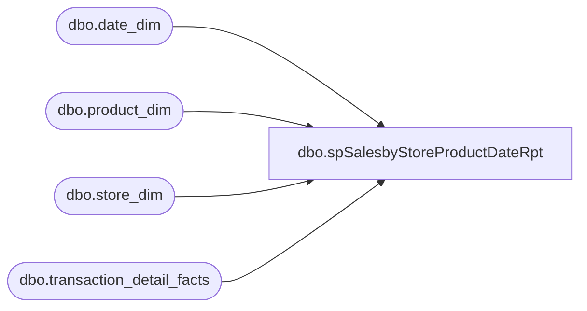

# dbo.spSalesbyStoreProductDateRpt

**Database:** dw  
**Server:** papamart  

## Architecture Diagram



## Table Dependencies

| Referenced Table |
|---|
| dbo.date_dim |
| dbo.product_dim |
| dbo.store_dim |
| dbo.transaction_detail_facts |

## Stored Procedure Code

```sql
CREATE PROC spSalesbyStoreProductDateRpt
-- =============================================================================================================
-- Name: spSalesbyStoreProductDateRpt
--
-- Description:	report the delivers sales and transactions data by store, sku, date
--
-- Input:		@ac_path			filepath for output
--				@ad_date			date to start obtaining records
--
-- Output: returns records in textfile and uploads to FTP site through bcp command
--
-- Dependencies: 
--
-- Revision History
--		Name:			Date:			Comments:
--		Keith Missey	11/6/2008		Created
-- =============================================================================================================
    --@productstyle VARCHAR(25)=''
    @curstartdate DATETIME = NULL,
    @curenddate DATETIME = NULL
AS 
    SET NOCOUNT ON
    
    DECLARE @priorstartdate DATETIME,
        @priorenddate DATETIME,
        @curstartweek DATETIME,
        @priorstartweek DATETIME,
        @priorendweek DATETIME,
        @timeperiod INT,
		@todaydayofweek INT,
		@daystogetlastsunday INT
	
    IF @curstartdate IS NULL 
        SET @curstartdate = DATEADD(DAY, -1, CONVERT(VARCHAR, GETDATE(), 101))
    IF @curenddate IS NULL 
        SET @curenddate = @curstartdate
		
    SET @timeperiod = DATEDIFF(day, @curstartdate, @curenddate) + 1
    SET @priorstartdate = DATEADD(day, 0 - @timeperiod, @curstartdate)
    SET @priorenddate = DATEADD(day, 0 - @timeperiod, @curenddate)
	
    SET @todayDayOfWeek = DATEPART(WeekDay, @curenddate)
    SET @daysToGetLastSunday = 1 - @todayDayOfWeek
    SET @curstartweek = DATEADD(Day, @daysToGetLastSunday, @curenddate)

    SET @priorstartweek = DATEADD(Day, -7, @curstartweek)
    SET @priorendweek = DATEADD(DAY, -1, @curstartweek)
	
--    SELECT  @curstartdate,
--            @curenddate,
--            @timeperiod,
--            @priorstartdate,
--            @priorenddate,
--            @curstartweek,
--            @priorstartweek,
--            @priorendweek

    CREATE TABLE [#tmpcurperiod]
        (
          style_code VARCHAR(20),
          style_desc VARCHAR(20),
          store_id INT,
          legal_description VARCHAR(50),
          sales DECIMAL(8, 2),
          units INT
        )	

    CREATE TABLE [#tmppriorperiod]
        (
          style_code VARCHAR(20),
          style_desc VARCHAR(20),
          store_id INT,
          legal_description VARCHAR(50),
          sales DECIMAL(8, 2),
          units INT
        )

    CREATE TABLE [#tmpcurwtd]
        (
          style_code VARCHAR(20),
          style_desc VARCHAR(20),
          store_id INT,
          legal_description VARCHAR(50),
          sales DECIMAL(8, 2),
          units INT
        )

    CREATE TABLE [#tmppriorwtd]
        (
          style_code VARCHAR(20),
          style_desc VARCHAR(20),
          store_id INT,
          legal_description VARCHAR(50),
          sales DECIMAL(8, 2),
          units INT
        )

    CREATE TABLE [#tmplife]
        (
          style_code VARCHAR(20),
          style_desc VARCHAR(20),
          store_id INT,
          legal_description VARCHAR(50),
          sales DECIMAL(8, 2),
          units INT
        )
	
    INSERT  [#tmpcurperiod]
            (
              [style_code],
              [style_desc],
              [store_id],
              [legal_description],
              [sales],
              [units]
	      )
            SELECT  pd.style_code,
                    pd.style_desc,
                    sd.store_id,
                    sd.legal_description, --actual_date, 
                    SUM(tdf.unit_gross_amount - tdf.unit_disc_amount) AS sales,
                    SUM(tdf.UNITS) AS transactions
            FROM    dbo.transaction_detail_facts tdf WITH ( NOLOCK )
                    INNER JOIN dbo.product_dim pd WITH ( NOLOCK ) ON pd.product_key = tdf.product_key
                    INNER JOIN dbo.store_dim sd WITH ( NOLOCK ) ON sd.store_key = tdf.store_key
                    INNER JOIN dbo.date_dim dd WITH ( NOLOCK ) ON dd.date_key = tdf.date_key
            WHERE   dd.actual_date BETWEEN @curstartdate AND @curenddate
                    AND RIGHT(pd.department_code, 2) = '53'
            GROUP BY sd.store_id,
                    sd.legal_description,
                    pd.style_code,
                    pd.style_desc
	
    INSERT  [#tmppriorperiod]
            (
              [style_code],
              [style_desc],
              [store_id],
              [legal_description],
              [sales],
              [units]
	      )
            SELECT  pd.style_code,
                    pd.style_desc,
                    sd.store_id,
                    sd.legal_description, --actual_date, 
                    SUM(tdf.unit_gross_amount - tdf.unit_disc_amount) AS sales,
                    SUM(tdf.UNITS) AS transactions
            FROM    dbo.transaction_detail_facts tdf WITH ( NOLOCK )
                    INNER JOIN dbo.product_dim pd WITH ( NOLOCK ) ON pd.product_key = tdf.product_key
                    INNER JOIN dbo.store_dim sd WITH ( NOLOCK ) ON sd.store_key = tdf.store_key
                    INNER JOIN dbo.date_dim dd WITH ( NOLOCK ) ON dd.date_key = tdf.date_key
            WHERE   dd.actual_date BETWEEN @priorstartdate
                                  AND     @priorenddate
                    AND RIGHT(pd.department_code, 2) = '53'
            GROUP BY sd.store_id,
                    sd.legal_description,
                    pd.style_code,
                    pd.style_desc
	
    INSERT  [#tmpcurwtd]
            (
              [style_code],
              [style_desc],
              [store_id],
              [legal_description],
              [sales],
              [units]
	      )
            SELECT  pd.style_code,
                    pd.style_desc,
                    sd.store_id,
                    sd.legal_description, --actual_date, 
                    SUM(tdf.unit_gross_amount - tdf.unit_disc_amount) AS sales,
                    SUM(tdf.UNITS) AS transactions
            FROM    dbo.transaction_detail_facts tdf WITH ( NOLOCK )
                    INNER JOIN dbo.product_dim pd WITH ( NOLOCK ) ON pd.product_key = tdf.product_key
                    INNER JOIN dbo.store_dim sd WITH ( NOLOCK ) ON sd.store_key = tdf.store_key
                    INNER JOIN dbo.date_dim dd WITH ( NOLOCK ) ON dd.date_key = tdf.date_key
            WHERE   dd.actual_date BETWEEN @curstartweek AND @curenddate
                    AND RIGHT(pd.department_code, 2) = '53'
            GROUP BY sd.store_id,
                    sd.legal_description,
                    pd.style_code,
                    pd.style_desc
	
    INSERT  [#tmppriorwtd]
            (
              [style_code],
              [style_desc],
              [store_id],
              [legal_description],
              [sales],
              [units]
	      )
            SELECT  pd.style_code,
                    pd.style_desc,
                    sd.store_id,
                    sd.legal_description, --actual_date, 
                    SUM(tdf.unit_gross_amount - tdf.unit_disc_amount) AS sales,
                    SUM(tdf.UNITS) AS transactions
            FROM    dbo.transaction_detail_facts tdf WITH ( NOLOCK )
                    INNER JOIN dbo.product_dim pd WITH ( NOLOCK ) ON pd.product_key = tdf.product_key
                    INNER JOIN dbo.store_dim sd WITH ( NOLOCK ) ON sd.store_key = tdf.store_key
                    INNER JOIN dbo.date_dim dd WITH ( NOLOCK ) ON dd.date_key = tdf.date_key
            WHERE   dd.actual_date BETWEEN @priorstartweek
                                AND     @priorendweek
                    AND RIGHT(pd.department_code, 2) = '53'
            GROUP BY sd.store_id,
                    sd.legal_description,
                    pd.style_code,
                    pd.style_desc


	
    INSERT  [#tmplife]
            (
              [style_code],
              [style_desc],
              [store_id],
              [legal_description],
              [sales],
              [units]
	      )
            SELECT  pd.style_code,
                    pd.style_desc,
                    sd.store_id,
                    sd.legal_description, --actual_date, 
                    SUM(tdf.unit_gross_amount - tdf.unit_disc_amount) AS sales,
                    SUM(tdf.UNITS) AS transactions
            FROM    dbo.transaction_detail_facts tdf WITH ( NOLOCK )
                    INNER JOIN dbo.product_dim pd WITH ( NOLOCK ) ON pd.product_key = tdf.product_key
                    INNER JOIN dbo.store_dim sd WITH ( NOLOCK ) ON sd.store_key = tdf.store_key
                    INNER JOIN dbo.date_dim dd WITH ( NOLOCK ) ON dd.date_key = tdf.date_key
            WHERE   RIGHT(pd.department_code, 2) = '53'
                    AND dd.actual_date >= '10/19/2008'
            GROUP BY sd.store_id,
                    sd.legal_description,
                    pd.style_code,
                    pd.style_desc
	
	
	
	
    SELECT  a.style_code,
            a.style_desc,
            a.store_id,
            a.legal_description,
            ISNULL(a.sales, 0) AS lifesales,
            ISNULL(a.units, 0) AS lifetransactions,
            ISNULL(b.sales, 0) AS cursales,
            ISNULL(b.units, 0) AS curtransactions,
            ISNULL(c.sales, 0) AS priorsales,
            ISNULL(c.units, 0) AS priortransactions,
            ISNULL(d.sales, 0) AS wtdcursales,
            ISNULL(d.units, 0) AS wtdcurtransactions,
            ISNULL(e.sales, 0) AS wtdpriorsales,
            ISNULL(e.units, 0) AS wtdpriortransactions
    FROM    tempdb.dbo.#tmplife a
            LEFT JOIN tempdb.dbo.#tmpcurperiod b ON a.store_id = b.store_id
                                                    AND a.style_code = b.style_code
            LEFT JOIN tempdb.dbo.#tmppriorperiod c ON a.store_id = c.store_id
                                                      AND a.style_code = c.style_code
            LEFT JOIN tempdb.dbo.[#tmpcurwtd] d ON a.store_id = d.store_id
                                                   AND a.style_code = d.style_code
            LEFT JOIN tempdb.dbo.[#tmppriorwtd] e ON a.store_id = e.store_id
                                                     AND a.style_code = e.style_code
    ORDER BY a.style_code,
            a.store_id
```

