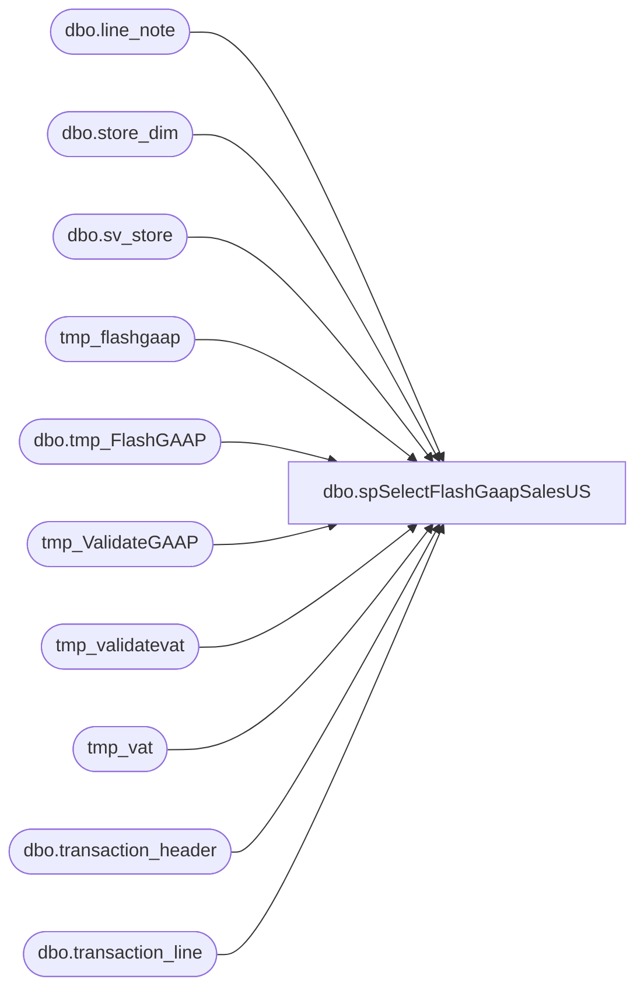

# dbo.spSelectFlashGaapSalesUS

**Database:** dw  
**Server:** papamart  

## Architecture Diagram



## Table Dependencies

| Referenced Table |
|---|
| dbo.line_note |
| dbo.store_dim |
| dbo.sv_store |
| tmp_flashgaap |
| dbo.tmp_FlashGAAP |
| tmp_ValidateGAAP |
| tmp_validatevat |
| tmp_vat |
| dbo.transaction_header |
| dbo.transaction_line |

## Stored Procedure Code

```sql
CREATE proc [dbo].[spSelectFlashGaapSalesUS]
@TransDate date

as 

--========================================================
--	Code taken from usp_FlashGAAPSales, this procs selects the data, the other proc breaks it out and emails
-- Created by Dan Tweedie -- 10/31/2015
--=========================================================

set nocount on

declare @transaction_date DATETIME
select @transaction_date = cast(@TransDate as datetime)

    DECLARE @salesdate DATETIME
    DECLARE @str_salesdate CHAR(8)
    DECLARE @total DECIMAL(12, 4)
    DECLARE @USquery VARCHAR(8000)
	DECLARE @UKquery VARCHAR(8000)
  
SET @transaction_date = CAST(CONVERT(CHAR(10), GETDATE() - 1, 101) AS DATETIME)

SET @salesdate = @transaction_date
SET @str_salesdate = ( SELECT   CONVERT(CHAR(8), @salesdate, 1)
                         )

    IF EXISTS ( SELECT  *
                FROM    sysobjects
                WHERE   id = OBJECT_ID('dbo.tmp_FlashGAAP')
                        AND sysstat & 0xf = 3 ) 
        DROP TABLE dbo.tmp_FlashGAAP
    IF EXISTS ( SELECT  *
                FROM    sysobjects
                WHERE   id = OBJECT_ID('dbo.tmp_VAT')
                        AND sysstat & 0xf = 3 ) 
        DROP TABLE dbo.tmp_VAT
    IF EXISTS ( SELECT  *
                FROM    sysobjects
                WHERE   id = OBJECT_ID('dbo.tmp_ValidateGAAP')
                        AND sysstat & 0xf = 3 ) 
        DROP TABLE dbo.tmp_ValidateGAAP
    IF EXISTS ( SELECT  *
                FROM    sysobjects
                WHERE   id = OBJECT_ID('dbo.tmp_ValidateVat')
                        AND sysstat & 0xf = 3 ) 
        DROP TABLE dbo.tmp_ValidateVat

    SELECT  h.store_no AS 'StoreNo',
            c.store_name AS 'Store Name',
            ( SUM(( (l.gross_line_amount - l.pos_discount_amount) )
                  * l.db_cr_none * l.voiding_reversal_flag) ) * -1 AS 'GAAPSales'
    INTO    dbo.tmp_FlashGAAP
    FROM    bedrockdb01.auditworks.dbo.transaction_header h
            JOIN bedrockdb01.auditworks.dbo.transaction_line l ON h.transaction_id = l.transaction_id
            JOIN bedrockdb01.auditworks.dbo.sv_store c ON h.store_no = c.store_no
    WHERE   ( h.transaction_date = @salesdate
              AND h.transaction_void_flag = 0
              AND h.transaction_category IN ( 1, 2 )
            )
            AND l.line_object IN ( 100, 102,103, 104, 200, 202, 203, 204, 206, 210, 250, 290,
                                   291, 293, 295, 296, 623, 640, 690, 691, 1630, 1631 )

            AND l.line_void_flag = 0 
    GROUP BY h.store_no,
            c.store_name
    ORDER BY h.store_no,
            c.store_name

    SELECT  h.store_no AS 'StoreNo',
            h.transaction_id,
            ( SUM(( (l.gross_line_amount - l.pos_discount_amount) )
                  * l.db_cr_none * l.voiding_reversal_flag) ) * -1 AS 'GAAPSales'
    INTO    dbo.tmp_ValidateGAAP
    FROM    bedrockdb01.auditworks.dbo.transaction_header h
            JOIN bedrockdb01.auditworks.dbo.transaction_line l ON h.transaction_id = l.transaction_id
            JOIN bedrockdb01.auditworks.dbo.sv_store c ON h.store_no = c.store_no
    WHERE   ( h.transaction_date = @salesdate
              AND h.transaction_void_flag = 0
              AND h.transaction_category IN ( 1, 2 )
            )
            AND l.line_object IN ( 100, 102,103, 104, 200, 202, 203, 204, 206, 210, 250, 290,
                                   291, 293, 295, 296, 623, 640, 690, 691, 1630, 1631 )

            AND l.line_void_flag = 0
    GROUP BY h.store_no,
            c.store_name,
            h.transaction_id

--CALCULATE TOTAL VAT FOR STORES' SALES
    SELECT  h.store_no AS 'StoreNo',
            SUM(( l.gross_line_amount * CASE [line_action]
                                          WHEN 13 THEN -1
                                          WHEN 21 THEN 1
                                        END )) AS 'VAT'
    INTO    dbo.tmp_VAT
    FROM    bedrockdb01.auditworks.dbo.transaction_header h
            JOIN bedrockdb01.auditworks.dbo.transaction_line l ON h.transaction_id = l.transaction_id
    WHERE   ( h.transaction_date = @salesdate
              AND h.transaction_void_flag = 0
              AND h.transaction_category IN ( 1, 2 )
            )
            AND l.line_object IN ( 1150 )
            AND l.line_void_flag = 0
    GROUP BY h.store_no
    ORDER BY h.store_no

    SELECT  h.store_no AS 'StoreNo',
            l.transaction_id,
            SUM(( CAST([line_note] AS NUMERIC(9, 2)) * CASE [line_action]
                                                         WHEN 1 THEN -1
                                                         WHEN 2 THEN 1
                                                         WHEN 11 THEN -1
                                                         WHEN 12 THEN 1
                                                       END )) AS VAT
    INTO    dbo.tmp_ValidateVat
    FROM    bedrockdb01.auditworks.dbo.transaction_header h
            INNER JOIN bedrockdb01.auditworks.dbo.transaction_line l ON h.transaction_id = l.transaction_id
            INNER JOIN bedrockdb01.auditworks.dbo.line_note ln ON l.transaction_id = ln.transaction_id
                                                                AND l.line_id = ln.line_id
    WHERE   ( h.transaction_date = @salesdate
              AND h.transaction_void_flag = 0
              AND h.transaction_category IN ( 1, 2 )
            )
            AND (l.line_object IN ( 100, 102,103, 104, 200, 202, 203, 204, 206, 210, 250, 290,
                                   291, 293, 295, 296, 623, 640, 690, 691, 1630, 1631 ))

            AND l.line_void_flag = 0
            AND ln.[note_type] = 35
			AND ISNUMERIC([line_note]) = 1
    GROUP BY h.[store_no],
            l.transaction_id
    ORDER BY h.[store_no],
            l.transaction_id

--UPDATE GAAP SALES BY STRIPPING OUT VAT
    UPDATE  tmp_flashgaap
    SET     gaapsales = gaapsales + vat
    FROM    tmp_flashgaap f
            INNER JOIN tmp_vat v ON v.storeno = f.storeno
	
    UPDATE  tmp_ValidateGAAP
    SET     gaapsales = gaapsales + vat
    FROM    tmp_ValidateGAAP f
            INNER JOIN tmp_validatevat v ON v.storeno = f.storeno
                                            AND v.transaction_id = f.transaction_id

--N.America--
 IF (Object_ID('tempdb..##tmp_FlashGAAP') IS NOT NULL) DROP TABLE ##tmp_FlashGAAP
SET ANSI_WARNINGS OFF 
SET NOCOUNT ON

select case when sd.store_id = 473 then '0013' else RIGHT(('0000' + CAST(sd.store_id AS VARCHAR)), 4) end as Store_Num
, cast(@str_salesdate as date) as 'Begin'
, cast(@str_salesdate as date) as 'End'
, CAST(SUM(COALESCE(f.GAAPSales,0)) as numeric(10,2)) as 'GAAPSales'
from dw.dbo.store_dim sd
	left join dw.dbo.tmp_FlashGAAP f on sd.store_id = f.storeno
where sd.store_id between 1 and 1499
group by sd.store_id
```

