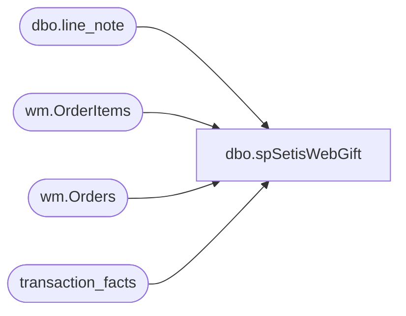

# dbo.spSetisWebGift

**Database:** dw  
**Server:** papamart  

## Architecture Diagram



## Table Dependencies

| Referenced Table |
|---|
| dbo.line_note |
| wm.OrderItems |
| wm.Orders |
| transaction_facts |

## Stored Procedure Code

```sql
create proc spSetisWebGift 

as 

set nocount on 

select o.OrderNumber
into #isGift
from [bearcluster01.sql.buildabear.com].WebOrderProcessing.wm.Orders o with (nolock)
join [bearcluster01.sql.buildabear.com].WebOrderProcessing.wm.OrderItems oi with (nolock) on o.OrderId=oi.OrderID 
where 
	(
		o.GiftSender is not NULL
		or 
		(o.GiftMessage is not NULL and o.GiftMessage not like 'We''re excited to party with you! %') --is not party message
		or
		concat(o.BilltoFName,o.BilltoLname)<>concat(o.ShipToFName,o.ShipToLName)
		or
		oi.sku in ('027433','427433','027432','427432','028293','428293','028429','428429') --giftbox skus
	)
and datepart(yyyy, OrderDate) in (2023,2024)
group by o.OrderNumber


select 
	ln.transaction_id
into #G
from bedrockdb01.auditworks.dbo.line_note ln with (nolock)
join #isGift ig on substring(ln.line_note,12,8) collate SQL_Latin1_General_CP1_CI_AS = ig.OrderNumber
group by 
	ln.transaction_id
--union
--select 
--	ln.av_transaction_id
--from bedrockdb01.auditworks.dbo.av_line_note ln with (nolock)
--join #isGift ig on substring(ln.line_note,12,8) collate SQL_Latin1_General_CP1_CI_AS = ig.OrderNumber
--group by 
--	ln.av_transaction_id


update tf
set tf.isWebGift=1
from transaction_facts tf
join #G g on tf.transaction_id=g.transaction_id
where isnull(tf.isWebGift,0)=0
```

