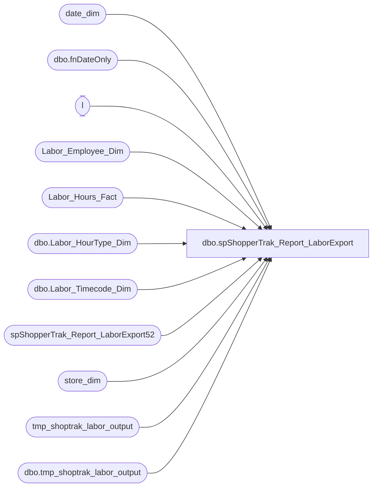

# dbo.spShopperTrak_Report_LaborExport

**Database:** dw  
**Server:** papamart  

## Architecture Diagram



## Table Dependencies

| Referenced Table |
|---|
| date_dim |
| dbo.fnDateOnly |
| l |
| Labor_Employee_Dim |
| Labor_Hours_Fact |
| dbo.Labor_HourType_Dim |
| dbo.Labor_Timecode_Dim |
| spShopperTrak_Report_LaborExport52 |
| store_dim |
| tmp_shoptrak_labor_output |
| dbo.tmp_shoptrak_labor_output |

## Stored Procedure Code

```sql
CREATE PROC [dbo].[spShopperTrak_Report_LaborExport]
-- =============================================================================================================
-- Name: spShopperTrak_Report_LaborExport
--
-- Description:      daily load process for ShopperTrak
--
-- Input:            @ac_path                   filepath for output
--                         @ad_dateStart        date to start obtaining records
--                         @ad_dateEnd                last date of data range
--
-- Output: returns records in textfile and uploads to FTP site through bcp command
--
-- Dependencies: 
--
-- Revision History
--            Name:                Date:                Comments:
--            Keith Missey  5/5/2008             Created
--            Gary Derikito 6/18/2008            Modified for labor.
--            Gary Derikito 9/30/2008            Set to return single day.  Remove quotes from output and include data date in filename.
--            Gary Derikito 10/02/2008           Modified to return range of dates
--            Gary Derikito 11/04/2008           Modified with query from Workbrain Team
--            Gary Derikito 02/13/2009           Send file to Databears for upload.
--            Gary Derikito 03/13/2009           Add WrkHol to filter to capture holiday hours.       
--            Gary Derikito 03/16/2009           Add WrkHol to filter to capture holiday hours.       
--            Gary Derikito 11/18/2009           Modify to deposit file to papamart.      
--            Gary Derikito 11/20/2009           Remove reference to delete old files sproc.
--            Gary Derikito 11/24/2009           Change table reference from queries to dw.dbo.tmp_shoptrak_labor_output
--            Keith Missey  08/02/2011           updated store list
--            Keith Missey  12/11/2011           updated store list
--            Keith Missey  12/19/2011           removed store filter
--            Keith Missey  03/16/2012           changed labor query to pull from data warehouse tables, not Workbrain
--            Gary Murrish  8/13/2013            changed to filter records from 2AM to 2AM and adjust records which would 
--                                                                   have been split at 2:00 AM
--            Gary Murrish  8/20/2013            changed to filter excluded any records outside of the 'day' being exported
--                                                                   There were some 'stray' records which were exported.
--			  Brian Byas 10/28/2015				 changed to filter records from 12am to 12am and adjust records which 
--																	would have been split at 12am for all stores except store
--																	52 which will adhere to adjusting records from 2AM to 2AM.
-- ============================================================================================================================
       @ac_path varchar(100),
       @ad_dateStart datetime,
       @ad_dateEnd datetime

AS


       IF EXISTS (SELECT
                           *
                     FROM
                           dbo.sysobjects
                     WHERE
                           id = OBJECT_ID(N'[dbo].[tmp_shoptrak_labor_output]'))
              DROP TABLE dbo.tmp_shoptrak_labor_output

       CREATE TABLE dbo.tmp_shoptrak_labor_output (
              StoreId int,
              LaborDate char(8),
              EmployeeId int,
              EmployeeStartTime char(6),
              EmployeeEndTime char(6)
       )

       DECLARE       @outputsql varchar(1000),
                     @bcpsql varchar(4000),
                     @cmd varchar(1000),
                     @filename varchar(100)
---------------------------------------------------------
       DECLARE @startDate AS datetime;
       DECLARE @endDate AS datetime;

       SET @startDate = @ad_dateStart;
       SET @endDate = @ad_dateEnd;

       IF OBJECT_ID('tempdb..#tmpLaborAllBut52') IS NOT NULL
       BEGIN
              DROP TABLE #tmpLaborAllBut52
       END

-- Pull data into temp table

       SELECT actual_date + lhf.start_Time AS revStartTime,
			  actual_date + lhf.end_Time AS revEndTime,
              actual_date AS MidnightToday,                                        
              DATEADD(D, 1, actual_date) AS MidnightTomorrow, 
              dd.actual_date AS laborDate,
              CAST(lhf.recID AS integer) AS recID,
              lhf.store_key,
              lhf.date_key,
              lhf.emp_key,
              lhf.job_key,
              lhf.HOURTYPE_KEY,
              lhf.timecode_key,
              lhf.start_Time,
              lhf.end_Time,
              lhf.wrkd_minutes,
              lhf.source_system,
              lhf.INS_DT,
              lhf.ETL_LOG_ID,
              lhf.ETL_EVNT_ID
       INTO #tmpLaborAllBut52
       FROM
              Labor_Hours_Fact lhf WITH (NOLOCK)
              INNER JOIN date_dim dd WITH (NOLOCK)
                     ON lhf.date_key = dd.date_key
              INNER JOIN dw.dbo.Labor_HourType_Dim h WITH (NOLOCK)
                     ON lhf.HOURTYPE_KEY = h.HOURTYPE_KEY
              INNER JOIN dw.dbo.Labor_Timecode_Dim t WITH (NOLOCK)
                     ON lhf.timecode_key = t.timecode_key
       WHERE
              1 = 1
              AND actual_date + lhf.start_Time > @startDate 
              AND actual_date + lhf.end_Time > @startDate
              AND isWork = 1
              AND isPaid = 1
              AND lhf.start_Time <> lhf.end_Time
			  AND lhf.store_key <> 52 -- Filters Out Store 52

-- Lop off any record which starts prior to 12:00 AM
	   
       UPDATE l
              SET    l.revStartTime = @startDate,
                     LaborDate = dbo.fnDateOnly(@startDate),
                     ETL_EVNT_ID = -27
       FROM
              #tmpLaborAllBut52 l WITH (NOLOCK)
       WHERE MidnightTomorrow  < revStartTime 
	   AND MidnightTomorrow <> revStartTime 
	   AND MidnightTomorrow < @startDate

-- Adjust the records for the end of the day by inserting a new record for tomorrow and updating today's record to end at 12:00AM
-- Insert records from 12:00AM until existing end


       INSERT INTO #tmpLaborAllBut52
              SELECT
                     l.MidnightTomorrow,
                     l.revEndTime,
                     DATEADD(D, 1, l.MidnightToday) AS MidnightToday,
                     DATEADD(D, 1, l.MidnightTomorrow) AS MidnightTomorrow,
                     DATEADD(D, 1, l.LaborDate) AS LaborDate,
                     l.recID,
                     l.store_key,
                     l.date_key,
                     l.emp_key,
                     l.job_key,
                     l.HOURTYPE_KEY,
                     l.timecode_key,
                     l.start_Time,
                     l.end_Time,
                     l.wrkd_minutes,
                     l.source_system,
                     l.INS_DT,
                     -1 AS ETL_LOG_ID,
                     l.ETL_EVNT_ID

              FROM 
                     #tmpLaborAllBut52 l
              WHERE
                     l.MidnightTomorrow BETWEEN l.revStartTime AND l.revEndTime
                     AND l.revEndTime <> l.MidnightTomorrow
                     AND l.revStartTime <> l.MidnightTomorrow

-- Update the existing record to go to 12AM

       UPDATE l
              SET revEndTime = l.MidnightTomorrow
       FROM
              #tmpLaborAllBut52 l
       WHERE l.MidnightTomorrow BETWEEN l.revStartTime AND l.revEndTime 
	   AND l.MidnightTomorrow <> l.revStartTime
	   AND l.revEndTime > l.MidnightTomorrow

       -- Set the labor Date of any record after 12:00AM
	   
       UPDATE l
              SET    LaborDate = dbo.fnDateOnly(l.revStartTime),
                     ETL_EVNT_ID = -2
       FROM
              #tmpLaborAllBut52 l
       WHERE l.revStartTime > l.MidnightTomorrow 
	   AND dbo.fnDateOnly(l.revStartTime) <> l.LaborDate

	  
-- Delete any records before 12:00 AM on the first day

       DELETE FROM #tmpLaborAllBut52
       WHERE revStartTime < @startDate

-- Delete any records after 12:00 AM on the last day

       DELETE FROM #tmpLaborAllBut52
       WHERE revStartTime >= @endDate                                         

---------------------------------------------------------------------------------------------
-- Now format up the records for ShopperTrak
       TRUNCATE TABLE tmp_shoptrak_labor_output

       INSERT INTO dbo.tmp_shoptrak_labor_output
              --this query is based on a query from the WorkBrain Team
              SELECT
                     store_id AS 'StoreId',
                     CONVERT(varchar, l.LaborDate, 112) AS 'LaborDate',
                     emp_id AS 'EmployeeId',
                     REPLICATE('0', 2 - LEN(CAST(DATEPART(HOUR, l.revStartTime) AS varchar))) + CAST(DATEPART(HOUR, l.revStartTime) AS varchar)
                     + REPLICATE('0', 2 - LEN(CAST(DATEPART(MINUTE, l.revStartTime) AS varchar))) + CAST(DATEPART(MINUTE, l.revStartTime) AS varchar)
                     + REPLICATE('0', 2 - LEN(CAST(DATEPART(SECOND, l.revStartTime) AS varchar))) + CAST(DATEPART(SECOND, l.revStartTime) AS varchar)
                     AS 'EmployeeStartTime',
                     REPLICATE('0', 2 - LEN(CAST(DATEPART(HOUR, l.revEndTime) AS varchar))) + CAST(DATEPART(HOUR, l.revEndTime) AS varchar)
                     + REPLICATE('0', 2 - LEN(CAST(DATEPART(MINUTE, l.revEndTime) AS varchar))) + CAST(DATEPART(MINUTE, l.revEndTime) AS varchar)
                     + REPLICATE('0', 2 - LEN(CAST(DATEPART(SECOND, l.revEndTime) AS varchar))) + CAST(DATEPART(SECOND, l.revEndTime) AS varchar)
                     AS 'EmployeeEndTime'
              FROM
                     #tmpLaborAllBut52 l WITH (NOLOCK)
                     INNER JOIN store_dim sd WITH (NOLOCK)
                           ON l.store_key = sd.store_key
                     INNER JOIN Labor_Employee_Dim led WITH (NOLOCK)
                           ON l.emp_key = led.emp_key


    EXEC spShopperTrak_Report_LaborExport52 @ac_path, @ad_dateStart, @ad_dateEnd 


dbo,spPopulateBearDimFromTKF,-- =============================================
-- Author:		Burge, Shawn
-- Create date: 09/17/2012
-- Description:	Populdate BearDim from TKF
-- =============================================
CREATE PROCEDURE [dbo].[spPopulateBearDimFromTKF]
AS
BEGIN
	SET NOCOUNT ON;
	INSERT INTO [dbo].[BEAR_DIM] (BearId, store_key, date_key, tkf_id)
       SELECT TKF.ANML_BARCD_NBR, TKF.STR_ID, TKF.DT_ID, TKF.TKF_ID FROM [dbo].[TRN_KSK_FACT] AS TKF
              LEFT OUTER JOIN [dbo].[BEAR_DIM] AS BD
                     ON BD.[BearID] = TKF.ANML_BARCD_NBR AND BD.[store_key] = TKF.STR_ID AND BD.[date_key] = TKF.DT_ID
              WHERE STR_ID <> -1 AND DT_ID <> -1 AND (ANML_BARCD_NBR IS NOT NULL AND ANML_BARCD_NBR <> '') AND BD.BearKey IS NULL AND LEN(TKF.ANML_BARCD_NBR) <= 20 AND TKF.DT_ID >= 5700;
	UPDATE [dbo].[BEAR_DIM]
		   SET [TKF_ID] = TKF.TKF_ID
		   FROM [dbo].[BEAR_DIM] AS BD
		   INNER JOIN [dbo].[TRN_KSK_FACT] AS TKF
				  ON BD.[BearID] = TKF.ANML_BARCD_NBR AND BD.[store_key] = TKF.STR_ID AND BD.[date_key] = TKF.DT_ID
		   WHERE BD.[TKF_ID] IS NULL;
END
```

