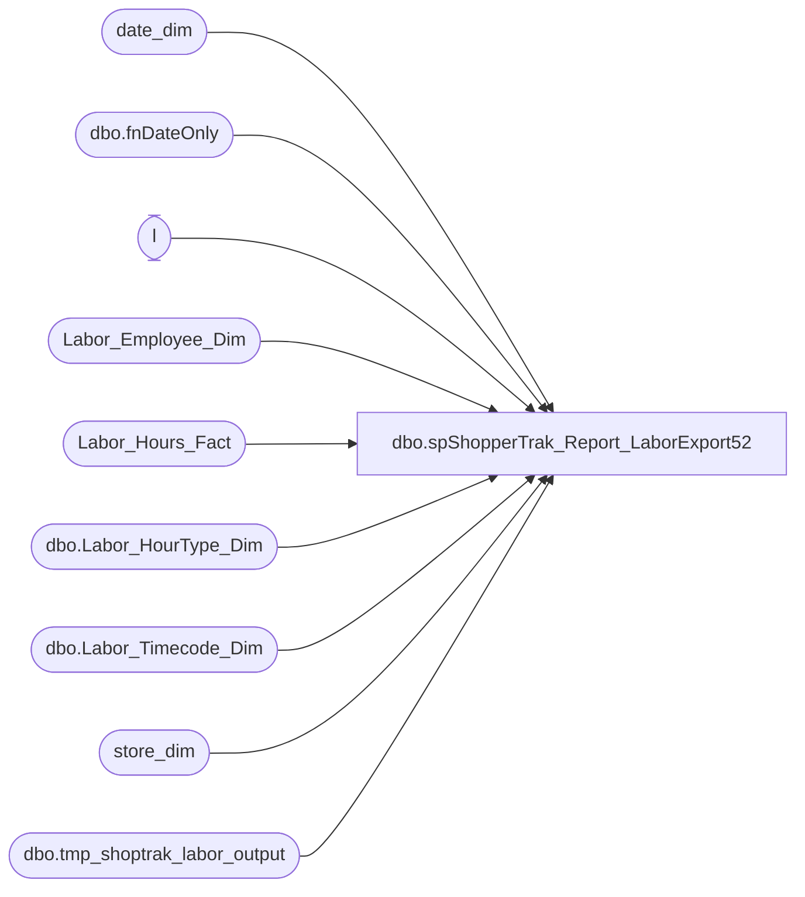

# dbo.spShopperTrak_Report_LaborExport52

**Database:** dw  
**Server:** papamart  

## Architecture Diagram



## Table Dependencies

| Referenced Table |
|---|
| date_dim |
| dbo.fnDateOnly |
| l |
| Labor_Employee_Dim |
| Labor_Hours_Fact |
| dbo.Labor_HourType_Dim |
| dbo.Labor_Timecode_Dim |
| store_dim |
| dbo.tmp_shoptrak_labor_output |

## Stored Procedure Code

```sql
CREATE PROC [dbo].[spShopperTrak_Report_LaborExport52]
-- =============================================================================================================
-- Name: spShopperTrak_Report_LaborExport
--
-- Description:	daily load process for ShopperTrak
--
-- Input:		@ac_path			filepath for output
--				@ad_dateStart		date to start obtaining records
--				@ad_dateEnd			last date of data range
--
-- Output: returns records in textfile and uploads to FTP site through bcp command
--
-- Dependencies: 
--
-- Revision History
--		Brian Byas		10/28/2015		Changed the Query to only filter records from 2AM to 2AM and adjust records which would 
--										have been split at 2:00 AM ONLY for store 52, then kicks off [spShopperTrak_Report_LaborExport]
--										which handles the other stores data from 12AM to 12AM and adjust records which would 
--										have been split at 12:00 AM.
-- =============================================================================================================
	@ac_path varchar(100),
	@ad_dateStart datetime,
	@ad_dateEnd datetime

AS


	

	DECLARE	@outputsql varchar(1000),
			@bcpsql varchar(4000),
			@cmd varchar(1000),
			@filename varchar(100)

	DECLARE @startDate AS datetime
	DECLARE @endDate AS datetime

	SET @startDate = @ad_dateStart
	SET @endDate = @ad_dateEnd

-- Adjust to 2:00 AM
	SET @startDate = dbo.fnDateOnly(@startDate) + CAST('2:00AM' AS datetime)
	SET @endDate = DATEADD(D, 1, dbo.fnDateOnly(@endDate)) + CAST('2:00AM' AS datetime)


	IF OBJECT_ID('tempdb..#tmpLabor52') IS NOT NULL
	BEGIN
		DROP TABLE #tmpLabor52
	END

-- Pull data into temp table

	SELECT

		actual_date + lhf.start_Time AS revStartTime,
		actual_date + lhf.end_Time AS revEndTime,
		actual_date + CAST('2:00AM' AS datetime) AS TwoAMToday,
		DATEADD(D, 1, actual_date) + CAST('2:00AM' AS datetime) AS TwoAMTomorrow,
		dd.actual_date AS laborDate,
		CAST(lhf.recID AS integer) AS recID,
		lhf.store_key,
		lhf.date_key,
		lhf.emp_key,
		lhf.job_key,
		lhf.HOURTYPE_KEY,
		lhf.timecode_key,
		lhf.start_Time,
		lhf.end_Time,
		lhf.wrkd_minutes,
		lhf.source_system,
		lhf.INS_DT,
		lhf.ETL_LOG_ID,
		lhf.ETL_EVNT_ID
	INTO #tmpLabor52
	FROM
		Labor_Hours_Fact lhf WITH (NOLOCK)
		INNER JOIN date_dim dd WITH (NOLOCK)
			ON lhf.date_key = dd.date_key
		INNER JOIN dw.dbo.Labor_HourType_Dim h WITH (NOLOCK)
			ON lhf.HOURTYPE_KEY = h.HOURTYPE_KEY
		INNER JOIN dw.dbo.Labor_Timecode_Dim t WITH (NOLOCK)
			ON lhf.timecode_key = t.timecode_key
	WHERE
		1 = 1
		AND actual_date + lhf.start_Time < @endDate
		AND actual_date + lhf.end_Time > @startDate
		AND isWork = 1
		AND isPaid = 1
		AND lhf.start_Time <> lhf.end_Time
		AND lhf.store_key = 52 -- Filters for only Store 52


-- Lop off any record which starts prior to 2:00 AM

	DELETE FROM #tmpLabor52 
	WHERE revStartTime  < @startDate  -- On First Day
	AND revEndTime < @startDate 
	OR LEFT(CONVERT(VARCHAR,labordate,120),10) = LEFT(CONVERT(VARCHAR,@startdate,120),10)
	AND RIGHT(CONVERT(VARCHAR,revStartTime,120),8) < '02:00:00'

-- Adjust the records for the end of the day by inserting a new record for tomorrow and updating today's record to end at 2:00AM
-- Insert records from 2:00AM until existing end

	INSERT INTO #tmpLabor52
		SELECT
			l.TwoAMTomorrow,
			l.revEndTime,
			DATEADD(D, 1, l.TwoAMToday),
			DATEADD(D, 1, l.TwoAMTomorrow),
			DATEADD(D, 1, l.LaborDate),
			l.recID,
			l.store_key,
			l.date_key,
			l.emp_key,
			l.job_key,
			l.HOURTYPE_KEY,
			l.timecode_key,
			l.start_Time,
			l.end_Time,
			l.wrkd_minutes,
			l.source_system,
			l.INS_DT,
			-1 AS ETL_LOG_ID,
			l.ETL_EVNT_ID

		FROM
			#tmpLabor52 l
		WHERE
			l.TwoAMTomorrow BETWEEN l.revStartTime AND l.revEndTime
			AND l.revEndTime <> l.TwoAMTomorrow
			AND l.revStartTime <> l.TwoAMTomorrow

-- Update the existing record to go to 2AM

	UPDATE l
		SET revEndTime = l.TwoAMTomorrow
	FROM
		#tmpLabor52 l
	WHERE l.TwoAMTomorrow BETWEEN l.revStartTime AND l.revEndTime AND l.TwoAMTomorrow <> l.revStartTime

-- Set the labor Date of any record after 2:00AM

	UPDATE l
		SET	LaborDate = dbo.fnDateOnly(l.revStartTime),
			ETL_EVNT_ID = -2
	FROM
		#tmpLabor52 l
	WHERE l.revStartTime > l.TwoAMTomorrow AND dbo.fnDateOnly(l.revStartTime) <> l.LaborDate
   
-- Delete any records after 2:00 AM on last Day

	DELETE FROM #tmpLabor52 WHERE revStartTime >= @endDate AND revEndTime > @endDate
-------------------------------------------------------------------------------------
	-- Now format up the records for ShopperTrak

	INSERT INTO dbo.tmp_shoptrak_labor_output
		--this query is based on a query from the WorkBrain Team
		SELECT
			store_id AS 'StoreId',
			CONVERT(varchar, l.LaborDate, 112) AS 'LaborDate',
			emp_id AS 'EmployeeId',
			REPLICATE('0', 2 - LEN(CAST(DATEPART(HOUR, l.revStartTime) AS varchar))) + CAST(DATEPART(HOUR, l.revStartTime) AS varchar)
			+ REPLICATE('0', 2 - LEN(CAST(DATEPART(MINUTE, l.revStartTime) AS varchar))) + CAST(DATEPART(MINUTE, l.revStartTime) AS varchar)
			+ REPLICATE('0', 2 - LEN(CAST(DATEPART(SECOND, l.revStartTime) AS varchar))) + CAST(DATEPART(SECOND, l.revStartTime) AS varchar)
			AS 'EmployeeStartTime',
			REPLICATE('0', 2 - LEN(CAST(DATEPART(HOUR, l.revEndTime) AS varchar))) + CAST(DATEPART(HOUR, l.revEndTime) AS varchar)
			+ REPLICATE('0', 2 - LEN(CAST(DATEPART(MINUTE, l.revEndTime) AS varchar))) + CAST(DATEPART(MINUTE, l.revEndTime) AS varchar)
			+ REPLICATE('0', 2 - LEN(CAST(DATEPART(SECOND, l.revEndTime) AS varchar))) + CAST(DATEPART(SECOND, l.revEndTime) AS varchar)
			AS 'EmployeeEndTime'
		FROM
			#tmpLabor52 l WITH (NOLOCK)
			INNER JOIN store_dim sd WITH (NOLOCK)
				ON l.store_key = sd.store_key
			INNER JOIN Labor_Employee_Dim led WITH (NOLOCK)
				ON l.emp_key = led.emp_key
-----------------------------------------

	SET @outputsql = 'SELECT CAST(StoreId AS VARCHAR), ' +
	'LaborDate, CAST(EmployeeId AS VARCHAR),EmployeeStartTime, '
	+ 'EmployeeEndTime'
	+ ' FROM dw.dbo.tmp_shoptrak_labor_output WHERE EmployeeEndTime IS NOT NULL ORDER BY StoreId, LaborDate, EmployeeId'


	SELECT
		@filename = 'LABOR_' + CONVERT(varchar(8), @ad_dateEnd, 112) + '.txt'


	SET @bcpsql = 'bcp "' + @outputsql + '" queryout "' + @ac_path + @filename
	+ '" -t "," -T -c'

	EXEC master..xp_cmdshell @bcpsql
```

