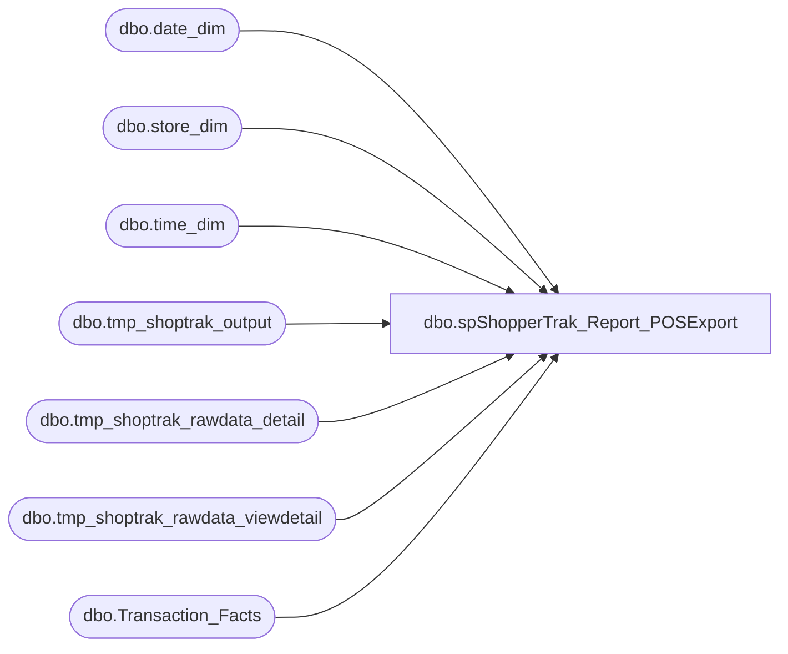

# dbo.spShopperTrak_Report_POSExport

**Database:** dw  
**Server:** papamart  

## Architecture Diagram



## Table Dependencies

| Referenced Table |
|---|
| dbo.date_dim |
| dbo.store_dim |
| dbo.time_dim |
| dbo.tmp_shoptrak_output |
| dbo.tmp_shoptrak_rawdata_detail |
| dbo.tmp_shoptrak_rawdata_viewdetail |
| dbo.Transaction_Facts |

## Stored Procedure Code

```sql
CREATE PROC [dbo].[spShopperTrak_Report_POSExport]
-- =============================================================================================================
-- Name: spShopperTrak_Report_POSExport
--
-- Description:	daily load process for ShopperTrak
--
-- Input:		@ac_path			filepath for output
--				@ad_date			date to start obtaining records
--
-- Output: returns records in textfile and uploads to FTP site through bcp command
--
-- Dependencies: 
--
-- Revision History
--		Name:			Date:			Comments:
--		Keith Missey	5/5/2008		Created
--		Keith Missey	10/1/2008		updated per new ShopperTrak specs
--		Gary Derikito	10/16/2008		Updated to use dbmail following SQL 2005 upgrade
--		Keith Missey	2/13/2008		removed Wayne and Judy's e-mail address
--		Keith Missey	08/02/2011		added new stores
--		Keith Missey	12/11/2011		updated store list
--		Keith Missey	12/19/2011		removed store filter
--		Gary Murrish	4/17/2013		removed closed store filter and switched to Transaction_facts
-- =============================================================================================================
    @ac_path VARCHAR(100),
    @ad_startdate DATETIME,
	@ad_enddate DATETIME
AS 
SET NOCOUNT ON

--DROP TABLES IF EXIST IN DATABASE
    IF EXISTS ( SELECT  *
                FROM    dbo.sysobjects
                WHERE   id = OBJECT_ID(N'[dbo].[tmp_shoptrak_rawdata_viewdetail]') ) 
        DROP TABLE dbo.tmp_shoptrak_rawdata_viewdetail

    IF EXISTS ( SELECT  *
                FROM    dbo.sysobjects
                WHERE   id = OBJECT_ID(N'[dbo].[tmp_shoptrak_rawdata_detail]') ) 
        DROP TABLE dbo.tmp_shoptrak_rawdata_detail

    IF EXISTS ( SELECT  *
                FROM    dbo.sysobjects
                WHERE   id = OBJECT_ID(N'[dbo].[tmp_shoptrak_output]') ) 
        DROP TABLE dbo.tmp_shoptrak_output

    CREATE TABLE dbo.tmp_shoptrak_output
        (
          storeid INT,
          transdate CHAR(8),
          transendtime CHAR(6),
          sales MONEY,
          --transactiontype CHAR(1),
          transactionid INT
        )

    DECLARE @outputsql VARCHAR(1000),
        @bcpsql VARCHAR(4000),
		@cmd VARCHAR(1000),
		@filename VARCHAR(100)
		
--CREATE SHOPPERTRAK STORE IDS
    SELECT  store_dim.store_id
    INTO    #tmpstore
    FROM    DW.dbo.store_dim
    WHERE   store_id > 0 AND store_id < 3000

--COLLECT RAW DATA FROM TRANSACTION DETAIL FACTS VIEW
    SELECT  vtdf.transaction_id,
            sd.store_id AS store_id,
            dd.actual_date,
            vtdf.GAAP_sales_amount AS gaapSales
    INTO    dbo.tmp_shoptrak_rawdata_viewdetail
    FROM    dbo.Transaction_Facts vtdf WITH ( NOLOCK )
            INNER JOIN dbo.store_dim sd WITH ( NOLOCK ) ON vtdf.store_key = sd.store_key
            INNER JOIN dbo.date_dim dd WITH ( NOLOCK ) ON vtdf.date_key = dd.date_key
    WHERE   sd.store_id IN ( SELECT store_id
                             FROM   [#tmpstore] )
            AND dd.actual_date >= @ad_startdate AND dd.actual_date < @ad_enddate
    ORDER BY vtdf.transaction_id 

    SELECT DISTINCT
            vtdf.transaction_id,
            td.[hour],
            td.[minute]
    INTO    dbo.tmp_shoptrak_rawdata_detail
    FROM    dbo.tmp_shoptrak_rawdata_viewdetail vtdf
            INNER JOIN dbo.transaction_facts tdf WITH ( NOLOCK ) ON vtdf.transaction_id = tdf.transaction_id
            INNER JOIN dbo.time_dim td WITH ( NOLOCK ) ON tdf.time_key = td.time_key
  
    INSERT  dbo.tmp_shoptrak_output
            SELECT DISTINCT
                    vd.store_id,
                    CONVERT(VARCHAR, vd.actual_date, 112),
                    REPLICATE('0', 2 - LEN(CAST([hour] AS VARCHAR))) + CAST(hour AS VARCHAR) 
	+ REPLICATE('0', 2 - LEN(CAST([minute] AS VARCHAR))) + CAST(minute AS VARCHAR)  + '00',
                    vd.gaapsales,
                   -- 'N',
                    vd.transaction_id
            FROM    dbo.tmp_shoptrak_rawdata_viewdetail vd
                    INNER JOIN dbo.tmp_shoptrak_rawdata_detail d ON vd.transaction_id = d.transaction_id

--FORMAT REQUESTED BY SHOPPERTRAK
    SET @outputsql = 'SELECT storeid, ' + 
	'transdate, transendtime , sales , '
        + 'transactionid'
        + ' FROM dw.dbo.tmp_shoptrak_output ORDER BY storeid, transdate, transendtime'

    SELECT  @filename = 'SALES_' + CAST(YEAR(GETDATE()) AS VARCHAR) + REPLICATE('0', 2 - LEN(MONTH(GETDATE()))) + CAST(MONTH(GETDATE()) AS VARCHAR) + 
						REPLICATE('0', 2 - LEN(DAY(GETDATE()))) + CAST(DAY(GETDATE()) AS VARCHAR) + '.txt'


    SET @bcpsql = 'bcp "' + @outputsql + '" queryout "' + @ac_path + @filename
        + '" -t "," -T -c'
    --SELECT @bcpsql

    EXEC master..xp_cmdshell @bcpsql

--    SELECT  @cmd = 'ftp.exe -s:i:\postfuture\postfuture.ftp'
--    EXEC master..xp_cmdshell @cmd, no_output
--    SET nocount OFF

--INTERIM SOLUTION UNTIL WE GET FILE LOAD AUTOMATED
--DECLARE @recipients VARCHAR(100),
--		@copy_recipients VARCHAR(100),
--		@filelocation VARCHAR(100)
		
--		SET @recipients = 'it-data@buildabear.com'
--		SET @copy_recipients = ''
--		SET @filelocation = @ac_path + @filename
		
----exec master..xp_sendmail @recipients=@recipients
----,@copy_recipients=@copy_recipients
----,@subject = 'ShopperTrak Daily File To Upload'
----,@separator = ','
----,@attachments =  @filelocation
----,@ansi_attachment='TRUE'
----,@message = 'Please upload the file to the following site using the following credentials:  
----
----Server address: https://data.shoppertrak.com
----
----Login ID:           buildabear
----Password:         sTuff3dt3dDy'

----exec msdb.dbo.sp_send_dbmail
--@recipients=@recipients
--,@copy_recipients=@copy_recipients
--,@subject = 'ShopperTrak Daily File To Upload'
--,@query_result_separator = ','
--,@file_attachments =  @filelocation
----,@ansi_attachment='TRUE'
--,@body = 'Please upload the file to the following site using the following credentials:  

--Server address: https://data.shoppertrak.com

--Login ID:           buildabear
--Password:         sTuff3dt3dDy'
```

