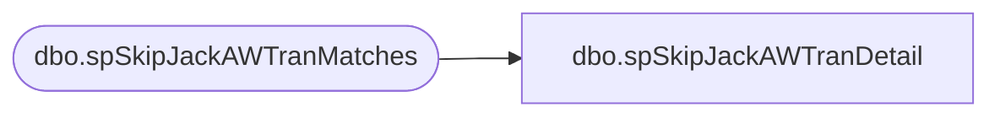

# dbo.spSkipJackAWTranDetail

**Database:** dw  
**Server:** papamart  

## Architecture Diagram



## Table Dependencies

| Referenced Table |
|---|
| dbo.spSkipJackAWTranMatches |

## Stored Procedure Code

```sql
CREATE PROC spSkipJackAWTranDetail
(@AW_StartDate datetime, @AW_EndDate datetime)
AS
BEGIN
DECLARE @SJ_StartDate datetime, @SJ_EndDate datetime
DECLARE @Report_StartDate datetime, @Report_EndDate datetime
--DECLARE @AW_StartDate datetime, @AW_EndDate datetime
Set @AW_EndDate=dateadd(dd,1,@AW_EndDate)

--The day the order was settled
SET @SJ_StartDate=DATEADD(day,+1,@AW_StartDate)
SET @SJ_EndDate=DATEADD(day,+1,@AW_EndDate)

-- /************************************************************************************************/
-- /* Get Data                                                                                     */
-- /************************************************************************************************/
CREATE TABLE #AW_CCTrans
(ID int identity(1,1),
 AW_Site	varchar(14),	     	     
 AW_OrderNumber	varchar(99),	     	     
 AW_TranNo	int,    
 AW_ReqToSettleDate	datetime,	     	     
 AW_CCAmount	numeric(12,4),    
 AW_CCGrossLineAmount	numeric(12,4) ,   
 AW_CCLineObject	smallint	,
 AW_CCLineAction	tinyint	,
 SJ_OrderNumber	varchar(255),     	     
 Match	tinyint)    

CREATE TABLE #SJ_CCTrans
(SJ_OrderNumber	varchar(50),
SJ_transid	     varchar(50),
SJ_SettleDate	     datetime,	
SJ_CCAmount	     money,	
Match	          tinyint,
SJ_Site	varchar(50))	

--Call proc that determines mismatches used for summary and detail
EXEC  [dw].[dbo].[spSkipJackAWTranMatches] @SJ_StartDate, @SJ_EndDate, @AW_StartDate, @AW_EndDate


/************************************************************************************************/
/* Report Detail Output                                                                               */
/************************************************************************************************/
--If they ever want to percentage it is all of aw plus 0 in sj as the dominator
--Auditworks 
SELECT AW_OrderNumber,
       aw.SJ_OrderNumber,
       AW_ReqToSettleDate transaction_date,
       SJ_SettleDate skipjack_date,
       CASE 
          WHEN aw.match= 0 THEN 'Not Found In Skipjack'
          WHEN aw.match in (1,2) THEN 'Match with Skipjack'
          WHEN aw.match=3 THEN 'Duplicate'
       END AS match_status,
       AW_CCAmount AS tran_dollars,        
       AW_Site AS aw_site
FROM #AW_CCTrans aw
LEFT JOIN  #SJ_CCTrans sj
ON aw.SJ_OrderNumber=sj.SJ_OrderNumber
UNION ALL
--SkipJack
SELECT SJ_OrderNumber,
       SJ_OrderNumber,
       NULL transaction_date,
       SJ_SettleDate skipjack_date,
       'Not Found in Auditworks',
       SJ_CCAmount,
      SJ_Site
FROM #SJ_CCTrans sj
WHERE match=0

/************************************************************************************************/
/* DROP TABLES                                                                                  */
/************************************************************************************************/
DROP TABLE #AW_CCTrans
DROP TABLE #SJ_CCTrans

END
```

