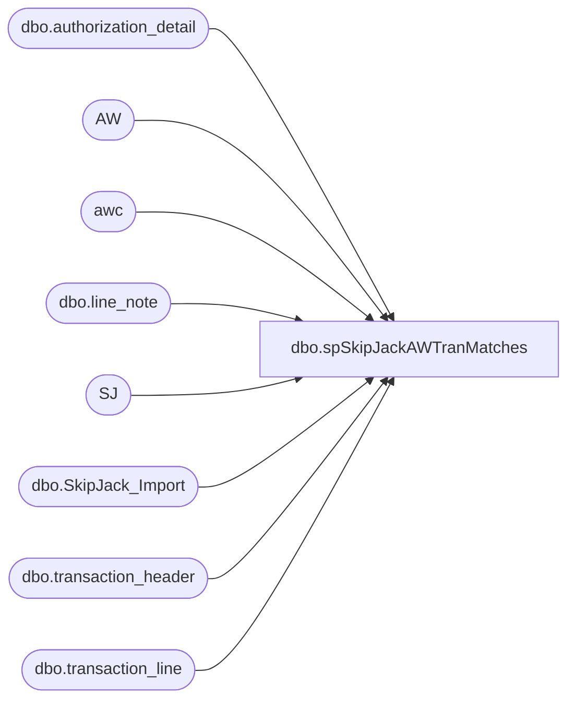

# dbo.spSkipJackAWTranMatches

**Database:** dw  
**Server:** papamart  

## Architecture Diagram



## Table Dependencies

| Referenced Table |
|---|
| dbo.authorization_detail |
| AW |
| awc |
| dbo.line_note |
| SJ |
| dbo.SkipJack_Import |
| dbo.transaction_header |
| dbo.transaction_line |

## Stored Procedure Code

```sql
CREATE PROC [dbo].[spSkipJackAWTranMatches]
(@SJ_StartDate datetime
,@SJ_EndDate datetime
,@AW_StartDate datetime
,@AW_EndDate datetime)
AS
-- =====================================================================================================
-- Name: spSkipJackAWTranMatches
--
-- Description:	Pulls transaction data from Sales Audit
--
-- Input:	
--			@SJ_StartDate			datetime	Sets date range
--			@SJ_EndDate		datetime	
--
-- Output: Resultset with the following columns:
--			N/A
--
-- Dependencies: None
--
-- Revision History
--		Name:			Date:			Comments:
--		GaryD			08/18/2010		Initial version in source control.
--		GaryD			08/19/2010		Update server name for SA 5.0.
-- =====================================================================================================
SET NOCOUNT ON

/***********************************************************************************************/
/* Get Data to Compare                                                                         */
/***********************************************************************************************/

--AW CC Trans ===================================================================================
INSERT INTO #AW_CCTrans
(AW_Site, AW_OrderNumber, AW_TranNo, AW_ReqToSettleDate, AW_CCAmount, AW_CCGrossLineAmount, AW_CCLineObject, AW_CCLineAction, SJ_OrderNumber,Match)

SELECT  
    	case 	when a.store_no=13 AND a.transaction_series='W' then 'US_WEB'
		when a.store_no=13 AND a.transaction_series='D' then 'US_F2BM'
		when a.store_no=136 AND a.transaction_series='W' then 'CA_WEB'
		when a.store_no not in (13, 136) AND a.transaction_series='W' and a.register_no=1 then 'GC_KIOSK'
		else 'NOT 13 or 136!'
	end as AW_Site
	, substring(d.line_note,12,99) as AW_OrderNumber	--web cart order number
	, a.transaction_no as AW_TranNo				--AW trans ID
	, CONVERT(varchar(12),a.transaction_date,101)as AW_ReqToSettleDate --actual transaction date
	, case	when b.line_action = 11 AND b.line_object IN (604,605,606,608,611,642)then b.gross_line_amount	
		when b.line_action = 27 AND b.line_object IN (604,605,606,608,611,642)then - b.gross_line_amount	
		else 0
	end as AW_CCAmount					--$ on this CC line item
	,b.gross_line_amount as AW_CCGrossLineAmount		--Absolute value of amount
	,b.line_object as AW_CCLineObject
	,b.line_action as AW_CCLineAction
	,e.approval_message as SJ_OrderNumber			--SJ OrderID starting March 8,2005
	,0 as Match
FROM bedrockdb01.auditworks.dbo.transaction_header a
	JOIN bedrockdb01.auditworks.dbo.transaction_line b ON a.transaction_id=b.transaction_id 
	JOIN bedrockdb01.auditworks.dbo.line_note d ON  b.transaction_id=d.transaction_id 
	JOIN bedrockdb01.auditworks.dbo.authorization_detail e on e.transaction_id=b.transaction_id and e.line_id=b.line_id
WHERE 	b.line_void_flag = 0 
	AND a.transaction_void_flag = 0 
	AND a.transaction_date >= @AW_StartDate and a.transaction_date < @AW_EndDate
	AND (
		(a.store_no IN (13,136) AND a.transaction_series = 'W')
		OR 
		(a.store_no IN (13) AND a.transaction_series = 'D')
		OR
		(a.store_no NOT IN (13,136) AND a.transaction_series = 'W' and a.register_no = 1)
	    )
	AND d.note_type = 28
	AND b.line_object IN (604,605,606,608,611,642)
ORDER BY a.transaction_no

--Skip Jack Transaction ============================================================================
INSERT INTO #SJ_CCTrans (SJ_OrderNumber, SJ_transid, SJ_SettleDate, SJ_CCAmount, Match, SJ_Site)
SELECT    i.sOrderNumber as SJ_OrderNumber,
          i.sTransactionID as SJ_transid,
          convert(varchar(12),i.dTransactionDate,101) as SJ_SettleDate,
          isnull(i.mTransactionAmount,0) as SJ_CCAmount,
          0 as Match,   
          sSiteName
FROM  archive.dbo.SkipJack_Import i 
where i.dTransactionDate >= @SJ_StartDate and i.dTransactionDate < @SJ_EndDate

-- /************************************************************************************************/
-- /* Based on Dups this is the way to Match                                                       */
-- /* Dups came in the form of:                                                                    */
-- /*1.Same SJ Number DIfferent Charge Amounts                                                     */
-- /*2.Same SJ Number Same Charge Amount Different Time Reported Charged                           */
-- /* 3. Do not use 3 this is dups and used for detail reprt so if you come up with a another       */
-- /*   type of mismatches go to 4.  There comes from 2                                            */
-- /************************************************************************************************/
Select SJ_OrderNumber,
       AW_CCAmount,
       count(*) as AW_TimesRPTCharged,
       convert(tinyint,0) as Match,
       convert(int,0) as Num_Matches
INTO #AW_CCNumCharges
from #AW_CCTrans
GROUP BY SJ_OrderNumber, AW_CCAmount


Select SJ_OrderNumber,
	SJ_CCAmount,
	count(*) as SJ_TimesCharged,
	convert(tinyint,0) As Match
INTO #SJ_CCNumCharges
from #SJ_CCTrans
GROUP BY SJ_OrderNumber, SJ_CCAmount

--These match perfect amount and times charged ======================================================
Update AW
SET Match=1
FROM #AW_CCNumCharges AW
INNER JOIN #SJ_CCNumCharges SJ ON AW.SJ_OrderNumber = SJ.SJ_OrderNumber 
	and AW.AW_CCAmount = SJ.SJ_CCAmount
	and AW.AW_TimesRPTCharged = SJ.SJ_TimesCharged 

Update SJ
SET Match=1
FROM #AW_CCNumCharges AW
INNER JOIN #SJ_CCNumCharges SJ ON AW.SJ_OrderNumber = SJ.SJ_OrderNumber 
	and AW.AW_CCAmount = SJ.SJ_CCAmount 
	and AW.AW_TimesRPTCharged = SJ.SJ_TimesCharged 

--These match on SJ number and amount but not the right number of times
--Auditworks reports more times
--IN SJ the SJ Order Number is a primary key and only occurs once
Update AW
SET Match=2, Num_Matches = SJ.SJ_TimesCharged 
FROM #AW_CCNumCharges AW
INNER JOIN #SJ_CCNumCharges SJ ON AW.SJ_OrderNumber = SJ.SJ_OrderNumber 
	and AW.AW_CCAmount = SJ.SJ_CCAmount 
	and AW.AW_TimesRPTCharged > SJ.SJ_TimesCharged 

Update SJ
SET Match=2
FROM #AW_CCNumCharges AW
INNER JOIN #SJ_CCNumCharges SJ ON AW.SJ_OrderNumber = SJ.SJ_OrderNumber 
	and AW.AW_CCAmount = SJ.SJ_CCAmount 
	and AW.AW_TimesRPTCharged > SJ.SJ_TimesCharged 

-- /************************************************************************************************/
-- /* Mark Matches                                                                                 */
-- /************************************************************************************************/

-- --Match 1===========================================================================
-- --Good Matches
Update aw
Set Match=1 
from #AW_CCTrans aw 
INNER JOIN #AW_CCNumCharges awc ON aw.SJ_OrderNumber = awc.SJ_OrderNumber 
	and aw.AW_CCAmount = awc.AW_CCAmount
Where awc.Match=1
       
Update sj
SET Match=1 
from #SJ_CCTrans sj
INNER JOIN #SJ_CCNumCharges sjc ON sj.SJ_OrderNumber = sjc.SJ_OrderNumber
	and sj.SJ_CCAmount = sjc.SJ_CCAmount
Where sjc.Match=1

--Match 2 (match) and 3(duplicates)===========================================================================
--Include only those that appear the same number of times as SJ if they occur more and are not reported and match
--those greater will be reported as duplicates
DECLARE @match2_count int

SELECT @match2_count = count(*)
FROM #AW_CCNumCharges
Where Match=2 and Num_Matches > 0

WHILE @match2_count>0
BEGIN
     Update aw
     SET Match=2 
     FROM  #AW_CCTrans aw 
     INNER JOIN 
     (    Select aw.SJ_OrderNumber,min(ID) ID 
          from #AW_CCTrans aw 
          INNER JOIN #AW_CCNumCharges awc ON aw.SJ_OrderNumber = awc.SJ_OrderNumber 
		and aw.AW_CCAmount = awc.AW_CCAmount
          Where awc.Match=2 and Num_Matches > 0 and aw.Match=0
          group by aw.SJ_OrderNumber) as q
     ON q.SJ_OrderNumber = aw.SJ_OrderNumber and q.ID = aw.ID 

     Update awc 
     Set  Num_Matches = Num_Matches-1
     FROM #AW_CCNumCharges awc
     Where Match=2 and Num_Matches > 0


     SELECT @match2_count = count(*)
     FROM #AW_CCNumCharges
     Where Match=2 and Num_Matches > 0

CONTINUE
END

Update aw 
Set Match=3
from #AW_CCTrans aw 
INNER JOIN #AW_CCNumCharges awc ON aw.SJ_OrderNumber=awc.SJ_OrderNumber 
	and aw.AW_CCAmount = awc.AW_CCAmount
Where awc.Match=2 and aw.Match=0

Update sj
SET Match=sjc.Match 
from #SJ_CCTrans sj
INNER JOIN #SJ_CCNumCharges sjc ON sj.SJ_OrderNumber = sjc.SJ_OrderNumber
	and sj.SJ_CCAmount = sjc.SJ_CCAmount
Where sjc.Match=2


-- /************************************************************************************************/
-- /* Drop Temp Tabels                                                                             */
-- /************************************************************************************************/
DROP TABLE #AW_CCNumCharges
DROP TABLE #SJ_CCNumCharges
```

