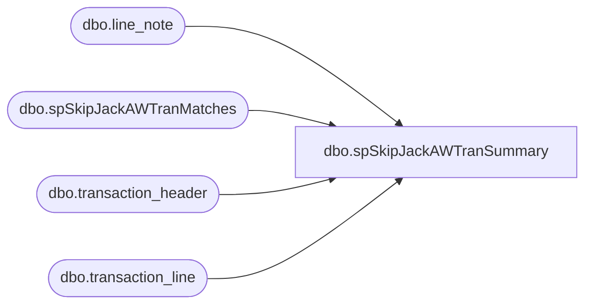

# dbo.spSkipJackAWTranSummary

**Database:** dw  
**Server:** papamart  

## Architecture Diagram



## Table Dependencies

| Referenced Table |
|---|
| dbo.line_note |
| dbo.spSkipJackAWTranMatches |
| dbo.transaction_header |
| dbo.transaction_line |

## Stored Procedure Code

```sql
CREATE  PROC [dbo].[spSkipJackAWTranSummary]
(@AW_StartDate datetime, @AW_EndDate datetime)
AS
-- =====================================================================================================
-- Name: spSkipJackAWTranSummary
--
-- Description:	Pulls transaction data from Sales Audit
--
-- Input:	
--			@AW_StartDate			datetime	Sets date range
--			@AW_EndDate				datetime	
--
-- Output: Resultset with the following columns:
--			N/A
--
-- Dependencies: None
--
-- Revision History
--		Name:			Date:			Comments:
--		GaryD			08/18/2010		Initial version in source control.
--		GaryD			08/19/2010		Update server name for SA 5.0.
-- =====================================================================================================
BEGIN
DECLARE @SJ_StartDate datetime, @SJ_EndDate datetime
DECLARE @Report_StartDate datetime, @Report_EndDate datetime
--DECLARE @AW_StartDate datetime, @AW_EndDate datetime
Set @AW_EndDate=dateadd(dd,1,@AW_EndDate)

--The day the order was settled
SET @SJ_StartDate=DATEADD(day,+1,@AW_StartDate)
SET @SJ_EndDate=DATEADD(day,+1,@AW_EndDate)

-- /************************************************************************************************/
-- /* Get Data                                                                                     */
-- /************************************************************************************************/
CREATE TABLE #AW_CCTrans
(ID int identity(1,1),
 AW_Site	varchar(14),	     	     
 AW_OrderNumber	varchar(99),	     	     
 AW_TranNo	int,    
 AW_ReqToSettleDate	datetime,	     	     
 AW_CCAmount	numeric(12,4),    
 AW_CCGrossLineAmount	numeric(12,4) ,   
 AW_CCLineObject	smallint	,
 AW_CCLineAction	tinyint	,
 SJ_OrderNumber	varchar(255),     	     
 Match	tinyint)    

CREATE TABLE #SJ_CCTrans
(SJ_OrderNumber	varchar(50),
SJ_transid	     varchar(50),
SJ_SettleDate	     datetime,	
SJ_CCAmount	     money,	
Match	          tinyint,
SJ_Site	varchar(50))	

--Call proc that determines mismatches used for summary and detail
EXEC  [dw].[dbo].[spSkipJackAWTranMatches] @SJ_StartDate, @SJ_EndDate, @AW_StartDate, @AW_EndDate

--Gift Card trans 
SELECT  case 	when a.store_no=13 AND a.transaction_series='W' then 'US_WEB'
		when a.store_no=13 AND a.transaction_series='D' then 'US_F2BM'
		when a.store_no=136 AND a.transaction_series='W' then 'CA_WEB'
		else 'NOT 13 or 136!'
	end as AW_Site
	, substring(d.line_note,12,99)as AW_OrderNumber	--web cart order number
	, a.transaction_no AW_TranNo				--AW trans ID
	, CONVERT(char,a.transaction_date,101)as AW_TranDate --actual transaction date
	, case 	when b.line_action = 25 AND b.line_object IN (624,633,640)then b.gross_line_amount	
		when b.line_action = 12 AND b.line_object IN (624,633,640)then  - b.gross_line_amount	
		else 0
	end as AW_GCAmount		
	,b.gross_line_amount AW_GCGrossLineAmount				--Absolute value of amount
	,b.line_object AW_GCLineObject
	,b.line_action AW_GCLinEAction
INTO #AW_GCTrans	
FROM 	bedrockdb01.auditworks.dbo.transaction_header a

	JOIN bedrockdb01.auditworks.dbo.transaction_line b 
     ON a.transaction_id=b.transaction_id
	
     JOIN bedrockdb01.auditworks.dbo.line_note d 
     ON  b.transaction_id=d.transaction_id 
WHERE 
	b.line_void_flag=0 
	ANd a.transaction_void_flag = 0 
	AND a.transaction_date >=  @AW_StartDate and   a.transaction_date<@AW_EndDate
	AND (
		(a.store_no IN (13,136) AND a.transaction_series = 'W')
		OR 
		(a.store_no IN (13) AND a.transaction_series = 'D')
	    )
	AND d.note_type = 28
	AND b.line_object IN (624,633,640)
/************************************************************************************************/
/* Report Summary                                                                               */
/************************************************************************************************/
--If they ever want to percentage it is all of aw plus 0 in sj as the dominator
--Auditworks 
SELECT COALESCE(AW_ReqToSettleDate,dateadd(dd,1,SJ_SettleDate)) transaction_date,
       COALESCE(SJ_SettleDate,dateadd(dd,1,AW_ReqToSettleDate)) skipjack_date,
       SUM(CASE WHEN aw.match=0 THEN 1 ELSE 0 END) AS aw_notmatch_count,
       SUM(CASE WHEN aw.match=0 THEN AW_CCAmount ELSE 0 END) AS aw_notmatch_dollars,
       SUM(CASE WHEN aw.match in (1,2) THEN 1 ELSE 0 END) AS aw_match_count,
       SUM(CASE WHEN aw.match in (1,2) THEN AW_CCAmount ELSE 0 END) AS aw_match_dollars,
       SUM(CASE WHEN aw.match=3 THEN 1 ELSE 0 END) AS aw_dup_count,
       SUM(CASE WHEN aw.match=3 THEN AW_CCAmount ELSE 0 END )AS aw_dup_dollars,        
       CASE AW_Site WHEN 'US_F2BM' THEN 'US_WEB' ELSE AW_Site END AS aw_site
INTO #AW_CCTrans_summary
FROM #AW_CCTrans aw
LEFT JOIN  #SJ_CCTrans sj
ON aw.SJ_OrderNumber=sj.SJ_OrderNumber
GROUP BY  COALESCE(AW_ReqToSettleDate,dateadd(dd,1,SJ_SettleDate)) ,
          COALESCE(SJ_SettleDate,dateadd(dd,1,AW_ReqToSettleDate)),
          CASE AW_Site WHEN 'US_F2BM' THEN 'US_WEB' ELSE AW_Site END

--SkipJack
SELECT DATEADD(dd,-1,SJ_SettleDate) transaction_date,
       SJ_SettleDate skipjack_date,
       COUNT(*) sj_notmatch_count,
       SUM(SJ_CCAmount) sj_notmatch_dollars,
      SJ_Site
INTO #SJ_CCTran_summary
FROM #SJ_CCTrans sj
WHERE match=0
GROUP BY  DATEADD(dd,-1,SJ_SettleDate), SJ_SettleDate,SJ_Site

--Gift Card Trans 
Select AW_TranDate transaction_date, 
       dateadd(dd,1,AW_TranDate) skipjack_date,
       count(*) gc_count,
sum(AW_GCAmount	) gc_dollars,
AW_Site
INTO #AW_GCTrans_summary
from #AW_GCTrans
GROUP BY AW_TranDate,dateadd(dd,1,AW_TranDate),AW_Site

SELECT @Report_StartDate=min(AW_ReqToSettleDate), @Report_EndDate=max(AW_ReqToSettleDate)
FROM #AW_CCTrans

Select q.transaction_date,
q.skipjack_date,
q.site,
isnull(q.aw_match_count,0) aw_match_count,
isnull(q.aw_match_dollars,0) aw_match_dollars,
isnull(q.aw_notmatch_count,0) aw_notmatch_count,
isnull(q.aw_notmatch_dollars,0) aw_notmatch_dollars,
isnull(q.aw_dup_count,0) aw_dup_count,
isnull(q.aw_dup_dollars,0) aw_dup_dollars,
isnull(q.sj_notmatch_count,0) sj_notmatch_count,
isnull(q.sj_notmatch_dollars,0)sj_notmatch_dollars ,
isnull(gc.gc_count,0) gc_count,
isnull(gc.gc_dollars,0) gc_dollars
From 
     (Select  COALESCE(aw.transaction_date,sj.transaction_date) transaction_date,
             COALESCE(aw.skipjack_date,sj.skipjack_date) skipjack_date,
             COALESCE(aw.aw_site,sj.sj_site) site, 
             aw_match_count,
             aw_match_dollars,
             aw_notmatch_count,
             aw_notmatch_dollars,
             aw_dup_count,
             aw_dup_dollars,
     sj_notmatch_count,
             sj_notmatch_dollars
     FROM #AW_CCTrans_summary aw
     FULL OUTER JOIN #SJ_CCTran_summary sj
     ON aw.transaction_date=sj.transaction_date
     and aw.skipjack_date=sj.skipjack_date
     and aw.aw_site=sj.sj_site
    WHERE COALESCE(aw.transaction_date,sj.transaction_date) >=@Report_StartDate and COALESCE(aw.transaction_date,sj.transaction_date)<@Report_EndDate
) q
LEFT JOIN #AW_GCTrans_summary gc
ON q.transaction_date=gc.transaction_date and
   q.skipjack_date=gc.skipjack_date and
  q.site=gc.AW_Site
order by q.transaction_date,q.skipjack_date

/************************************************************************************************/
/* DROP TABLES                                                                                  */
/************************************************************************************************/
DROP TABLE #AW_CCTrans
DROP TABLE #SJ_CCTrans
DROP TABLE #AW_GCTrans
DROP TABLE #AW_CCTrans_summary
DROP TABLE #SJ_CCTran_summary
DROP TABLE #AW_GCTrans_summary

END
```

