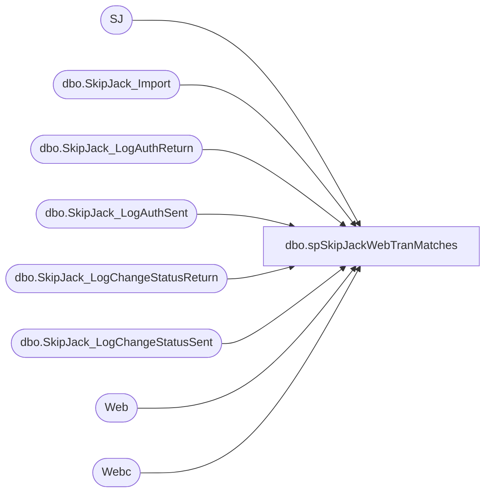

# dbo.spSkipJackWebTranMatches

**Database:** dw  
**Server:** papamart  

## Architecture Diagram



## Table Dependencies

| Referenced Table |
|---|
| SJ |
| dbo.SkipJack_Import |
| dbo.SkipJack_LogAuthReturn |
| dbo.SkipJack_LogAuthSent |
| dbo.SkipJack_LogChangeStatusReturn |
| dbo.SkipJack_LogChangeStatusSent |
| Web |
| Webc |

## Stored Procedure Code

```sql
Create Proc dbo.spSkipJackWebTranMatches
(@SJ_StartDate datetime, @SJ_EndDate datetime,
@Cart_StartDate datetime,@Cart_EndDate datetime)
AS

SET NOCOUNT ON

--Declare @SJ_StartDate datetime, @SJ_EndDate datetime,@Cart_StartDate datetime, @Cart_EndDate datetime


/***********************************************************************************************/
/* Get Data to Compare                                                                         */
/**********************************************************************************************/
--Cart CC Trans
--DROP TABLE #Web_CCTrans
--INSERT INTO #Web_CCTrans
SELECT    identity(int,1,1) ID,
          las.dTimeStamp as auth_date,
          las.sOrderNumber as SJ_OrderNumber,
          cast(las.sAmount as decimal(10,2)) as Web_CCAmount,
          lar.sTransactionID Web_TranID,
          convert(varchar(20),'NA') as Web_DesiredStatus, 
          convert(datetime,NULL) as Web_SettleDate,
          las.sSerialNumber Web_SerialNumber,
          0 Match
INTO #Web_CCTrans
FROM Bearwebdb.[WebCart_Commerce].[dbo].[SkipJack_LogAuthSent] las
join Bearwebdb.[WebCart_Commerce].[dbo].SkipJack_LogAuthReturn lar 
on las.id=lar.id
where lar.sReturnCode=1 
and lar.sIsApproved='1'
and cast(las.sAmount as decimal(10,2)) < 0
and las.dTimeStamp>=@Cart_StartDate
and las.dTimeStamp<@Cart_EndDate

--add SETTLED AUTHS
Insert into #Web_CCTrans
select las.dTimeStamp as auth_date,
       las.sOrderNumber SJ_OrderNumber, 
       cast(las.sAmount as decimal(10,2)) as Web_CCAmount,
       lar.sTransactionID Web_TranID,
       lcss.sDesiredStatus Web_DesiredStatus,
       lcsr.dTimeStamp as Web_SettleDate,
       las.sSerialNumber as Web_SerialNumber,
       0 Match
FROM Bearwebdb.[WebCart_Commerce].[dbo].[SkipJack_LogAuthSent] las
join Bearwebdb.[WebCart_Commerce].[dbo].SkipJack_LogAuthReturn lar 
on las.id=lar.id
join Bearwebdb.[WebCart_Commerce].[dbo].SkipJack_LogChangeStatusReturn lcsr 
on lar.sTransactionID=lcsr.sTransactionID
join Bearwebdb.[WebCart_Commerce].[dbo].[SkipJack_LogChangeStatusSent] lcss 
on lcss.id=lcsr.id
where lcsr.sErrorCode=0                 AND 
      lcss.sDesiredStatus='SETTLE'      AND 
      lcsr.sStatusResponse='SUCCESSFUL' AND 
      lcsr.dTimeStamp>=@Cart_StartDate  AND 
      lcsr.dTimeStamp<@Cart_EndDate


--Skip Jack Transaction
--DROP Table #SJ_CCTrans
--INSERT INTO #SJ_CCTrans (SJ_OrderNumber,SJ_transid,SJ_SettleDate,SJ_CCAmount,Match,SJ_Site)
SELECT 
          i.sOrderNumber                       SJ_OrderNumber,
          i.sTransactionID as                  SJ_transid,
          convert(varchar(12),i.dTransactionDate,101) as                SJ_SettleDate,
          isnull(i.mTransactionAmount,0)       SJ_CCAmount	,
          0 Match ,   
          sSiteName
INTO #SJ_CCTrans
FROM  archive.dbo.SkipJack_Import i 
where i.dTransactionDate >= @SJ_StartDate and i.dTransactionDate<@SJ_EndDate
Select * from #Web_CCTrans
Select * from #SJ_CCTrans
-- /************************************************************************************************/
-- /*                       */
-- /* Dups came in the form of:                                                                    */
-- /*1.Same SJ Number DIfferent Charge Amounts                                                     */
-- /*2.Same SJ Number Same Charge Amount Different Time Reported Charged                           */
-- /* 3. Do not use 3 this is dups and used for detail reprt so if you come up with a another       */
-- /*   type of mismatches go to 4.  There comes from 2                                            */
-- /************************************************************************************************/
--DROP TABLE #Web_CCNumCharges
SELECT SJ_OrderNumber,
Web_CCAmount,
count(*) Web_TimesRPTCharged,
convert(tinyint,0) as Match,
convert(int,0) as Num_Matches
INTO #Web_CCNumCharges
FROM  #Web_CCTrans
GROUP BY SJ_OrderNumber,
Web_CCAmount

--DROP TABLE #SJ_CCNumCharges

Select SJ_OrderNumber,
       SJ_CCAmount,
       count(*) SJ_TimesCharged,
       convert(tinyint,0) As Match
INTO #SJ_CCNumCharges
from #SJ_CCTrans
GROUP BY SJ_OrderNumber,SJ_CCAmount

--These match perfect amount and times charged
Update Web
SET Match=1
FROM #Web_CCNumCharges Web
INNER JOIN #SJ_CCNumCharges SJ
ON Web.SJ_OrderNumber=SJ.SJ_OrderNumber and
Web.Web_CCAmount=SJ.SJ_CCAmount and
Web.Web_TimesRPTCharged=SJ.SJ_TimesCharged 

Update SJ
SET Match=1
FROM #Web_CCNumCharges Web
INNER JOIN #SJ_CCNumCharges SJ
ON Web.SJ_OrderNumber=SJ.SJ_OrderNumber and
Web.Web_CCAmount=SJ.SJ_CCAmount and
Web.Web_TimesRPTCharged=SJ.SJ_TimesCharged 


--These match on SJ number and amount but not the right number of times
--Auditworks reports more times
--IN SJ the SJ Order Number is a primary key and only occurs once
Update Web
SET Match=2,
Num_Matches=SJ.SJ_TimesCharged 
FROM #Web_CCNumCharges Web
INNER JOIN #SJ_CCNumCharges SJ
ON Web.SJ_OrderNumber=SJ.SJ_OrderNumber and
Web.Web_CCAmount=SJ.SJ_CCAmount and
Web.Web_TimesRPTCharged>SJ.SJ_TimesCharged 

Update SJ
SET Match=2
FROM #Web_CCNumCharges Web
INNER JOIN #SJ_CCNumCharges SJ
ON Web.SJ_OrderNumber=SJ.SJ_OrderNumber and
Web.Web_CCAmount=SJ.SJ_CCAmount and
Web.Web_TimesRPTCharged>SJ.SJ_TimesCharged 

-- /************************************************************************************************/
-- /* Mark Matches                                                                                 */
-- /************************************************************************************************/
-- --Match 1
-- --Good Matches
Update Web
Set Match=1 
from #Web_CCTrans Web 
INNER JOIN #Web_CCNumCharges Webc
ON Web.SJ_OrderNumber=Webc.SJ_OrderNumber and
Web.Web_CCAmount=Webc.Web_CCAmount
Where Webc.Match=1
       
Update sj
SET Match=1 
from #SJ_CCTrans sj
INNER JOIN #SJ_CCNumCharges sjc
ON sj.SJ_OrderNumber=sjc.SJ_OrderNumber
and sj.SJ_CCAmount=sjc.SJ_CCAmount
Where sjc.Match=1

--Match 2 (match) and 3(duplicates)
--Include only those that appear the same number of times as SJ if they occur more and are not reported and match
--those greater will be reported as duplicates
DECLARE @match2_count int

SELECT @match2_count=count(*)
FROM #Web_CCNumCharges
Where Match=2 and Num_Matches>0

WHILE @match2_count>0
BEGIN
     Update Web
     SET Match=2 
     FROM  #Web_CCTrans Web 
     INNER JOIN 
     (    Select Web.SJ_OrderNumber,min(ID) ID 
          from #Web_CCTrans Web 
          INNER JOIN #Web_CCNumCharges Webc
          ON Web.SJ_OrderNumber=Webc.SJ_OrderNumber and
          Web.Web_CCAmount=Webc.Web_CCAmount
          Where Webc.Match=2 and Num_Matches>0 and Web.Match=0
          group by Web.SJ_OrderNumber) as q
     ON q.SJ_OrderNumber=Web.SJ_OrderNumber and q.ID=Web.ID 

     Update Webc 
     Set  Num_Matches=Num_Matches-1
     FROM #Web_CCNumCharges Webc
     Where Match=2 and Num_Matches>0


     SELECT @match2_count=count(*)
     FROM #Web_CCNumCharges
     Where Match=2 and Num_Matches>0

CONTINUE
END

Update Web 
Set Match=3
from #Web_CCTrans Web 
INNER JOIN #Web_CCNumCharges Webc
ON Web.SJ_OrderNumber=Webc.SJ_OrderNumber and
   Web.Web_CCAmount=Webc.Web_CCAmount
Where Webc.Match=2 and Web.Match=0

Update sj
SET Match=sjc.Match 
from #SJ_CCTrans sj
INNER JOIN #SJ_CCNumCharges sjc
ON sj.SJ_OrderNumber=sjc.SJ_OrderNumber
and sj.SJ_CCAmount=sjc.SJ_CCAmount
Where sjc.Match=2


-- /************************************************************************************************/
-- /* Drop Temp Tabels                                                                             */
-- /************************************************************************************************/
DROP TABLE #Web_CCNumCharges
DROP TABLE #SJ_CCNumCharges
```

