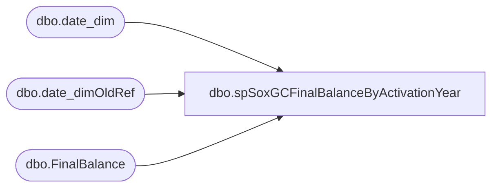

# dbo.spSoxGCFinalBalanceByActivationYear

**Database:** dw  
**Server:** papamart  

## Architecture Diagram



## Table Dependencies

| Referenced Table |
|---|
| dbo.date_dim |
| dbo.date_dimOldRef |
| dbo.FinalBalance |

## Stored Procedure Code

```sql
CREATE PROCEDURE [spSoxGCFinalBalanceByActivationYear]

AS

-- =============================================================================================================
-- Name: [DOMO].[spSoxGCFinalBalanceByActivationYear]
--
-- Description: Sox GiftCard Balance Reporting to DOMO.
-- 
--
--
-- Dependencies: 
--
-- Revision History
--		Name:				Date:			Comments:
--		Dan Tweedie			2017-01-07		Initial creation
--		Dan Tweedie			2018-03-01		Updated query to capture 12-31-2017 thru 02-03-2018 as '201800', and pre-fiscal calendar years (pre 2005) from old date dim
-- =============================================================================================================

set nocount on;

WITH FinalBalance 
AS 
	(
		
		SELECT			
			b.MID,		
			case 
				when cast(dd.actual_date as date) between '2017-12-31' and '2018-02-03' 
				then '201800'
				else isnull(dd.fiscal_year, d2.fiscal_year)
			end as ActivationYear,
			COUNT(*) AS numCards,		
			SUM(b.balance) AS balance,		
			SUM(b.activation_discount_balance) AS discountBalance		
		FROM			
			SOX.dbo.FinalBalance b WITH (NOLOCK)	
			join dw.dbo.date_dim dd with (nolock) on b.date_key = dd.date_key
			join dw.dbo.date_dimOldRef d2 with (nolock) on b.date_key = d2.date_key 
		GROUP BY b.MID, dd.fiscal_year, cast(dd.actual_date as date), d2.fiscal_year
	)
SELECT 
	MID,
	ActivationYear,
	sum(numCards) numCards,
	sum(balance) balance,
	sum(discountBalance) discountBalance
FROM FinalBalance
group by MID, ActivationYear
ORDER BY ActivationYear, MID
```

