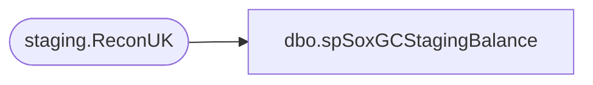

# dbo.spSoxGCStagingBalance

**Database:** dw  
**Server:** papamart  

## Architecture Diagram



## Table Dependencies

| Referenced Table |
|---|
| staging.ReconUK |

## Stored Procedure Code

```sql
CREATE PROCEDURE [spSoxGCStagingBalance]
@Fiscal_Year int,
@AuditQuarter int
AS

-- =============================================================================================================
-- Name: [DOMO].[spSoxGCStagingBalance]
--
-- Description: Sox StagingGiftCard Balance Reporting to DOMO.
-- 
--
--
-- Dependencies: 
--
-- Revision History
--		Name:				Date:			Comments:
--		Brian Byas			9/8/2016		Initial creation
-- =============================================================================================================


WITH StagingBalance (Fiscal_Year,AuditQuarter,ActivationMid,NumCards,OutstandingBalance) AS (
		
		/*
		-- Sox Staging GiftCard Balance Reporting
		*/
	
	
		SELECT
		@Fiscal_year AS Fiscal_Year,
		@AuditQuarter AS AuditQuarter,			
		ru.ActivationMid,	
		COUNT(*) AS NumCards,	
		SUM(ru.OutstandingBalance) AS OutstandingBalance	
	FROM		
		SOX.staging.ReconUK ru WITH (NOLOCK)	
	GROUP BY ru.ActivationMid		

		)


		SELECT * FROM StagingBalance
		ORDER BY ActivationMid
```

