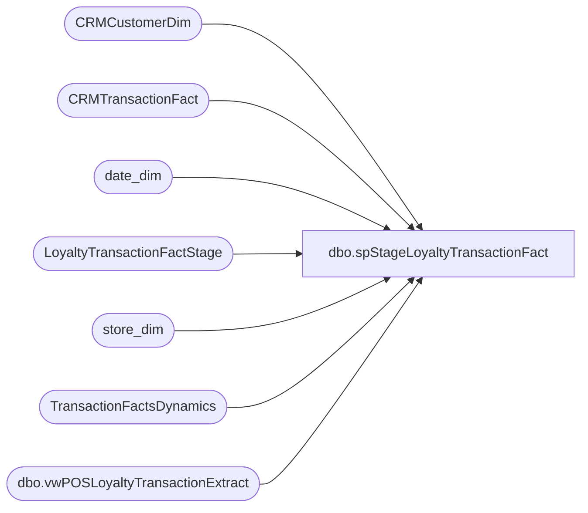

# dbo.spStageLoyaltyTransactionFact

**Database:** dw  
**Server:** papamart  

## Architecture Diagram



## Table Dependencies

| Referenced Table |
|---|
| CRMCustomerDim |
| CRMTransactionFact |
| date_dim |
| LoyaltyTransactionFactStage |
| store_dim |
| TransactionFactsDynamics |
| dbo.vwPOSLoyaltyTransactionExtract |

## Stored Procedure Code

```sql
CREATE proc spStageLoyaltyTransactionFact 

as 

set nocount on 

select 
	v.*
into #SA
from BEDROCKDB01.auditworks.dbo.vwPOSLoyaltyTransactionExtract v


select sa.*
into #SACD
from #SA sa
join CRMCustomerDim cd on sa.CustomerNumber collate SQL_Latin1_General_CP1_CI_AS=cd.CustomerNumber


select
	tf.transaction_id,
	tf.store_key as StoreKey,
	cast(dd.actual_date as date) as TransactionDate,
	tf.date_key as DateKey,
	tf.register_no as POSRegisterNumber,
	tf.transaction_no as POSTransactionNumber,
	tf.GAAP_sales_amount as GaapSales,
	tf.Gaap_units as GaapUnits,
	sacd.*
into #DW
from TransactionFactsDynamics tf with (nolock)
join date_dim dd on tf.date_key=dd.date_key
join store_dim sd on tf.store_key=sd.store_key
join #SACD sacd on tf.transaction_id=sacd.SATransactionID

insert LoyaltyTransactionFactStage
select 
	dw.transaction_id as TransactionID,	
	dw.StoreKey,
	dw.DateKey,
	dw.TransactionDate,
	isnull(CRMTransactionType, 'New') as LoyaltyTransactionType,
	dw.POSTransactionNumber,	
	dw.POSRegisterNumber,	
	dw.CustomerNumber,	
	dw.GaapSales,	
	dw.GaapUnits,	
	dw.matchedByEmail
from #DW dw
left join CRMTransactionFact ctf with (nolock) on dw.transaction_id=ctf.TransactionID 

--where dw.transaction_id=489863737
dbo,dt_adduserobject,/*
**	Add an object to the dtproperties table
*/
create procedure dbo.dt_adduserobject
as
	set nocount on
	/*
	** Create the user object if it does not exist already
	*/
	begin transaction
		insert dbo.dtproperties (property) VALUES ('DtgSchemaOBJECT')
		update dbo.dtproperties set objectid=@@identity 
			where id=@@identity and property='DtgSchemaOBJECT'
	commit
	return @@identity
```

