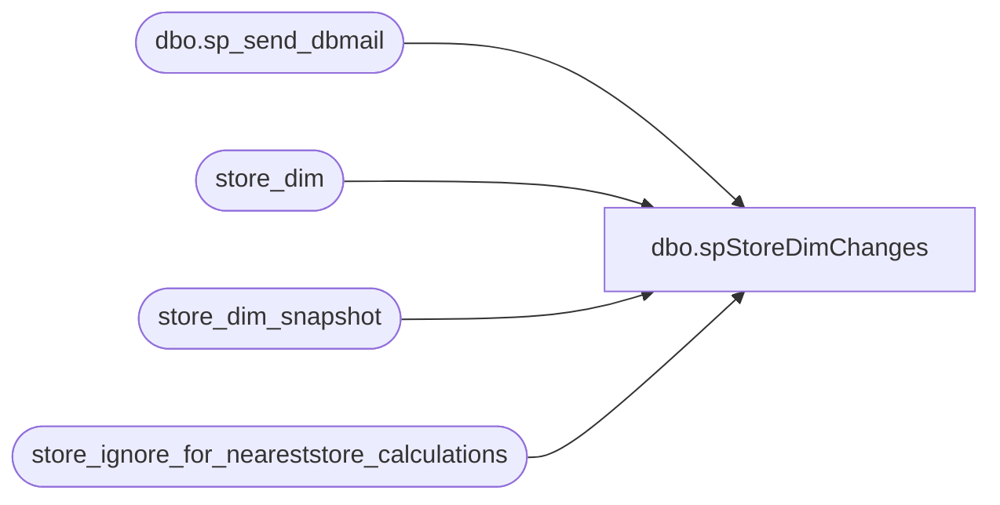

# dbo.spStoreDimChanges

**Database:** dw  
**Server:** papamart  

## Architecture Diagram



## Table Dependencies

| Referenced Table |
|---|
| dbo.sp_send_dbmail |
| store_dim |
| store_dim_snapshot |
| store_ignore_for_neareststore_calculations |

## Stored Procedure Code

```sql
CREATE PROCEDURE [dbo].[spStoreDimChanges] AS

-- =============================================================================================================
-- Name: spStoreDimChanges
--
-- Description:	

--
-- Input:		
--				
--
--
-- Output: 
--
-- Dependencies: 
--
-- Revision History
--		Name:			Date:			Comments:
--		GaryD			20090914		Update recipients
--		MikeP			20140724		replaced email procedure with sp_send_dbmail
-- =============================================================================================================
set nocount on
/*
The nearest store algorithm originally started with us providing a table of 3 nearest stores
per zipcode.  The nearest store function then took an address's lat/lon and went through those
three stores to find the true nearest store. This is why you will see references to ziptop3.  We
also experimented with ziptop2.

Figuring out 3 nearest stores per zip was overkill for an address.  We are so spread out
that figuring out one store per zipcode is quite sufficient.  If we were mcdonalds, then yes, it
would be an issue.  Now, there are some exceptions to this.  We need multiple stores per zip to
present a list on the web and for parties.  But, in terms of the data warehouse, it's not worth the
processing time.


ok, what can go wrong with the stores?  well, lots of things.  the store info
could be wrong in the merchandising system, first logic could come up with a different
lat/lon with the upgrade to a new version, the store could be rezoned to a new zipcode,
stores are opened/closed, ...

Since i've been building the nearest store list for the the past and future, any of these
changes could change our neareststore calculations. 

for example, lats/lons are roughly 60 miles per degree, granted longitude will become insignificant
as we move closer to the poles. so, let's just use 60 as an average for both lats and lons.  if the
store's lat/lon changes by one degree, we would be off by 60 miles, but typically, the changes will
be in fractions of degrees. 

So, we have two measurements to worry about, the nearest store calc by zipcode and an addresses distance
from the nearest store.  

for the nearest store calc:
Since we aren't mcdonalds with a store on every block, we can be very leniant on 
what differences we allow.  We do not place our stores that close and the nearest store algorithm is using the
centroid of the zipcode so there's additional flux.  not to mention that we don't take into account actual 
driving distances.  we actually have a problem with the great lakes.  the nearest store for some addresses is 
across the lake.

for the distance to nearest store calcs:
we typically deal with a rounded integer and on top of that, the strategic analysis group typically looks at addresses
in 5 mile increments.  Marketing looks at 40 mile wide trading areas.  so, half a mile really doesn't matter.


at what level would we care and have to redo things?  I'd suggest .01 because 
60*.01 would be a difference of .6 or about half a mile.  that would cause some issues with the nearest

select 60*.01


lats/lons


truncate table store_dim_snapshot

select store_key, store_id, postal_code, opening_date, closing_date, latitude, longitude
-- into store_dim_snapshot
from dw..store_dim
where store_id between 1 and 299
	or store_id between 1501 and 1589
	or store_id between 2001 and 2199
	or store_id between 2201 and 2299
order by store_id

delete from store_dim_snapshot where store_id = 2201

update store_dim_snapshot set latitude = 88 where store_id = 114

update store_dim_snapshot set latitude = null where store_id = 119

update store_dim_snapshot set longitude = null where store_id = 166

update store_dim_snapshot set opening_date = '1/1/2009' where store_id = 2006

update store_dim_snapshot set opening_date = null where store_id = 2007
update store_dim_snapshot set closing_date = '1/1/2009' where store_id = 9

************************************************************************************************************
************************************************************************************************************
************************************************************************************************************
also look in spNearestStoreHistoricalInsert


ok, there are changes to a store, what to do, what to do.
well, more than likely the changes are big enough to warrant rebuilding parts of the nearest store historical
structure, so we will have to find the first instance of the problem and then delete any records from there
forward and then just rerun the spNearestStoreHistoricalInsert

we'll also have to update the store_dim_snapshot to make sure we don't see this problem again.

let's go through a typical example, this proc just reported that store 291 data changed.  in this case the 
zip code changed from 77706-6718 to 77026-1315.  this means that the lat/lon will also change.

select * from store_dim where store_id = 291 
select * from store_dim_snapshot where store_id = 291 

-- destroy any instance of the store in the historical tables
delete from tblZipTop1_historical_us_ca
where date_key >= (select min(date_key) from tblZipTop1_historical_us_ca where store_key = 533)

exec spNearestStoreHistoricalInsert

-- we still have to worry about any addresses that might be associated with the wrong store.  if the
-- problem isn't too bad, we can just wait and let the monthly process verify the neareststore calculations.

-- update the snapshot
update store_dim_snapshot
set postal_code = s.postal_code, latitude = s.latitude, longitude = s.longitude
from store_dim_snapshot ss
	join store_dim s
	on s.store_key = ss.store_key
where ss.store_id = 291 

select * from guest_activity_summary where neareststore_key = 533

nearest_store_key
distance_to_nearest_store


select * from tblZipTop1_historical_us_ca

select max(date_key)
from tblZipTop1_historical_us_ca
where date_key < (select date_key from date_dim where actual_date = cast(convert(varchar, getdate(), 101) as datetime))


select dw.dbo.fnCalcDistance(s.latitude, s.longitude, c.lat, c.lon),
cast(dw.dbo.fnCalcDistance(s.latitude, s.longitude, c.lat, c.lon) as decimal(10,1)),* 
from tblZipTop1_historical_us_ca h
	join dw..tblUSCANzipsCombined c
	on c.zip = h.postal_code
	join dw..store_dim s
	on s.store_key = h.store_key
where date_key = 4206
order by h.postal_code


IF (Object_ID('dave_neareststore_us') IS NOT NULL) DROP TABLE dave_neareststore_us
select a.address_key, a.country, a.postal_code, 
	c.store_key nearest_store_key_new, round(dw.dbo.fnCalcDistance (a.latitude, a.longitude, c.latitude, c.longitude),0) distance_to_nearest_store_new,
	f.store_key nearest_futurestore_key_new, round(dw.dbo.fnCalcDistance (a.latitude, a.longitude, f.latitude, f.longitude),0) distance_to_nearest_futurestore_new
into dave_neareststore_us
from address_dim a with (nolock)
	join #us_ca_current c
	on c.postal_code = a.postal_code
	join #us_ca_future f
	on f.postal_code = a.postal_code
where 1=1
	and a.verified_address = 'Y'
 	and a.country in ('US', 'PR')
	and a.latitude is not null and a.longitude is not null
go
create index ix_dave_neareststore_us on dave_neareststore_us(address_key)


select * from 

select * from store_dim where store_id = 1


select * from tblUSCANzipsCombined order by zip

select * from date_dim where date_key = 4206


*/


-- new stores
IF (Object_ID('tempdb..##changed_stores') IS NOT NULL) DROP TABLE ##changed_stores
select 'new store' problem, s.store_id
into ##changed_stores
from store_dim s
	left join store_dim_snapshot ss
	on ss.store_key = s.store_key
	left join store_ignore_for_neareststore_calculations i
	on i.store_key = s.store_key
where (s.store_id between 1 and 299
	or s.store_id between 1501 and 1589
	or s.store_id between 2001 and 2199
	or s.store_id between 2201 and 2299)
	and ss.store_key is null
	and i.store_key is null
	and s.opening_date < dateadd(mm, 1, getdate())

union

-- changed lat/lon
select 'latitude change: ' + cast(isnull(ss.latitude,-99999) as varchar) + ' v/ ' + cast(isnull(s.latitude,-99999) as varchar)  problem, s.store_id
--select abs(ss.latitude - s.latitude), 'latitude change: ' + cast(isnull(ss.latitude,-99999) as varchar) + ' v/ ' + cast(isnull(s.latitude,-99999) as varchar)  problem, s.store_id
from store_dim s
	join store_dim_snapshot ss
	on ss.store_key = s.store_key
	left join store_ignore_for_neareststore_calculations i
	on i.store_key = s.store_key
where isnull(ss.latitude,-99999) != isnull(s.latitude,-99999)
	and abs(isnull(ss.latitude,-99999) - isnull(s.latitude,-99999)) > .05
	and i.store_key is null

/*
WITH Updates (store_key, NewLatitude, OldLatitude) AS (
	SELECT ss.store_key, s.latitude AS NewLatitude, ss.latitude AS OldLatitude
	FROM dw.dbo.store_dim_snapshot ss
	INNER JOIN dw.dbo.store_dim s
		ON s.store_key=ss.store_key
	WHERE ss.store_id in (328)
	) 
UPDATE Updates
SET OldLatitude=NewLatitude
*/

union

select 'longitude change: ' + cast(isnull(ss.longitude,-99999) as varchar) + ' v/ ' + cast(isnull(s.longitude,-99999) as varchar)  problem, s.store_id
from store_dim s
	join store_dim_snapshot ss
	on ss.store_key = s.store_key
	left join store_ignore_for_neareststore_calculations i
	on i.store_key = s.store_key
where isnull(ss.longitude,-99999) != isnull(s.longitude,-99999)
	and abs(isnull(ss.longitude,-99999) - isnull(s.longitude,-99999)) > .05
	and i.store_key is null

/*
WITH Updates (store_key, NewLongitude, OldLongitude) AS (
	SELECT ss.store_key, s.longitude AS NewLongitude, ss.longitude AS OldLongitude
	FROM dw.dbo.store_dim_snapshot ss
	INNER JOIN dw.dbo.store_dim s
		ON s.store_key=ss.store_key
	WHERE ss.store_id in (328)
	) 
UPDATE Updates
SET OldLongitude=NewLongitude
*/

union

-- changed opening date
select 'opening_date change: ' + convert(varchar, isnull(ss.opening_date,'1/1/3000'), 101) + ' v/ ' + convert(varchar, isnull(s.opening_date,'1/1/3000'), 101)  problem, s.store_id
from store_dim s
	join store_dim_snapshot ss
	on ss.store_key = s.store_key
	left join store_ignore_for_neareststore_calculations i
	on i.store_key = s.store_key
where isnull(ss.opening_date,'1/1/3000') != isnull(s.opening_date,'1/1/3000')
	and i.store_key is null
	and abs(datediff(dd, ss.opening_date,s.opening_date)) > 1	-- does one day really matter?  hopefully not

/*
WITH Updates (store_key, NewOpeningDate, OldOpeningDate) AS (
	SELECT ss.store_key, s.opening_date AS NewOpeningDate, ss.opening_date AS OldOpeningDate
	FROM dw.dbo.store_dim_snapshot ss
	INNER JOIN dw.dbo.store_dim s
		ON s.store_key=ss.store_key
	WHERE ss.store_id in (116,122,192,2020)
	) 
UPDATE Updates
SET OldOpeningDate=NewOpeningDate
*/

union

-- changed closing date
select 'closing_date change: ' + convert(varchar, isnull(ss.closing_date,'1/1/3000'), 101) + ' v/ ' + convert(varchar, isnull(s.closing_date,'1/1/3000'), 101)  problem, s.store_id
from store_dim s
	join store_dim_snapshot ss
	on ss.store_key = s.store_key
	left join store_ignore_for_neareststore_calculations i
	on i.store_key = s.store_key
where isnull(ss.closing_date,'1/1/3000') != isnull(s.closing_date,'1/1/3000')
	and i.store_key is null

if (select count(*) from ##changed_stores) > 0 
begin
	declare @subject varchar(200)
	declare @recipients varchar(200)
	
	set @recipients = 'Develobears@buildabear.com'
	set @recipients = 'databears@buildabear.com'
	set @subject = 'changes detected in store_dim'

	exec msdb.dbo.sp_send_dbmail 
	@recipients=@recipients
	,@subject = @subject
	,@query_result_width = 200	
	,@query = '
	print ''there are changes detected between dw..store_dim and dw..store_dim_snapshot''
	print ''''
	print ''this might affect our nearest store calculations''
	print ''''
	
	select * from ##changed_stores
	
	print ''''
	print ''this was run from dw..spStoreDimChanges''
	'
end

-- looks like the closing dates are working correctly, so just update the store_dim_snapshot, but, we want to be notified
-- assume email went out correctly for the notification
update store_dim_snapshot
set closing_date = s.closing_date
from store_dim_snapshot ss
	join store_dim s
	on s.store_id = ss.store_id
where ss.store_id in (select store_id from ##changed_stores where problem like 'closing%')
```

