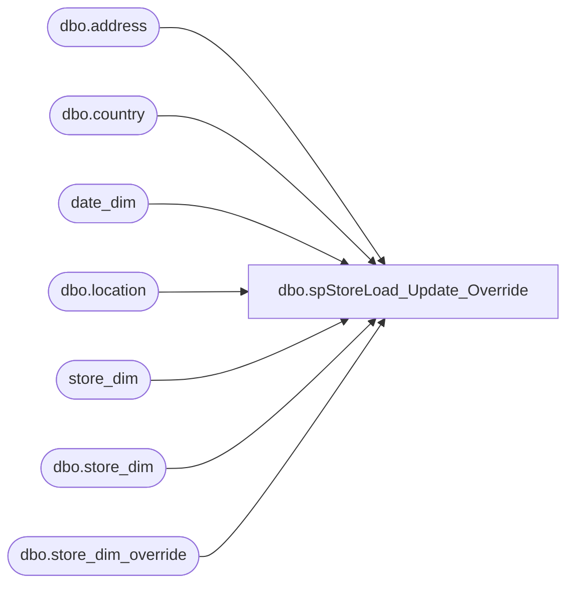

# dbo.spStoreLoad_Update_Override

**Database:** dw  
**Server:** papamart  

## Architecture Diagram



## Table Dependencies

| Referenced Table |
|---|
| dbo.address |
| dbo.country |
| date_dim |
| dbo.location |
| store_dim |
| dbo.store_dim |
| dbo.store_dim_override |

## Stored Procedure Code

```sql
CREATE PROCEDURE [dbo].[spStoreLoad_Update_Override]
AS

-- =============================================================================================================
-- Name: spStoreLoad_Update_Override
--
-- Description:	
--		updates store information that wasn't so easy to do through the informatica load.
--		overrides had always existed because of geocoding conflicts with first logic and new/bad addresses
--		for stores, so this override list became larger and larger
--
--		going to QAS complicated things since there was no integrated informatica interface, so i did what i
--		could.  there 
--
--This proc will override the updates done to the store_dim table.  There are a lot of them.
--
--It is highly questionable on which fields to even import.  So much is being overridden.  
--For now, just do the overrides and look into this later
--
--
---- geocoding
--good lord, these store addresses SUCK.  30% or more weren't viable
--
--Either i force jack to update them, or i override them.  UK was the worst, almost all were worthless
--
--I know firstlogic was much more flexible, but this is ridiculous.
--
--So, since we're not adding a bunch of stores, i should be able to manually update the lat/lon for now
--
-- Input:
--		
-- Output: 
--
-- Dependencies: 
--
-- EXAMPLE:
--		exec dw.dbo.spStoreLoad_Update_Override
--
-- Revision History
--		Name:			Date:			Comments:
--		Keith Missey	12/15/2012		updated incorrect lat/lon for 2058
--		Mike Pelikan	10/4/2012		added lat/lon for store 307
--		Keith Missey	5/1/2012		added lat/lon for store 613
--		Gary Murrish	2/5/2012		Added Lat/Lon for the following stores
--											2057, 2058, 2059, 2060, 2061, 2037
--		Gary Murrish	1/10/2012		Reversed Overrode Comp Date for store 046 - Washington Square
--		Gary Murrish	1/9/2012		Overrode Comp Date for store 046 - Washington Square
--		Gary Murrish	8/29/2011		Overrode Comp Date for store 225 - Bellis Fair
--		Gary Murrish	4/20/2011		Overrode Comp Date for Store 11 - Scottsdale.
--		Gary Murrish	3/24/2011		Overrode Comp Date for Store 60.
--		Gary Murrish	2/27/2011		Overrode Comp Date for store 263 Jefferson Mills
--		Gary Murrish	2/16/2011		Force Comp Date to the last date in the date_dim if it exceeds it.
--		Gary Murrish	1/11/2011		Overrode Comp Date for store 250
--		Gary Murrish	11/20/2010		Override Comp Date for King of Prussia (KOP) Store 30
--		Dave Rice		circa 2010		created
-- =============================================================================================================

BEGIN
-- SET NOCOUNT ON added to prevent extra result sets from
-- interfering with SELECT statements.
SET NOCOUNT ON;

--exec spStoreLoad_Update_Override

--select *
--into store_dim_override_20100331
--from store_dim

-- *******************************************************************************************************
-- *******************************************************************************************************
-- *******************************************************************************************************

--drop table #fields
--create table #fields (
--	field1 varchar(40)
--)
--alter table #fields add id int IDENTITY (1, 1) NOT FOR REPLICATION  NOT NULL
--
--
--insert into #fields values ('bearea')
----insert into #fields values ('store_name')	new wins
------insert into #fields values ('store_name_abbrv')
--insert into #fields values ('bearritory')
--insert into #fields values ('address1') -- old wins
--insert into #fields values ('region')	-- new wins
------insert into #fields values ('zone')
--insert into #fields values ('address2')
----insert into #fields values ('state_province_name') -- new wins
------insert into #fields values ('business_type')
--insert into #fields values ('city')
--insert into #fields values ('division')
--insert into #fields values ('state_province')
------insert into #fields values ('county')
------insert into #fields values ('business_unit')
--insert into #fields values ('country')
----insert into #fields values ('country_name') -- new wins
--insert into #fields values ('postal_code')
------insert into #fields values ('phone')
------insert into #fields values ('fax')
--insert into #fields values ('email')
--insert into #fields values ('opening_date')
------insert into #fields values ('active')
--insert into #fields values ('latitude')
--insert into #fields values ('longitude')
----insert into #fields values ('volume_group') -- new wins
------insert into #fields values ('store_mgr')
------insert into #fields values ('bearea_mgr')
------insert into #fields values ('bearitory_mgr')
------insert into #fields values ('region_mgr')
------insert into #fields values ('store_type')
--insert into #fields values ('closing_date')
--insert into #fields values ('comp_date')
------insert into #fields values ('store_group_id')
------insert into #fields values ('address3')
------insert into #fields values ('address4')
------insert into #fields values ('square_feet')
------insert into #fields values ('num_of_pos')
------insert into #fields values ('num_of_kiosks')
------insert into #fields values ('postal_plus4')
--
----insert into #fields values ('Abbreviation')	-- new wins
----insert into #fields values ('Legal_Description') -- new wins feeds from kodiak, but override when i need to
----insert into #fields values ('comp_week_id')	-- no longer used, besides, 272 are wrong
------insert into #fields values ('bearea_id')
------insert into #fields values ('bearitory_id')
------insert into #fields values ('region_id')
------insert into #fields values ('division_code')
------insert into #fields values ('language')
------insert into #fields values ('demographics_bg_key')
--
--
--
---- *******************************************************************************************************
---- *******************************************************************************************************
---- *******************************************************************************************************
--
--declare @sql varchar(8000)
--declare @field1 varchar(80)
--
--declare curFields cursor
--for
--select  field1
--from #fields
--order by id
--open curFields
--
--fetch next from curFields into @field1
--while (@@fetch_STATUS <> -1)
--begin
----		join store_dim_override  o
--
--	set @sql = '
--	select s.store_id, s.' + @field1 + ' new, o.' + @field1 + ' old, ''' + @field1 + ''', *
--	from dw.dbo.store_dim s
--		join dw.dbo.store_dim_override  o
--		on o.store_id = s.store_id
--	where 
--		isnull(cast(s.' + @field1 + ' as varchar), '''') != isnull(cast(o.' + @field1 + ' as varchar),'''')'
--
--
--	print @sql
--exec (@sql)
--
--	fetch next from curFields into @field1
--end
--close curFields
--deallocate curFields


-- *******************************************************************************************************
-- *******************************************************************************************************
-- *******************************************************************************************************


-- original overrides from informatica
--osql -Spapamart -ddw -Uosql -P05ql -Q"update store_dim set latitude = 41.229636877216485, longitude = -73.21967124938965 where store_id = 170"
--osql -Spapamart -ddw -Uosql -P05ql -Q"update store_dim set latitude = 43.794540, longitude = -79.51355 where store_id = 174"
--osql -Spapamart -ddw -Uosql -P05ql -Q"update store_dim set latitude = 49.228166999999999, longitude = -122.998749 where store_id = 177"
--osql -Spapamart -ddw -Uosql -P05ql -Q"update store_dim set latitude = 41.810000, longitude = -72.54800 where store_id = 132"
--osql -Spapamart -ddw -Uosql -P05ql -Q"update store_dim set latitude = 33.3275790000, longitude = -111.7594540000 where store_id = 268"
--osql -Spapamart -ddw -Uosql -P05ql -Q"update store_dim set latitude = 51.888334, longitude = 0.898951 where store_id = 2011"
--osql -Spapamart -ddw -Uosql -P05ql -Q"update store_dim set latitude = 53.4026708345865, longitude = -2.97856439598998 where store_id = 2051"
--osql -Spapamart -ddw -Uosql -P05ql -Q"update store_dim set latitude = 54.5993837194389, longitude = -5.92863755711422 where store_id = 2052"
--osql -Spapamart -ddw -Uosql -P05ql -Q"update store_dim set latitude = 52.1922151920792, longitude = 0.127268231683168 where store_id = 2053"
--osql -Spapamart -ddw -Uosql -P05ql -Q"update store_dim set latitude = 51.51055, longitude = -0.219162 where store_id = 2050"
--osql -Spapamart -ddw -Uosql -P05ql -Q"update store_dim set demographics_bg_key = '120990001012' where store_id = 9"
--osql -Spapamart -ddw -Uosql -P05ql -Q"update store_dim set demographics_bg_key = '090034001001' where store_id = 132"
--osql -Spapamart -ddw -Uosql -P05ql -Q"update store_dim set demographics_bg_key = 'L0C 1A0' where store_id = 174"
--osql -Spapamart -ddw -Uosql -P05ql -Q"update store_dim set demographics_bg_key = '050059502001' where store_id = 221"
--osql -Spapamart -ddw -Uosql -P05ql -Q"update store_dim set demographics_bg_key = '00918', country = 'US' where store_id = 255"
--osql -Spapamart -ddw -Uosql -P05ql -Q"update store_dim set city = 'Portland', postal_code = '97266-7736', latitude = '45.4354800000', longitude = '-122.5790930000', demographics_bg_key = '410050222012' where store_id = 49"
--osql -Spapamart -ddw -Uosql -P05ql -Q"update s set address1 = uk.address_line1, address2 = uk.address_line2, city = uk.address_city, postal_code = uk.address_zip_code from store_dim s join (select l.location_code,a.address_line1, a.address_line2,a.address_city, a.address_state, a.address_zip_code, c.country_code, c.country_description from oursmarchand.merchantworks.dbo.location l left join (select * from oursmarchand.merchantworks.dbo.address where parent_type != 3) a on l.location_id=a.parent_id left join oursmarchand.merchantworks.dbo.country c on a.country_id=c.country_id where l.location_code between 2000 and 2999) uk on s.store_id = uk.location_code"
--osql -Spapamart -ddw -Uosql -P05ql -Q"update store_dim set country='UK' where country='GB'"
--osql -Spapamart -ddw -Uosql -P05ql -Q"update store_dim set comp_date = '10/01/2006', comp_week_id = 509 where store_id = 1"
--osql -Spapamart -ddw -Uosql -P05ql -Q"update store_dim set comp_date = '10/03/2004', comp_week_id = 405 where store_id in (141,142,143,144,145,146)"
--osql -Spapamart -ddw -Uosql -P05ql -Q"update store_dim set comp_date = '10/31/2004', comp_week_id = 409 where store_id in (147,148,149,150,151,152)"
--osql -Spapamart -ddw -Uosql -P05ql -Q"update store_dim set comp_date = '11/28/2004', comp_week_id = 413 where store_id =153"
--osql -Spapamart -ddw -Uosql -P05ql -Q"update store_dim set comp_date = '04/03/2005', comp_week_id = 431 where store_id =154"
--osql -Spapamart -ddw -Uosql -P05ql -Q"update store_dim set comp_date = '05/29/2005', comp_week_id = 439 where store_id in (156,157,158)"
--osql -Spapamart -ddw -Uosql -P05ql -Q"update store_dim set comp_date = '07/03/2005', comp_week_id = 444 where store_id in (159,160,161,162)"
--osql -Spapamart -ddw -Uosql -P05ql -Q"update store_dim set comp_date = '08/28/2005', comp_week_id = 452 where store_id in (163,164,167)"
--osql -Spapamart -ddw -Uosql -P05ql -Q"update store_dim set comp_date = '10/02/2005', comp_week_id = 457 where store_id in (166,168,169,171)"
--osql -Spapamart -ddw -Uosql -P05ql -Q"update store_dim set comp_date = '10/30/2005', comp_week_id = 461 where store_id in (170,172,173,175)"
--osql -Spapamart -ddw -Uosql -P05ql -Q"update store_dim set comp_date = '11/27/2005', comp_week_id = 465 where store_id in (126,165,174)"
--osql -Spapamart -ddw -Uosql -P05ql -Q"update store_dim set comp_date = '04/02/2006', comp_week_id = 483 where store_id in (176,177, 178)"
--osql -Spapamart -ddw -Uosql -P05ql -Q"update store_dim set comp_date = '04/30/2006', comp_week_id = 487 where store_id in (181,182,183,184)"
--osql -Spapamart -ddw -Uosql -P05ql -Q"update store_dim set comp_date = '05/28/2006', comp_week_id = 491 where store_id in (185,186,187,188)"
--osql -Spapamart -ddw -Uosql -P05ql -Q"update store_dim set comp_date = '07/02/2006', comp_week_id = 496 where store_id in (189,190,191,192,195)"
--osql -Spapamart -ddw -Uosql -P05ql -Q"update store_dim set comp_date = '07/30/2006', comp_week_id = 500 where store_id in (193,196,200)"
--osql -Spapamart -ddw -Uosql -P05ql -Q"update store_dim set comp_date = '08/27/2006', comp_week_id = 504 where store_id =194"
--osql -Spapamart -ddw -Uosql -P05ql -Q"update store_dim set comp_date = '10/01/2006', comp_week_id = 509 where store_id in (197,198,199)"
--osql -Spapamart -ddw -Uosql -P05ql -Q"update store_dim set comp_date = '10/29/2006', comp_week_id = 513 where store_id in (201,202,204)"
--osql -Spapamart -ddw -Uosql -P05ql -Q"update store_dim set comp_date = '11/26/2006', comp_week_id = 517 where store_id in (203,205,206,207)"
--osql -Spapamart -ddw -Uosql -P05ql -Q"update store_dim set comp_date = '04/01/2007', comp_week_id = 535 where store_id in (6,208,210)"
--osql -Spapamart -ddw -Uosql -P05ql -Q"update store_dim set comp_date = '04/29/2007', comp_week_id = 539 where store_id in (211,213,214,216)"
--osql -Spapamart -ddw -Uosql -P05ql -Q"update store_dim set comp_date = '05/27/2007', comp_week_id = 543 where store_id in (217,218,219,220)"
--osql -Spapamart -ddw -Uosql -P05ql -Q"update store_dim set comp_date = '07/01/2007', comp_week_id = 548 where store_id in (215,221,222,223,224,225)"
--osql -Spapamart -ddw -Uosql -P05ql -Q"update store_dim set comp_date = '07/29/2007', comp_week_id = 552 where store_id in (226,227,229)"
--osql -Spapamart -ddw -Uosql -P05ql -Q"update store_dim set comp_date = '08/26/2007', comp_week_id = 556 where store_id in (228,232)"
--osql -Spapamart -ddw -Uosql -P05ql -Q"update store_dim set comp_date = '09/30/2007', comp_week_id = 561 where store_id in (231,233,236,237,238)"
--osql -Spapamart -ddw -Uosql -P05ql -Q"update store_dim set comp_date = '10/28/2007', comp_week_id = 565 where store_id in (234,235,239,240)"
--osql -Spapamart -ddw -Uosql -P05ql -Q"update store_dim set comp_date = '11/25/2007', comp_week_id = 569 where store_id in (230,241,242)"
--osql -Spapamart -ddw -Uosql -P05ql -Q"update store_dim set comp_date = '01/03/2015', comp_week_id = 939 where store_id in (17,155,179,180,212,209,482,485,486)"


update dw.dbo.store_dim set latitude = 41.229636877216485, longitude = -73.21967124938965 where store_id = 170
update dw.dbo.store_dim set latitude = 43.794540, longitude = -79.51355 where store_id = 174
update dw.dbo.store_dim set latitude = 49.228166999999999, longitude = -122.998749 where store_id = 177
update dw.dbo.store_dim set latitude = 41.810000, longitude = -72.54800 where store_id = 132
update dw.dbo.store_dim set latitude = 33.3275790000, longitude = -111.7594540000 where store_id = 268
update dw.dbo.store_dim set latitude = 51.888334, longitude = 0.898951 where store_id = 2011
update dw.dbo.store_dim set latitude = 51.51055, longitude = -0.219162 where store_id = 2050
update dw.dbo.store_dim set latitude = 53.4026708345865, longitude = -2.97856439598998 where store_id = 2051
update dw.dbo.store_dim set latitude = 54.5993837194389, longitude = -5.92863755711422 where store_id = 2052
update dw.dbo.store_dim set latitude = 52.1922151920792, longitude = 0.127268231683168 where store_id = 2053
update dw.dbo.store_dim set latitude = 51.37879544403593, longitude = -2.3592355102300 where store_id = 2055
update dw.dbo.store_dim set latitude = 54.974953, longitude = -1.613481 where store_id = 2056
update dw.dbo.store_dim set latitude = 51.543633, longitude = -0.006845 WHERE store_id = 2057
update dw.dbo.store_dim SET latitude = 52.635829, longitude = -1.137585 WHERE store_id = 2058
update dw.dbo.store_dim SET latitude = 54.957672, longitude = -1.668543 WHERE store_id = 2059
UPDATE dw.dbo.store_dim SET latitude = 51.751391, longitude = -1.26029 WHERE store_id = 2060
UPDATE dw.dbo.store_dim SET latitude = 53.594912, longitude = -2.293289 WHERE store_id = 2061
UPDATE dw.dbo.store_dim SET latitude = 37.695370, longitude = -121.928945 WHERE store_id = 307


UPDATE dw.dbo.store_dim SET latitude = 53.286033, longitude= -6.241675 where store_id = 2036

update dw.dbo.store_dim set latitude = 36.296903, longitude = -86.699372 where store_id = 601
update dw.dbo.store_dim set latitude = 33.599266, longitude = -111.983772 where store_id = 602
update dw.dbo.store_dim set latitude = 42.383238, longitude = -87.954814 where store_id = 603
update dw.dbo.store_dim set latitude = 45.555966, longitude = -94.151767 where store_id = 604
update dw.dbo.store_dim set latitude = 34.313025, longitude = -88.706618 where store_id = 605
update dw.dbo.store_dim set latitude = 39.191426, longitude = -75.543892 where store_id = 606
update dw.dbo.store_dim set latitude = 34.039211, longitude = -118.090602 where store_id = 607
update dw.dbo.store_dim set latitude = 38.438211, longitude = -122.714598 where store_id = 608
update dw.dbo.store_dim set latitude = 37.693114, longitude = -121.923420 where store_id = 609
update dw.dbo.store_dim set latitude = 38.795518, longitude = -76.997127 where store_id = 610
update dw.dbo.store_dim set latitude = 32.545450, longitude = -117.040764 where store_id = 611
update dw.dbo.store_dim set latitude = 28.430553, longitude = -81.305143 where store_id = 305
update dw.dbo.store_dim set latitude = 27.712793, longitude = -97.374530 where store_id = 613

update dw.dbo.store_dim set demographics_bg_key = '120990001012' where store_id = 9
update dw.dbo.store_dim set demographics_bg_key = '090034001001' where store_id = 132
update dw.dbo.store_dim set demographics_bg_key = 'L0C 1A0' where store_id = 174
update dw.dbo.store_dim set demographics_bg_key = '050059502001' where store_id = 221
update dw.dbo.store_dim set demographics_bg_key = '00918', country = 'US' where store_id = 255
update dw.dbo.store_dim set city = 'Portland', postal_code = '97266-7736', latitude = '45.4354800000', longitude = '-122.5790930000', demographics_bg_key = '410050222012' where store_id = 49

update store_dim  set demographics_bg_key = '721270065003' where store_id = 255
update store_dim  set demographics_bg_key = '516500103052' where store_id = 304
update store_dim  set demographics_bg_key = '470370104013' where store_id = 601
update store_dim  set demographics_bg_key = '040131032082' where store_id = 602
update store_dim  set demographics_bg_key = '170978616032' where store_id = 603
update store_dim  set demographics_bg_key = '271450002001' where store_id = 604
update store_dim  set demographics_bg_key = '280819505003' where store_id = 605
update store_dim  set demographics_bg_key = '100010405002' where store_id = 606
update store_dim  set demographics_bg_key = '060374825222' where store_id = 607
update store_dim  set demographics_bg_key = '060971520001' where store_id = 608
update store_dim  set demographics_bg_key = '060014506021' where store_id = 609
update store_dim  set demographics_bg_key = '240338014051' where store_id = 610
update store_dim  set demographics_bg_key = '060730100092' where store_id = 611

-- jack hadn't put these in yet and 611 was way off
update dw.dbo.store_dim set opening_date = '12/10/2010' where store_id = 611
update dw.dbo.store_dim set closing_date = '01/02/2011' where store_id = 250
update dw.dbo.store_dim set closing_date = '01/09/2011' where store_id = 486
update dw.dbo.store_dim set closing_date = '01/22/2011' where store_id = 263


update s set address1 = uk.address_line1, address2 = uk.address_line2, city = uk.address_city, postal_code = uk.address_zip_code 
	from dw.dbo.store_dim s 
	join (
		select l.location_code,
			a.address_line1, 
			a.address_line2,
			a.address_city, 
			a.address_state, 
			a.address_zip_code, 
			c.country_code, 
			c.country_description 
		from bedrockdb02.me_01.dbo.location l 
		left join (select * from bedrockdb02.me_01.dbo.address where parent_type != 3) a 
		on l.location_id=a.parent_id 
		left join bedrockdb02.me_01.dbo.country c 
		on a.country_id=c.country_id 
		where l.location_code between 2000 and 2999) uk 
	on s.store_id = uk.location_code

update dw.dbo.store_dim 
set address1 = o.address1, 
	address2 = o.address2, 
	state_province_name = o.state_province_name, 
	city = o.city, 
	state_province = o.state_province, 
	country = o.country, 
	postal_code = o.postal_code
from dw.dbo.store_dim s
	join dw.dbo.store_dim_override o
	on o.store_id = s.store_id

update dw.dbo.store_dim set legal_description = 'Peninsula Town Center', latitude = 37.0446460000, longitude = -76.3897680000 where store_id = 304

-- the comp_dates should be one year from the open date and set to the first day of that fiscal month
-- 53 week fiscal years can complicate this

-- closing of the doll stores that had a physical tie to a bear store threw things off.  because of
-- the closings, we weren't comparing apples to apples.  So, if store 1 was open in 1997, then it's comp
-- date should have been in 1998, but since it was attached to a doll store, it's new comp date is in 2010

update dw.dbo.store_dim set comp_date = '10/01/2006' where store_id = 1
update dw.dbo.store_dim set comp_date = '10/03/2004' where store_id in (141,142,143,144,145,146)
update dw.dbo.store_dim set comp_date = '10/31/2004' where store_id in (147,148,149,150,151,152)
update dw.dbo.store_dim set comp_date = '11/28/2004' where store_id =153
update dw.dbo.store_dim set comp_date = '04/03/2005' where store_id =154
update dw.dbo.store_dim set comp_date = '05/29/2005' where store_id in (156,157,158)
update dw.dbo.store_dim set comp_date = '07/03/2005' where store_id in (159,160,161,162)
update dw.dbo.store_dim set comp_date = '08/28/2005' where store_id in (163,164,167)
update dw.dbo.store_dim set comp_date = '10/02/2005' where store_id in (166,168,169,171)
update dw.dbo.store_dim set comp_date = '10/30/2005' where store_id in (170,172,173,175)
update dw.dbo.store_dim set comp_date = '11/27/2005' where store_id in (126,165,174)
update dw.dbo.store_dim set comp_date = '04/02/2006' where store_id in (176,177, 178)
update dw.dbo.store_dim set comp_date = '04/30/2006' where store_id in (181,182,183,184)
update dw.dbo.store_dim set comp_date = '05/28/2006' where store_id in (185,186,187,188)
update dw.dbo.store_dim set comp_date = '07/02/2006' where store_id in (189,190,191,192,195)
update dw.dbo.store_dim set comp_date = '07/30/2006' where store_id in (193,196,200)
update dw.dbo.store_dim set comp_date = '08/27/2006' where store_id =194
update dw.dbo.store_dim set comp_date = '10/01/2006' where store_id in (197,198,199)
update dw.dbo.store_dim set comp_date = '10/29/2006' where store_id in (201,202,204)
update dw.dbo.store_dim set comp_date = '11/26/2006' where store_id in (203,205,206,207)
update dw.dbo.store_dim set comp_date = '04/01/2007' where store_id in (6,208,210)
update dw.dbo.store_dim set comp_date = '04/29/2007' where store_id in (211,213,214,216)
update dw.dbo.store_dim set comp_date = '05/27/2007' where store_id in (217,218,219,220)
update dw.dbo.store_dim set comp_date = '07/01/2007' where store_id in (215,221,222,223,224)
update dw.dbo.store_dim set comp_date = '12/31/2399' where store_id in (225) -- GMurrish 8/29/2011
update dw.dbo.store_dim set comp_date = '07/29/2007' where store_id in (226,227,229)
update dw.dbo.store_dim set comp_date = '08/26/2007' where store_id in (228,232)
update dw.dbo.store_dim set comp_date = '09/30/2007' where store_id in (231,233,236,237,238)
update dw.dbo.store_dim set comp_date = '10/28/2007' where store_id in (234,235,239,240)
update dw.dbo.store_dim set comp_date = '11/25/2007' where store_id in (230,241,242)

update dw.dbo.store_dim set comp_date = '01/03/2015' where store_id in (17,155,179,180,212,209,482,485,486,285,470)

update dw.dbo.store_dim set comp_date = '2015-01-03' where store_id = 165
update dw.dbo.store_dim set comp_date = '2015-01-03' where store_id = 242
update dw.dbo.store_dim set comp_date = '2010-08-22' where store_id = 1401
update dw.dbo.store_dim set comp_date = '2010-08-29' where store_id = 1515
update dw.dbo.store_dim set comp_date = '2009-11-19' where store_id = 9411

update dw.dbo.store_dim set comp_date = '2010-07-04' where store_id = 	1
update dw.dbo.store_dim set comp_date = '2010-08-29' where store_id = 	5
update dw.dbo.store_dim set comp_date = '2010-10-03' where store_id = 	6
update dw.dbo.store_dim set comp_date = '2010-05-30' where store_id = 	16
update dw.dbo.store_dim set comp_date = '2010-07-04' where store_id = 	126
update dw.dbo.store_dim set comp_date = '2010-05-30' where store_id = 	214
update dw.dbo.store_dim set comp_date = '2009-07-05' where store_id = 	284
update dw.dbo.store_dim set comp_date = '2009-05-03' where store_id = 	286
update dw.dbo.store_dim set comp_date = '2009-08-02' where store_id = 	289
update dw.dbo.store_dim set comp_date = '2009-08-02' where store_id = 	293
update dw.dbo.store_dim set comp_date = '2009-11-01' where store_id = 	302
update dw.dbo.store_dim set comp_date = '2009-11-01' where store_id = 	2050
update dw.dbo.store_dim set comp_date = '2009-05-31' where store_id = 	2051
update dw.dbo.store_dim set comp_date = '2010-11-24' where store_id = 	30 -- GM 11/20/2010
UPDATE dw.dbo.store_dim SET comp_date = '2015-01-03' WHERE store_id =   250	-- GM 1/11/2011
UPDATE dw.dbo.store_dim SET comp_date = '2015-01-03' WHERE store_id =   263	-- GM 2/22/2011
UPDATE dw.dbo.store_dim SET comp_date = '2015-01-03' WHERE store_id =   60	-- GM 3/24/2011
UPDATE dw.dbo.store_dim SET comp_date = '2012-05-27' WHERE store_id =   11	-- GM 4/20/2011

-- Fix any other comp_dates that exceed the last date in the date_dim
DECLARE @lastCalendarDate AS DATETIME
SET @lastCalendarDate = (SELECT MAX(actual_date) FROM date_dim)
--SELECT @lastCalendarDate
UPDATE dw.dbo.store_dim SET comp_date = @lastCalendarDate WHERE comp_date > @lastCalendarDate


update dw.dbo.store_dim set comp_week_id = null

update dw.dbo.store_dim set opening_date = '2006-04-21' where store_id = 214
update dw.dbo.store_dim set opening_date = '2008-07-03' where store_id = 284
update dw.dbo.store_dim set opening_date = '2008-05-02' where store_id = 286
update dw.dbo.store_dim set opening_date = '2008-07-10' where store_id = 289
update dw.dbo.store_dim set opening_date = '2008-07-10' where store_id = 291
update dw.dbo.store_dim set opening_date = '2008-09-19' where store_id = 298
update dw.dbo.store_dim set opening_date = '2008-10-23' where store_id = 299
update dw.dbo.store_dim set opening_date = '2008-11-07' where store_id = 300
update dw.dbo.store_dim set opening_date = '2008-10-24' where store_id = 301
update dw.dbo.store_dim set opening_date = '2008-10-30' where store_id = 302
update dw.dbo.store_dim set opening_date = '2009-08-24' where store_id = 1401
update dw.dbo.store_dim set opening_date = '2009-08-19' where store_id = 1515
update dw.dbo.store_dim set opening_date = '2008-09-19' where store_id = 2053
update dw.dbo.store_dim set opening_date = '2008-11-20' where store_id = 9411

update dw.dbo.store_dim set country='UK' where country='GB'
update dw.dbo.store_dim set country='US' where country='USA'

--select * from store_dim
--select * from store_dim_override
--
--select * 
--from store_dim s
--	left join store_dim_override o
--	on o.store_id = s.store_id
--where o.store_id is null

END
```

