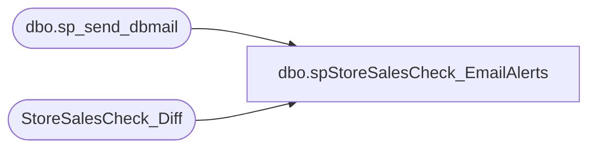

# dbo.spStoreSalesCheck_EmailAlerts

**Database:** dw  
**Server:** papamart  

## Architecture Diagram



## Table Dependencies

| Referenced Table |
|---|
| dbo.sp_send_dbmail |
| StoreSalesCheck_Diff |

## Stored Procedure Code

```sql
-- =============================================================================================================
-- Name: spStoreSalesCheck_EmailAlerts
--
-- Description:	
--		Spawn off important emails related to the StoreSalesCheck process
--		
--
-- Input:
--
-- Output: 
--
-- Dependencies: 
--
-- EXAMPLE:
--		exec spStoreSalesCheck_EmailAlerts 
--
-- Revision History
--		Name:			Date:			Comments:
--		Dave Rice		8/20/2010		created
--		Mike Pelikan	2/24/2012		updated email  recipients
--		Dan Tweedie		12/1/2015		Added extra zero to end of @max_body_length, removed databears from email distribution.
--		Anthony Delgado 07/11/2016		updated email recipients
-- =============================================================================================================

CREATE PROCEDURE [dbo].[spStoreSalesCheck_EmailAlerts]
AS
BEGIN
-- SET NOCOUNT ON added to prevent extra result sets from
-- interfering with SELECT statements.
SET NOCOUNT ON;

declare @subject varchar(100)
declare @query varchar(8000)
declare @recipients varchar(200)

set @subject = case 
					when (select count(*) from StoreSalesCheck_Diff) = 0 
					then 'StoreSalesCheck - No Issues'
					else 'StoreSalesCheck - Issues'
				end

set @recipients = 'poll@buildabear.com'


declare @body nvarchar(4000)
declare @store_id nvarchar(20)
declare @aw_units nvarchar(20)
declare @store_units nvarchar(20)
declare @diff_units nvarchar(20)
declare @issue nvarchar(20)

declare @max_body_length_reached bit
declare @max_body_length int
set @max_body_length = 35000 --this was previously 3500, which only allowed for about 100 rows, I don't think we should need a limit, we have less than 300 stores, so increasing it to 35000 should do the trick - DanT 12/1/2015
set @max_body_length_reached = 0

set @body = 
	'
	<html>
	<body>
	<STYLE TYPE="text/css">
	<!--
	TD{font-family: Arial; font-size: 9pt; text-align: right}
	--->
	</STYLE>

	<table border=1>
	<tr><b><td>store</td><td>aw_units</td><td>st_units</td><td>diff</td><td>issue</td></b></tr>
	'
	
	DECLARE curStores CURSOR READ_ONLY FORWARD_ONLY LOCAL
	FOR
		select store_id, aw_units, store_units, diff_units, issue
		from StoreSalesCheck_Diff
		order by store_id
	
	OPEN curStores
	FETCH NEXT FROM curStores INTO @store_id, @aw_units, @store_units, @diff_units, @issue
	 
	WHILE (@@Fetch_Status <> -1)
	BEGIN
		if @max_body_length_reached = 0
		begin
			if len(@body) > @max_body_length
			begin
				set @body = @body + '<tr><td colspan=5> too many to list</td></tr>'
				set @max_body_length_reached = 1
			end

			else 
			begin
				set @body = @body + '<tr><td>' + @store_id + '</td><td>' + @aw_units + '</td><td>' + @store_units + '</td><td>' + @diff_units + '</td><td>' + @issue + '</td></tr>'
			end
		end

		FETCH NEXT FROM curStores INTO @store_id, @aw_units, @store_units, @diff_units, @issue
	END	
	
	CLOSE curStores
	DEALLOCATE curStores	
	
	set @body = @body +
	'</table>

	<font face =arial size = 1><i>This was run from papamart.dw.dbo.spStoreSalesCheck_EmailAlerts.</i></font>
	</body>
	<html>
	'

    EXEC msdb.dbo.sp_send_dbmail 
		@recipients = @recipients, 
        @subject = @subject, --@query_result_width = 500,
        @body_format = 'HTML', @body = @body

END


dbo,spRPT_GiftcardUpsell_Summary_forDateCountry,-- =====================================================================================================
-- Name: spRPT_GiftcardUpsell_Summary_forDateCountry
--
-- Description:	Extracts the informtion for GiftcardUpsell_Summary_ForDateCountry report
--
-- Input: None
--
-- Output: Resultset 
--			
--
-- Dependencies: None
--
-- Revision History
--		Name:			Date:			Comments:
--		Gary Murrish	12/23/2013		Initial Release
-- =====================================================================================================
CREATE PROCEDURE [dbo].[spRPT_GiftcardUpsell_Summary_forDateCountry]
	@fromDate datetime,
	@thruDate datetime,
	@forCountry varchar(50)

AS
BEGIN
	SET NOCOUNT ON;

	DECLARE @fromDateKey int
	DECLARE @thruDateKey int
	SELECT
		@fromDateKey = date_key
	FROM
		date_dim dd WITH (NOLOCK)
	WHERE
		dd.actual_date = @fromDate
	SELECT
		@thruDateKey = date_key
	FROM
		date_dim dd WITH (NOLOCK)
	WHERE
		dd.actual_date = @thruDate

	-- Get all of the redemptions with activated discounts
	IF OBJECT_ID('tempdb..#tmpRedemptions') IS NOT NULL
	BEGIN
		DROP TABLE #tmpRedemptions
	END

	SELECT
		sd.store_id,
		gr.giftcard_no,
		gr.redemption_amount,
		gr.currency_key AS redCurrency_Key,
		gr.activation_discount_amount,
		tf.transaction_no AS redTransaction_no,
		tf.register_no AS redRegister_no,
		dd.actual_date AS redDate,
		gr.date_key AS red_Date_Key,
		gr.daysSinceLastActivation,
		sd.store_name_abbrv AS redStoreName
	INTO #tmpRedemptions
	FROM
		giftcards_redeemed gr WITH (NOLOCK)
		INNER JOIN store_dim sd WITH (NOLOCK)
			ON gr.store_key = sd.store_key
		INNER JOIN Transaction_Facts tf WITH (NOLOCK)
			ON gr.transaction_id = tf.transaction_id
		INNER JOIN date_dim dd WITH (NOLOCK)
			ON gr.date_key = dd.date_key
	WHERE
		gr.date_key BETWEEN @fromDateKey AND @thruDateKey
		AND gr.activation_discount_amount <> 0
		AND sd.country = @forCountry
	-- (3501 row(s) affected)

	SELECT
		r.giftcard_no,
		r.redemption_amount,
		r.store_id AS redStoreNo,
		r.redStoreName AS redStoreName,
		r.activation_discount_amount AS redDiscountApplied,
		r.redTransaction_no,
		r.redRegister_no,
		r.redDate,
		r.daysSinceLastActivation,
		cdr.currency_code AS redCurrency_code
	FROM
		#tmpRedemptions r WITH (NOLOCK)
		INNER JOIN currency_dim cdr WITH (NOLOCK)
			ON r.redCurrency_Key = cdr.currency_key
END


dbo,spGuestLoad_Pull_Clnsd_Addresses,-- =============================================================================================================
-- Name: spGuestLoad_Pull_Clnsd_Addresses
--
-- Description:	
--		Take the cleansed addresses from QAS batch api and tie them with the raw data so that we can process them,
--		as new or updates.
--
-- Input:
--		@etl_log_id			int	
--			Current load to process
--
-- Output: 
--		data will be loaded into dw.dbo.GuestLoad_Pull_Clnsd_Addresses 
--
-- Dependencies: 
--
-- EXAMPLE:
--		exec dw.dbo.spGuestLoad_Pull_Clnsd_Addresses 1
--
-- Revision History
--		Name:			Date:			Comments:
--		Dave Rice		7/19/2010		created
--		Dave Rice		01/06/2011		changed global date and cleaned up mail_stat_cd
--		Dan Tweedie		08/20/2016		Altered proc to allow for bypass of QASCleansing tables
--      Tim Bytnar		09/19/2017		The geocodable flag was breaking the ETL.  Now we're setting it to 1 everytime.
-- =============================================================================================================
CREATE PROCEDURE [dbo].[spGuestLoad_Pull_Clnsd_Addresses](@etl_log_id int)
AS
BEGIN

SET NOCOUNT ON;


-- pull any closely matching cleansed addresses, we'll get tighter down below, but at least we can use the index for this part
IF (Object_ID('tempdb..#clnsd_addr') IS NOT NULL) DROP TABLE #clnsd_addr
select distinct 
	cad.clnsd_addr_id, 
	cad.addr_ln_1_txt, 
	isnull(cad.addr_ln_2_txt,'') addr_ln_2_txt, 
	isnull(cad.apt_unit_nbr,'') apt_unit_nbr, 
	isnull(cad.st_prvnc_abbrv,'') st_prvnc_abbrv, 
	cad.pstl_cd, 
	cad.cntry_abbrv
into #clnsd_addr
from dwstaging.dbo.BATCH_ADDR_STG g with (nolock)
	join dw.dbo.clnsd_addr_dim cad with (nolock)
	on cad.addr_ln_1_txt = g.addr_ln_1_txt
	and cad.pstl_cd = g.pstl_cd
create index ix_clnsd_addr on #clnsd_addr(addr_ln_1_txt, apt_unit_nbr, pstl_cd, cntry_abbrv)

truncate table GuestLoad_Pull_Clnsd_Addresses

-- non-puerto rico
insert into GuestLoad_Pull_Clnsd_Addresses (
	stg_id, stg_dta_set_cd, raw_addr_id, mail_stat_cd, opt_in_src_sys_cd, orig_src_sys_cd, glbl_opt_in_dt, 
	clnsd_addr_id, qas_rtrn_cd, addr_ln_1_txt, addr_ln_2_txt, addr_ln_3_txt, apt_unit_nbr, cty_nm, cnty_nm, st_prvnc_nm, st_prvnc_abbrv, 
	pstl_cd, nrst_str_pstl_cd, pstl_pls_4_cd, cntry_abbrv, cntry_nm,
	lat_nbr, long_nbr, apt_unit_ind, addr_typ_cd, addr_typ_descr, addr_actv_stat_cd, geocodable)
select distinct
	c.stg_id,
	c.stg_dta_set_cd,
	c.raw_addr_id,
	case 
		when rad.drvd_mail_stat_cd = 'N' then 'OPT-OUT'
		when rad.drvd_mail_stat_cd = 'Y' then 'OPT-IN'
		else 'UNK'
	end mail_stat_cd,
	c.stg_dta_set_cd opt_in_src_sys_cd,
	c.stg_dta_set_cd orig_src_sys_cd,
	'1/1/1900' glbl_opt_in_dt,

	case 
		when cad.clnsd_addr_id is not null then cad.clnsd_addr_id 
		when substring(g.qas_rtrn_cd, 1, 2) != 'R9' then -1
	end clnsd_addr_id,

	g.qas_rtrn_cd, 
	g.addr_ln_1_txt,
	case when g.addr_ln_2_txt = '' then null else g.addr_ln_2_txt end addr_ln_2_txt,
	case when g.addr_ln_3_txt = '' then null else g.addr_ln_3_txt end addr_ln_3_txt,
	case when g.apt_unit_nbr = '' then null else g.apt_unit_nbr end apt_unit_nbr,
	case when g.cty_nm = '' then null else g.cty_nm end cty_nm,
	case when g.cnty_nm = '' then null else g.cnty_nm end cnty_nm,
	case when g.st_prvnc_nm = '' then null else g.st_prvnc_nm end st_prvnc_nm,
	case when g.st_prvnc_abbrv = '' then null else g.st_prvnc_abbrv end st_prvnc_abbrv,
	case when g.pstl_cd = '' then null else g.pstl_cd end pstl_cd,
	case 
		when g.cntry_abbrv in ('CAN','GBR') and charindex(' ',g.pstl_cd) > 0 then substring(g.pstl_cd, 1, charindex(' ',g.pstl_cd)-1) 
		else case when g.pstl_cd = '' then null else g.pstl_cd end
		end nrst_str_pstl_cd,
	case when g.pstl_pls_4_cd = '' then null else g.pstl_pls_4_cd end pstl_pls_4_cd,
	g.cntry_abbrv,
	case when g.cntry_nm = '' then null else g.cntry_nm end cntry_nm,

	case when can.fsaldu is not null then cast(can.latitude as varchar(20))
		when g.lat_nbr = '' then null 
		else g.lat_nbr 
	end lat_nbr,
	case when can.fsaldu is not null then cast(can.longitude as varchar(20))
		when g.long_nbr = '' then null 
		else g.long_nbr 
	end long_nbr,

	case when g.apt_unit_ind = '' then null else g.apt_unit_ind end apt_unit_ind,
	case when g.addr_typ_cd = '' then null else g.addr_typ_cd end addr_typ_cd,
	case when g.addr_typ_descr = '' then null else g.addr_typ_descr end addr_typ_descr,
	case when g.addr_actv_stat_cd = '' then null else g.addr_actv_stat_cd end addr_actv_stat_cd,
	-- case when substring(g.qas_rtrn_cd, 1, 2) = 'R9' then 1 else 0 end geocodable
	1 as geocodable
from dwstaging.dbo.LOAD_REC_ID_CNTRL c with (nolock)
	join dwstaging.dbo.BATCH_ADDR_STG g with (nolock)
	on g.stg_id = c.raw_addr_id
	join dw.dbo.raw_addr_dim rad with (nolock)
	on rad.raw_addr_id = c.raw_addr_id

	left join #clnsd_addr cad with (nolock)
	on cad.addr_ln_1_txt = g.addr_ln_1_txt

	and cad.apt_unit_nbr = g.apt_unit_nbr
	and cad.pstl_cd = g.pstl_cd
	and cad.cntry_abbrv = g.cntry_abbrv

	left join dw.dbo.CAN_FSALDU_Cluster can with (nolock)
	on can.fsaldu = g.pstl_cd
	and g.cntry_abbrv = 'CAN'
where
	c.etl_log_id = @etl_log_id
	and g.st_prvnc_abbrv != 'PR'

-- puerto rico
insert into GuestLoad_Pull_Clnsd_Addresses (
	stg_id, stg_dta_set_cd, raw_addr_id, mail_stat_cd, opt_in_src_sys_cd, orig_src_sys_cd, glbl_opt_in_dt, 
	clnsd_addr_id, qas_rtrn_cd, addr_ln_1_txt, addr_ln_2_txt, addr_ln_3_txt, apt_unit_nbr, cty_nm, cnty_nm, st_prvnc_nm, st_prvnc_abbrv, 
	pstl_cd, nrst_str_pstl_cd, pstl_pls_4_cd, cntry_abbrv, cntry_nm,
	lat_nbr, long_nbr, apt_unit_ind, addr_typ_cd, addr_typ_descr, addr_actv_stat_cd, geocodable)
select distinct
	c.stg_id,
	c.stg_dta_set_cd,
	c.raw_addr_id,
	case 
		when c.stg_dta_set_cd = 'CRM' and rad.drvd_mail_stat_cd = 'N' then 'OPT-OUT'
		when c.stg_dta_set_cd = 'CRM' and rad.drvd_mail_stat_cd = 'Y' then 'OPT-IN'
		when c.stg_dta_set_cd = 'KSK' and rad.drvd_mail_stat_cd = 'N' then 'OPT-OUT'
		when c.stg_dta_set_cd = 'KSK' and rad.drvd_mail_stat_cd = 'Y' then 'OPT-IN'
		else 'UNK'
	end mail_stat_cd,
	c.stg_dta_set_cd opt_in_src_sys_cd,
	c.stg_dta_set_cd orig_src_sys_cd,
	'1/1/1900' glbl_opt_in_dt,

	case 
		when cad.clnsd_addr_id is not null then cad.clnsd_addr_id 
		when substring(g.qas_rtrn_cd, 1, 2) != 'R9' then -1
	end clnsd_addr_id,

	g.qas_rtrn_cd,
	g.addr_ln_1_txt,
	case when g.addr_ln_2_txt = '' then null else g.addr_ln_2_txt end addr_ln_2_txt,
	case when g.addr_ln_3_txt = '' then null else g.addr_ln_3_txt end addr_ln_3_txt,
	case when g.apt_unit_nbr = '' then null else g.apt_unit_nbr end apt_unit_nbr,
	case when g.cty_nm = '' then null else g.cty_nm end cty_nm,
	case when g.cnty_nm = '' then null else g.cnty_nm end cnty_nm,
	case when g.st_prvnc_nm = '' then null else g.st_prvnc_nm end st_prvnc_nm,
	case when g.st_prvnc_abbrv = '' then null else g.st_prvnc_abbrv end st_prvnc_abbrv,
	case when g.pstl_cd = '' then null else g.pstl_cd end pstl_cd,
	case 
		when g.cntry_abbrv in ('CAN','GBR') and charindex(' ',g.pstl_cd) > 0 then substring(g.pstl_cd, 1, charindex(' ',g.pstl_cd)-1) 
		else case when g.pstl_cd = '' then null else g.pstl_cd end
		end nrst_str_pstl_cd,
	case when g.pstl_pls_4_cd = '' then null else g.pstl_pls_4_cd end pstl_pls_4_cd,
	g.cntry_abbrv,
	case when g.cntry_nm = '' then null else g.cntry_nm end cntry_nm,

	case when can.fsaldu is not null then cast(can.latitude as varchar(20))
		when g.lat_nbr = '' then null 
		else g.lat_nbr 
	end lat_nbr,
	case when can.fsaldu is not null then cast(can.longitude as varchar(20))
		when g.long_nbr = '' then null 
		else g.long_nbr 
	end long_nbr,

	case when g.apt_unit_ind = '' then null else g.apt_unit_ind end apt_unit_ind,
	case when g.addr_typ_cd = '' then null else g.addr_typ_cd end addr_typ_cd,
	case when g.addr_typ_descr = '' then null else g.addr_typ_descr end addr_typ_descr,
	case when g.addr_actv_stat_cd = '' then null else g.addr_actv_stat_cd end addr_actv_stat_cd,
	case when substring(g.qas_rtrn_cd, 1, 2) = 'R9' then 1 else 0 end geocodable
from dwstaging.dbo.LOAD_REC_ID_CNTRL c with (nolock)
	join dwstaging.dbo.BATCH_ADDR_STG g with (nolock)
	on g.stg_id = c.raw_addr_id
	join dw.dbo.raw_addr_dim rad with (nolock)
	on rad.raw_addr_id = c.raw_addr_id

	-- don't have to isnull the BATCH_ADDR_CLNSD_STG because they come out as blank instead of null
	left join #clnsd_addr cad with (nolock)
	on cad.addr_ln_1_txt = g.addr_ln_1_txt
	and cad.addr_ln_2_txt = g.addr_ln_2_txt
	and cad.apt_unit_nbr = g.apt_unit_nbr
	and cad.pstl_cd = g.pstl_cd
	and cad.cntry_abbrv = g.cntry_abbrv

	left join dw.dbo.CAN_FSALDU_Cluster can with (nolock)
	on can.fsaldu = g.pstl_cd
	and g.cntry_abbrv = 'CAN'
where
	c.etl_log_id = @etl_log_id
	and g.st_prvnc_abbrv = 'PR'
END
```

