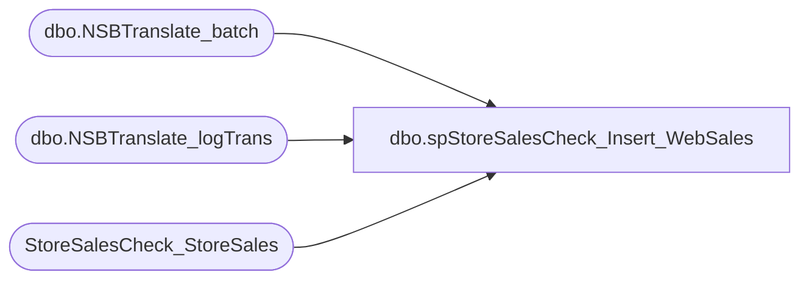

# dbo.spStoreSalesCheck_Insert_WebSales

**Database:** dw  
**Server:** papamart  

## Architecture Diagram



## Table Dependencies

| Referenced Table |
|---|
| dbo.NSBTranslate_batch |
| dbo.NSBTranslate_logTrans |
| StoreSalesCheck_StoreSales |

## Stored Procedure Code

```sql
-- =============================================================================================================
-- Name: spStoreSalesCheck_Insert_WebSales
--
-- Description:	
--		Pulls the previous days sales for stores related to the NSBTranslate - i.e., web sales. 
--		
--
--
-- Input:
--
-- Output: 
--
-- Dependencies: 
--
-- EXAMPLE:
--		exec spStoreSalesCheck_StoreList 
--
-- Revision History
--		Name:			Date:			Comments:
--		Dave Rice		8/16/2010		created
---		Dan Tweedie		2017-10-09		New query against new settlement tables
-- =============================================================================================================

CREATE PROCEDURE [dbo].[spStoreSalesCheck_Insert_WebSales]
AS
BEGIN

SET NOCOUNT ON;

declare @startDate date, @endDate date

set @startDate = cast(getdate()-1 as date)
set @endDate = cast(getdate() as date)

insert into StoreSalesCheck_StoreSales (store_id, sales_date, units, sales, datestamp)
select 
	lt.sStore,
	CONVERT(char,lt.dTimeStamp,101),
	SUM(lt.iUnits) ,
	SUM(lt.mAmount),
	getdate()
from [STL-SQLAAG-P-01].BABWeCommerce.dbo.NSBTranslate_logTrans lt
  join [STL-SQLAAG-P-01].BABWeCommerce.dbo.NSBTranslate_batch b on lt.sBatchID=b.sBatchID
where b.bSentToAW = 1 
	AND cast(b.dTimeStamp as date) between @startDate and @endDate
	AND cast(lt.dTimeStamp as date) between @startDate and @endDate
and lt.sStore in ('0013', '2013')
group by lt.sStore, CONVERT(char,lt.dTimeStamp,101)


END
```

